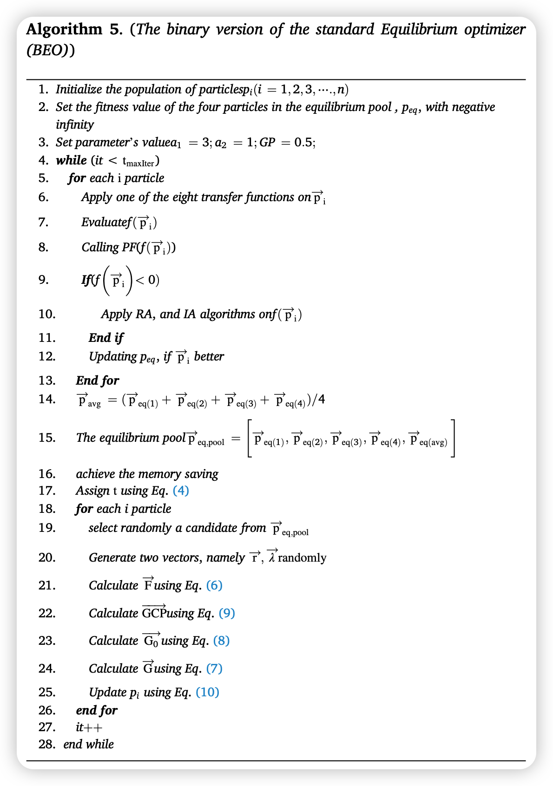
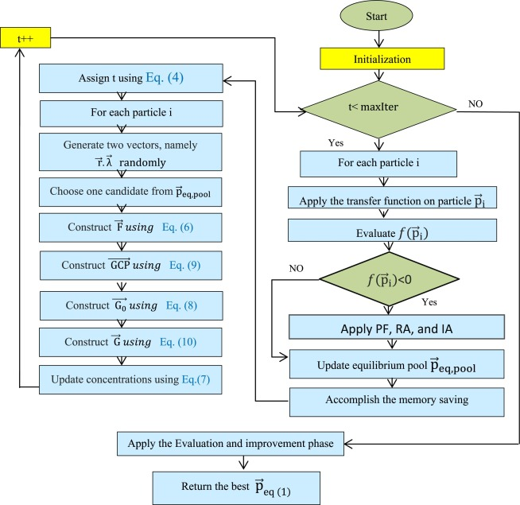
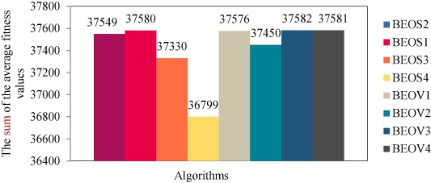
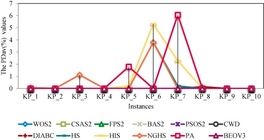
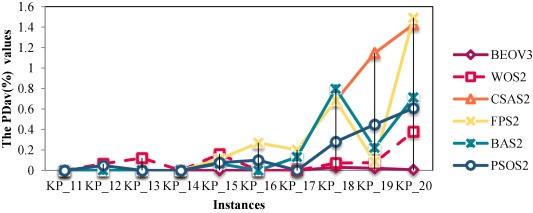
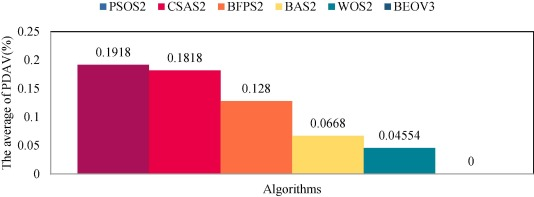
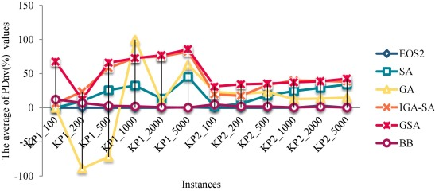

 

  
    

  									Санкт-Петербургский политехнический университет Петра Великого

 																Институт компьютерных наук и технологий

<b>										  						Высшая школа программной инженерии</b>

| Выполнил студент  гр. 3530904/90102 | Мэн Цзянин        |
| :--------------------------------------: | ----------------- |
|               Руководитель               | Черноруцкий И. Г. |

---

<b>Алгоритм оптимизации бинарного равновесия для задач 0-1 рюкзака</b>

<b>A Binary Equilibrium Optimization Algorithm for 0–1 Knapsack Problems</b>

> 
Author links open overlay panel<a class="author size-m workspace-trigger" name="bau005" href="#!">MohamedAbdel-Basseta<svg role="img" focusable="false" viewBox="0 0 102 128" width="19.125" height="12" class="icon icon-envelope" aria-label="Envelope"><title>Envelope</title><path d="m55.8 57.2c-1.78 1.31-5.14 1.31-6.9 0l-31.32-23.2h69.54l-31.32 23.19zm-55.8-24.78l42.94 32.62c2.64 1.95 6.02 2.93 9.4 2.93s6.78-0.98 9.42-2.93l40.24-30.7v-10.34h-102zm92 56.48l-18.06-22.74-8.04 5.95 17.38 21.89h-64.54l18.38-23.12-8.04-5.96-19.08 24.02v-37.58l-1e1 -8.46v61.1h102v-59.18l-1e1 8.46v35.62"></path></svg></a><a class="author size-m workspace-trigger" name="bau010" href="#!">RedaMohameda<svg role="img" focusable="false" viewBox="0 0 102 128" width="19.125" height="12" class="icon icon-envelope" aria-label="Envelope"><title>Envelope</title><path d="m55.8 57.2c-1.78 1.31-5.14 1.31-6.9 0l-31.32-23.2h69.54l-31.32 23.19zm-55.8-24.78l42.94 32.62c2.64 1.95 6.02 2.93 9.4 2.93s6.78-0.98 9.42-2.93l40.24-30.7v-10.34h-102zm92 56.48l-18.06-22.74-8.04 5.95 17.38 21.89h-64.54l18.38-23.12-8.04-5.96-19.08 24.02v-37.58l-1e1 -8.46v61.1h102v-59.18l-1e1 8.46v35.62"></path></svg></a><a class="author size-m workspace-trigger" name="bau015" href="#!">SeyedaliMirjalilibcd<svg role="img" focusable="false" viewBox="0 0 106 128" width="19.875" height="12" class="icon icon-person" aria-label="Person"><title>Person</title><path d="m11.07 1.2e2l0.84-9.29c1.97-18.79 23.34-22.93 41.09-22.93 17.74 0 39.11 4.13 41.08 22.84l0.84 9.38h10.04l-0.93-10.34c-2.15-20.43-20.14-31.66-51.03-31.66s-48.89 11.22-51.05 31.73l-0.91 10.27h10.03m41.93-102.29c-9.72 0-18.24 8.69-18.24 18.59 0 13.67 7.84 23.98 18.24 23.98s18.24-10.31 18.24-23.98c0-9.9-8.52-18.59-18.24-18.59zm0 52.29c-15.96 0-28-14.48-28-33.67 0-15.36 12.82-28.33 28-28.33s28 12.97 28 28.33c0 19.19-12.04 33.67-28 33.67"></path></svg>1</a><dl class="affiliation"><dt>a</dt><dd>Faculty of Computers and Informatics, Zagazig University, Zagazig 44519, Egypt</dd></dl><dl class="affiliation"><dt>b</dt><dd>Center for Artificial Intelligence Research and Optimization, Torrens University Australia, Australia</dd></dl><dl class="affiliation"><dt>c</dt><dd>Yonsei Frontier Lab, Yonsei University, Seoul, Korea</dd></dl><dl class="affiliation"><dt>d</dt><dd>King Abdul Aziz University, Jeddah, Saudi Arabia</dd></dl>

>
> https://doi.org/10.1016/j.cie.2020.106946

**Аннотация**
В данной работе предлагается бинарная версия равновесной оптимизации (BEO - binary version of equilibrium optimization) для решения задачи 0-1 рюкзака, которая характеризуется как дискретная задача. Поскольку стандартный оптимизатор равновесия (EO - equilibrium optimizer) был предложен для решения непрерывных задач оптимизации, для решения бинарных задач требуется дискретный вариант. Поэтому для преобразования непрерывного EO в бинарный EO (BEO) используются восемь передаточных функций, включая V-образные и S-образные. Среди этих передаточных функций в данном исследовании показано, что V-образная V3 является наилучшей. Также замечено, что сигмоидная передаточная функция S3 может быть более полезной, чем V3, для улучшения работы других алгоритмов, используемых в данной работе. Мы пришли к выводу, что производительность любого двоичного алгоритма зависит от правильного выбора передаточной функции. Кроме того, мы используем штрафную функцию для отсеивания невыполнимых решений от решений задачи и применяем алгоритм восстановления (RA) для преобразования их в выполнимые решения. Производительность предложенного алгоритма оценивается на трех эталонных наборах данных с 63 экземплярами малого, среднего и крупного масштаба и сравнивается с рядом других алгоритмов, предложенных для решения задача 0-1 рюкзака, при различных статистических анализах. Результаты экспериментов показывают, что алгоритм BEOV3 превосходит все мелко- и среднемасштабные тестовые примеры. Что касается крупномасштабных тестовых примеров, то предложенный метод достигает оптимального значения для 13 из 18 примеров.

**Ключевые слова**
Задач 0-1 рюкзака; Равновесный оптимизатор; Передаточная функция; Алгоритм Бинарная оптимизация; Оптимизация роя частиц; Комбинаторная оптимизация; Искусственный интеллект; Бенчмарк

---

# Введение

Задач  рюкзака (KP - Knapsack Problems) приобретают свою значимость благодаря появлению во многих реальных приложениях. Эти проблемы часто встречаются в принятии инвестиционных решений (Rooderkerk and van Heerde, 2016), проблеме погрузки груза (Mladenović, 2019, Cho, 2019, Brandt and Nickel, 2019), минимизации энергии (Müller, 2015, Karaboghossian and Zito, 2018), распределении ресурсов (Jacko, 2016), компьютерной памяти (Oppong, 2019), выборе портфеля проектов (Koc, 2009, Bas, 2012, Tavana, 2015, Tavana et al., 2013), адаптивные мультимедийные системы (Khan, 2002), криптография (Khan, 2002, Liu et al., 2019), жилищная проблема (Chan, 2018) и проблема раскроя запасов (Alfares and Alsawafy, 2019). Поэтому решение KP позволяет многим приложениям процветать и развиваться. Однако KP является NP-трудной задачей, поэтому найти решение за полиномиальное время довольно сложно. KP - это комбинаторная задача оптимизации, в которой мы стремимся найти оптимальное решение среди конечного множества решений. Если размер KP увеличивается, то время, затрачиваемое точными методами на поиск оптимального решения, растет экспоненциально. Точные методы, такие как исчерпывающий поиск или метод ветвей и границ, потребляют огромные вычислительные ресурсы в пространстве и времени, особенно для крупномасштабных KP. Следовательно, необходимость поиска близкого к оптимальному решения за приемлемое время - это тенденция, которой следуют многие исследователи при решении KP.

В 0-1 KP, предположим, дан набор из $n$ предметов, каждый из которых имеет частный вес $w_i$ и прибыль $p_i$. Из заданных $n$ предметов лицам, принимающим решения, необходимо найти подмножество, которое максимизирует прибыль и при этом сумма их весов меньше или равна вместимости рюкзака. Чтобы найти такое подмножество товаров, был создан рюкзак, который содержит выбранный $i$-й товар со значением $x_i = 1$, в то время как остальные товары имеют значение $x_i = 0$, которые не выбираются в рюкзак. Наконец, математически эта задача может быть сформулирована как:

$$
\operatorname{maximize} \sum_{i=1}^{n} x_{i}^{*} p_{i}

\\

subjectto \sum_{i=1}^{n} w_{i}^{*} x_{i}<c

\\

x_{i}=0 \ or \ 1, i=0,1 \cdots \cdots n

\\

p_{i}>0,\ w_{i}>0,\ c>0
$$
В последнее время предлагается множество метаэвристических алгоритмов (*meta*-heuristic algorithms) для поиска оптимальных решений различных задач оптимизации с относительно хорошими результатами (Bairathi and Gopalani, 2018, Mirjalili and Lewis, 2016, Askarzadeh, 2016, Abualigah, 2019, Abualigah et al., 2018, Abualigah et al., 2018, Mohammad Abualigah, 2020, Abualigah and Diabat, 2020, Safaldin et al., 2020). В отличие от точных методов, метаэвристика характеризуется более быстрой сходимостью к оптимальному решению и снижением вычислительных затрат. Поэтому многие авторы пытались решить KP с помощью метаэвристики. Основной целью любой метаэвристики является эффективное исследование пространства поиска для нахождения близких к оптимальным решений. Надежный метаэвристический алгоритм - это алгоритм, который может поддерживать баланс между фазами исследования и эксплуатации. Некоторые метаэвристические алгоритмы, предложенные для решения задачи 0-1 KP, обсуждаются в следующем разделе.

Превосходство метаэвристических алгоритмов побудило нас предложить бинарную версию нового метаэвристического алгоритма, а именно равновесного оптимизатора (EO) (Faramarzi, 2019), вдохновленного физикой, для решения проблемы рюкзака. Высокая способность этого алгоритма решать непрерывную задачу послужила причиной для предложения бинарной версии, чтобы исследовать его производительность при решении задачи 0-1 рюкзака, характеризующейся как комбинаторная задача оптимизации. Преимущества данного алгоритма по сравнению с существующими алгоритмами сводятся к следующему:

1. Избежание преждевременной сходимости к локальному оптимуму
2. Высокая способность сохранять разнообразие популяции до конца итерации.
3. Наличие двух факторов помогает алгоритму сбалансировать способность к исследованию и эксплуатации.
4. Использование архива для сохранения четырех лучших решений, что дает алгоритму дополнительную возможность избежать застревания в локальных минимумах и впоследствии ускорить сходимость к оптимальному решению.

В соответствии с этими преимуществами, он считается сильным алгоритмом, и впоследствии исследование его производительности на дискретной задаче является необходимой командой. Для преобразования непрерывных значений EO в дискретные были использованы восемь передаточных функций, а именно V-образная и S-образная, и были проведены обширные эксперименты с этими функциями, чтобы получить наилучшую производительность с двоичной версией EO (BEO). После экспериментов стало очевидно, что V-образная функция V3 является лучшей. Кроме того, чтобы проверить эффективность BEO, он был проверен на трех эталонных наборах данных - мелко-, средне- и крупномасштабных - и сравнен с 14 современными алгоритмами. После проверки и сравнения превосходство предложенного алгоритма на большинстве экземпляров трех эталонов, особенно на крупномасштабных, стало очевидным. В заключение, основной вклад данной работы заключается в следующем:

- Предложение бинарной версии нового EO для решения задачи 0-1 рюкзака.
- Добавление модели принятия решений, обладающей большей способностью решать крупномасштабные рюкзакевые задачи, для нахождения наименее распространенной моды на срез сырья, выбора инвестиций и портфелей, генерации ключей Merkle-hellman (Lagarias, 1984) и решения других рюкзакевых задач (Kellerer et al., 2004).
- Предположение о том, что хороший выбор передаточной функции может улучшить производительность бинарного алгоритма.

Остальные разделы данной работы организованы следующим образом. В разделе 2 рассматриваются некоторые из предыдущих работ, предложенных для решения как одиночных 0-1 KP, так и МKP. В разделе 3 кратко описывается оригинальная равновесная оптимизация. В разделе 4 мы иллюстрируем адаптацию EO для решения задачи 0-1 рюкзака с использованием адекватной передаточной функции в качестве предлагаемого подхода. В разделе 5 представлено обсуждение и экспериментальные результаты предложенного подхода для решения задачи 0-1 рюкзака на трех наборах стандартных известных эталонов, проиллюстрированных в деталях. В разделе 6 представлены некоторые выводы по предложенному подходу и дальнейшая работа.

# Обзор литературы
Чтобы показать современное состояние дел, мы представим некоторые предыдущие работы, выполненные для решения одиночного 0-1 KP. В работе Ye et al. (Ye, 2019) для решения KP использовалась система tissue P, имитирующая механизмы биологических тканей. Хотя эта система показывает правильные результаты, авторы не проверяли ее работу на крупномасштабных KP. Ву и др. (Wu et al., 2018) объединили алгоритм симбиотического поиска с поиском гармонии для решения мелких и крупномасштабных KP.

Кроме того, Гао и др. (Gao, 2018) повысили производительность алгоритма "волчья стая" за счет использования квантового кодирования. Алгоритм использовал квантовое вращение и квантовый коллапс, чтобы перейти к глобальному поиску и избежать локального оптимума. В работе (Zouache et al., 2016); Zouache et al. интегрировали квантовую концепцию с алгоритмом светлячка и оптимизацией роя частиц, и результаты оказались весьма обнадеживающими. Другие алгоритмы, такие как гармонический осциллятор и социальная эволюция (Pavithr, 2016, Huang, 2019, Wang, 2007), используют преимущества квантовых вычислений. Метод кодирования с комплексным значением включен в алгоритм оптимизации с движением ветра (Zhou, 2017) в дополнение к жадной стратегии для увеличения разнообразия популяции и улучшения локального поиска алгоритма. Также метод комплексно-значного кодирования добавлен в алгоритм летучей мыши, чтобы разнообразить популяцию летучих мышей (Zhou et al., 2016).

В работе (Kulkarni and Shabir, 2016) алгоритм когортного интеллекта (CI) был использован для решения KP 0-1 с количеством элементов от 4 до 75. Более того, увеличение размера задачи влияет на производительность алгоритма за счет увеличения времени вычислений и оценок функций, а выбранные для экспериментов наборы данных являются низкоразмерными. Следовательно, Сапре и др. (Sapre, 2019) улучшили производительность алгоритма CI для низкоразмерных наборов данных с помощью образованного подхода, который выбирает оптимальное решение кандидата. Фенг и др. (Feng, 2018) улучшили качество решений, применив стратегию обучения на основе оппозиции (OBL) и гауссово возмущение к Monarch Butterfly Optimization (MBO). Алгоритм использовал OBL на поздней стадии на половине популяции, но стратегия гауссова возмущения работает на половине особей с минимальной приспособленностью. После этого, используя тот же алгоритм (MBO), Feng et al. (2018) применили карту хаоса для улучшения возможностей глобальной оптимизации алгоритма MBO.

Zhou et al. (2016) улучшили алгоритм обезьяны, который использует жадный алгоритм для исправления неосуществимости решений и повышения осуществимости этих решений. Более того, алгоритм повторно инициализирует популяцию, если глобальное оптимальное решение не изменилось в течение предопределенного числа итераций. Эксперименты показывают, что алгоритм может быть полезен при решении 0-1 KP. Упрощенный бинарный поиск гармонии, представленный в (Kong, 2015), зависит от разницы между гармониями, хранящимися в памяти гармоний, а не от параметров. Кроме того, El-Shafei et al. (2018) использовали параллельную обработку ускорителя Harare на базе FPGA для решения KP большой размерности с помощью двоичного поиска гармонии.

Более того, для решения задачи 0-1 рюкзака был разработан новый алгоритм глобального гармоничного поиска (NGHS) (Zou, 2011). NGHS был улучшен с помощью двух операций: первая - обновление позиции, которая используется для быстрого обновления наихудшей гармонии к наилучшей глобальной в течение каждой итерации, а вторая - генетическая мутация, которая стремится вывести NGHS из локального оптимума. NGHS по-прежнему страдает от застревания в локальных минимумах и впоследствии не может достичь лучших решений при решении 0-1 KP. Кроме того, был предложен улучшенный алгоритм оптимизации кита (IWOA) (Abdel-Basset et al., 2019) для решения как одиночного 0-1 KP, так и МKP. IWOA был интегрирован со стратегией локального поиска (LSS) и стратегией левитирующего полета, чтобы обеспечить лучший компромисс между операторами исследования и эксплуатации. Кроме того, IWOA была интегрирована с побитовым оператором в попытке повысить эффективность. WOA использовалась и в других бинарных задачах.

В работе (Wu, 2020) недавно был предложен дискретный гибридный алгоритм оптимизации на основе обучения (HTLBO) для решения дисконтированного KP 0-1. Оптимизационные возможности HTLBO улучшены на основе трех перспектив: (1) для повышения способности к исследованию HTLBO была улучшена стратегия обучения, (2) для баланса между операторами исследования и эксплуатации фазы учителя и ученика интегрированы с факторами самообучения, (3) наконец, два типа кроссовера были использованы для повышения поисковой способности HTLBO.

# Равновесный оптимизатор

Недавно Faramarzi (2019) предложил новый метаэвристический алгоритм, основанный на физике, под названием "оптимизатор равновесия" (EO) для решения задач непрерывной оптимизации. EO стремится найти равновесное состояние, при котором достигается баланс массы, входящей, генерируемой и выходящей из контрольного объема. Математически EO формулируется следующим образом:
$$
Step 1: initialization
$$
На этапе инициализации генерируется набор из $N$ частиц с числом размеров $n$ для каждой частицы. Размеры внутри каждой частицы инициализируются случайным образом следующим образом:
$$
\vec{v}_{i}=L_{\min }+\left(U_{\max }-\mathrm{L}_{\min }\right) * \mathrm{ri}=0,1,2, \cdots, \mathrm{N}
\tag1
$$
где 𝑣⃗𝑖  - вектор, содержащий концентрации частиці, 𝐿𝑚𝑖𝑛,𝑈𝑚𝑎𝑥 - максимальная и минимальная границы пространства поиска, специализированного для каждого измерения. 𝑟 - число, генерируемое случайным образом в пределах 0 и 1.
$$
{Step 2: Equilibrium\ pool\ and\ candidates \left(c_{e q}\right)}
$$
EO работает над поиском состояния, которое достигает равновесия на контрольном объеме. Когда EO достигает этого состояния, он может достичь близкого к оптимальному решения, которое он ищет. Как и все метаэвристические алгоритмы, в начале процесса оптимизации глобальное оптимальное решение неизвестно, поэтому они выбирают наиболее подходящее решение из популяции в качестве глобального. Аналогично, EO, в начале, не знает концентраций массы, которые могли бы достичь равновесия системы, поэтому он добавляет лучшие четыре частицы в $\overrightarrow{\mathrm{p}}_{\text {eq,pool }}$ в качестве кандидатов на равновесие в дополнение к еще одной, содержащей среднее значение лучших четырех частиц. Первые четыре кандидата на достижение равновесия в $\overrightarrow{\mathrm{p}}_{\text {eq,pool }}$ работают на повышение способности EO к исследованию, в то время как последний улучшает способность к эксплуатации.
$$
\vec{p}_{\text {eqppool }}=\left[\vec{p}_{\text {eq(1) }}, \vec{p}_{\text {eq(2) }}, \vec{p}_{\text {eq(3) }}, \vec{p}_{\text {eq(4) }}, \vec{p}_{\text {eq(avg) }}\right]

\tag2
$$

$$
{Step 3: updating\ the\ concentration}
$$

Следующее уравнение было разработано для того, чтобы обеспечить правдоподобный баланс между оператором разведки и оператором эксплуатации.
$$
\vec{F}=e^{-\vec{\lambda}\left(t-t_{0}\right)}

\tag3
$$

где $\vec{\lambda}$ - вектор, сгенерированный случайным образом в диапазоне (Rooderkerk and van Heerde, 2016), а $t$  постепенно уменьшается с итерациями и формулируется следующим образом:
$$
t=\left(1-\frac{i t}{t_{\max }}\right)^{(a 2^{*}\left(\frac{i t}{t_{\max }}\right)}

\tag4
$$
где $it$ - текущая итерация, $t_{max }$ - максимальное количество итераций, $a 2$  - фиксированное значение, контролирующее способность EO к эксплуатации. В качестве еще одной попытки улучшить возможности исследования и эксплуатации EO, EO также рассматривает:
$$
\vec{t}_{0}=\frac{1}{\vec{\lambda}} \ln \left(-a_{1} \operatorname{sign}(\vec{r}-0.5)\left[1-e^{-\vec{\lambda}^{t}}\right)+t\right.

\tag5
$$
где $a_{1}$ - фиксированное значение, предопределенное для управления возможностью диверсификации. В случае, если $a_{1}$  больше, то оператор разведки выше, а эксплуатации меньше. Напротив, если $a_{2}$  больше, то эксплуатационные возможности EO доминируют над разведочными возможностями.

Уравнение (6) описывает пересмотренный вариант уравнения (3) с заменой уравнения (5) на уравнение (3):
$$
\vec{F}=a_{1} \operatorname{sign}(\vec{r}-0.5)\left[e^{-\vec{\lambda}(t)}-1\right]

\tag6
$$
Где $\vec{r}$ - случайный вектор, созданный между 0 и 1. Другой фактор $R$ был предложен для улучшения эксплуатационных возможностей EO и выглядит следующим образом:
$$
\vec{R}=\vec{R}_{0} * e^{-\vec{\lambda}^{*}\left(t-t_{0}\right)}

\tag7
$$
где $R_0$ является начальным значением и рассчитывается по следующему уравнению:
$$
\vec{R}_{0}=\overrightarrow{R C P^{*}} *\left(\overrightarrow{c_{e q}}-\vec{\lambda} * \vec{C}\right)

\tag8
$$
$$
\overrightarrow{R C P}=\left\{\begin{array}{c}0.5 r_{1} r_{2}>R P \\ \text { 0 otherwise }\end{array}\right.

\tag9
$$

где $r_1$  и $r_2$ - числа, генерируемые случайным образом в пределах 0 и 1. В уравнении 9 RCP используется для определения того, применяется ли $\vec{R}_{0}$ к обновленному решению или нет. $\vec{R}_{0}$ применяется, если вероятность RP меньше $r_2$, в противном случае он не применяется. Каждое решение в процессе оптимизации обычно обновляется с помощью следующего уравнения:
$$
\vec{C}=\overrightarrow{c_{e q}}+\left(\vec{C}-\overrightarrow{c_{e q}}\right) * \vec{F}+\frac{\vec{R}}{\vec{\lambda} * V} *(1-\vec{F})

\tag{10}
$$
где $V = 1$. В целом, основные шаги EO показаны в Алгоритме 1

***Алгоритм 1 - Алгоритм EO:***

# Предлагаемый подход

В этом разделе алгоритм равновесной оптимизации перерабатывается в бинарную версию для решения задач с рюкзаками 0-1. Стандартный EO предназначен для решения непрерывной задачи оптимизации, а задача о рюкзаке считается дискретной задачей, поэтому он должен быть переработан, чтобы быть адекватным для решения этой задачи. Для преобразования стандартного EO в двоичную версию используется одна из передаточных функций, показанных далее, в которой непрерывное значение возвращается из стандартного алгоритма и преобразуется в 0 или 1. 0 указывает на предмет, взятый из рюкзака, а значение 1 указывает на предмет, выбранный в рюкзаке. В следующих подразделах показаны этапы построения предлагаемого нами алгоритма.

## Инициализация

На этом этапе предлагается группа, состоящая из числа частиц 𝑁, где каждая частица содержит $n$ измерений, которые инициализируются случайным образом с реальными значениями $P_{j}$ , $ \mathrm{j}=0,1,2 \cdots n$ между 0 и 1, затем $V_j$ преобразуется в 0 или 1 на основе уравнения (11). Представление исходной группы, используемой при решении задачи 0-1 рюкзака, показано на рис. 1.
$$
P_{j}=\left\{\begin{array}{l}\text { 1 \ if } \ {P_j}>0.5 \\ \text { 0 \ otherwise }\end{array}\right.

\tag{11}
$$
***Рис. 1. Представление исходной группы:***

## Фитнес-функция

Фитнес-функция является незаменимой функцией во всех метаэвристических алгоритмах. Поэтому для решения рюкзакевых задач с помощью метаэвристики Равновесная оптимизация, фитнес-функция должна быть задана до тех пор, пока она не позволит найти поисковое ядро процесса оптимизации. Функция пригодности, используемая в EO для решения задачи о рюкзаке 0-1, вычисляется как сумма прибылей предметов, найденных в рюкзаке: $\mathrm{f}(x)=\sum_{i=1}^{n} P_{i}{ }^{*} p_{i}$ и ее результаты при условии достижения ограничения $\sum_{i=1}^{n} w_{i}{ }^{*} P_{i}<c$ , где 𝑤𝑖 ,и 𝑃𝑖 - вес и статус, 0, или 1, каждого предмета в рюкзаке, а $c$ - вместимость рюкзака. Решение, которое не подчиняется предыдущему ограничению и может быть выбрано в качестве наилучшего в результате его максимальной пригодности, называется неосуществимым решением. Мы будем иметь дело с этим невыполнимым решением, используя штрафную функцию, которая дает отрицательное значение пригодности для этого решения до тех пор, пока оно не будет выбрано в качестве наилучшего. Алгоритм 2 описывает шаги штрафной функции (PF - Penalty function).

***Алгоритм 2. (Штрафная функция (PF)):***

## Фиксация неосуществимого решения

В этих подразделах показаны алгоритмы, используемые для преобразования неосуществимого решения в осуществимое. На этом этапе используются два алгоритма, первый из которых, а именно алгоритм ремонта (RA - Repair Algorithm), работает над исправлением неосуществимого решения, полученного от алгоритма PF, а второй, а именно алгоритм улучшения (IA - Improvement Algorithm), работает над улучшением осуществимого решения, полученного от RA. Эти два алгоритма перечислены ниже:

В алгоритме ремонта:
1. Из рюкзака удаляется элемент с наименьшим $\frac{\mathrm{p}_{i}}{\mathrm{w}_{i}}$ отношением.

2. Оценивается новое решение.

3. Проверяется выполнимость нового решения, если оно не выполнимо, то повторяются шаги 1 и 2, пока не будет найдено выполнимое решение (см. Алгоритм 3).

***Алгоритм 3 Алгоритм восстановления (RA):***

В алгоритме улучшения:
1. В рюкзаке выбирается элемент с наибольшим $\frac{\mathrm{p}_{i}}{\mathrm{w}_{i}}$ соотношением.

2. Оценивается новое решение.

3. Проверяется выполнимость нового решения, если оно не выполнимо, то удаляются последние элементы, выбранные в рюкзаке, и процесс улучшения завершается (иллюстрация в алгоритме 4).

***Алгоритм 4 Алгоритм улучшения (IA):***

## Передаточные функции
Существует восемь различных передаточных функций, которые делятся на два класса: S-образные и V-образные. Они позволяют преобразовывать непрерывные значения в 0 или 1. Эти передаточные функции принимают на вход реальное значение, затем каждая из них использует определенную формулу для преобразования реального значения в значение между 0 и 1. После этого значение, находящееся между 0 и 1, преобразуется в двоичное значение с помощью уравнения (12). Формула каждой функции приведена в таблице 1, а рис. 2 иллюстрирует графическую форму той же функции. Более подробную информацию об этих передаточных функциях можно найти в (Mirjalili & Lewis, 2013). Следует отметить, что в литературе существуют бинарные варианты EO с одной передаточной функцией (Kushal et al., 2020, Yuanyuan et al., 2020, Zheng-Ming et al., 2020). Однако данная работа является полупопыткой интегрировать восемь передаточных функций в алгоритм BEO и тщательно сравнить их.
$$
F_{\text {bin }}=\left\{\begin{array}{c}1 \text { if F}(a) \geq \operatorname{rand}() \\ \text { 0 otherwise }\end{array}\right.

\tag{12}
$$

***Таблица 1. V-образная и S-образная передаточная функция:***

| **V-Shaped**                                                 | **S-Shaped**                                      |
| ------------------------------------------------------------ | ------------------------------------------------- |
| $\mathrm{V}1\boldsymbol{F}(\boldsymbol{a})=\left|\frac{2}{\pi}\operatorname{arcTan}\left(\frac{\pi}{2}\mathbf{a}\right)\right|$ | $\mathrm{S} 1 F(a)=\frac{1}{1+e^{-a}} $           |
| $\mathrm{~V} 2 \boldsymbol{F}(\boldsymbol{a})=|\tanh (\boldsymbol{a})|$ | $\mathrm{S} 2 F(a)=\frac{1}{1+e^{-2 * a}} $       |
| $\mathrm{~V} 3 \boldsymbol{F}(\boldsymbol{a})=\left|\frac{\mathbf{a}}{\sqrt{1+\boldsymbol{a}^2}}\right|$ | $\mathrm{S} 3 F(a)=\frac{1}{1+e^{-\frac{a}{2}}} $ |
| $\mathrm{~V} 4 \boldsymbol{F}(\boldsymbol{a})=\left|\operatorname{erf}\left(\frac{\sqrt{\pi}}{2} \boldsymbol{a}\right)\right|$ | $\mathrm{S} 4 F(a)=\frac{1}{1+e^{-\frac{a}{3}}}$  |

***Рис. 2. (a) S-образная и (b) V-образная передаточные функции:***

 V-Shaped transfer Functions.jpg)

## Оценка

После обновления текущего решения, обновленное решение преобразуется в двоичное решение с помощью одной из предыдущих передаточных функций, затем используется PF, чтобы проверить, является ли оно выполнимым или нет. Если оно не выполнимо, то применяется фитнес-функция (RA), показанный ранее, для преобразования этого невыполнимого решения в выполнимое. Более того, выполнимое решение, возвращенное алгоритмом ремонта, улучшается с помощью алгоритма улучшения (IA). Если улучшенное решение лучше предыдущего, оно обновляется в популяции и используется в качестве особи в следующем поколении. Наконец, бинарная версия EO (BEO) представлена в алгоритме 5. Блок-схема тех же шагов также изображена на рис. 3.

***Алгоритм 5. Бинарная версия стандартного оптимизатора равновесия (BEO):***

***Рис. 3. Шаги бинарной версии стандартной равновесной оптимизации:***

## Иллюстративный пример

После четкого описания предлагаемого алгоритма, в этом разделе предполагается небольшой пример для улучшения читабельности. Предположим, что у нас есть рюкзак, состоящий из нескольких предметов разного размера и прибыли, и этот рюкзак имеет вместимость 15 кубических дюймов (Ezugwu, 2019). Нам нужно положить в рюкзак те предметы, которые максимизируют прибыль, не нарушая ограничения по вместимости. Предположим, что есть три потенциальных предмета: A, B и C, а их веса и прибыль приведены в таблице 2.

***Таблица 2. Вес и прибыль трех пунктов:***

| **Items** | **Weights (w)** | **Profits (p)** |
| --------- | --------------- | --------------- |
| A         | 2               | 5               |
| B         | 30              | 10              |
| C         | 10              | 15              |

Нам нужно найти количество предметов, которое будет максимизировать общую прибыль (см. упр. (13)) при сохранении вместимости рюкзака (см. упр. (14)):
$$
totalprofit =\sum_{i=1}^{3} x_{i}^{*} p_{i}

\tag{13}
$$

$$
capacity =\sum_{i=1}^{3} w_{i}{ }^{*} x_{i}<15

\tag{14}
$$

В начале предлагаемый алгоритм создает популяцию из N решений, каждое решение включает d измерений, в нашем примере d = 3. Затем эти решения будут случайным образом распределены, а передаточная функция используется для преобразования непрерывных решений в двоичные. В качестве наглядного примера на рис. 4 приведено решение из решений, созданных предложенным способом. После создания и инициализации этого решения оно будет преобразовано в двоичное с помощью передаточной функции. Изображение того, что после использования передаточной функции полученное двоичное решение имеет вид, показанный на рис. 5.

**Рис. 4. начальное решение, x:**

**Рис. 5. Бинарное решение начального решения, x:**

После вычисления бинарного решения 0 в этом решении означает, что товар в данной позиции не выбран, а 1 - выбран. Общая прибыль выбранных позиций в соответствии с двоичным решением, представленным на рис. 5, вычисляется следующим образом:

$f(x)=0 * 5+1 * 10+1 * 15=25$

А вместимость этого решения вычисляется следующим образом:

$capacity =0 * 2+1 * 30+1 * 10=40>15$

Вычислив вместимость этого решения, мы обнаружили, что она превышает допустимую вместимость рюкзака, которая равна 15. Следовательно, это невыполнимое решение должно быть удалено из популяции, чтобы не быть выбранным в качестве наилучшего на данный момент решения. Для этого будет вызван алгоритм PF, который преобразует пригодность этого решения в отрицательное значение. После вызова алгоритма PF, f(x) = -25, и впоследствии это решение не будет выбрано как лучшее. В рамках нашего предложения это невыполнимое решение будет исправлено с помощью RA. После вызова алгоритма RA и удаления из этого неосуществимого решения элемента с наименьшим $\frac{\mathrm{p}_{i}}{\mathrm{w}_{i}}$, то есть элемента, находящегося на второй позиции, это неосуществимое решение после шага RA будет выглядеть следующим образом:

Общая прибыль выбранных товаров в соответствии с восстановленным бинарным решением, представленным на рис. 6, вычисляется следующим образом:

***Рис. 6. Отремонтированное бинарное решение:***

Общая прибыль выбранных товаров в соответствии с восстановленным бинарным решением, приведенным на рис. 6, вычисляется следующим образом:

$f(x)=0 * 5+0 * 10+1 * 15=15$

А вместимость этого решения вычисляется следующим образом:

$capacity =0 * 2+0 * 30+1 * 10=10<15$

После вычисления вместимости этого отремонтированного решения очевидно, что она меньше вместимости рюкзака, поэтому данное решение считается выполнимым. После преобразования невыполнимого решения в выполнимое, оно будет улучшено с помощью алгоритма IA. Алгоритм IA поместит в ранец предмет с наибольшим $\frac{\mathrm{p}_{i}}{\mathrm{w}_{i}}$ и это будет первый предмет. Таким образом, после вызова IA это выполнимое решение будет выглядеть следующим образом:

***Рис. 7. Улучшенное восстановленное бинарное решение:***

Общая прибыль выбранных товаров в соответствии с бинарным решением, представленным на рис. 7, вычисляется следующим образом:

$f(x)=1 * 5+0^{*} 10+1 * 15=20$

А вместимость этого решения вычисляется следующим образом:

$capacity =1 * 2+0 * 30+1 * 10=12<15$

Очевидно, что вместимость этого улучшенного отремонтированного решения меньше вместимости рюкзака, и поэтому оно считается выполнимым решением и используется в популяции для следующего поколения. Этот пример был проведен на одном решении из популяции, состоящей из N решений, чтобы проиллюстрировать этапы нашего предложения.

# Результаты экспериментов
В данной работе мы провели ряд экспериментальных исследований на небольших, средних и крупномасштабных задачах, чтобы проверить эффективность предложенного нами алгоритма. Все экспериментальные исследования проводились на устройстве, оснащенном платформой Windows 7 ultimate с 64-битной операционной системой, процессором Intel® Core™ i3-2330 M CPU @ 2,20 ГГц и 1 ГБ оперативной памяти. IEOA и EOA реализованы с использованием языка программирования Java.

Данный раздел организован следующим образом: В разделе 4.1 показаны настройки параметров. В разделе 4.2 приведены результаты, полученные предложенным нами алгоритмом (BEO) на задачах малого масштаба. В разделе 4.3 приведены результаты, полученные предложенным нами алгоритмом (BEO) на крупномасштабной задаче.

## Настройки параметров
В этом разделе мы проиллюстрируем значения параметров, присвоенные предложенному алгоритму. Для справедливого сравнения алгоритмов, максимальное количество итераций и размер популяции установлены на 20 и 5000, соответственно. Что касается других алгоритмов, их сравнение было основано на параметрах, найденных в опубликованной статье. a1 предлагаемого алгоритма установлен на 3 как рекомендуемое значение, в то время как a2 равен 1, что также рекомендуется. Наконец, в таблице 3 приведены параметры предложенного алгоритма.

***Таблица 3. Настройка параметров всех используемых алгоритмов:***

| Параметры                        | Значение |
| -------------------------------- | -------- |
| Максимальное количество итераций | 5000     |
| Количество частиц                | 20       |
| Количество запусков              | 20       |
| a1                               | 3        |
| a2                               | 1        |

## Описание эталонных наборов данных
В этом разделе мы проверяем производительность предложенного нами алгоритма на наборах данных малого и среднего масштаба, представленных в таблице 4. Эти наборы данных разделены на два набора:
i. Первый набор получен из (Kulkarni et al., 2017) с диапазоном элементов от 10 до 75,

ii. Второй набор находится на сайте https://pages.mtu.edu/~kreher/cages/Data.html с количеством элементов в интервале от 8 до 24.

***Таблица 4. Описание эталонных наборов данных:***

| ID                                      | Problem   | Capacity   | D      | Opt        |
| :-------------------------------------- | :-------- | :--------- | :----- | :--------- |
| First Benchmark Datasets(Small-Scale)   |           |            |        |            |
| 1                                       | KP_1      | 269        | 10     | 295        |
| 2                                       | **KP_2**  | **878**    | **20** | **1024**   |
| 3                                       | KP_3      | 20         | 4      | 35         |
| 4                                       | **KP_4**  | **11**     | **4**  | **23**     |
| 5                                       | KP_5      | 375        | 15     | 481.07     |
| 6                                       | **KP_6**  | **60**     | **10** | **52**     |
| 7                                       | KP_7      | 50         | 7      | 107        |
| 8                                       | **KP_8**  | **10,000** | **23** | **9767**   |
| 9                                       | KP_9      | 80         | 5      | 130        |
| 10                                      | **KP_10** | **879**    | **20** | **1025**   |
| 11                                      | KP_11     | 577        | 30     | 1437       |
| 12                                      | **KP_12** | **655**    | **35** | **1689.0** |
| 13                                      | KP_13     | 819        | 40     | 1821       |
| 14                                      | **KP_14** | **907**    | **45** | **2033**   |
| 15                                      | KP_15     | 882        | 50     | 2440       |
| 16                                      | **KP_16** | **1050**   | **55** | **2651**   |
| 17                                      | KP_17     | 1006       | 60     | 2917       |
| 18                                      | **KP_18** | **1319**   | **65** | **2817**   |
| 19                                      | KP_19     | 1426       | 70     | 3223       |
| 20                                      | **KP_20** | **1433**   | **75** | **3614**   |
| Second Benchmark Datasets (small-scale) |           |            |        |            |
| 21                                      | KP_8a     | 1,863,633  | 8      | 3,924,400  |
| 22                                      | KP_8b     | 1,822,718  | 8      | 3,813,669  |
| 23                                      | KP_8c     | 1,609,419  | 8      | 3,347,452  |
| 24                                      | KP_8d     | 2,112,292  | 8      | 4,187,707  |
| 25                                      | KP_8e     | 2,493,250  | 8      | 4,955,555  |
| 26                                      | KP_12a    | 2,805,213  | 12     | 5,688,887  |
| 27                                      | KP_12b    | 3,259,036  | 12     | 6,473,019  |
| 28                                      | KP_12c    | 2,489,815  | 12     | 5,170,626  |
| 29                                      | KP_12d    | 3,453,702  | 12     | 6,941,564  |
| 30                                      | KP_12e    | 2,520,392  | 12     | 5,337,472  |
| 31                                      | KP_16a    | 3,780,355  | 16     | 7,850,983  |
| 32                                      | KP_16b    | 4,426,945  | 16     | 9,352,998  |
| 33                                      | KP_16c    | 4,323,280  | 16     | 9,151,147  |
| 34                                      | KP_16d    | 4,550,938  | 16     | 9,348,889  |
| 35                                      | KP_16e    | 3,760,429  | 16     | 7,769,117  |
| 36                                      | KP_20a    | 5,169,647  | 20     | 10,727,049 |
| 37                                      | KP_20b    | 4,681,373  | 20     | 9,818,261  |
| 38                                      | KP_20c    | 5,063,791  | 20     | 10,714,023 |
| 39                                      | KP_20d    | 4,286,641  | 20     | 8,929,156  |
| 40                                      | KP_20e    | 4,476,000  | 20     | 9,357,969  |
| 41                                      | KP_24a    | 6,404,180  | 24     | 13,549,094 |
| 42                                      | KP_24b    | 5,971,071  | 24     | 12,233,713 |
| 43                                      | KP_24c    | 5,870,470  | 24     | 12,448,780 |
| 44                                      | KP_24d    | 5,762,284  | 24     | 11,815,315 |
| 45                                      | KP_24e    | 6,654,569  | 24     | 13,940,099 |

В таблице 4 столбец problem содержит название каждого контрольного экземпляра, использованного в нашем эксперименте, столбец capacity содержит вместимость рюкзака для каждого экземпляра, столбец D показывает количество измерений для мелких, средних и крупномасштабных задач, и, наконец, столбец opt содержит оптимальное значение для каждого экземпляра. В нашем эксперименте мы оцениваем производительность каждого алгоритма по шести критериям: лучший, средний, худший, стандартное отклонение (SD), коэффициент успеха (SR) и процентное отклонение (PDav (%)). Процентное отклонение - это статистический тест, используемый для проверки того, насколько каждый алгоритм близок к оптимальному решению, и рассчитываемый по следующей формуле:
$$
PDav(\%)\geq\frac{opimalalue-fmebaleblebledledt}{opimalvalue}*100

\tag{15}
$$
Коэффициент успешности - это процент достижения алгоритмом оптимального решения в ходе независимых прогонов, который вычисляется следующим образом:
$$
\mathrm{SR}(\%)=\frac{\text { number of optimal solution obtained with in the independent runs }}{\text{number of runs}}{ }^{ {*}} 100

\tag{16}
$$
Наконец, наши эксперименты в этом разделе организованы следующим образом:
1. Эксперимент 1: EO оснащается и тестируется со всеми передаточными функциями, показанными ранее.

2. Эксперимент 2: Результаты работы предложенного алгоритма.

3. Эксперимент 3: Сравнение с различными алгоритмами.

### Эксперимент 1: Работа восьми передаточных функций с BEO.
В этом разделе все восемь передаточных функций используются для отображения BEO в бинарную версию, чтобы проверить их эффективность с BEO. Здесь мы сравниваем превосходство каждой функции для BEO, используя только первый эталонный набор данных.

В Таблица 5, Таблица 6, Таблица 7 показаны лучшие, худшие и средние значения пригодности, полученные при отображении BEO с помощью восьми различных передаточных функций. В этих таблицах столбцы BEOS1, BEOS2, BEOS3, BEOS4, BEOV1, BEOV1, BEOV1 и BEOV1 обозначают результаты, полученные при отображении BEO с помощью передаточных функций S1, S2, S3, S4, V1, V2, V3 и V4 соответственно.

***Таблица 5. Наилучшие значения пригодности при восьми различных передаточных функциях:***

| Instance | Opt    | BEOS1      | BEOS2      | BEOS3      | BEOS4      | BEOV1      | BEOV2      | BEOV3      | BEOV4      |
| :------- | :----- | :--------- | :--------- | :--------- | :--------- | :--------- | :--------- | :--------- | :--------- |
| KP_1     | 295    | **295**    | **295**    | **295**    | **295**    | **295**    | **295**    | **295**    | **295**    |
| KP_2     | 1024   | **1024**   | **1024**   | **1024**   | **1024**   | **1024**   | 1018       | **1024**   | **1024**   |
| KP_3     | 35     | **35**     | **35**     | **35**     | **35**     | **35**     | **35**     | **35**     | **35**     |
| KP_4     | 23     | **23**     | **23**     | **23**     | **23**     | **22**     | **22**     | **23**     | **23**     |
| KP_5     | 481.07 | **481.07** | **481.07** | **481.07** | **481.07** | **481.07** | **481.07** | **481.07** | **481.07** |
| KP_6     | 52     | **52**     | **52**     | **52**     | **52**     | **52**     | **52**     | **52**     | **52**     |
| KP_7     | 107    | **107**    | **107**    | **107**    | **107**    | **105**    | **105**    | **107**    | **107**    |
| KP_8     | 9767   | **9767**   | **9767**   | **9767**   | **9767**   | **9767**   | **9767**   | **9767**   | **9767**   |
| KP_9     | 130    | **130**    | **130**    | **130**    | **130**    | **130**    | **130**    | **130**    | **130**    |
| KP_10    | 1025   | **1025**   | **1025**   | **1025**   | **1025**   | **1025**   | **1025**   | **1025**   | **1025**   |
| KP_11    | 1437   | **1437**   | **1437**   | **1437**   | **1437**   | **1437**   | **1437**   | **1437**   | **1437**   |
| KP_12    | 1689.0 | **1689**   | **1689**   | **1689**   | **1689**   | **1689**   | **1689**   | **1689**   | **1689**   |
| KP_13    | 1821   | **1817**   | **1817**   | **1817**   | **1817**   | **1817**   | **1817**   | **1817**   | **1817**   |
| KP_14    | 2033   | **2033**   | **2033**   | **2033**   | **2033**   | **2033**   | **2033**   | **2033**   | **2033**   |
| KP_15    | 2440   | **2444**   | **2444**   | 2438       | 2440       | **2444**   | **2444**   | **2444**   | 2351       |
| KP_16    | 2651   | **2651**   | **2651**   | **2651**   | **2651**   | **2651**   | **2651**   | **2651**   | **2651**   |
| KP_17    | 2917   | **2917**   | **2917**   | **2917**   | **2917**   | **2917**   | **2917**   | **2917**   | **2917**   |
| KP_18    | 2817   | **2817**   | **2817**   | **2817**   | **2817**   | **2817**   | **2817**   | **2817**   | **2817**   |
| KP_19    | 3223   | **3223**   | **3223**   | **3223**   | **3223**   | **3223**   | **3223**   | **3223**   | **3223**   |
| KP_20    | 3614   | **3614**   | **3614**   | **3614**   | **3614**   | **3614**   | **3614**   | **3614**   | **3614**   |

***Таблица 6. Наихудшие результаты при 8 различных передаточных функциях:***

| Instance | Opt    | BEOS1      | BEOS2      | BEOS3      | BEOS4      | BEOV1      | BEOV2      | BEOV3      | BEOV4      |
| :------- | :----- | :--------- | :--------- | :--------- | :--------- | :--------- | :--------- | :--------- | :--------- |
| KP_1     | 295    | **295**    | **295**    | **295**    | **295**    | **295**    | **295**    | **295**    | **295**    |
| KP_2     | 1024   | **1024**   | **1024**   | **1024**   | **1024**   | **1024**   | 1018       | **1024**   | **1024**   |
| KP_3     | 35     | **35**     | **35**     | **35**     | **35**     | **35**     | **35**     | **35**     | **35**     |
| KP_4     | 23     | **23**     | **23**     | **23**     | **23**     | **22**     | **22**     | **23**     | **23**     |
| KP_5     | 481.07 | **481.07** | **481.07** | **481.07** | **481.07** | **481.07** | **481.07** | **481.07** | **481.07** |
| KP_6     | 52     | **52**     | **52**     | **52**     | **52**     | **52**     | **52**     | **52**     | **52**     |
| KP_7     | 107    | **107**    | **107**    | **107**    | **107**    | **105**    | **105**    | **107**    | **107**    |
| KP_8     | 9767   | **9767**   | **9767**   | **9767**   | **9767**   | **9767**   | **9767**   | **9767**   | **9767**   |
| KP_9     | 130    | **130**    | **130**    | **130**    | **130**    | **130**    | **130**    | **130**    | **130**    |
| KP_10    | 1025   | **1025**   | **1025**   | **1025**   | **1025**   | **1025**   | **1025**   | **1025**   | **1025**   |
| KP_11    | 1437   | **1437**   | **1437**   | **1437**   | **1437**   | **1437**   | **1437**   | **1437**   | **1437**   |
| KP_12    | 1689.0 | **1689**   | **1689**   | **1689**   | 1682       | 1684       | **1689**   | **1689**   | **1689**   |
| KP_13    | 1821   | **1817**   | **1817**   | **1817**   | 1792       | 1778       | **1817**   | **1817**   | **1817**   |
| KP_14    | 2033   | **2033**   | **2033**   | **2033**   | 1979       | 2016       | **2033**   | **2033**   | **2033**   |
| KP_15    | 2440   | **2444**   | **2444**   | **2444**   | **2444**   | **2444**   | **2444**   | **2444**   | **2444**   |
| KP_16    | 2651   | 2630       | **2651**   | 2566       | 2568       | 2651       | 2651       | 2651       | 2651       |
| KP_17    | 2917   | **2917**   | **2917**   | 2801       | 2735       | **2917**   | **2917**   | **2917**   | **2917**   |
| KP_18    | 2817   | 2752       | **2818**   | 2674       | 2581       | **2818**   | **2818**   | **2818**   | **2818**   |
| KP_19    | 3223   | 3056.0     | **3206**   | 3103       | 2915       | **3223**   | 3221       | **3223**   | **3223**   |
| KP_20    | 3614   | 3494       | **3614**   | 3385       | 3222       | **3614**   | **3614**   | **3614**   | 3605       |

***Таблица 7. Средняя пригодность при 8 различных передаточных функциях:***

| Instance | Opt    | BEOS1      | BEOS2      | BEOS3      | BEOS4      | BEOV1      | BEOV2      | BEOV3      | BEOV4      |
| :------- | :----- | :--------- | :--------- | :--------- | :--------- | :--------- | :--------- | :--------- | :--------- |
| KP_1     | 295    | **295**    | **295**    | **295**    | **295**    | **295**    | **295**    | **295**    | **295**    |
| KP_2     | 1024   | **1024**   | **1024**   | **1024**   | **1024**   | **1024**   | 1024       | **1024**   | **1024**   |
| KP_3     | 35     | **35**     | **35**     | **35**     | **35**     | **35**     | **35**     | **35**     | **35**     |
| KP_4     | 23     | **23**     | **23**     | **23**     | **23**     | **22**     | **22**     | **23**     | **23**     |
| KP_5     | 481.07 | **481.07** | **481.07** | **481.07** | **481.07** | **481.07** | **481.07** | **481.07** | **481.07** |
| KP_6     | 52     | **52**     | **52**     | **52**     | **52**     | **52**     | **52**     | **52**     | **52**     |
| KP_7     | 107    | **107**    | **107**    | **107**    | **107**    | **105**    | **105**    | **107**    | **107**    |
| KP_8     | 9767   | **9767**   | **9767**   | **9767**   | **9767**   | **9767**   | **9767**   | **9767**   | **9767**   |
| KP_9     | 130    | **130**    | **130**    | **130**    | **130**    | **130**    | **130**    | **130**    | **130**    |
| KP_10    | 1025   | **1025**   | **1025**   | **1025**   | **1025**   | **1025**   | **1025**   | **1025**   | **1025**   |
| KP_11    | 1437   | **1437**   | **1437**   | **1437**   | **1437**   | **1437**   | **1437**   | **1437**   | **1437**   |
| KP_12    | 1689.0 | **1689**   | **1689**   | **1689**   | 1688.75    | 1688.4     | **1689**   | **1689**   | **1689**   |
| KP_13    | 1821   | **1817**   | **1817**   | **1817**   | 1814.95    | **1816.4** | 1688.75    | **1817**   | **1817**   |
| KP_14    | 2033   | **2033**   | **2033**   | **2033**   | 2019.1     | 2031.5     | **2033**   | **2033**   | **2033**   |
| KP_15    | 2440   | **2444**   | **2444**   | 2436.75    | 2428.0     | **2444**   | **2444**   | **2444**   | **2444**   |
| KP_16    | 2651   | 2649.75    | **2651**   | 2625.95    | 2613.7     | **2651**   | **2651**   | **2651**   | **2651**   |
| KP_17    | 2917   | **2917**   | **2917**   | 2886.6     | 2831.5     | **2917**   | **2917**   | **2917**   | **2917**   |
| KP_18    | 2817   | **2806.7** | **2818**   | 2777.7     | 2702.3     | **2818**   | **2818**   | **2818**   | **2818**   |
| KP_19    | 3223   | 3216.85    | 3221       | 3154.6     | 2999.45    | **3223**   | 3222.2     | **3223**   | **3223**   |
| KP_20    | 3614   | 3599.75    | **3614**   | 3533.4     | 3325.55    | **3614**   | **3614**   | **3614**   | 3613.15    |

На основании результатов, представленных в этих таблицах, отображение BEO с помощью V3 превосходит все другие передаточные функции, где BEOV3 смогла достичь оптимального значения для всех экземпляров во всех 20 независимых прогонах в отличие от других передаточных функций, которые не смогли достичь оптимума во всех прогонах. Графически мы показываем превосходство передаточной функции V3 на рис. 8, где сумма средних значений пригодности (AFV) в течение 20 прогонов для всех экземпляров, полученных с помощью BEOV3, превосходит все AFV, полученные с помощью других передаточных функций с BEO.

***Рис. 8. Сравнение суммирования значений фитнеса:***

В таблице 8 представлены значения PDav(%), полученные BEO при различных передаточных функциях на каждом экземпляре от KP_1 до KP_20. Последняя строка в этой таблице показывает сумму значений PDav, полученных BEO по всем экземплярам с каждой передаточной функцией. Просмотр этой строки показывает, что BEO с V3 смог достичь оптимального значения для всех экземпляров и занять первое место, тогда как BEO с V2 занимает второе место со значением 0,012, а с S4 - последнее место со значением 0,1813.

***Таблица 8. Значения PDav для 8 различных передаточных функций:***

| Name  | Opt  | BEOS1    | BEOS2 | BEOS3  | BEOS4  | BEOV1     | BEOV2 | BEOV3 | BEOV4 |
| :---- | :--- | :------- | :---- | :----- | :----- | :-------- | :---- | :---- | :---- |
| KP_1  | 0    | **0**    | **0** | **0**  | **0**  | **0**     | **0** | **0** | **0** |
| KP_2  | 0    | **0**    | **0** | **0**  | **0**  | **0**     | **0** | **0** | **0** |
| KP_3  | 0    | **0**    | **0** | **0**  | **0**  | **0**     | **0** | **0** | **0** |
| KP_4  | 0    | **0**    | **0** | **0**  | **0**  | **0**     | **0** | **0** | **0** |
| KP_5  | 0    | **0**    | **0** | **0**  | **0**  | **0**     | **0** | **0** | **0** |
| KP_6  | 0    | **0**    | **0** | **0**  | **0**  | **0**     | **0** | **0** | **0** |
| KP_7  | 0    | **0**    | **0** | **0**  | **0**  | **0**     | **0** | **0** | **0** |
| KP_8  | 0    | **0**    | **0** | **0**  | **0**  | **0**     | **0** | **0** | **0** |
| KP_9  | 0    | **0**    | **0** | **0**  | **0**  | **0**     | **0** | **0** | **0** |
| KP_10 | 0    | **0**    | **0** | **0**  | **0**  | **0**     | **0** | **0** | **0** |
| KP_11 | 0    | **0**    | **0** | **0**  | **0**  | **0**     | **0** | **0** | **0** |
| KP_12 | 0    | **0**    | **0** | **0**  | 0.014  | 0.0355    | **0** | **0** | **0** |
| KP_13 | 0    | **0**    | **0** | **0**  | 0.0002 | **0.033** | **0** | **0** | **0** |
| KP_14 | 0    | **0**    | **0** | **0**  | 0.0033 | 0.07      | **0** | **0** | **0** |
| KP_15 | 0    | **0**    | **0** | 0.0058 | 0.0068 | **0**     | **0** | **0** | **0** |
| KP_16 | 0    | 0.047    | **0** | 0.003  | 0.004  | **0**     | **0** | **0** | **0** |
| KP_17 | 0    | **0**    | **0** | 0.0120 | 0.0140 | **0**     | **0** | **0** | **0** |
| KP_18 | 0    | **0.03** | **0** | 0.027  | 0.029  | **0**     | **0** | **0** | **0** |
| KP_19 | 0    | 0.001    | 0.06  | 0.035  | 0.040  | **0**     | 0.012 | **0** | **0** |
| KP_20 | 0    | 0.03     | **0** | 0.06   | 0.07   | **0**     | **0** | **0** | 0.03  |
| Sum   | 0    | 0.108    | 0.06  | 0.1428 | 0.1813 | 0.1385    | 0.012 | **0** | 0.03  |

### Эксперимент 2: Результаты работы предложенного алгоритма (BEOV3)

В предыдущем разделе восемь передаточных функций были исследованы с помощью BEO для проверки их производительности при отображении непрерывных значений, создаваемых EO, в двоичные. Это исследование было проверено на первых эталонных экземплярах, и после проверки был сделан вывод, что V3 может работать лучше, чем другие. Следовательно, в этом разделе предложенный алгоритм BEOV3 будет оценен на двух эталонах, упомянутых ранее. Оставшаяся часть данного раздела организована следующим образом:

1. Раздел A: Сравнение первого эталона

2. Раздел B: Сравнение второго эталона

**A: Сравнение первого эталона**

На основании результатов, представленных в таблице 9, предложенный алгоритм получает оптимальное решение для всех экземпляров первого эталонного набора данных с коэффициентом успеха (SR) = 100% и PDav = 0%. После доказательства превосходства предложенного алгоритма на этом эталоне, состоящем из 20 экземпляров с количеством элементов от 10 до 75, в следующем разделе будет проведено дальнейшее исследование его работы на эталоне, состоящем из 25 экземпляров с количеством элементов от 8 до 24.

***Таблица 9. Результаты работы BEOV3 на первых эталонных наборах данных:***

| Instance | Opt    | Best       | Avg        | Worst      | SD    | SR(%)   | PDav(%) |
| :------- | :----- | :--------- | :--------- | :--------- | :---- | :------ | :------ |
| KP_1     | 295    | **295**    | **295**    | **295**    | **0** | **100** | **0**   |
| KP_2     | 1024   | **1024**   | **1024**   | **1024**   | **0** | **100** | **0**   |
| KP_3     | 35     | **35**     | **35**     | **35**     | **0** | **100** | **0**   |
| KP_4     | 23     | **23**     | **23**     | **23**     | **0** | **100** | **0**   |
| KP_5     | 481.07 | **481.07** | **481.07** | **481.07** | **0** | **100** | **0**   |
| KP_6     | 52     | **52**     | **52**     | **52**     | **0** | **100** | **0**   |
| KP_7     | 107    | **107**    | **107**    | **107**    | **0** | **100** | **0**   |
| KP_8     | 9767   | **9767**   | **9767**   | **9767**   | **0** | **100** | **0**   |
| KP_9     | 130    | **130**    | **130**    | **130**    | **0** | **100** | **0**   |
| KP_10    | 125    | **125**    | **125**    | **125**    | **0** | **100** | **0**   |
| KP_11    | 1437   | **1437**   | **1437**   | **1437**   | **0** | **100** | **0**   |
| KP_12    | 1689   | **1689**   | **1689**   | **1689**   | **0** | **100** | **0**   |
| KP_13    | 1821   | **1821**   | **1821**   | **1821**   | **0** | **100** | **0**   |
| KP_14    | 2033   | **2033**   | **2033**   | **2033**   | **0** | **100** | **0**   |
| KP_15    | 2440   | **2440**   | **2440**   | **2440**   | **0** | **100** | **0**   |
| KP_16    | 2651   | **2651**   | **2651**   | **2651**   | **0** | **100** | **0**   |
| KP_17    | 2917   | **2917**   | **2917**   | **2917**   | **0** | **100** | **0**   |
| KP_18    | 2817   | **2817**   | **2817**   | **2817**   | **0** | **100** | **0**   |
| KP_19    | 3223   | **3223**   | **3223**   | **3223**   | **0** | **100** | **0**   |
| KP_20    | 3614   | **3614**   | **3614**   | **3614**   | **0** | **100** | **0**   |

**B: Сравнение второго эталона**
В таблице 10 представлены результаты, полученные BEOV3 на втором эталонном наборе данных. Из этих результатов видно, что он смог достичь оптимального решения для всех экземпляров с SR = 100 и PDav = 0, кроме KP_24d с SR = 10 и PDav = 0.04.

***Таблица 10. Результаты работы BEOV3 на наборах данных от KP_8a до KP_24e:***

| Name   | Opt           | Best           | Avg            | Worst          | SD           | SR(%)   | PDav(%)    |
| :----- | :------------ | :------------- | :------------- | :------------- | :----------- | :------ | :--------- |
| KP_8a  | 3,924,400     | **3,924,400**  | **3,924,400**  | **3,924,400**  | **0**        | **100** | **0**      |
| KP_8b  | 3,813,669     | **3,813,669**  | **3,813,669**  | **3,813,669**  | **0**        | **100** | **0**      |
| KP_8c  | 3,347,452     | **3,347,452**  | **3,347,452**  | **3,347,452**  | **0**        | **100** | **0**      |
| KP_8d  | 4,187,707     | **4,187,707**  | **4,187,707**  | **4,187,707**  | **0**        | **100** | **0**      |
| KP_8e  | 4,955,555     | **4,955,555**  | **4,955,555**  | **4,955,555**  | **0**        | **100** | **0**      |
| KP_12a | 5,688,887     | **5,688,887**  | **5,688,887**  | **5,688,887**  | **0**        | **100** | **0**      |
| KP_12b | 6,473,019     | **6,498,597**  | **6,498,597**  | **6,498,597**  | **0**        | **100** | **0**      |
| KP_12c | 5,170,626     | **5170626.0**  | **5170626.0**  | **5170626.0**  | **00**       | **100** | **0**      |
| KP_12d | 6,941,564     | **6,992,404**  | **6,992,404**  | **6,992,404**  | **0**        | **100** | **0**      |
| KP_12e | 5,337,472     | **5,337,472**  | **5,337,472**  | **5,337,472**  | **0**        | **100** | **0**      |
| KP_16a | 7,850,983     | **7,850,983**  | **7,850,983**  | **7,850,983**  | **0**        | **100** | **0**      |
| KP_16b | 9,352,998     | **9,352,998**  | **9,352,998**  | **9,352,998**  | **0**        | **100** | **0**      |
| KP_16c | 9,151,147     | **9,151,147**  | **9,151,147**  | **9,151,147**  | **0**        | **100** | **0**      |
| KP_16d | **9,348,889** | **9,348,889**  | **9,348,889**  | **9,348,889**  | **0**        | **100** | **0**      |
| KP_16e | 7,769,117     | **7,769,117**  | **7,769,117**  | **7,769,117**  | **0**        | **100** | **0**      |
| KP_20a | 10,727,049    | **10,727,049** | **10,727,049** | **10,727,049** | **0**        | **100** | **0**      |
| KP_20b | 9,818,261     | **9,818,261**  | **9,818,261**  | **9,818,261**  | **0**        | **100** | **0**      |
| KP_20c | 10,714,023    | **10,714,023** | **10,714,023** | **10,714,023** | **0**        | **100** | **0**      |
| KP_20d | 8,929,156     | **8,929,156**  | **8,929,156**  | **8,929,156**  | **0**        | **100** | **0**      |
| KP_20e | 9,357,969     | **9,357,969**  | **9,357,969**  | **9,357,969**  | **0**        | **100** | **0**      |
| KP_24a | 1,359,094     | **1,359,094**  | **1,359,094**  | **1,359,094**  | **0**        | **100** | **0**      |
| KP_24b | 12,233,713    | **12,233,713** | **12,233,713** | **12,233,713** | **0**        | **100** | **0**      |
| KP_24c | 12,448,780    | **12,448,780** | **12,448,780** | **12,448,780** | **0**        | **100** | **0**      |
| KP_24d | 11,815,315    | **11,815,315** | 11,814,367     | 11,810,051     | **1147.262** | **25**  | **0.0036** |
| KP_24e | 13,940,099    | **13,940,099** | **13,940,099** | **13,940,099** | **0**        | **100** | **0**      |

**Жирным** шрифтом выделены оптимальные результаты.

В результате экспериментов, проведенных на первом и втором эталонах, предложенный нами алгоритм смог достичь оптимального значения для 44 из 45 эталонов. Чтобы проверить превосходство предложенного нами алгоритма над существующими, в следующих разделах он будет сравнен с рядом существующих алгоритмов на различных эталонах.

### Эксперимент 3: Сравнение с различными алгоритмами.
В этом разделе мы сравниваем превосходство предложенного алгоритма со следующими бинарными метаэвристическими алгоритмами:

1. Алгоритм опыления цветов (Yang et al., 2014), отображенный с помощью S2(FPS2).

2. Алгоритм оптимизации кита (Mirjalili and Lewis, 2016), отображенный с помощью S2(WOS2).

3. Алгоритм летучей мыши (Yang, 2010), отображенный с помощью S2(BAS2).

4. Алгоритм поиска ворона (Askarzadeh, 2016), отображенный с помощью (CSAS2).

5. Алгоритм оптимизации роя частиц (Эберхарт и Кеннеди, 1995) (PSOS2)

6. Дискретный улучшенный алгоритм искусственной пчелиной колонии (DIABC) (Zhang and Liu, 2019).

7. CWDO (Lagarias, 1984).

8. HS (Zou, 2010).

9. IHS (Zou, 2010)

10. НГГС (Zou, 2010).

11. ПА (Sonuc et al., 2016).

12. Улучшенный алгоритм обезьяны (CGMA) (Zhou et al., 2016).

13. Гибридный алгоритм поиска симбиотических организмов(GHSOS) (Wu et al., 2018).

14. Модифицированный алгоритм искусственной пчелиной колонии (BABC-DE) (Cao, 2018).

Первые пять алгоритмов из предыдущего списка реализованы в данной работе с использованием языка программирования Java. Как упоминалось ранее, хороший выбор передаточной функции может улучшить производительность бинарных алгоритмов, поэтому мы экспериментировали с первыми пятью алгоритмами с восемью передаточными функциями, после эксперимента мы обнаружили, что S2 работает на этих алгоритмах лучше, чем все остальные передаточные функции. Все предыдущие алгоритмы используются для проверки превосходства предложенных нами алгоритмов. Остальная часть этого раздела структурирована следующим образом:

1. Раздел A: Сравнение первого эталона

2. Раздел B: Сравнение второго эталона

**A. Сравнение первого эталона**
В таблице 11 представлены результаты, полученные BEOV3 и 11 другими бинарными алгоритмами на наборах данных KP_1 - KP_12, в которых он смог достичь оптимального решения для этих наборов данных во всех прогонах с PDav(%) = 0. На рис. 9 показано сравнение предложенных алгоритмов с аналогичными алгоритмами на основе значений PDav, полученных каждым из них на наборах данных от KP_1 до KP_10. Просмотр этого рисунка подтверждает, что предложенный нами алгоритм смог приблизиться к оптимальному значению для первых 10 экземпляров этого бенчмарка.

***Таблица 11. Сравнение наборов данных KP_1 и KP_10:***

<table><thead><tr class="rowsep-1 valign-top"><th scope="col" class="align-left">Instance</th><th scope="col" class="align-left">Opt</th><th scope="col" class="align-left">Algorithms</th><th scope="col" class="align-left">Best</th><th scope="col" class="align-left">Average</th><th scope="col" class="align-left">Worst</th><th scope="col" class="align-left">Std</th><th scope="col" class="align-left">PDav(%)</th><th scope="col" class="align-left">Instance</th><th scope="col" class="align-left">Opt</th><th scope="col" class="align-left">Best</th><th scope="col" class="align-left">Average</th><th scope="col" class="align-left">Worst</th><th scope="col" class="align-left">Std</th><th scope="col" class="align-left">PDav(%)</th></tr></thead><tbody><tr class="valign-top"><td class="align-left" rowspan="12">KP_1</td><td class="align-left" rowspan="12">295</td><td class="align-left"><strong>BEOV3</strong></td><td class="align-left"><strong>295</strong></td><td class="align-left"><strong>295</strong></td><td class="align-left"><strong>295</strong></td><td class="align-left"><strong>0</strong></td><td class="align-left"><strong>0</strong></td><td class="align-left" rowspan="12"><strong>KP_6</strong></td><td class="align-left" rowspan="12">52</td><td class="align-left"><strong>52</strong></td><td class="align-left"><strong>52</strong></td><td class="align-left"><strong>52</strong></td><td class="align-left"><strong>0</strong></td><td class="align-left"><strong>0</strong></td></tr><tr class="valign-top"><td class="align-left"><strong>WOS2</strong></td><td class="align-left"><strong>295</strong></td><td class="align-left"><strong>295</strong></td><td class="align-left"><strong>295</strong></td><td class="align-left"><strong>0</strong></td><td class="align-left"><strong>0</strong></td><td class="align-left"><strong>52</strong></td><td class="align-left"><strong>52</strong></td><td class="align-left"><strong>52</strong></td><td class="align-left"><strong>0</strong></td><td class="align-left"><strong>0</strong></td></tr><tr class="valign-top"><td class="align-left"><strong>PSOS2</strong></td><td class="align-left"><strong>295</strong></td><td class="align-left"><strong>295</strong></td><td class="align-left"><strong>295</strong></td><td class="align-left"><strong>0</strong></td><td class="align-left"><strong>0</strong></td><td class="align-left"><strong>52</strong></td><td class="align-left"><strong>52</strong></td><td class="align-left"><strong>52</strong></td><td class="align-left"><strong>0</strong></td><td class="align-left"><strong>0</strong></td></tr><tr class="valign-top"><td class="align-left"><strong>FPS2</strong></td><td class="align-left"><strong>295</strong></td><td class="align-left"><strong>295</strong></td><td class="align-left"><strong>295</strong></td><td class="align-left"><strong>0</strong></td><td class="align-left"><strong>0</strong></td><td class="align-left"><strong>52</strong></td><td class="align-left"><strong>52</strong></td><td class="align-left"><strong>52</strong></td><td class="align-left"><strong>0</strong></td><td class="align-left"><strong>0</strong></td></tr><tr class="valign-top"><td class="align-left"><strong>CSAS2</strong></td><td class="align-left"><strong>295</strong></td><td class="align-left"><strong>295</strong></td><td class="align-left"><strong>295</strong></td><td class="align-left"><strong>0</strong></td><td class="align-left"><strong>0</strong></td><td class="align-left"><strong>52</strong></td><td class="align-left"><strong>52</strong></td><td class="align-left"><strong>52</strong></td><td class="align-left"><strong>0</strong></td><td class="align-left"><strong>0</strong></td></tr><tr class="valign-top"><td class="align-left"><strong>BAS2</strong></td><td class="align-left"><strong>295</strong></td><td class="align-left"><strong>295</strong></td><td class="align-left"><strong>295</strong></td><td class="align-left"><strong>0</strong></td><td class="align-left"><strong>0</strong></td><td class="align-left"><strong>52</strong></td><td class="align-left"><strong>52</strong></td><td class="align-left"><strong>52</strong></td><td class="align-left"><strong>0</strong></td><td class="align-left"><strong>0</strong></td></tr><tr class="valign-top"><td class="align-left">CWD (<a name="bb0180" href="#b0180" class="workspace-trigger">Zhou, 2017</a>)</td><td class="align-left"><strong>295</strong></td><td class="align-left"><strong>295</strong></td><td class="align-left"><strong>295</strong></td><td class="align-left"><strong>0</strong></td><td class="align-left"><strong>0</strong></td><td class="align-left"><strong>52</strong></td><td class="align-left"><strong>52</strong></td><td class="align-left"><strong>52</strong></td><td class="align-left"><strong>0</strong></td><td class="align-left"><strong>0</strong></td></tr><tr class="valign-top"><td class="align-left">DIABC (<a name="bb0270" href="#b0270" class="workspace-trigger">Zhang and Liu, 2019</a>)</td><td class="align-left"><strong>295</strong></td><td class="align-left"><strong>295</strong></td><td class="align-left"><strong>295</strong></td><td class="align-left"><strong>0</strong></td><td class="align-left"><strong>0</strong></td><td class="align-left"><strong>52</strong></td><td class="align-left"><strong>52</strong></td><td class="align-left"><strong>52</strong></td><td class="align-left"><strong>0</strong></td><td class="align-left"><strong>0</strong></td></tr><tr class="valign-top"><td class="align-left">HS (<a name="bb0275" href="#b0275" class="workspace-trigger">Zou, 2010</a>)</td><td class="align-left"><strong>295</strong></td><td class="align-left"><strong>295</strong></td><td class="align-left"><strong>295</strong></td><td class="align-left"><strong>0</strong></td><td class="align-left"><strong>0</strong></td><td class="align-left">50</td><td class="align-left">50</td><td class="align-left">50</td><td class="align-left">0</td><td class="align-left">3.8</td></tr><tr class="valign-top"><td class="align-left">IHS (<a name="bb0275" href="#b0275" class="workspace-trigger">Zou, 2010</a>)</td><td class="align-left"><strong>295</strong></td><td class="align-left"><strong>295</strong></td><td class="align-left"><strong>295</strong></td><td class="align-left"><strong>0</strong></td><td class="align-left"><strong>0</strong></td><td class="align-left">50</td><td class="align-left">49.2</td><td class="align-left">44</td><td class="align-left">1.85</td><td class="align-left">5.3</td></tr><tr class="valign-top"><td class="align-left">NGHS (<a name="bb0275" href="#b0275" class="workspace-trigger">Zou, 2010</a>)</td><td class="align-left">295</td><td class="align-left">294.78</td><td class="align-left">288</td><td class="align-left">–</td><td class="align-left">0.07</td><td class="align-left">50</td><td class="align-left">50</td><td class="align-left">50</td><td class="align-left">0</td><td class="align-left">3.8</td></tr><tr class="valign-top"><td class="align-left">PA (<a name="bb0280" href="#b0280" class="workspace-trigger">Sonuc et al., 2016</a>)</td><td class="align-left"><strong>295</strong></td><td class="align-left"><strong>295</strong></td><td class="align-left"><strong>295</strong></td><td class="align-left"><strong>0</strong></td><td class="align-left"><strong>0</strong></td><td class="align-left"><strong>52</strong></td><td class="align-left"><strong>52</strong></td><td class="align-left"><strong>52</strong></td><td class="align-left"><strong>0</strong></td><td class="align-left"><strong>0</strong></td></tr><tr class="valign-top"><td class="align-left" rowspan="12">KP_2</td><td class="align-left" rowspan="12">1024</td><td class="align-left"><strong>BEOV3</strong></td><td class="align-left"><strong>1024</strong></td><td class="align-left"><strong>1024</strong></td><td class="align-left"><strong>1024</strong></td><td class="align-left"><strong>0</strong></td><td class="align-left"><strong>0</strong></td><td class="align-left" rowspan="12"><strong>KP_7</strong></td><td class="align-left" rowspan="12">107</td><td class="align-left"><strong>107</strong></td><td class="align-left"><strong>107</strong></td><td class="align-left"><strong>107</strong></td><td class="align-left"><strong>0</strong></td><td class="align-left"><strong>0</strong></td></tr><tr class="valign-top"><td class="align-left"><strong>WOS2</strong></td><td class="align-left"><strong>1024</strong></td><td class="align-left"><strong>1024</strong></td><td class="align-left"><strong>1024</strong></td><td class="align-left"><strong>0</strong></td><td class="align-left"><strong>0</strong></td><td class="align-left"><strong>107</strong></td><td class="align-left"><strong>107</strong></td><td class="align-left"><strong>107</strong></td><td class="align-left"><strong>0</strong></td><td class="align-left"><strong>0</strong></td></tr><tr class="valign-top"><td class="align-left"><strong>PSOS2</strong></td><td class="align-left"><strong>1024</strong></td><td class="align-left"><strong>1024</strong></td><td class="align-left"><strong>1024</strong></td><td class="align-left"><strong>0</strong></td><td class="align-left"><strong>0</strong></td><td class="align-left"><strong>107</strong></td><td class="align-left"><strong>107</strong></td><td class="align-left"><strong>107</strong></td><td class="align-left"><strong>0</strong></td><td class="align-left"><strong>0</strong></td></tr><tr class="valign-top"><td class="align-left"><strong>FPS2</strong></td><td class="align-left"><strong>1024</strong></td><td class="align-left"><strong>1024</strong></td><td class="align-left"><strong>1024</strong></td><td class="align-left"><strong>0</strong></td><td class="align-left"><strong>0</strong></td><td class="align-left"><strong>107</strong></td><td class="align-left"><strong>107</strong></td><td class="align-left"><strong>107</strong></td><td class="align-left"><strong>0</strong></td><td class="align-left"><strong>0</strong></td></tr><tr class="valign-top"><td class="align-left"><strong>CSAS2</strong></td><td class="align-left"><strong>1024</strong></td><td class="align-left"><strong>1024</strong></td><td class="align-left"><strong>1024</strong></td><td class="align-left"><strong>0</strong></td><td class="align-left"><strong>0</strong></td><td class="align-left"><strong>107</strong></td><td class="align-left"><strong>107</strong></td><td class="align-left"><strong>107</strong></td><td class="align-left"><strong>0</strong></td><td class="align-left"><strong>0</strong></td></tr><tr class="valign-top"><td class="align-left"><strong>BAS2</strong></td><td class="align-left"><strong>1024</strong></td><td class="align-left"><strong>1024</strong></td><td class="align-left"><strong>1024</strong></td><td class="align-left"><strong>0</strong></td><td class="align-left"><strong>0</strong></td><td class="align-left"><strong>107</strong></td><td class="align-left"><strong>107</strong></td><td class="align-left"><strong>107</strong></td><td class="align-left"><strong>0</strong></td><td class="align-left"><strong>0</strong></td></tr><tr class="valign-top"><td class="align-left">CWD (<a name="bb0180" href="#b0180" class="workspace-trigger">Zhou, 2017</a>)</td><td class="align-left"><strong>1024</strong></td><td class="align-left"><strong>1024</strong></td><td class="align-left"><strong>1024</strong></td><td class="align-left"><strong>0</strong></td><td class="align-left"><strong>0</strong></td><td class="align-left"><strong>107</strong></td><td class="align-left"><strong>107</strong></td><td class="align-left"><strong>107</strong></td><td class="align-left"><strong>0</strong></td><td class="align-left"><strong>0</strong></td></tr><tr class="valign-top"><td class="align-left">DIABC (<a name="bb0270" href="#b0270" class="workspace-trigger">Zhang and Liu, 2019</a>)</td><td class="align-left"><strong>1024</strong></td><td class="align-left"><strong>1024</strong></td><td class="align-left"><strong>1024</strong></td><td class="align-left"><strong>0</strong></td><td class="align-left"><strong>0</strong></td><td class="align-left"><strong>107</strong></td><td class="align-left"><strong>107</strong></td><td class="align-left"><strong>107</strong></td><td class="align-left"><strong>0</strong></td><td class="align-left"><strong>0</strong></td></tr><tr class="valign-top"><td class="align-left">HS (<a name="bb0275" href="#b0275" class="workspace-trigger">Zou, 2010</a>)</td><td class="align-left"><strong>1024</strong></td><td class="align-left"><strong>1024</strong></td><td class="align-left"><strong>1024</strong></td><td class="align-left"><strong>0</strong></td><td class="align-left"><strong>0</strong></td><td class="align-left"><strong>107</strong></td><td class="align-left">106.8</td><td class="align-left">105</td><td class="align-left">–</td><td class="align-left">0.2</td></tr><tr class="valign-top"><td class="align-left">IHS (<a name="bb0275" href="#b0275" class="workspace-trigger">Zou, 2010</a>)</td><td class="align-left"><strong>1024</strong></td><td class="align-left"><strong>1024</strong></td><td class="align-left"><strong>1024</strong></td><td class="align-left"><strong>0</strong></td><td class="align-left"><strong>0</strong></td><td class="align-left"><strong>107</strong></td><td class="align-left">103.98</td><td class="align-left">93</td><td class="align-left">–</td><td class="align-left">2.28</td></tr><tr class="valign-top"><td class="align-left">NGHS (<a name="bb0275" href="#b0275" class="workspace-trigger">Zou, 2010</a>)</td><td class="align-left"><strong>1024</strong></td><td class="align-left"><strong>1024</strong></td><td class="align-left"><strong>1024</strong></td><td class="align-left"><strong>0</strong></td><td class="align-left"><strong>0</strong></td><td class="align-left"><strong>107</strong></td><td class="align-left"><strong>107</strong></td><td class="align-left"><strong>107</strong></td><td class="align-left"><strong>0</strong></td><td class="align-left"><strong>0</strong></td></tr><tr class="valign-top"><td class="align-left">PA (<a name="bb0280" href="#b0280" class="workspace-trigger">Sonuc et al., 2016</a>)</td><td class="align-left"><strong>1024</strong></td><td class="align-left"><strong>1024</strong></td><td class="align-left"><strong>1024</strong></td><td class="align-left"><strong>0</strong></td><td class="align-left"><strong>0</strong></td><td class="align-left"><strong>107</strong></td><td class="align-left">100.5</td><td class="align-left">81</td><td class="align-left">7.53</td><td class="align-left">6.06</td></tr><tr class="valign-top"><td class="align-left" rowspan="7">KP_3</td><td class="align-left" rowspan="7">35</td><td class="align-left"><strong>BEOV3</strong></td><td class="align-left"><strong>35</strong></td><td class="align-left"><strong>35</strong></td><td class="align-left"><strong>35</strong></td><td class="align-left"><strong>0</strong></td><td class="align-left"><strong>0</strong></td><td class="align-left" rowspan="12"><strong>KP_8</strong></td><td class="align-left" rowspan="12">9767</td><td class="align-left"><strong>9767</strong></td><td class="align-left"><strong>9767</strong></td><td class="align-left"><strong>9767</strong></td><td class="align-left"><strong>0</strong></td><td class="align-left"><strong>0</strong></td></tr><tr class="valign-top"><td class="align-left"><strong>WOS2</strong></td><td class="align-left"><strong>35</strong></td><td class="align-left"><strong>35</strong></td><td class="align-left"><strong>35</strong></td><td class="align-left"><strong>0</strong></td><td class="align-left"><strong>0</strong></td><td class="align-left"><strong>9767</strong></td><td class="align-left">9763.17</td><td class="align-left">9756</td><td class="align-left">5.58</td><td class="align-left">0.039</td></tr><tr class="valign-top"><td class="align-left"><strong>PSOS2</strong></td><td class="align-left"><strong>35</strong></td><td class="align-left"><strong>35</strong></td><td class="align-left"><strong>35</strong></td><td class="align-left"><strong>0</strong></td><td class="align-left"><strong>0</strong></td><td class="align-left"><strong>9767</strong></td><td class="align-left">9766.55</td><td class="align-left">9763</td><td class="align-left">2.191</td><td class="align-left">0.040</td></tr><tr class="valign-top"><td class="align-left"><strong>FPS2</strong></td><td class="align-left"><strong>35</strong></td><td class="align-left"><strong>35</strong></td><td class="align-left"><strong>35</strong></td><td class="align-left"><strong>0</strong></td><td class="align-left"><strong>0</strong></td><td class="align-left"><strong>9767</strong></td><td class="align-left">9766.55</td><td class="align-left">9763</td><td class="align-left">2.191</td><td class="align-left">0.040</td></tr><tr class="valign-top"><td class="align-left"><strong>CSAS2</strong></td><td class="align-left"><strong>35</strong></td><td class="align-left"><strong>35</strong></td><td class="align-left"><strong>35</strong></td><td class="align-left"><strong>0</strong></td><td class="align-left"><strong>0</strong></td><td class="align-left"><strong>9767</strong></td><td class="align-left"><strong>9767</strong></td><td class="align-left"><strong>9767</strong></td><td class="align-left"><strong>0</strong></td><td class="align-left"><strong>0</strong></td></tr><tr class="valign-top"><td class="align-left"><strong>BAS2</strong></td><td class="align-left"><strong>35</strong></td><td class="align-left"><strong>35</strong></td><td class="align-left"><strong>35</strong></td><td class="align-left"><strong>0</strong></td><td class="align-left"><strong>0</strong></td><td class="align-left"><strong>9767</strong></td><td class="align-left">9767</td><td class="align-left">9767</td><td class="align-left">0</td><td class="align-left">0</td></tr><tr class="valign-top"><td class="align-left">CWD (<a name="bb0180" href="#b0180" class="workspace-trigger">Zhou, 2017</a>)</td><td class="align-left"><strong>35</strong></td><td class="align-left"><strong>35</strong></td><td class="align-left"><strong>35</strong></td><td class="align-left"><strong>0</strong></td><td class="align-left"><strong>0</strong></td><td class="align-left"><strong>9767</strong></td><td class="align-left">9753</td><td class="align-left">9748</td><td class="align-left">3.5</td><td class="align-left">0.14</td></tr><tr class="valign-top"><td class="align-left" rowspan="5"></td><td class="align-left" rowspan="5"></td><td class="align-left">DIABC (<a name="bb0270" href="#b0270" class="workspace-trigger">Zhang and Liu, 2019</a>)</td><td class="align-left"><strong>35</strong></td><td class="align-left"><strong>35</strong></td><td class="align-left"><strong>35</strong></td><td class="align-left"><strong>0</strong></td><td class="align-left"><strong>0</strong></td><td class="align-left"><strong>9767</strong></td><td class="align-left">9753</td><td class="align-left">9748</td><td class="align-left">3.5</td><td class="align-left">0.14</td></tr><tr class="valign-top"><td class="align-left">HS (<a name="bb0275" href="#b0275" class="workspace-trigger">Zou, 2010</a>)</td><td class="align-left"><strong>35</strong></td><td class="align-left"><strong>35</strong></td><td class="align-left"><strong>35</strong></td><td class="align-left"><strong>0</strong></td><td class="align-left"><strong>0</strong></td><td class="align-left"><strong>9767</strong></td><td class="align-left">9767</td><td class="align-left">9767</td><td class="align-left">0</td><td class="align-left">0</td></tr><tr class="valign-top"><td class="align-left">IHS (<a name="bb0275" href="#b0275" class="workspace-trigger">Zou, 2010</a>)</td><td class="align-left"><strong>35</strong></td><td class="align-left"><strong>35</strong></td><td class="align-left"><strong>35</strong></td><td class="align-left"><strong>0</strong></td><td class="align-left"><strong>0</strong></td><td class="align-left"><strong>9767</strong></td><td class="align-left">9767</td><td class="align-left">9767</td><td class="align-left">0</td><td class="align-left">0</td></tr><tr class="valign-top"><td class="align-left">NGHS (<a name="bb0275" href="#b0275" class="workspace-trigger">Zou, 2010</a>)</td><td class="align-left"><strong>35</strong></td><td class="align-left">34.55</td><td class="align-left">28</td><td class="align-left">0</td><td class="align-left">1.12</td><td class="align-left"><strong>9767</strong></td><td class="align-left">9767</td><td class="align-left">9767</td><td class="align-left">0</td><td class="align-left">0</td></tr><tr class="valign-top"><td class="align-left">PA (<a name="bb0280" href="#b0280" class="workspace-trigger">Sonuc et al., 2016</a>)</td><td class="align-left"><strong>35</strong></td><td class="align-left"><strong>35</strong></td><td class="align-left"><strong>35</strong></td><td class="align-left"><strong>0</strong></td><td class="align-left"><strong>0</strong></td><td class="align-left"><strong>9767</strong></td><td class="align-left">9767</td><td class="align-left">9767</td><td class="align-left">0</td><td class="align-left">0</td></tr><tr class="valign-top"><td class="align-left" rowspan="12">KP_4</td><td class="align-left" rowspan="12">23</td><td class="align-left"><strong>BEOV3</strong></td><td class="align-left"><strong>23</strong></td><td class="align-left"><strong>23</strong></td><td class="align-left"><strong>23</strong></td><td class="align-left"><strong>0</strong></td><td class="align-left"><strong>0</strong></td><td class="align-left" rowspan="12"><strong>KP_9</strong></td><td class="align-left" rowspan="12">130</td><td class="align-left"><strong>130</strong></td><td class="align-left"><strong>130</strong></td><td class="align-left"><strong>130</strong></td><td class="align-left"><strong>0</strong></td><td class="align-left"><strong>0</strong></td></tr><tr class="valign-top"><td class="align-left"><strong>WOS2</strong></td><td class="align-left"><strong>23</strong></td><td class="align-left"><strong>23</strong></td><td class="align-left"><strong>23</strong></td><td class="align-left"><strong>0</strong></td><td class="align-left"><strong>0</strong></td><td class="align-left"><strong>130</strong></td><td class="align-left"><strong>130</strong></td><td class="align-left"><strong>130</strong></td><td class="align-left"><strong>0</strong></td><td class="align-left"><strong>0</strong></td></tr><tr class="valign-top"><td class="align-left"><strong>PSOS2</strong></td><td class="align-left"><strong>23</strong></td><td class="align-left"><strong>23</strong></td><td class="align-left"><strong>23</strong></td><td class="align-left"><strong>0</strong></td><td class="align-left"><strong>0</strong></td><td class="align-left"><strong>130</strong></td><td class="align-left"><strong>130</strong></td><td class="align-left"><strong>130</strong></td><td class="align-left"><strong>0</strong></td><td class="align-left"><strong>0</strong></td></tr><tr class="valign-top"><td class="align-left"><strong>FPS2</strong></td><td class="align-left"><strong>23</strong></td><td class="align-left"><strong>23</strong></td><td class="align-left"><strong>23</strong></td><td class="align-left"><strong>0</strong></td><td class="align-left"><strong>0</strong></td><td class="align-left"><strong>130</strong></td><td class="align-left"><strong>130</strong></td><td class="align-left"><strong>130</strong></td><td class="align-left"><strong>0</strong></td><td class="align-left"><strong>0</strong></td></tr><tr class="valign-top"><td class="align-left"><strong>CSAS2</strong></td><td class="align-left"><strong>23</strong></td><td class="align-left"><strong>23</strong></td><td class="align-left"><strong>23</strong></td><td class="align-left"><strong>0</strong></td><td class="align-left"><strong>0</strong></td><td class="align-left"><strong>130</strong></td><td class="align-left"><strong>130</strong></td><td class="align-left"><strong>130</strong></td><td class="align-left"><strong>0</strong></td><td class="align-left"><strong>0</strong></td></tr><tr class="valign-top"><td class="align-left"><strong>BAS2</strong></td><td class="align-left"><strong>23</strong></td><td class="align-left"><strong>23</strong></td><td class="align-left"><strong>23</strong></td><td class="align-left"><strong>0</strong></td><td class="align-left"><strong>0</strong></td><td class="align-left"><strong>130</strong></td><td class="align-left"><strong>130</strong></td><td class="align-left"><strong>130</strong></td><td class="align-left"><strong>0</strong></td><td class="align-left"><strong>0</strong></td></tr><tr class="valign-top"><td class="align-left">CWD (<a name="bb0180" href="#b0180" class="workspace-trigger">Zhou, 2017</a>)</td><td class="align-left"><strong>23</strong></td><td class="align-left"><strong>23</strong></td><td class="align-left"><strong>23</strong></td><td class="align-left"><strong>0</strong></td><td class="align-left"><strong>0</strong></td><td class="align-left"><strong>130</strong></td><td class="align-left"><strong>130</strong></td><td class="align-left"><strong>130</strong></td><td class="align-left"><strong>0</strong></td><td class="align-left"><strong>0</strong></td></tr><tr class="valign-top"><td class="align-left">DIABC (<a name="bb0270" href="#b0270" class="workspace-trigger">Zhang and Liu, 2019</a>)</td><td class="align-left"><strong>23</strong></td><td class="align-left"><strong>23</strong></td><td class="align-left"><strong>23</strong></td><td class="align-left"><strong>0</strong></td><td class="align-left"><strong>0</strong></td><td class="align-left"><strong>130</strong></td><td class="align-left"><strong>130</strong></td><td class="align-left"><strong>130</strong></td><td class="align-left"><strong>0</strong></td><td class="align-left"><strong>0</strong></td></tr><tr class="valign-top"><td class="align-left">HS (<a name="bb0275" href="#b0275" class="workspace-trigger">Zou, 2010</a>)</td><td class="align-left"><strong>23</strong></td><td class="align-left"><strong>23</strong></td><td class="align-left"><strong>23</strong></td><td class="align-left"><strong>0</strong></td><td class="align-left"><strong>0</strong></td><td class="align-left"><strong>130</strong></td><td class="align-left"><strong>130</strong></td><td class="align-left"><strong>130</strong></td><td class="align-left"><strong>0</strong></td><td class="align-left"><strong>0</strong></td></tr><tr class="valign-top"><td class="align-left">IHS (<a name="bb0275" href="#b0275" class="workspace-trigger">Zou, 2010</a>)</td><td class="align-left"><strong>23</strong></td><td class="align-left"><strong>23</strong></td><td class="align-left"><strong>23</strong></td><td class="align-left"><strong>0</strong></td><td class="align-left"><strong>0</strong></td><td class="align-left"><strong>130</strong></td><td class="align-left"><strong>130</strong></td><td class="align-left"><strong>130</strong></td><td class="align-left"><strong>0</strong></td><td class="align-left"><strong>0</strong></td></tr><tr class="valign-top"><td class="align-left">NGHS (<a name="bb0275" href="#b0275" class="workspace-trigger">Zou, 2010</a>)</td><td class="align-left"><strong>23</strong></td><td class="align-left"><strong>23</strong></td><td class="align-left"><strong>23</strong></td><td class="align-left"><strong>0</strong></td><td class="align-left"><strong>0</strong></td><td class="align-left"><strong>130</strong></td><td class="align-left"><strong>130</strong></td><td class="align-left"><strong>130</strong></td><td class="align-left"><strong>0</strong></td><td class="align-left"><strong>0</strong></td></tr><tr class="valign-top"><td class="align-left">PA (<a name="bb0280" href="#b0280" class="workspace-trigger">Sonuc et al., 2016</a>)</td><td class="align-left"><strong>23</strong></td><td class="align-left"><strong>23</strong></td><td class="align-left"><strong>23</strong></td><td class="align-left"><strong>0</strong></td><td class="align-left"><strong>0</strong></td><td class="align-left"><strong>130</strong></td><td class="align-left"><strong>130</strong></td><td class="align-left"><strong>130</strong></td><td class="align-left"><strong>0</strong></td><td class="align-left"><strong>0</strong></td></tr><tr class="valign-top"><td class="align-left" rowspan="12">KP_5</td><td class="align-left" rowspan="12">481.07</td><td class="align-left"><strong>BEOV3</strong></td><td class="align-left"><strong>481.07</strong></td><td class="align-left"><strong>481.07</strong></td><td class="align-left"><strong>481.07</strong></td><td class="align-left"><strong>0</strong></td><td class="align-left"><strong>0</strong></td><td class="align-left" rowspan="12"><strong>KP_10</strong></td><td class="align-left" rowspan="12">1025</td><td class="align-left"><strong>1025</strong></td><td class="align-left"><strong>1025</strong></td><td class="align-left"><strong>1025</strong></td><td class="align-left"><strong>0</strong></td><td class="align-left"><strong>0</strong></td></tr><tr class="valign-top"><td class="align-left"><strong>WOS2</strong></td><td class="align-left"><strong>481.07</strong></td><td class="align-left"><strong>481.07</strong></td><td class="align-left"><strong>481.07</strong></td><td class="align-left"><strong>0</strong></td><td class="align-left"><strong>0</strong></td><td class="align-left"><strong>1025</strong></td><td class="align-left"><strong>1025</strong></td><td class="align-left"><strong>1025</strong></td><td class="align-left"><strong>0</strong></td><td class="align-left"><strong>0</strong></td></tr><tr class="valign-top"><td class="align-left"><strong>PSOS2</strong></td><td class="align-left"><strong>481.07</strong></td><td class="align-left"><strong>481.07</strong></td><td class="align-left"><strong>481.07</strong></td><td class="align-left"><strong>0</strong></td><td class="align-left"><strong>0</strong></td><td class="align-left"><strong>1025</strong></td><td class="align-left"><strong>1025</strong></td><td class="align-left"><strong>1025</strong></td><td class="align-left"><strong>0</strong></td><td class="align-left"><strong>0</strong></td></tr><tr class="valign-top"><td class="align-left"><strong>FPS2</strong></td><td class="align-left"><strong>481.07</strong></td><td class="align-left"><strong>481.07</strong></td><td class="align-left"><strong>481.07</strong></td><td class="align-left"><strong>0</strong></td><td class="align-left"><strong>0</strong></td><td class="align-left"><strong>1025</strong></td><td class="align-left"><strong>1025</strong></td><td class="align-left"><strong>1025</strong></td><td class="align-left"><strong>0</strong></td><td class="align-left"><strong>0</strong></td></tr><tr class="valign-top"><td class="align-left"><strong>CSAS2</strong></td><td class="align-left"><strong>481.07</strong></td><td class="align-left"><strong>481.07</strong></td><td class="align-left"><strong>481.07</strong></td><td class="align-left"><strong>0</strong></td><td class="align-left"><strong>0</strong></td><td class="align-left"><strong>1025</strong></td><td class="align-left"><strong>1025</strong></td><td class="align-left"><strong>1025</strong></td><td class="align-left"><strong>0</strong></td><td class="align-left"><strong>0</strong></td></tr><tr class="valign-top"><td class="align-left"><strong>BAS2</strong></td><td class="align-left"><strong>481.07</strong></td><td class="align-left"><strong>481.07</strong></td><td class="align-left"><strong>481.07</strong></td><td class="align-left"><strong>0</strong></td><td class="align-left"><strong>0</strong></td><td class="align-left"><strong>1025</strong></td><td class="align-left"><strong>1025</strong></td><td class="align-left"><strong>1025</strong></td><td class="align-left"><strong>0</strong></td><td class="align-left"><strong>0</strong></td></tr><tr class="valign-top"><td class="align-left">CWD (<a name="bb0180" href="#b0180" class="workspace-trigger">Zhou, 2017</a>)</td><td class="align-left"><strong>481.07</strong></td><td class="align-left"><strong>481.07</strong></td><td class="align-left"><strong>481.07</strong></td><td class="align-left"><strong>2.9E-13</strong></td><td class="align-left"><strong>0</strong></td><td class="align-left"><strong>1025</strong></td><td class="align-left"><strong>1025</strong></td><td class="align-left"><strong>1025</strong></td><td class="align-left"><strong>0</strong></td><td class="align-left"><strong>0</strong></td></tr><tr class="valign-top"><td class="align-left">DIABC (<a name="bb0270" href="#b0270" class="workspace-trigger">Zhang and Liu, 2019</a>)</td><td class="align-left"><strong>481.07</strong></td><td class="align-left"><strong>481.07</strong></td><td class="align-left"><strong>481.07</strong></td><td class="align-left"><strong>0</strong></td><td class="align-left"><strong>0</strong></td><td class="align-left"><strong>1025</strong></td><td class="align-left"><strong>1025</strong></td><td class="align-left"><strong>1025</strong></td><td class="align-left"><strong>0</strong></td><td class="align-left"><strong>0</strong></td></tr><tr class="valign-top"><td class="align-left">HS (<a name="bb0275" href="#b0275" class="workspace-trigger">Zou, 2010</a>)</td><td class="align-left"><strong>481.07</strong></td><td class="align-left"><strong>481.07</strong></td><td class="align-left"><strong>481.07</strong></td><td class="align-left"><strong>0</strong></td><td class="align-left"><strong>0</strong></td><td class="align-left"><strong>1025</strong></td><td class="align-left"><strong>1025</strong></td><td class="align-left"><strong>1025</strong></td><td class="align-left"><strong>0</strong></td><td class="align-left"><strong>0</strong></td></tr><tr class="valign-top"><td class="align-left">IHS (<a name="bb0275" href="#b0275" class="workspace-trigger">Zou, 2010</a>)</td><td class="align-left"><strong>481.07</strong></td><td class="align-left">478.48</td><td class="align-left">437.93</td><td class="align-left">10.35</td><td class="align-left">0.20</td><td class="align-left"><strong>1025</strong></td><td class="align-left"><strong>1025</strong></td><td class="align-left"><strong>1025</strong></td><td class="align-left"><strong>0</strong></td><td class="align-left"><strong>0</strong></td></tr><tr class="valign-top"><td class="align-left">NGHS (<a name="bb0275" href="#b0275" class="workspace-trigger">Zou, 2010</a>)</td><td class="align-left"><strong>481.07</strong></td><td class="align-left"><strong>481.07</strong></td><td class="align-left"><strong>481.07</strong></td><td class="align-left"><strong>0</strong></td><td class="align-left"><strong>0</strong></td><td class="align-left"><strong>1025</strong></td><td class="align-left"><strong>1025</strong></td><td class="align-left"><strong>1025</strong></td><td class="align-left"><strong>0</strong></td><td class="align-left"><strong>0</strong></td></tr><tr class="valign-top"><td class="align-left">PA (<a name="bb0280" href="#b0280" class="workspace-trigger">Sonuc et al., 2016</a>)</td><td class="align-left"><strong>481.07</strong></td><td class="align-left">472.4424</td><td class="align-left">437.93</td><td class="align-left">17.25</td><td class="align-left">1.79</td><td class="align-left"><strong>1025</strong></td><td class="align-left"><strong>1025</strong></td><td class="align-left"><strong>1025</strong></td><td class="align-left"><strong>0</strong></td><td class="align-left"><strong>0</strong></td></tr></tbody></table>

***Рис. 9. Сравнение значений PDav наборов данных от KP_1 до KP_10.***

В таблице 12 представлены результаты, полученные предложенным алгоритмом и пятью другими бинарными методами на наборах данных KP_11 - KP_20, в которых он смог достичь оптимального решения для этих наборов данных во всех прогонах при PDav(%) = 0. На рис. 10 графически показано сравнение предложенного алгоритма со сравниваемыми алгоритмами на основе значений PDav, полученных каждым из них на тех же наборах данных. На рис. 11 дополнительно показано сравнение предложенных алгоритмов на основе среднего значения PDav. На этом рисунке видно, что предложенный нами алгоритм является лучшим со средним значением PDav равным 0.

***Таблица 12. Сравнение на наборах данных KP_11 и KP_20:***

<table><thead><tr class="rowsep-1 valign-top"><th scope="col" class="align-left">Instance</th><th scope="col" class="align-left">Opt</th><td scope="col" class="align-left">Empty Cell</td><th scope="col" class="align-left">BEOV3</th><th scope="col" class="align-left">WOS2</th><th scope="col" class="align-left">PSOS2</th><th scope="col" class="align-left">CSAS2</th><th scope="col" class="align-left">FBS2</th><th scope="col" class="align-left">BAS2</th><th scope="col" class="align-left">Instance</th><th scope="col" class="align-left">Opt</th><td scope="col" class="align-left">Empty Cell</td><th scope="col" class="align-left">BEOV3</th><th scope="col" class="align-left">WOS2</th><th scope="col" class="align-left">PSOS2</th><th scope="col" class="align-left">CSAS2</th><th scope="col" class="align-left">FBS2</th><th scope="col" class="align-left">BAS2</th></tr></thead><tbody><tr class="valign-top"><td class="align-left" rowspan="6">KP_11</td><td class="align-left" rowspan="6">1437</td><td class="align-left">Best</td><td class="align-left"><strong>1437</strong></td><td class="align-left"><strong>1437</strong></td><td class="align-left"><strong>1437</strong></td><td class="align-left"><strong>1437</strong></td><td class="align-left"><strong>1437</strong></td><td class="align-left"><strong>1437</strong></td><td class="align-left" rowspan="6">KP_16</td><td class="align-left" rowspan="6">2651</td><td class="align-left">Best</td><td class="align-left"><strong>2651</strong></td><td class="align-left"><strong>2651</strong></td><td class="align-left"><strong>2651</strong></td><td class="align-left"><strong>2651</strong></td><td class="align-left"><strong>2651</strong></td><td class="align-left"><strong>2651</strong></td></tr><tr class="valign-top"><td class="align-left">Avg</td><td class="align-left"><strong>1437</strong></td><td class="align-left"><strong>1437</strong></td><td class="align-left"><strong>1437</strong></td><td class="align-left"><strong>1437</strong></td><td class="align-left"><strong>1437</strong></td><td class="align-left"><strong>1437</strong></td><td class="align-left">Avg</td><td class="align-left"><strong>2651</strong></td><td class="align-left"><strong>2651</strong></td><td class="align-left">2648.15</td><td class="align-left">2643.8</td><td class="align-left"><strong>2651</strong></td><td class="align-left">2650</td></tr><tr class="valign-top"><td class="align-left">Worst</td><td class="align-left"><strong>1437</strong></td><td class="align-left"><strong>1437</strong></td><td class="align-left"><strong>1437</strong></td><td class="align-left"><strong>1437</strong></td><td class="align-left"><strong>1437</strong></td><td class="align-left"><strong>1437</strong></td><td class="align-left">Worst</td><td class="align-left"><strong>2651</strong></td><td class="align-left"><strong>2651</strong></td><td class="align-left">2651</td><td class="align-left">2630</td><td class="align-left"><strong>2651</strong></td><td class="align-left">2643</td></tr><tr class="valign-top"><td class="align-left">SD</td><td class="align-left"><strong>0</strong></td><td class="align-left"><strong>0</strong></td><td class="align-left"><strong>0</strong></td><td class="align-left"><strong>0</strong></td><td class="align-left"><strong>0</strong></td><td class="align-left"><strong>0</strong></td><td class="align-left"><strong>SD</strong></td><td class="align-left"><strong>0</strong></td><td class="align-left"><strong>0</strong></td><td class="align-left">3.940</td><td class="align-left">3.92</td><td class="align-left"><strong>0</strong></td><td class="align-left">4.35</td></tr><tr class="valign-top"><td class="align-left">SR</td><td class="align-left"><strong>100</strong></td><td class="align-left"><strong>100</strong></td><td class="align-left"><strong>100</strong></td><td class="align-left"><strong>100</strong></td><td class="align-left"><strong>100</strong></td><td class="align-left"><strong>100</strong></td><td class="align-left"><strong>SR</strong></td><td class="align-left"><strong>100</strong></td><td class="align-left"><strong>100</strong></td><td class="align-left">60</td><td class="align-left">35</td><td class="align-left"><strong>100</strong></td><td class="align-left">65</td></tr><tr class="valign-top"><td class="align-left">PDav</td><td class="align-left"><strong>0</strong></td><td class="align-left"><strong>0</strong></td><td class="align-left"><strong>0</strong></td><td class="align-left"><strong>0</strong></td><td class="align-left"><strong>0</strong></td><td class="align-left"><strong>0</strong></td><td class="align-left"><strong>PDav</strong></td><td class="align-left"><strong>0</strong></td><td class="align-left"><strong>0</strong></td><td class="align-left">0.10</td><td class="align-left">0.27</td><td class="align-left"><strong>0</strong></td><td class="align-left">0.03</td></tr><tr class="valign-top"><td class="align-left" rowspan="6">KP_12</td><td class="align-left" rowspan="6">1689.0</td><td class="align-left">Best</td><td class="align-left"><strong>1689</strong></td><td class="align-left"><strong>1689</strong></td><td class="align-left"><strong>1689</strong></td><td class="align-left"><strong>1689</strong></td><td class="align-left"><strong>1689</strong></td><td class="align-left"><strong>1689</strong></td><td class="align-left" rowspan="6">KP_17</td><td class="align-left" rowspan="6">2917</td><td class="align-left">Best</td><td class="align-left"><strong>2917</strong></td><td class="align-left"><strong>2917</strong></td><td class="align-left"><strong>2917</strong></td><td class="align-left"><strong>2917</strong></td><td class="align-left"><strong>2917</strong></td><td class="align-left"><strong>2917</strong></td></tr><tr class="valign-top"><td class="align-left">Avg</td><td class="align-left"><strong>1689</strong></td><td class="align-left">1687.9</td><td class="align-left">1688.2</td><td class="align-left"><strong>1689</strong></td><td class="align-left"><strong>1689</strong></td><td class="align-left"><strong>1689</strong></td><td class="align-left">Avg</td><td class="align-left"><strong>2917</strong></td><td class="align-left"><strong>2917</strong></td><td class="align-left"><strong>2917</strong></td><td class="align-left">2911</td><td class="align-left">2913.2</td><td class="align-left"><strong>2917</strong></td></tr><tr class="valign-top"><td class="align-left">Worst</td><td class="align-left"><strong>1689</strong></td><td class="align-left">1684</td><td class="align-left">1676</td><td class="align-left"><strong>1689</strong></td><td class="align-left"><strong>1689</strong></td><td class="align-left"><strong>1689</strong></td><td class="align-left">Worst</td><td class="align-left"><strong>2917</strong></td><td class="align-left"><strong>2917</strong></td><td class="align-left"><strong>2917</strong></td><td class="align-left">2878</td><td class="align-left">2891</td><td class="align-left"><strong>2917</strong></td></tr><tr class="valign-top"><td class="align-left"><strong>SD</strong></td><td class="align-left"><strong>0</strong></td><td class="align-left">2.62</td><td class="align-left">2.874</td><td class="align-left"><strong>0</strong></td><td class="align-left"><strong>0</strong></td><td class="align-left"><strong>0</strong></td><td class="align-left"><strong>SD</strong></td><td class="align-left"><strong>0</strong></td><td class="align-left"><strong>0</strong></td><td class="align-left"><strong>0</strong></td><td class="align-left">21</td><td class="align-left">8.091</td><td class="align-left"><strong>0</strong></td></tr><tr class="valign-top"><td class="align-left"><strong>SR</strong></td><td class="align-left"><strong>100</strong></td><td class="align-left">55</td><td class="align-left">90</td><td class="align-left"><strong>100</strong></td><td class="align-left"><strong>100</strong></td><td class="align-left"><strong>100</strong></td><td class="align-left"><strong>SR</strong></td><td class="align-left"><strong>100</strong></td><td class="align-left"><strong>100</strong></td><td class="align-left"><strong>100</strong></td><td class="align-left">95</td><td class="align-left">80</td><td class="align-left"><strong>100</strong></td></tr><tr class="valign-top"><td class="align-left"><strong>PDav</strong></td><td class="align-left"><strong>0</strong></td><td class="align-left">0.065</td><td class="align-left">0.047</td><td class="align-left"><strong>0</strong></td><td class="align-left"><strong>0</strong></td><td class="align-left"><strong>0</strong></td><td class="align-left"><strong>PDav</strong></td><td class="align-left"><strong>0</strong></td><td class="align-left"><strong>0.0</strong></td><td class="align-left"><strong>0</strong></td><td class="align-left">0.20</td><td class="align-left">0.13</td><td class="align-left"><strong>0</strong></td></tr><tr class="valign-top"><td class="align-left" rowspan="6">KP_13</td><td class="align-left" rowspan="6">1821</td><td class="align-left">Best</td><td class="align-left"><strong>1821</strong></td><td class="align-left"><strong>1821</strong></td><td class="align-left"><strong>1821</strong></td><td class="align-left"><strong>1821</strong></td><td class="align-left"><strong>1821</strong></td><td class="align-left"><strong>1821</strong></td><td class="align-left" rowspan="6">KP_18</td><td class="align-left" rowspan="6">2817</td><td class="align-left">Best</td><td class="align-left"><strong>2818</strong></td><td class="align-left"><strong>2818</strong></td><td class="align-left"><strong>2817</strong></td><td class="align-left"><strong>2817</strong></td><td class="align-left"><strong>2816</strong></td><td class="align-left"><strong>2817</strong></td></tr><tr class="valign-top"><td class="align-left">Avg</td><td class="align-left"><strong>1821</strong></td><td class="align-left">1818.8</td><td class="align-left"><strong>1821</strong></td><td class="align-left"><strong>1821</strong></td><td class="align-left"><strong>1821</strong></td><td class="align-left"><strong>1821</strong></td><td class="align-left">Avg</td><td class="align-left"><strong>2818</strong></td><td class="align-left">2815.95</td><td class="align-left">2809.0</td><td class="align-left">2797.8</td><td class="align-left">2794.25</td><td class="align-left">2809.5</td></tr><tr class="valign-top"><td class="align-left">Worst</td><td class="align-left"><strong>1821</strong></td><td class="align-left">1817</td><td class="align-left"><strong>1821</strong></td><td class="align-left"><strong>1821</strong></td><td class="align-left"><strong>1821</strong></td><td class="align-left"><strong>1821</strong></td><td class="align-left">Worst</td><td class="align-left"><strong>2818</strong></td><td class="align-left">2815</td><td class="align-left">2761</td><td class="align-left">2767</td><td class="align-left">2774</td><td class="align-left">2752</td></tr><tr class="valign-top"><td class="align-left"><strong>SD</strong></td><td class="align-left"><strong>0</strong></td><td class="align-left">2.003</td><td class="align-left"><strong>0</strong></td><td class="align-left"><strong>0</strong></td><td class="align-left"><strong>0</strong></td><td class="align-left"><strong>0</strong></td><td class="align-left">SD</td><td class="align-left"><strong>0</strong></td><td class="align-left">1.533</td><td class="align-left">14.953</td><td class="align-left">25.22</td><td class="align-left">12.2</td><td class="align-left">35.56</td></tr><tr class="valign-top"><td class="align-left"><strong>SR</strong></td><td class="align-left"><strong>100</strong></td><td class="align-left">55</td><td class="align-left"><strong>100</strong></td><td class="align-left"><strong>100</strong></td><td class="align-left"><strong>100</strong></td><td class="align-left"><strong>100</strong></td><td class="align-left">SR</td><td class="align-left"><strong>100</strong></td><td class="align-left">60</td><td class="align-left">40</td><td class="align-left">10</td><td class="align-left">0.0</td><td class="align-left">30</td></tr><tr class="valign-top"><td class="align-left"><strong>PDav</strong></td><td class="align-left"><strong>0</strong></td><td class="align-left">0.1208</td><td class="align-left"><strong>0</strong></td><td class="align-left"><strong>0</strong></td><td class="align-left"><strong>0</strong></td><td class="align-left"><strong>0</strong></td><td class="align-left">PDav</td><td class="align-left"><strong>0</strong></td><td class="align-left">0.072</td><td class="align-left">0.28</td><td class="align-left">0. 682</td><td class="align-left">0.80</td><td class="align-left">0.266</td></tr><tr class="valign-top"><td class="align-left" rowspan="6">KP_14</td><td class="align-left" rowspan="6">2033</td><td class="align-left">Best</td><td class="align-left"><strong>2033</strong></td><td class="align-left"><strong>2033</strong></td><td class="align-left"><strong>2033</strong></td><td class="align-left"><strong>2033</strong></td><td class="align-left"><strong>2033</strong></td><td class="align-left"><strong>2033</strong></td><td class="align-left" rowspan="6">KP_19</td><td class="align-left" rowspan="6">3223</td><td class="align-left">Best</td><td class="align-left"><strong>3223.0</strong></td><td class="align-left"><strong>3223</strong></td><td class="align-left"><strong>3223</strong></td><td class="align-left">3205</td><td class="align-left">3221</td><td class="align-left">3221</td></tr><tr class="valign-top"><td class="align-left">Avg</td><td class="align-left"><strong>2033</strong></td><td class="align-left"><strong>2033</strong></td><td class="align-left"><strong>2033</strong></td><td class="align-left"><strong>2033</strong></td><td class="align-left"><strong>2033</strong></td><td class="align-left"><strong>2033</strong></td><td class="align-left">Avg</td><td class="align-left"><strong>3223.0</strong></td><td class="align-left">3220.55</td><td class="align-left">3208.55</td><td class="align-left">3186</td><td class="align-left">3220.25</td><td class="align-left">3215.8</td></tr><tr class="valign-top"><td class="align-left">Worst</td><td class="align-left"><strong>2033</strong></td><td class="align-left"><strong>2033</strong></td><td class="align-left"><strong>2033</strong></td><td class="align-left"><strong>2033</strong></td><td class="align-left"><strong>2033</strong></td><td class="align-left"><strong>2033</strong></td><td class="align-left">Worst</td><td class="align-left"><strong>3223.0</strong></td><td class="align-left">3220</td><td class="align-left">3161</td><td class="align-left">3159</td><td class="align-left">3220</td><td class="align-left">3200</td></tr><tr class="valign-top"><td class="align-left"><strong>SD</strong></td><td class="align-left"><strong>0</strong></td><td class="align-left">0</td><td class="align-left"><strong>0</strong></td><td class="align-left"><strong>0</strong></td><td class="align-left"><strong>0</strong></td><td class="align-left"><strong>0</strong></td><td class="align-left"><strong>SD</strong></td><td class="align-left"><strong>0</strong></td><td class="align-left">1.59</td><td class="align-left">17.35</td><td class="align-left">23.11</td><td class="align-left">0.52</td><td class="align-left">10.93</td></tr><tr class="valign-top"><td class="align-left"><strong>SR</strong></td><td class="align-left"><strong>100</strong></td><td class="align-left">100</td><td class="align-left"><strong>100</strong></td><td class="align-left"><strong>100</strong></td><td class="align-left"><strong>100</strong></td><td class="align-left"><strong>100</strong></td><td class="align-left"><strong>SR</strong></td><td class="align-left"><strong>100</strong></td><td class="align-left">5</td><td class="align-left">5</td><td class="align-left">0</td><td class="align-left">0</td><td class="align-left">0</td></tr><tr class="valign-top"><td class="align-left"><strong>PDav</strong></td><td class="align-left"><strong>0</strong></td><td class="align-left">0</td><td class="align-left"><strong>0</strong></td><td class="align-left"><strong>0</strong></td><td class="align-left"><strong>0</strong></td><td class="align-left"><strong>0</strong></td><td class="align-left"><strong>PDav</strong></td><td class="align-left"><strong>0</strong></td><td class="align-left">0.076</td><td class="align-left">0.448</td><td class="align-left">1.147</td><td class="align-left">0.085</td><td class="align-left">0.22</td></tr><tr class="valign-top"><td class="align-left" rowspan="6">KP_15</td><td class="align-left" rowspan="6">2440</td><td class="align-left">Best</td><td class="align-left"><strong>2444</strong></td><td class="align-left"><strong>2444</strong></td><td class="align-left"><strong>2444</strong></td><td class="align-left"><strong>2444</strong></td><td class="align-left"><strong>2444</strong></td><td class="align-left"><strong>2444</strong></td><td class="align-left" rowspan="6">KP_20</td><td class="align-left" rowspan="6">3614</td><td class="align-left">Best</td><td class="align-left"><strong>3614</strong></td><td class="align-left"><strong>3614</strong></td><td class="align-left"><strong>3614</strong></td><td class="align-left">3596</td><td class="align-left">3590</td><td class="align-left">3614</td></tr><tr class="valign-top"><td class="align-left">Avg</td><td class="align-left"><strong>2444</strong></td><td class="align-left">2440.1</td><td class="align-left">2442.15</td><td class="align-left">2441.3</td><td class="align-left">2442.4</td><td class="align-left">2441.3</td><td class="align-left">Avg</td><td class="align-left"><strong>3614</strong></td><td class="align-left">3600.3</td><td class="align-left">3592</td><td class="align-left">3562.4</td><td class="align-left">3559.95</td><td class="align-left">3588.24</td></tr><tr class="valign-top"><td class="align-left">Worst</td><td class="align-left"><strong>2444</strong></td><td class="align-left">2438</td><td class="align-left">2438</td><td class="align-left">2438</td><td class="align-left">2440</td><td class="align-left">2435</td><td class="align-left">Worst</td><td class="align-left"><strong>3614</strong></td><td class="align-left">3595</td><td class="align-left">3507</td><td class="align-left">3517</td><td class="align-left">3526</td><td class="align-left">3524</td></tr><tr class="valign-top"><td class="align-left">SD</td><td class="align-left"><strong>0</strong></td><td class="align-left">3.044</td><td class="align-left">3.072</td><td class="align-left">3.004</td><td class="align-left">2.013</td><td class="align-left">4.618</td><td class="align-left"><strong>SD</strong></td><td class="align-left"><strong>0</strong></td><td class="align-left">7.217</td><td class="align-left">25.683</td><td class="align-left">48.53</td><td class="align-left">16.59</td><td class="align-left">46.35</td></tr><tr class="valign-top"><td class="align-left">SR</td><td class="align-left"><strong>100</strong></td><td class="align-left">60</td><td class="align-left">45</td><td class="align-left">60</td><td class="align-left">45</td><td class="align-left">60</td><td class="align-left"><strong>SR</strong></td><td class="align-left"><strong>100</strong></td><td class="align-left">20</td><td class="align-left">5</td><td class="align-left">0</td><td class="align-left">0</td><td class="align-left">15</td></tr><tr class="valign-top"><td class="align-left">PDav</td><td class="align-left"><strong>0</strong></td><td class="align-left">0.159</td><td class="align-left">0.0756</td><td class="align-left">0.110</td><td class="align-left">0.065</td><td class="align-left">0.110</td><td class="align-left"><strong>PDav</strong></td><td class="align-left"><strong>0</strong></td><td class="align-left">0.379</td><td class="align-left">0.608</td><td class="align-left">1.427</td><td class="align-left">1.49</td><td class="align-left">0.712</td></tr></tbody></table>

**Жирным** шрифтом выделены оптимальные результаты.

***Рис. 10. Сравнение значений PDav для наборов данных от KP_11 до KP_20:***

**Рис. 11. Сравнение первых эталонных наборов данных:**

---

**B: Сравнение второго эталона**

В таблице 13 представлены результаты, полученные предложенным алгоритмом и восемью другими бинарными алгоритмами на наборах данных KP_8a - KP_12e, в которых он смог достичь оптимального решения для этих наборов данных во всех прогонах при PDav(%) = 0.

***Таблица 13. Сравнение на наборах данных KP_8a и KP_12e***

<table><thead><tr class="rowsep-1 valign-top"><th scope="col" class="align-left">Instance</th><th scope="col" class="align-left">Opt</th><th scope="col" class="align-left">Algorithms</th><th scope="col" class="align-left">Best</th><th scope="col" class="align-left">Average</th><th scope="col" class="align-left">Worst</th><th scope="col" class="align-left">Std</th><th scope="col" class="align-left">SR(%)</th><th scope="col" class="align-left">PDav(%)</th><th scope="col" class="align-left">Instance</th><th scope="col" class="align-left">Opt</th><th scope="col" class="align-left">Best</th><th scope="col" class="align-left">Average</th><th scope="col" class="align-left">Worst</th><th scope="col" class="align-left">Std</th><th scope="col" class="align-left">SR(%)</th><th scope="col" class="align-left">PDav(%)</th></tr></thead><tbody><tr class="valign-top"><td class="align-left" rowspan="9">KP_8a</td><td class="align-left" rowspan="9">3,924,400</td><td class="align-left"><strong>BEOV3</strong></td><td class="align-left"><strong>3,924,400</strong></td><td class="align-left"><strong>3,924,400</strong></td><td class="align-left"><strong>3,924,400</strong></td><td class="align-left"><strong>0</strong></td><td class="align-left"><strong>100</strong></td><td class="align-left"><strong>0</strong></td><td class="align-left" rowspan="9">KP_12a</td><td class="align-left" rowspan="9">5,688,887</td><td class="align-left"><strong>5,688,887</strong></td><td class="align-left"><strong>5,688,887</strong></td><td class="align-left"><strong>5,688,887</strong></td><td class="align-left"><strong>0</strong></td><td class="align-left"><strong>100</strong></td><td class="align-left"><strong>0</strong></td></tr><tr class="valign-top"><td class="align-left"><strong>WOS2</strong></td><td class="align-left"><strong>3,924,400</strong></td><td class="align-left"><strong>3,924,400</strong></td><td class="align-left"><strong>3,924,400</strong></td><td class="align-left"><strong>0</strong></td><td class="align-left"><strong>100</strong></td><td class="align-left"><strong>0</strong></td><td class="align-left"><strong>5,688,887</strong></td><td class="align-left">5,683,266</td><td class="align-left">5,665,980</td><td class="align-left">5062.05</td><td class="align-left"><strong>40</strong></td><td class="align-left"><strong>0.01</strong></td></tr><tr class="valign-top"><td class="align-left"><strong>PSOS2</strong></td><td class="align-left"><strong>3,924,400</strong></td><td class="align-left"><strong>3,924,400</strong></td><td class="align-left"><strong>3,924,400</strong></td><td class="align-left"><strong>0</strong></td><td class="align-left"><strong>100</strong></td><td class="align-left"><strong>0</strong></td><td class="align-left"><strong>5,688,887</strong></td><td class="align-left"><strong>5,688,887</strong></td><td class="align-left"><strong>5,688,887</strong></td><td class="align-left"><strong>0</strong></td><td class="align-left"><strong>100</strong></td><td class="align-left"><strong>0</strong></td></tr><tr class="valign-top"><td class="align-left"><strong>FPS2</strong></td><td class="align-left"><strong>3,924,400</strong></td><td class="align-left"><strong>3,924,400</strong></td><td class="align-left"><strong>3,924,400</strong></td><td class="align-left"><strong>0</strong></td><td class="align-left"><strong>100</strong></td><td class="align-left"><strong>0</strong></td><td class="align-left"><strong>5,688,887</strong></td><td class="align-left"><strong>5,688,887</strong></td><td class="align-left"><strong>5,688,887</strong></td><td class="align-left"><strong>0</strong></td><td class="align-left"><strong>100</strong></td><td class="align-left"><strong>0</strong></td></tr><tr class="valign-top"><td class="align-left"><strong>CSAS2</strong></td><td class="align-left"><strong>3,924,400</strong></td><td class="align-left"><strong>3,924,400</strong></td><td class="align-left"><strong>3,924,400</strong></td><td class="align-left"><strong>0</strong></td><td class="align-left"><strong>100</strong></td><td class="align-left"><strong>0</strong></td><td class="align-left"><strong>5,688,887</strong></td><td class="align-left"><strong>5,688,887</strong></td><td class="align-left"><strong>5,688,887</strong></td><td class="align-left"><strong>0</strong></td><td class="align-left"><strong>100</strong></td><td class="align-left"><strong>0</strong></td></tr><tr class="valign-top"><td class="align-left"><strong>BAS2</strong></td><td class="align-left"><strong>3,924,400</strong></td><td class="align-left"><strong>3,924,400</strong></td><td class="align-left"><strong>3,924,400</strong></td><td class="align-left"><strong>0</strong></td><td class="align-left"><strong>100</strong></td><td class="align-left"><strong>0</strong></td><td class="align-left"><strong>5,688,887</strong></td><td class="align-left"><strong>5,688,887</strong></td><td class="align-left"><strong>5,688,887</strong></td><td class="align-left"><strong>0</strong></td><td class="align-left"><strong>100</strong></td><td class="align-left"><strong>0</strong></td></tr><tr class="valign-top"><td class="align-left">CGMA (<a name="bb0210" href="#b0210" class="workspace-trigger">Zhou et al., 2016</a>)</td><td class="align-left"><strong>3,924,400</strong></td><td class="align-left"><strong>3,924,400</strong></td><td class="align-left"><strong>3,924,400</strong></td><td class="align-left"><strong>–</strong></td><td class="align-left"><strong>–</strong></td><td class="align-left"><strong>0</strong></td><td class="align-left"><strong>5,688,887</strong></td><td class="align-left">5,683,266</td><td class="align-left"><strong>–</strong></td><td class="align-left"><strong>–</strong></td><td class="align-left"></td><td class="align-left"><strong>0.09</strong></td></tr><tr class="valign-top"><td class="align-left">GHSOS (<a name="bb0105" href="#b0105" class="workspace-trigger">Abualigah et al., 2018</a>)</td><td class="align-left"><strong>3,924,400</strong></td><td class="align-left"><strong>3,924,400</strong></td><td class="align-left"><strong>3,924,400</strong></td><td class="align-left"><strong>0</strong></td><td class="align-left"><strong>–</strong></td><td class="align-left"><strong>0</strong></td><td class="align-left">5,688,887</td><td class="align-left">5,688,887</td><td class="align-left">5,688,887</td><td class="align-left"><strong>0</strong></td><td class="align-left"></td><td class="align-left"><strong>0</strong></td></tr><tr class="valign-top"><td class="align-left">BABC-DE (<a name="bb0285" href="#b0285" class="workspace-trigger">Cao, 2018</a>)</td><td class="align-left"><strong>–</strong></td><td class="align-left"><strong>3,924,400</strong></td><td class="align-left"><strong>–</strong></td><td class="align-left"><strong>–</strong></td><td class="align-left"><strong>–</strong></td><td class="align-left"><strong>–</strong></td><td class="align-left"><strong>–</strong></td><td class="align-left">5,688,887</td><td class="align-left"><strong>–</strong></td><td class="align-left"><strong>–</strong></td><td class="align-left"></td><td class="align-left"><strong>–</strong></td></tr><tr class="valign-top"><td class="align-left" rowspan="9">KP_8b</td><td class="align-left" rowspan="9">3,813,669</td><td class="align-left"><strong>BEOV3</strong></td><td class="align-left"><strong>3,813,669</strong></td><td class="align-left"><strong>3,813,669</strong></td><td class="align-left"><strong>3,813,669</strong></td><td class="align-left"><strong>0</strong></td><td class="align-left"><strong>100</strong></td><td class="align-left"><strong>0</strong></td><td class="align-left" rowspan="9">KP_12b</td><td class="align-left" rowspan="9">6,473,019</td><td class="align-left"><strong>6,498,597</strong></td><td class="align-left"><strong>6,498,597</strong></td><td class="align-left"><strong>6,498,597</strong></td><td class="align-left"><strong>0</strong></td><td class="align-left"><strong>100</strong></td><td class="align-left"><strong>0</strong></td></tr><tr class="valign-top"><td class="align-left"><strong>WOS2</strong></td><td class="align-left"><strong>3,813,669</strong></td><td class="align-left">3,805,921</td><td class="align-left">3,782,677</td><td class="align-left">13419.</td><td class="align-left">75</td><td class="align-left">0.20</td><td class="align-left"><strong>6,498,597</strong></td><td class="align-left">6,494,760</td><td class="align-left">6,473,019</td><td class="align-left"><strong>9133.17</strong></td><td class="align-left"><strong>85</strong></td><td class="align-left"><strong>0.06</strong></td></tr><tr class="valign-top"><td class="align-left"><strong>PSOS2</strong></td><td class="align-left"><strong>3,813,669</strong></td><td class="align-left"><strong>3,813,669</strong></td><td class="align-left"><strong>3,813,669</strong></td><td class="align-left"><strong>0</strong></td><td class="align-left"><strong>100</strong></td><td class="align-left"><strong>0</strong></td><td class="align-left"><strong>6,498,597</strong></td><td class="align-left"><strong>6,498,597</strong></td><td class="align-left"><strong>6,498,597</strong></td><td class="align-left"><strong>0</strong></td><td class="align-left"><strong>100</strong></td><td class="align-left"><strong>0</strong></td></tr><tr class="valign-top"><td class="align-left"><strong>FPS2</strong></td><td class="align-left"><strong>3,813,669</strong></td><td class="align-left"><strong>3,813,669</strong></td><td class="align-left"><strong>3,813,669</strong></td><td class="align-left"><strong>0</strong></td><td class="align-left"><strong>100</strong></td><td class="align-left"><strong>0</strong></td><td class="align-left"><strong>6,498,597</strong></td><td class="align-left"><strong>6,498,597</strong></td><td class="align-left"><strong>6,498,597</strong></td><td class="align-left"><strong>0</strong></td><td class="align-left"><strong>100</strong></td><td class="align-left"><strong>0</strong></td></tr><tr class="valign-top"><td class="align-left"><strong>CSAS2</strong></td><td class="align-left"><strong>3,813,669</strong></td><td class="align-left"><strong>3,813,669</strong></td><td class="align-left"><strong>3,813,669</strong></td><td class="align-left"><strong>0</strong></td><td class="align-left"><strong>100</strong></td><td class="align-left"><strong>0</strong></td><td class="align-left"><strong>6,498,597</strong></td><td class="align-left">6,488,365</td><td class="align-left">6,473,019</td><td class="align-left">12530.6</td><td class="align-left">60</td><td class="align-left">0.15</td></tr><tr class="valign-top"><td class="align-left"><strong>BAS2</strong></td><td class="align-left"><strong>3,813,669</strong></td><td class="align-left"><strong>3,813,669</strong></td><td class="align-left"><strong>3,813,669</strong></td><td class="align-left"><strong>0</strong></td><td class="align-left"><strong>100</strong></td><td class="align-left"><strong>0</strong></td><td class="align-left"><strong>6,498,597</strong></td><td class="align-left"><strong>6,498,597</strong></td><td class="align-left"><strong>6,498,597</strong></td><td class="align-left"><strong>0</strong></td><td class="align-left"><strong>100</strong></td><td class="align-left"><strong>0</strong></td></tr><tr class="valign-top"><td class="align-left">CGMA (<a name="bb0210" href="#b0210" class="workspace-trigger">Zhou et al., 2016</a>)</td><td class="align-left"><strong>3,813,669</strong></td><td class="align-left"><strong>3,813,669</strong></td><td class="align-left"><strong>3,813,669</strong></td><td class="align-left"><strong>0</strong></td><td class="align-left"><strong>–</strong></td><td class="align-left"><strong>0</strong></td><td class="align-left"><strong>6,498,597</strong></td><td class="align-left">6,494,760</td><td class="align-left"><strong>–</strong></td><td class="align-left"><strong>–</strong></td><td class="align-left"></td><td class="align-left"><strong>0.05</strong></td></tr><tr class="valign-top"><td class="align-left">GHSOS (<a name="bb0105" href="#b0105" class="workspace-trigger">Abualigah et al., 2018</a>)</td><td class="align-left"><strong>3,813,669</strong></td><td class="align-left"><strong>3,813,669</strong></td><td class="align-left"><strong>3,813,669</strong></td><td class="align-left"><strong>0</strong></td><td class="align-left"><strong>–</strong></td><td class="align-left"><strong>0</strong></td><td class="align-left">6,498,597</td><td class="align-left">6,498,597</td><td class="align-left">6,498,597</td><td class="align-left"><strong>0</strong></td><td class="align-left"></td><td class="align-left"><strong>0</strong></td></tr><tr class="valign-top"><td class="align-left">BABC-DE (<a name="bb0285" href="#b0285" class="workspace-trigger">Cao, 2018</a>)</td><td class="align-left"><strong>–</strong></td><td class="align-left">–</td><td class="align-left"><strong>–</strong></td><td class="align-left"><strong>–</strong></td><td class="align-left"><strong>–</strong></td><td class="align-left"><strong>–</strong></td><td class="align-left">–</td><td class="align-left"><strong>–</strong></td><td class="align-left">–</td><td class="align-left">–</td><td class="align-left"></td><td class="align-left">–</td></tr><tr class="valign-top"><td class="align-left" rowspan="9">KP_8c</td><td class="align-left" rowspan="9">3,347,452</td><td class="align-left"><strong>BEOV3</strong></td><td class="align-left"><strong>3,347,452</strong></td><td class="align-left"><strong>3,347,452</strong></td><td class="align-left"><strong>3,347,452</strong></td><td class="align-left"><strong>0</strong></td><td class="align-left"><strong>100</strong></td><td class="align-left"><strong>0</strong></td><td class="align-left" rowspan="9">KP_12c</td><td class="align-left" rowspan="9">5,170,626</td><td class="align-left"><strong>5,170,626</strong></td><td class="align-left"><strong>5,170,626</strong></td><td class="align-left"><strong>5,170,626</strong></td><td class="align-left"><strong>0</strong></td><td class="align-left"><strong>100</strong></td><td class="align-left"><strong>0</strong></td></tr><tr class="valign-top"><td class="align-left"><strong>WOS2</strong></td><td class="align-left"><strong>3,347,452</strong></td><td class="align-left"><strong>3,347,452</strong></td><td class="align-left"><strong>3,347,452</strong></td><td class="align-left"><strong>0</strong></td><td class="align-left"><strong>100</strong></td><td class="align-left"><strong>0</strong></td><td class="align-left"><strong>5,170,626</strong></td><td class="align-left"><strong>5,170,626</strong></td><td class="align-left"><strong>5,170,626</strong></td><td class="align-left"><strong>0</strong></td><td class="align-left"><strong>100</strong></td><td class="align-left"><strong>0</strong></td></tr><tr class="valign-top"><td class="align-left"><strong>PSOS2</strong></td><td class="align-left"><strong>3,347,452</strong></td><td class="align-left"><strong>3,347,452</strong></td><td class="align-left"><strong>3,347,452</strong></td><td class="align-left"><strong>0</strong></td><td class="align-left"><strong>100</strong></td><td class="align-left"><strong>0</strong></td><td class="align-left"><strong>5,170,626</strong></td><td class="align-left"><strong>5,170,626</strong></td><td class="align-left"><strong>5,170,626</strong></td><td class="align-left"><strong>0</strong></td><td class="align-left"><strong>100</strong></td><td class="align-left"><strong>0</strong></td></tr><tr class="valign-top"><td class="align-left"><strong>FPS2</strong></td><td class="align-left"><strong>3,347,452</strong></td><td class="align-left"><strong>3,347,452</strong></td><td class="align-left"><strong>3,347,452</strong></td><td class="align-left"><strong>0</strong></td><td class="align-left"><strong>100</strong></td><td class="align-left"><strong>0</strong></td><td class="align-left"><strong>5,170,626</strong></td><td class="align-left"><strong>5,170,626</strong></td><td class="align-left"><strong>5,170,626</strong></td><td class="align-left"><strong>0</strong></td><td class="align-left"><strong>100</strong></td><td class="align-left"><strong>0</strong></td></tr><tr class="valign-top"><td class="align-left"><strong>CSAS2</strong></td><td class="align-left"><strong>3,347,452</strong></td><td class="align-left"><strong>3,347,452</strong></td><td class="align-left"><strong>3,347,452</strong></td><td class="align-left"><strong>0</strong></td><td class="align-left"><strong>100</strong></td><td class="align-left"><strong>0</strong></td><td class="align-left"><strong>5,170,626</strong></td><td class="align-left"><strong>5,170,626</strong></td><td class="align-left"><strong>5,170,626</strong></td><td class="align-left"><strong>0</strong></td><td class="align-left"><strong>100</strong></td><td class="align-left"><strong>0</strong></td></tr><tr class="valign-top"><td class="align-left"><strong>BAS2</strong></td><td class="align-left"><strong>3,347,452</strong></td><td class="align-left"><strong>3,347,452</strong></td><td class="align-left"><strong>3,347,452</strong></td><td class="align-left"><strong>0</strong></td><td class="align-left"><strong>100</strong></td><td class="align-left"><strong>0</strong></td><td class="align-left"><strong>5,170,626</strong></td><td class="align-left"><strong>5,170,626</strong></td><td class="align-left"><strong>5,170,626</strong></td><td class="align-left"><strong>0</strong></td><td class="align-left"><strong>100</strong></td><td class="align-left"><strong>0</strong></td></tr><tr class="valign-top"><td class="align-left">CGMA (<a name="bb0210" href="#b0210" class="workspace-trigger">Zhou et al., 2016</a>)</td><td class="align-left"><strong>3,347,452</strong></td><td class="align-left"><strong>3,347,452</strong></td><td class="align-left"><strong>3,347,452</strong></td><td class="align-left"><strong>0</strong></td><td class="align-left"><strong>–</strong></td><td class="align-left"><strong>0</strong></td><td class="align-left">5,170,626</td><td class="align-left">5,170,626</td><td class="align-left">5,170,626</td><td class="align-left"><strong>0</strong></td><td class="align-left"><strong>–</strong></td><td class="align-left"><strong>0</strong></td></tr><tr class="valign-top"><td class="align-left">GHSOS (<a name="bb0105" href="#b0105" class="workspace-trigger">Abualigah et al., 2018</a>)</td><td class="align-left"><strong>3,347,452</strong></td><td class="align-left"><strong>3,347,452</strong></td><td class="align-left"><strong>3,347,452</strong></td><td class="align-left"><strong>0</strong></td><td class="align-left"><strong>–</strong></td><td class="align-left"><strong>0</strong></td><td class="align-left">5,170,626</td><td class="align-left">5,170,626</td><td class="align-left">5,170,626</td><td class="align-left"><strong>0</strong></td><td class="align-left"><strong>–</strong></td><td class="align-left"><strong>0</strong></td></tr><tr class="valign-top"><td class="align-left">BABC-DE (<a name="bb0285" href="#b0285" class="workspace-trigger">Cao, 2018</a>)</td><td class="align-left"><strong>–</strong></td><td class="align-left"><strong>–</strong></td><td class="align-left"><strong>–</strong></td><td class="align-left"><strong>–</strong></td><td class="align-left"></td><td class="align-left"><strong>–</strong></td><td class="align-left"><strong>–</strong></td><td class="align-left">–</td><td class="align-left">–</td><td class="align-left">–</td><td class="align-left">–</td><td class="align-left">–</td></tr><tr class="valign-top"><td class="align-left" rowspan="10">KP_8d</td><td class="align-left" rowspan="10">4,187,707</td><td class="align-left"><strong>BEOV3-LS</strong></td><td class="align-left"><strong>4,187,707</strong></td><td class="align-left"><strong>4,187,707</strong></td><td class="align-left"><strong>4,187,707</strong></td><td class="align-left"><strong>0</strong></td><td class="align-left"><strong>100</strong></td><td class="align-left"><strong>0</strong></td><td class="align-left" rowspan="10">KP_12d</td><td class="align-left" rowspan="10">6,941,564</td><td class="align-left"><strong>6,941,564</strong></td><td class="align-left"><strong>6,941,564</strong></td><td class="align-left"><strong>6,941,564</strong></td><td class="align-left"><strong>0</strong></td><td class="align-left"><strong>100</strong></td><td class="align-left"><strong>0</strong></td></tr><tr class="valign-top"><td class="align-left"><strong>BEOV3</strong></td><td class="align-left"><strong>4,187,707</strong></td><td class="align-left"><strong>4,187,707</strong></td><td class="align-left"><strong>4,187,707</strong></td><td class="align-left"><strong>0</strong></td><td class="align-left"><strong>100</strong></td><td class="align-left"><strong>0</strong></td><td class="align-left"><strong>6,941,564</strong></td><td class="align-left"><strong>6,941,564</strong></td><td class="align-left"><strong>6,941,564</strong></td><td class="align-left"><strong>0</strong></td><td class="align-left"><strong>100</strong></td><td class="align-left"><strong>0</strong></td></tr><tr class="valign-top"><td class="align-left"><strong>WOS2</strong></td><td class="align-left"><strong>4,187,707</strong></td><td class="align-left"><strong>4,187,707</strong></td><td class="align-left"><strong>4,187,707</strong></td><td class="align-left"><strong>0</strong></td><td class="align-left"><strong>100</strong></td><td class="align-left"><strong>0</strong></td><td class="align-left"><strong>6,941,564</strong></td><td class="align-left"><strong>6,941,564</strong></td><td class="align-left"><strong>6,941,564</strong></td><td class="align-left"><strong>0</strong></td><td class="align-left"><strong>100</strong></td><td class="align-left"><strong>0</strong></td></tr><tr class="valign-top"><td class="align-left"><strong>PSOS2</strong></td><td class="align-left"><strong>4,187,707</strong></td><td class="align-left"><strong>4,187,707</strong></td><td class="align-left"><strong>4,187,707</strong></td><td class="align-left"><strong>0</strong></td><td class="align-left"><strong>100</strong></td><td class="align-left"><strong>0</strong></td><td class="align-left"><strong>6,941,564</strong></td><td class="align-left"><strong>6,941,564</strong></td><td class="align-left"><strong>6,941,564</strong></td><td class="align-left"><strong>0</strong></td><td class="align-left"><strong>100</strong></td><td class="align-left"><strong>0</strong></td></tr><tr class="valign-top"><td class="align-left"><strong>FPS2</strong></td><td class="align-left"><strong>4,187,707</strong></td><td class="align-left"><strong>4,187,707</strong></td><td class="align-left"><strong>4,187,707</strong></td><td class="align-left"><strong>0</strong></td><td class="align-left"><strong>100</strong></td><td class="align-left"><strong>0</strong></td><td class="align-left">6,992,404</td><td class="align-left">6,971,781</td><td class="align-left">6,940,791</td><td class="align-left"><strong>23341.7</strong></td><td class="align-left"><strong>55</strong></td><td class="align-left"><strong>0.29</strong></td></tr><tr class="valign-top"><td class="align-left"><strong>CSAS2</strong></td><td class="align-left"><strong>4,187,707</strong></td><td class="align-left"><strong>4,187,707</strong></td><td class="align-left"><strong>4,187,707</strong></td><td class="align-left"><strong>0</strong></td><td class="align-left"><strong>100</strong></td><td class="align-left"><strong>0</strong></td><td class="align-left"><strong>6,941,564</strong></td><td class="align-left"><strong>6,941,564</strong></td><td class="align-left"><strong>6,941,564</strong></td><td class="align-left"><strong>0</strong></td><td class="align-left"><strong>100</strong></td><td class="align-left"><strong>0</strong></td></tr><tr class="valign-top"><td class="align-left"><strong>BAS2</strong></td><td class="align-left"><strong>4,187,707</strong></td><td class="align-left"><strong>4,187,707</strong></td><td class="align-left"><strong>4,187,707</strong></td><td class="align-left"><strong>0</strong></td><td class="align-left"><strong>100</strong></td><td class="align-left"><strong>0</strong></td><td class="align-left"><strong>6,941,564</strong></td><td class="align-left"><strong>6,941,564</strong></td><td class="align-left"><strong>6,941,564</strong></td><td class="align-left"><strong>0</strong></td><td class="align-left"><strong>–</strong></td><td class="align-left"><strong>0</strong></td></tr><tr class="valign-top"><td class="align-left">CGMA (<a name="bb0210" href="#b0210" class="workspace-trigger">Zhou et al., 2016</a>)</td><td class="align-left"><strong>4,187,707</strong></td><td class="align-left"><strong>4,187,707</strong></td><td class="align-left"><strong>4,187,707</strong></td><td class="align-left"><strong>0</strong></td><td class="align-left"><strong>–</strong></td><td class="align-left"><strong>0</strong></td><td class="align-left"><strong>6,941,564</strong></td><td class="align-left"><strong>6,941,564</strong></td><td class="align-left"><strong>6,941,564</strong></td><td class="align-left"><strong>0</strong></td><td class="align-left"><strong>–</strong></td><td class="align-left"><strong>0</strong></td></tr><tr class="valign-top"><td class="align-left">GHSOS (<a name="bb0105" href="#b0105" class="workspace-trigger">Abualigah et al., 2018</a>)</td><td class="align-left"><strong>4,187,707</strong></td><td class="align-left"><strong>4,187,707</strong></td><td class="align-left"><strong>4,187,707</strong></td><td class="align-left"><strong>0</strong></td><td class="align-left"><strong>–</strong></td><td class="align-left"><strong>0</strong></td><td class="align-left"><strong>–</strong></td><td class="align-left">–</td><td class="align-left"><strong>–</strong></td><td class="align-left"><strong>–</strong></td><td class="align-left"><strong>–</strong></td><td class="align-left"><strong>–</strong></td></tr><tr class="valign-top"><td class="align-left">BABC-DE (<a name="bb0285" href="#b0285" class="workspace-trigger">Cao, 2018</a>)</td><td class="align-left"><strong>–</strong></td><td class="align-left">–</td><td class="align-left"><strong>–</strong></td><td class="align-left"><strong>–</strong></td><td class="align-left"><strong>–</strong></td><td class="align-left"><strong>–</strong></td><td class="align-left"><strong>5,337,472</strong></td><td class="align-left"><strong>5,337,472</strong></td><td class="align-left"><strong>5,337,472</strong></td><td class="align-left"><strong>0</strong></td><td class="align-left"><strong>100</strong></td><td class="align-left"><strong>0</strong></td></tr><tr class="valign-top"><td class="align-left" rowspan="10">KP_8e</td><td class="align-left" rowspan="10">4955555.0</td><td class="align-left"><strong>BEOV3-LS</strong></td><td class="align-left"><strong>4,955,555</strong></td><td class="align-left"><strong>4,955,555</strong></td><td class="align-left"><strong>4,955,555</strong></td><td class="align-left"><strong>0</strong></td><td class="align-left"><strong>100</strong></td><td class="align-left"><strong>0</strong></td><td class="align-left" rowspan="10">KP_12e</td><td class="align-left" rowspan="10">5,337,472</td><td class="align-left"><strong>5,337,472</strong></td><td class="align-left"><strong>5,337,472</strong></td><td class="align-left"><strong>5,337,472</strong></td><td class="align-left"><strong>0</strong></td><td class="align-left"><strong>100</strong></td><td class="align-left"><strong>0</strong></td></tr><tr class="valign-top"><td class="align-left"><strong>BEOV3</strong></td><td class="align-left"><strong>4,955,555</strong></td><td class="align-left"><strong>4,955,555</strong></td><td class="align-left"><strong>4,955,555</strong></td><td class="align-left"><strong>0</strong></td><td class="align-left"><strong>100</strong></td><td class="align-left"><strong>0</strong></td><td class="align-left"><strong>5,337,472</strong></td><td class="align-left"><strong>5,337,472</strong></td><td class="align-left"><strong>5,337,472</strong></td><td class="align-left"><strong>0</strong></td><td class="align-left"><strong>100</strong></td><td class="align-left"><strong>0</strong></td></tr><tr class="valign-top"><td class="align-left"><strong>WOS2</strong></td><td class="align-left"><strong>4,955,555</strong></td><td class="align-left"><strong>4,955,555</strong></td><td class="align-left"><strong>4,955,555</strong></td><td class="align-left"><strong>0</strong></td><td class="align-left"><strong>100</strong></td><td class="align-left"><strong>0</strong></td><td class="align-left"><strong>5,337,472</strong></td><td class="align-left"><strong>5,337,472</strong></td><td class="align-left"><strong>5,337,472</strong></td><td class="align-left"><strong>0</strong></td><td class="align-left"><strong>100</strong></td><td class="align-left"><strong>0</strong></td></tr><tr class="valign-top"><td class="align-left"><strong>PSOS2</strong></td><td class="align-left"><strong>4,955,555</strong></td><td class="align-left"><strong>4,955,555</strong></td><td class="align-left"><strong>4,955,555</strong></td><td class="align-left"><strong>0</strong></td><td class="align-left"><strong>100</strong></td><td class="align-left"><strong>0</strong></td><td class="align-left"><strong>5,337,472</strong></td><td class="align-left"><strong>5,337,472</strong></td><td class="align-left"><strong>5,337,472</strong></td><td class="align-left"><strong>0</strong></td><td class="align-left"><strong>100</strong></td><td class="align-left"><strong>0</strong></td></tr><tr class="valign-top"><td class="align-left"><strong>FPS2</strong></td><td class="align-left"><strong>4,955,555</strong></td><td class="align-left"><strong>4,955,555</strong></td><td class="align-left"><strong>4,955,555</strong></td><td class="align-left"><strong>0</strong></td><td class="align-left"><strong>100</strong></td><td class="align-left"><strong>0</strong></td><td class="align-left"><strong>5,337,472</strong></td><td class="align-left"><strong>5,337,472</strong></td><td class="align-left"><strong>5,337,472</strong></td><td class="align-left"><strong>0</strong></td><td class="align-left"><strong>100</strong></td><td class="align-left"><strong>0</strong></td></tr><tr class="valign-top"><td class="align-left"><strong>CSAS2</strong></td><td class="align-left"><strong>4,955,555</strong></td><td class="align-left"><strong>4,955,555</strong></td><td class="align-left"><strong>4,955,555</strong></td><td class="align-left"><strong>0</strong></td><td class="align-left"><strong>100</strong></td><td class="align-left"><strong>0</strong></td><td class="align-left"><strong>5,337,472</strong></td><td class="align-left"><strong>5,337,472</strong></td><td class="align-left"><strong>5,337,472</strong></td><td class="align-left"><strong>0</strong></td><td class="align-left"><strong>–</strong></td><td class="align-left"><strong>0</strong></td></tr><tr class="valign-top"><td class="align-left"><strong>BAS2</strong></td><td class="align-left"><strong>4,955,555</strong></td><td class="align-left"><strong>4,955,555</strong></td><td class="align-left"><strong>4,955,555</strong></td><td class="align-left"><strong>0</strong></td><td class="align-left"><strong>100</strong></td><td class="align-left"><strong>0</strong></td><td class="align-left"><strong>5,337,472</strong></td><td class="align-left"><strong>5,337,472</strong></td><td class="align-left"><strong>5,337,472</strong></td><td class="align-left"><strong>0</strong></td><td class="align-left"><strong>–</strong></td><td class="align-left"><strong>0</strong></td></tr><tr class="valign-top"><td class="align-left">CGMA (<a name="bb0210" href="#b0210" class="workspace-trigger">Zhou et al., 2016</a>)</td><td class="align-left"><strong>–</strong></td><td class="align-left"><strong>–</strong></td><td class="align-left"><strong>–</strong></td><td class="align-left"><strong>–</strong></td><td class="align-left"><strong>–</strong></td><td class="align-left"><strong>–</strong></td><td class="align-left"><strong>–</strong></td><td class="align-left"><strong>–</strong></td><td class="align-left"><strong>–</strong></td><td class="align-left"><strong>–</strong></td><td class="align-left"><strong>–</strong></td><td class="align-left"><strong>–</strong></td></tr><tr class="valign-top"><td class="align-left">GHSOS (<a name="bb0105" href="#b0105" class="workspace-trigger">Abualigah et al., 2018</a>)</td><td class="align-left"><strong>–</strong></td><td class="align-left"><strong>–</strong></td><td class="align-left"><strong>–</strong></td><td class="align-left"><strong>–</strong></td><td class="align-left"><strong>–</strong></td><td class="align-left"><strong>–</strong></td><td class="align-left"><strong>5,688,887</strong></td><td class="align-left"><strong>5,688,887</strong></td><td class="align-left"><strong>5,688,887</strong></td><td class="align-left"><strong>0</strong></td><td class="align-left"><strong>100</strong></td><td class="align-left"><strong>0</strong></td></tr><tr class="valign-top"><td class="align-left">BABC-DE (<a name="bb0285" href="#b0285" class="workspace-trigger">Cao, 2018</a>)</td><td class="align-left"><strong>–</strong></td><td class="align-left"><strong>–</strong></td><td class="align-left"><strong>–</strong></td><td class="align-left"><strong>–</strong></td><td class="align-left"><strong>–</strong></td><td class="align-left"><strong>–</strong></td><td class="align-left"><strong>5,688,887</strong></td><td class="align-left">5,683,266</td><td class="align-left">5,665,980</td><td class="align-left">5062.05</td><td class="align-left"><strong>40</strong></td><td class="align-left"><strong>0.01</strong></td></tr></tbody></table>

**Жирным** шрифтом выделены оптимальные результаты.

---

В таблице 14 представлены результаты, полученные предложенным алгоритмом и восемью другими двоичными алгоритмами на наборах данных KP_16a - KP_24e. Очевидно, что BEOV3 превосходит все другие бинарные алгоритмы по шести критериям, предложенным для оценки эффективности предложенного нами алгоритма. В остальной части этого параграфа мы сосредоточимся на критерии PDav для проверки превосходства предложенного нами алгоритма. На основании значений PDav, представленных в таблице 13, среднее значение PDav, полученное BEOV3 для всех экземпляров, является наилучшим и может занять первое место, опередив другие алгоритмы. Кроме того, на рис. 12 сравниваются средние значения PDav, полученные каждым алгоритмом. Этот рисунок подтверждает превосходство предложенного алгоритма над остальными.

***Таблица 14. Сравнение на наборах данных KP_16a и KP_24e***

<table><thead><tr class="rowsep-1 valign-top"><th scope="col" class="align-left">Name</th><th scope="col" class="align-left">Opt</th><th scope="col" class="align-left">Algorithms</th><th scope="col" class="align-left">Best</th><th scope="col" class="align-left">Average</th><th scope="col" class="align-left">Worst</th><th scope="col" class="align-left">Std</th><th scope="col" class="align-left">SR(%)</th><th scope="col" class="align-left">PDav(%)</th></tr></thead><tbody><tr class="valign-top"><td class="align-left" rowspan="9">KP_16a</td><td class="align-left" rowspan="9">7,850,983</td><td class="align-left"><strong>BEOV3</strong></td><td class="align-left"><strong>7,850,983</strong></td><td class="align-left"><strong>7,850,983</strong></td><td class="align-left"><strong>7,850,983</strong></td><td class="align-left"><strong>0</strong></td><td class="align-left"><strong>100</strong></td><td class="align-left"><strong>0</strong></td></tr><tr class="valign-top"><td class="align-left"><strong>WOS2</strong></td><td class="align-left"><strong>7,850,983</strong></td><td class="align-left">7,832,971</td><td class="align-left">7,832,023</td><td class="align-left"><strong>4132.236</strong></td><td class="align-left"><strong>5</strong></td><td class="align-left"><strong>0.22</strong></td></tr><tr class="valign-top"><td class="align-left"><strong>PSOS2</strong></td><td class="align-left"><strong>7,850,983</strong></td><td class="align-left"><strong>7,850,983</strong></td><td class="align-left"><strong>7,850,983</strong></td><td class="align-left"><strong>0</strong></td><td class="align-left"><strong>100</strong></td><td class="align-left"><strong>0</strong></td></tr><tr class="valign-top"><td class="align-left"><strong>FPS2</strong></td><td class="align-left"><strong>7,850,983</strong></td><td class="align-left"><strong>7,850,983</strong></td><td class="align-left"><strong>7,850,983</strong></td><td class="align-left"><strong>0</strong></td><td class="align-left"><strong>100</strong></td><td class="align-left"><strong>0</strong></td></tr><tr class="valign-top"><td class="align-left"><strong>CSAS2</strong></td><td class="align-left"><strong>7,850,983</strong></td><td class="align-left"><strong>7,850,983</strong></td><td class="align-left"><strong>7,850,983</strong></td><td class="align-left"><strong>0</strong></td><td class="align-left"><strong>100</strong></td><td class="align-left"><strong>0.0</strong></td></tr><tr class="valign-top"><td class="align-left"><strong>BAS2</strong></td><td class="align-left"><strong>7,850,983</strong></td><td class="align-left"><strong>7,850,983</strong></td><td class="align-left"><strong>7,850,983</strong></td><td class="align-left"><strong>0</strong></td><td class="align-left"><strong>100</strong></td><td class="align-left"><strong>0</strong></td></tr><tr class="valign-top"><td class="align-left">CGMA (<a name="bb0210" href="#b0210" class="workspace-trigger">Zhou et al., 2016</a>)</td><td class="align-left">7,832,023</td><td class="align-left">7831152.5</td><td class="align-left">–</td><td class="align-left"><strong>–</strong></td><td class="align-left"><strong>–</strong></td><td class="align-left"><strong>0.25</strong></td></tr><tr class="valign-top"><td class="align-left">GHSOS (<a name="bb0105" href="#b0105" class="workspace-trigger">Abualigah et al., 2018</a>)</td><td class="align-left"><strong>7,850,983</strong></td><td class="align-left"><strong>7,850,983</strong></td><td class="align-left"><strong>7,850,983</strong></td><td class="align-left"><strong>0</strong></td><td class="align-left"><strong>–</strong></td><td class="align-left"><strong>0</strong></td></tr><tr class="valign-top"><td class="align-left">BABC-DE (<a name="bb0285" href="#b0285" class="workspace-trigger">Cao, 2018</a>)</td><td class="align-left"><strong>7,850,983</strong></td><td class="align-left"><strong>7,850,983</strong></td><td class="align-left"><strong>7,850,983</strong></td><td class="align-left"><strong>0</strong></td><td class="align-left"><strong>–</strong></td><td class="align-left"><strong>0</strong></td></tr><tr class="valign-top"><td class="align-left" rowspan="9">KP_16b</td><td class="align-left" rowspan="9"><strong>9,352,998</strong></td><td class="align-left"><strong>BEOV3</strong></td><td class="align-left"><strong>9,352,998</strong></td><td class="align-left"><strong>9,352,998</strong></td><td class="align-left"><strong>9,352,998</strong></td><td class="align-left"><strong>0</strong></td><td class="align-left"><strong>100</strong></td><td class="align-left"><strong>0</strong></td></tr><tr class="valign-top"><td class="align-left"><strong>WOS2</strong></td><td class="align-left"><strong>9,352,998</strong></td><td class="align-left">9334569.85</td><td class="align-left">9,213,927</td><td class="align-left">42733.237</td><td class="align-left"><strong>80</strong></td><td class="align-left"><strong>0.20</strong></td></tr><tr class="valign-top"><td class="align-left"><strong>PSOS2</strong></td><td class="align-left"><strong>9,352,998</strong></td><td class="align-left"><strong>9,352,998</strong></td><td class="align-left"><strong>9,352,998</strong></td><td class="align-left"><strong>0</strong></td><td class="align-left"><strong>100</strong></td><td class="align-left"><strong>0.0</strong></td></tr><tr class="valign-top"><td class="align-left"><strong>FPS2</strong></td><td class="align-left"><strong>9,352,998</strong></td><td class="align-left"><strong>9,352,998</strong></td><td class="align-left"><strong>9,352,998</strong></td><td class="align-left"><strong>0</strong></td><td class="align-left"><strong>100</strong></td><td class="align-left"><strong>0</strong></td></tr><tr class="valign-top"><td class="align-left"><strong>CSAS2</strong></td><td class="align-left"><strong>9,352,998</strong></td><td class="align-left"><strong>9,352,998</strong></td><td class="align-left"><strong>9,352,998</strong></td><td class="align-left"><strong>0</strong></td><td class="align-left"><strong>100</strong></td><td class="align-left"><strong>0</strong></td></tr><tr class="valign-top"><td class="align-left"><strong>BAS2</strong></td><td class="align-left"><strong>9,352,998</strong></td><td class="align-left"><strong>9,352,998</strong></td><td class="align-left"><strong>9,352,998</strong></td><td class="align-left"><strong>0</strong></td><td class="align-left"><strong>100</strong></td><td class="align-left"><strong>0</strong></td></tr><tr class="valign-top"><td class="align-left">CGMA (<a name="bb0210" href="#b0210" class="workspace-trigger">Zhou et al., 2016</a>)</td><td class="align-left"><strong>9,352,998</strong></td><td class="align-left">9334569.85</td><td class="align-left">–</td><td class="align-left"><strong>–</strong></td><td class="align-left"><strong>–</strong></td><td class="align-left"><strong>0.19</strong></td></tr><tr class="valign-top"><td class="align-left">GHSOS (<a name="bb0105" href="#b0105" class="workspace-trigger">Abualigah et al., 2018</a>)</td><td class="align-left"><strong>9,352,998</strong></td><td class="align-left"><strong>9,352,998</strong></td><td class="align-left"><strong>9,352,998</strong></td><td class="align-left"><strong>0</strong></td><td class="align-left"><strong>–</strong></td><td class="align-left"><strong>0</strong></td></tr><tr class="valign-top"><td class="align-left">BABC-DE (<a name="bb0285" href="#b0285" class="workspace-trigger">Cao, 2018</a>)</td><td class="align-left"><strong>–</strong></td><td class="align-left">–</td><td class="align-left"><strong>–</strong></td><td class="align-left"><strong>–</strong></td><td class="align-left"><strong>–</strong></td><td class="align-left"><strong>–</strong></td></tr><tr class="valign-top"><td class="align-left" rowspan="9">KP_16c</td><td class="align-left" rowspan="9"><strong>9,151,147</strong></td><td class="align-left"><strong>BEOV3</strong></td><td class="align-left"><strong>9,151,147</strong></td><td class="align-left"><strong>9,151,147</strong></td><td class="align-left"><strong>9,151,147</strong></td><td class="align-left"><strong>0</strong></td><td class="align-left"><strong>100</strong></td><td class="align-left"><strong>0</strong></td></tr><tr class="valign-top"><td class="align-left"><strong>WOS2</strong></td><td class="align-left"><strong>9,151,147</strong></td><td class="align-left"><strong>9,151,147</strong></td><td class="align-left"><strong>9,151,147</strong></td><td class="align-left"><strong>0</strong></td><td class="align-left"><strong>100</strong></td><td class="align-left"><strong>0</strong></td></tr><tr class="valign-top"><td class="align-left"><strong>PSOS2</strong></td><td class="align-left"><strong>9,151,147</strong></td><td class="align-left"><strong>9,151,147</strong></td><td class="align-left"><strong>9,151,147</strong></td><td class="align-left"><strong>0</strong></td><td class="align-left"><strong>100</strong></td><td class="align-left"><strong>0</strong></td></tr><tr class="valign-top"><td class="align-left"><strong>FPS2</strong></td><td class="align-left"><strong>9,151,147</strong></td><td class="align-left"><strong>9,151,147</strong></td><td class="align-left"><strong>9,151,147</strong></td><td class="align-left"><strong>0</strong></td><td class="align-left"><strong>100</strong></td><td class="align-left"><strong>0</strong></td></tr><tr class="valign-top"><td class="align-left"><strong>CSAS2</strong></td><td class="align-left"><strong>9,151,147</strong></td><td class="align-left"><strong>9,151,147</strong></td><td class="align-left"><strong>9,151,147</strong></td><td class="align-left"><strong>0</strong></td><td class="align-left"><strong>100</strong></td><td class="align-left"><strong>0</strong></td></tr><tr class="valign-top"><td class="align-left"><strong>BAS2</strong></td><td class="align-left"><strong>9,151,147</strong></td><td class="align-left"><strong>9,151,147</strong></td><td class="align-left"><strong>9,151,147</strong></td><td class="align-left"><strong>0</strong></td><td class="align-left"><strong>100</strong></td><td class="align-left"><strong>0</strong></td></tr><tr class="valign-top"><td class="align-left">CGMA (<a name="bb0210" href="#b0210" class="workspace-trigger">Zhou et al., 2016</a>)</td><td class="align-left"><strong>9,151,147</strong></td><td class="align-left"><strong>9,151,147</strong></td><td class="align-left"><strong>9,151,147</strong></td><td class="align-left"><strong>0</strong></td><td class="align-left"><strong>–</strong></td><td class="align-left"><strong>0</strong></td></tr><tr class="valign-top"><td class="align-left">GHSOS (<a name="bb0105" href="#b0105" class="workspace-trigger">Abualigah et al., 2018</a>)</td><td class="align-left"><strong>9,151,147</strong></td><td class="align-left"><strong>9,151,147</strong></td><td class="align-left"><strong>9,151,147</strong></td><td class="align-left"><strong>0</strong></td><td class="align-left"><strong>–</strong></td><td class="align-left"><strong>0</strong></td></tr><tr class="valign-top"><td class="align-left">BABC-DE (<a name="bb0285" href="#b0285" class="workspace-trigger">Cao, 2018</a>)</td><td class="align-left">–</td><td class="align-left">–</td><td class="align-left"><strong>–</strong></td><td class="align-left"><strong>–</strong></td><td class="align-left"><strong>–</strong></td><td class="align-left"><strong>–</strong></td></tr><tr class="valign-top"><td class="align-left" rowspan="9">KP_16d</td><td class="align-left" rowspan="9"><strong>9,348,889</strong></td><td class="align-left"><strong>BEOV3</strong></td><td class="align-left"><strong>9,348,889</strong></td><td class="align-left"><strong>9,348,889</strong></td><td class="align-left"><strong>9,348,889</strong></td><td class="align-left"><strong>0</strong></td><td class="align-left"><strong>100</strong></td><td class="align-left"><strong>0</strong></td></tr><tr class="valign-top"><td class="align-left"><strong>WOS2</strong></td><td class="align-left">9,336,691</td><td class="align-left">9,336,691</td><td class="align-left">9,336,691</td><td class="align-left"><strong>0</strong></td><td class="align-left"><strong>0</strong></td><td class="align-left"><strong>0.12</strong></td></tr><tr class="valign-top"><td class="align-left"><strong>PSOS2</strong></td><td class="align-left"><strong>9,348,889</strong></td><td class="align-left"><strong>9,348,889</strong></td><td class="align-left"><strong>9,348,889</strong></td><td class="align-left"><strong>0</strong></td><td class="align-left"><strong>100</strong></td><td class="align-left"><strong>00</strong></td></tr><tr class="valign-top"><td class="align-left"><strong>FPS2</strong></td><td class="align-left"><strong>9,348,889</strong></td><td class="align-left"><strong>9,348,889</strong></td><td class="align-left"><strong>9,348,889</strong></td><td class="align-left"><strong>0</strong></td><td class="align-left"><strong>100</strong></td><td class="align-left"><strong>0</strong></td></tr><tr class="valign-top"><td class="align-left"><strong>CSAS2</strong></td><td class="align-left"><strong>9,348,889</strong></td><td class="align-left"><strong>9,348,889</strong></td><td class="align-left"><strong>9,348,889</strong></td><td class="align-left"><strong>0</strong></td><td class="align-left"><strong>100</strong></td><td class="align-left"><strong>0.0</strong></td></tr><tr class="valign-top"><td class="align-left"><strong>BAS2</strong></td><td class="align-left"><strong>9,348,889</strong></td><td class="align-left">9347059.3</td><td class="align-left">9,336,691</td><td class="align-left"><strong>4879.200</strong></td><td class="align-left"><strong>80</strong></td><td class="align-left"><strong>0.019</strong></td></tr><tr class="valign-top"><td class="align-left">CGMA (<a name="bb0210" href="#b0210" class="workspace-trigger">Zhou et al., 2016</a>)</td><td class="align-left"><strong>9,348,889</strong></td><td class="align-left">9345229.2</td><td class="align-left">–</td><td class="align-left"><strong>0</strong></td><td class="align-left"><strong>–</strong></td><td class="align-left"><strong>0.039</strong></td></tr><tr class="valign-top"><td class="align-left">GHSOS (<a name="bb0105" href="#b0105" class="workspace-trigger">Abualigah et al., 2018</a>)</td><td class="align-left"><strong>9,348,889</strong></td><td class="align-left">9,348,889</td><td class="align-left">–</td><td class="align-left"><strong>0</strong></td><td class="align-left"><strong>–</strong></td><td class="align-left"><strong>0</strong></td></tr><tr class="valign-top"><td class="align-left">BABC-DE (<a name="bb0285" href="#b0285" class="workspace-trigger">Cao, 2018</a>)</td><td class="align-left"><strong>–</strong></td><td class="align-left">–</td><td class="align-left"><strong>–</strong></td><td class="align-left"><strong>–</strong></td><td class="align-left"><strong>–</strong></td><td class="align-left"><strong>–</strong></td></tr><tr class="valign-top"><td class="align-left" rowspan="10">KP_16e</td><td class="align-left" rowspan="10">7,769,117</td><td class="align-left"><strong>BEOV3-LS</strong></td><td class="align-left"><strong>7,769,117</strong></td><td class="align-left"><strong>7,769,117</strong></td><td class="align-left"><strong>7,769,117</strong></td><td class="align-left"><strong>0</strong></td><td class="align-left"><strong>100</strong></td><td class="align-left"><strong>0</strong></td></tr><tr class="valign-top"><td class="align-left"><strong>BEOV3</strong></td><td class="align-left"><strong>7,769,117</strong></td><td class="align-left"><strong>7,769,117</strong></td><td class="align-left"><strong>7,769,117</strong></td><td class="align-left"><strong>0</strong></td><td class="align-left"><strong>100</strong></td><td class="align-left"><strong>0</strong></td></tr><tr class="valign-top"><td class="align-left"><strong>WOS2</strong></td><td class="align-left"><strong>7,769,117</strong></td><td class="align-left">7761876.6</td><td class="align-left">7,691,882</td><td class="align-left">16054.133</td><td class="align-left">35</td><td class="align-left">0.22</td></tr><tr class="valign-top"><td class="align-left"><strong>PSOS2</strong></td><td class="align-left"><strong>7,769,117</strong></td><td class="align-left"><strong>7,769,117</strong></td><td class="align-left"><strong>7,769,117</strong></td><td class="align-left">0</td><td class="align-left">100</td><td class="align-left">0</td></tr><tr class="valign-top"><td class="align-left"><strong>FPS2</strong></td><td class="align-left"><strong>7,769,117</strong></td><td class="align-left"><strong>7,769,117</strong></td><td class="align-left"><strong>7,769,117</strong></td><td class="align-left"><strong>0</strong></td><td class="align-left"><strong>100</strong></td><td class="align-left"><strong>0</strong></td></tr><tr class="valign-top"><td class="align-left"><strong>CSAS2</strong></td><td class="align-left"><strong>7,769,117</strong></td><td class="align-left"><strong>7,769,117</strong></td><td class="align-left"><strong>7,769,117</strong></td><td class="align-left">0</td><td class="align-left">100</td><td class="align-left">0</td></tr><tr class="valign-top"><td class="align-left"><strong>BAS2</strong></td><td class="align-left"><strong>7,769,117</strong></td><td class="align-left"><strong>7,769,117</strong></td><td class="align-left"><strong>7,769,117</strong></td><td class="align-left"><strong>0</strong></td><td class="align-left"><strong>100</strong></td><td class="align-left"><strong>0</strong></td></tr><tr class="valign-top"><td class="align-left">CGMA (<a name="bb0210" href="#b0210" class="workspace-trigger">Zhou et al., 2016</a>)</td><td class="align-left"><strong>7,769,117</strong></td><td class="align-left"><strong>7767929.2</strong></td><td class="align-left"></td><td class="align-left"><strong>–</strong></td><td class="align-left"><strong>–</strong></td><td class="align-left"><strong>0.015</strong></td></tr><tr class="valign-top"><td class="align-left">GHSOS (<a name="bb0105" href="#b0105" class="workspace-trigger">Abualigah et al., 2018</a>)</td><td class="align-left"><strong>7,769,117</strong></td><td class="align-left"><strong>7767778.32</strong></td><td class="align-left"><strong>–</strong></td><td class="align-left"><strong>–</strong></td><td class="align-left"><strong>–</strong></td><td class="align-left"><strong>0.017</strong></td></tr><tr class="valign-top"><td class="align-left">BABC-DE (<a name="bb0285" href="#b0285" class="workspace-trigger">Cao, 2018</a>)</td><td class="align-left"><strong>–</strong></td><td class="align-left">–</td><td class="align-left"><strong>–</strong></td><td class="align-left"><strong>–</strong></td><td class="align-left"><strong>–</strong></td><td class="align-left"><strong>–</strong></td></tr><tr class="valign-top"><td class="align-left" rowspan="10">KP_20a</td><td class="align-left" rowspan="10">10,727,049</td><td class="align-left"><strong>BEOV3-LS</strong></td><td class="align-left"><strong>10,727,049</strong></td><td class="align-left"><strong>10,727,049</strong></td><td class="align-left"><strong>10,727,049</strong></td><td class="align-left"><strong>0</strong></td><td class="align-left"><strong>100</strong></td><td class="align-left"><strong>0</strong></td></tr><tr class="valign-top"><td class="align-left"><strong>BEOV3</strong></td><td class="align-left"><strong>10,727,049</strong></td><td class="align-left"><strong>10,727,049</strong></td><td class="align-left"><strong>10,727,049</strong></td><td class="align-left"><strong>0</strong></td><td class="align-left"><strong>100</strong></td><td class="align-left"><strong>0</strong></td></tr><tr class="valign-top"><td class="align-left"><strong>WOS2</strong></td><td class="align-left"><strong>10,727,049</strong></td><td class="align-left">1071775.5</td><td class="align-left">10,674,314</td><td class="align-left">15820.500</td><td class="align-left">95</td><td class="align-left">0.05</td></tr><tr class="valign-top"><td class="align-left"><strong>PSOS2</strong></td><td class="align-left"><strong>10,727,049</strong></td><td class="align-left"><strong>10,727,049</strong></td><td class="align-left"><strong>10,727,049</strong></td><td class="align-left"><strong>0</strong></td><td class="align-left"><strong>100</strong></td><td class="align-left"><strong>0</strong></td></tr><tr class="valign-top"><td class="align-left"><strong>FPS2</strong></td><td class="align-left"><strong>10,727,049</strong></td><td class="align-left"><strong>10,727,049</strong></td><td class="align-left"><strong>10,727,049</strong></td><td class="align-left"><strong>0</strong></td><td class="align-left"><strong>100</strong></td><td class="align-left"><strong>0</strong></td></tr><tr class="valign-top"><td class="align-left"><strong>CSAS2</strong></td><td class="align-left"><strong>10,727,049</strong></td><td class="align-left"><strong>10,727,049</strong></td><td class="align-left"><strong>10,727,049</strong></td><td class="align-left">0</td><td class="align-left">100</td><td class="align-left">0</td></tr><tr class="valign-top"><td class="align-left"><strong>BAS2</strong></td><td class="align-left"><strong>10,727,049</strong></td><td class="align-left"><strong>10,727,049</strong></td><td class="align-left"><strong>10,727,049</strong></td><td class="align-left"><strong>0</strong></td><td class="align-left"><strong>100</strong></td><td class="align-left"><strong>0</strong></td></tr><tr class="valign-top"><td class="align-left">CGMA (<a name="bb0210" href="#b0210" class="workspace-trigger">Zhou et al., 2016</a>)</td><td class="align-left"><strong>10,727,049</strong></td><td class="align-left"><strong>10,727,049</strong></td><td class="align-left"><strong>–</strong></td><td class="align-left"><strong>–</strong></td><td class="align-left"></td><td class="align-left"><strong>0</strong></td></tr><tr class="valign-top"><td class="align-left">GHSOS (<a name="bb0105" href="#b0105" class="workspace-trigger">Abualigah et al., 2018</a>)</td><td class="align-left"><strong>10,727,049</strong></td><td class="align-left"><strong>10,727,049</strong></td><td class="align-left"><strong>10,727,049</strong></td><td class="align-left"><strong>0</strong></td><td class="align-left"></td><td class="align-left"><strong>0</strong></td></tr><tr class="valign-top"><td class="align-left">BABC-DE (<a name="bb0285" href="#b0285" class="workspace-trigger">Cao, 2018</a>)</td><td class="align-left"><strong>–</strong></td><td class="align-left"><strong>10,727,049</strong></td><td class="align-left"><strong>–</strong></td><td class="align-left"><strong>0</strong></td><td class="align-left"></td><td class="align-left"><strong>0</strong></td></tr><tr class="valign-top"><td class="align-left" rowspan="10">KP_20b</td><td class="align-left" rowspan="10">9,818,261</td><td class="align-left"><strong>BEOV3-LS</strong></td><td class="align-left"><strong>9,818,261</strong></td><td class="align-left"><strong>9,818,261</strong></td><td class="align-left"><strong>9,818,261</strong></td><td class="align-left"><strong>0</strong></td><td class="align-left"><strong>100</strong></td><td class="align-left"><strong>0</strong></td></tr><tr class="valign-top"><td class="align-left"><strong>BEOV3</strong></td><td class="align-left"><strong>9,818,261</strong></td><td class="align-left"><strong>9,818,261</strong></td><td class="align-left"><strong>9,818,261</strong></td><td class="align-left"><strong>0</strong></td><td class="align-left"><strong>100</strong></td><td class="align-left"><strong>0</strong></td></tr><tr class="valign-top"><td class="align-left"><strong>WOS2</strong></td><td class="align-left"><strong>9,818,261</strong></td><td class="align-left"><strong>9,818,261</strong></td><td class="align-left"><strong>9,818,261</strong></td><td class="align-left"><strong>0</strong></td><td class="align-left"><strong>100</strong></td><td class="align-left"><strong>0</strong></td></tr><tr class="valign-top"><td class="align-left"><strong>PSOS2</strong></td><td class="align-left"><strong>9,818,261</strong></td><td class="align-left"><strong>9,818,261</strong></td><td class="align-left"><strong>9,818,261</strong></td><td class="align-left"><strong>0</strong></td><td class="align-left"><strong>100</strong></td><td class="align-left"><strong>0</strong></td></tr><tr class="valign-top"><td class="align-left"><strong>FPS2</strong></td><td class="align-left"><strong>9,818,261</strong></td><td class="align-left"><strong>9,818,261</strong></td><td class="align-left"><strong>9,818,261</strong></td><td class="align-left"><strong>0</strong></td><td class="align-left"><strong>100</strong></td><td class="align-left"><strong>0</strong></td></tr><tr class="valign-top"><td class="align-left"><strong>CSAS2</strong></td><td class="align-left"><strong>9,818,261</strong></td><td class="align-left"><strong>9,818,261</strong></td><td class="align-left"><strong>9,818,261</strong></td><td class="align-left">0</td><td class="align-left">100</td><td class="align-left">0</td></tr><tr class="valign-top"><td class="align-left"><strong>BAS2</strong></td><td class="align-left"><strong>9,818,261</strong></td><td class="align-left"><strong>9,818,261</strong></td><td class="align-left"><strong>9,818,261</strong></td><td class="align-left"><strong>0</strong></td><td class="align-left"><strong>100</strong></td><td class="align-left"><strong>0</strong></td></tr><tr class="valign-top"><td class="align-left">CGMA (<a name="bb0210" href="#b0210" class="workspace-trigger">Zhou et al., 2016</a>)</td><td class="align-left">9,818,261</td><td class="align-left">9,818,261</td><td class="align-left">9,818,261</td><td class="align-left"><strong>0</strong></td><td class="align-left"><strong>–</strong></td><td class="align-left"><strong>0</strong></td></tr><tr class="valign-top"><td class="align-left">GHSOS (<a name="bb0105" href="#b0105" class="workspace-trigger">Abualigah et al., 2018</a>)</td><td class="align-left"><strong>9,818,261</strong></td><td class="align-left"><strong>9,818,261</strong></td><td class="align-left"><strong>9,818,261</strong></td><td class="align-left"><strong>0</strong></td><td class="align-left"><strong>–</strong></td><td class="align-left"><strong>0</strong></td></tr><tr class="valign-top"><td class="align-left">BABC-DE (<a name="bb0285" href="#b0285" class="workspace-trigger">Cao, 2018</a>)</td><td class="align-left"><strong>–</strong></td><td class="align-left"><strong>–</strong></td><td class="align-left"><strong>–</strong></td><td class="align-left"><strong>–</strong></td><td class="align-left"><strong>–</strong></td><td class="align-left"><strong>–</strong></td></tr><tr class="valign-top"><td class="align-left" rowspan="9">KP_20c</td><td class="align-left" rowspan="9">10,714,023</td><td class="align-left"><strong>BEOV3</strong></td><td class="align-left"><strong>10,714,023</strong></td><td class="align-left"><strong>10,714,023</strong></td><td class="align-left"><strong>10,714,023</strong></td><td class="align-left"><strong>0</strong></td><td class="align-left"><strong>100</strong></td><td class="align-left"><strong>0</strong></td></tr><tr class="valign-top"><td class="align-left"><strong>WOS2</strong></td><td class="align-left">10,712,572</td><td class="align-left">10707307.9</td><td class="align-left">10,687,036</td><td class="align-left"><strong>7182.320</strong></td><td class="align-left"><strong>0</strong></td><td class="align-left"><strong>0.062</strong></td></tr><tr class="valign-top"><td class="align-left"><strong>PSOS2</strong></td><td class="align-left"><strong>10,714,023</strong></td><td class="align-left"><strong>10,714,023</strong></td><td class="align-left"><strong>10,714,023</strong></td><td class="align-left"><strong>0</strong></td><td class="align-left"><strong>100</strong></td><td class="align-left"><strong>0.0</strong></td></tr><tr class="valign-top"><td class="align-left"><strong>FPS2</strong></td><td class="align-left"><strong>10,714,023</strong></td><td class="align-left"><strong>10,714,023</strong></td><td class="align-left"><strong>10,714,023</strong></td><td class="align-left"><strong>0</strong></td><td class="align-left"><strong>100</strong></td><td class="align-left"><strong>0.0</strong></td></tr><tr class="valign-top"><td class="align-left"><strong>CSAS2</strong></td><td class="align-left"><strong>10,714,023</strong></td><td class="align-left"><strong>10,714,023</strong></td><td class="align-left"><strong>10,714,023</strong></td><td class="align-left"><strong>0</strong></td><td class="align-left"><strong>100</strong></td><td class="align-left"><strong>0</strong></td></tr><tr class="valign-top"><td class="align-left"><strong>BAS2</strong></td><td class="align-left"><strong>10,714,023</strong></td><td class="align-left">10713732.8</td><td class="align-left">10,712,572</td><td class="align-left"><strong>580.400</strong></td><td class="align-left"><strong>70</strong></td><td class="align-left"><strong>0.0027</strong></td></tr><tr class="valign-top"><td class="align-left">CGMA (<a name="bb0210" href="#b0210" class="workspace-trigger">Zhou et al., 2016</a>)</td><td class="align-left"><strong>10,714,023</strong></td><td class="align-left">10712553.7</td><td class="align-left">–</td><td class="align-left"><strong>0</strong></td><td class="align-left"><strong>–</strong></td><td class="align-left"><strong>0.013</strong></td></tr><tr class="valign-top"><td class="align-left">GHSOS (<a name="bb0105" href="#b0105" class="workspace-trigger">Abualigah et al., 2018</a>)</td><td class="align-left"><strong>10,714,023</strong></td><td class="align-left">10,714,023</td><td class="align-left">10,714,023</td><td class="align-left"><strong>0</strong></td><td class="align-left"><strong>–</strong></td><td class="align-left"><strong>0</strong></td></tr><tr class="valign-top"><td class="align-left">BABC-DE (<a name="bb0285" href="#b0285" class="workspace-trigger">Cao, 2018</a>)</td><td class="align-left"><strong>–</strong></td><td class="align-left">–</td><td class="align-left"><strong>–</strong></td><td class="align-left"><strong>–</strong></td><td class="align-left"><strong>–</strong></td><td class="align-left"><strong>–</strong></td></tr><tr class="valign-top"><td class="align-left" rowspan="9">KP_20d</td><td class="align-left" rowspan="9">8,929,156</td><td class="align-left"><strong>BEOV3</strong></td><td class="align-left"><strong>8,929,156</strong></td><td class="align-left"><strong>8,929,156</strong></td><td class="align-left"><strong>8,929,156</strong></td><td class="align-left"><strong>0</strong></td><td class="align-left"><strong>100</strong></td><td class="align-left"><strong>0</strong></td></tr><tr class="valign-top"><td class="align-left"><strong>WOS2</strong></td><td class="align-left"><strong>8,929,156</strong></td><td class="align-left">8,917,460</td><td class="align-left">8,915,396</td><td class="align-left"><strong>4913.303</strong></td><td class="align-left"><strong>15</strong></td><td class="align-left"><strong>0.13</strong></td></tr><tr class="valign-top"><td class="align-left"><strong>PSOS2</strong></td><td class="align-left"><strong>8,929,156</strong></td><td class="align-left">8925028.0</td><td class="align-left">8,915,396</td><td class="align-left"><strong>6305.624</strong></td><td class="align-left"><strong>70</strong></td><td class="align-left"><strong>0.04</strong></td></tr><tr class="valign-top"><td class="align-left"><strong>FPS2</strong></td><td class="align-left"><strong>8,929,156</strong></td><td class="align-left"><strong>8,929,156</strong></td><td class="align-left"><strong>8,929,156</strong></td><td class="align-left"><strong>0</strong></td><td class="align-left"><strong>100</strong></td><td class="align-left"><strong>0</strong></td></tr><tr class="valign-top"><td class="align-left"><strong>CSAS2</strong></td><td class="align-left"><strong>8,929,156</strong></td><td class="align-left"><strong>8,929,156</strong></td><td class="align-left"><strong>8,929,156</strong></td><td class="align-left"><strong>0</strong></td><td class="align-left"><strong>100</strong></td><td class="align-left"><strong>0</strong></td></tr><tr class="valign-top"><td class="align-left"><strong>BAS2</strong></td><td class="align-left"><strong>8,929,156</strong></td><td class="align-left"><strong>8,929,156</strong></td><td class="align-left"><strong>8,929,156</strong></td><td class="align-left"><strong>0</strong></td><td class="align-left"><strong>100</strong></td><td class="align-left"><strong>0</strong></td></tr><tr class="valign-top"><td class="align-left">CGMA (<a name="bb0210" href="#b0210" class="workspace-trigger">Zhou et al., 2016</a>)</td><td class="align-left"><strong>8,929,156</strong></td><td class="align-left">8918423.20</td><td class="align-left">–</td><td class="align-left"><strong>0</strong></td><td class="align-left"></td><td class="align-left"><strong>0.12</strong></td></tr><tr class="valign-top"><td class="align-left">GHSOS (<a name="bb0105" href="#b0105" class="workspace-trigger">Abualigah et al., 2018</a>)</td><td class="align-left"><strong>8,929,156</strong></td><td class="align-left">8,929,156</td><td class="align-left">–</td><td class="align-left"><strong>0</strong></td><td class="align-left"></td><td class="align-left"><strong>0</strong></td></tr><tr class="valign-top"><td class="align-left">BABC-DE (<a name="bb0285" href="#b0285" class="workspace-trigger">Cao, 2018</a>)</td><td class="align-left"><strong>–</strong></td><td class="align-left"><strong>–</strong></td><td class="align-left"><strong>–</strong></td><td class="align-left"><strong>–</strong></td><td class="align-left"></td><td class="align-left"><strong>–</strong></td></tr><tr class="valign-top"><td class="align-left" rowspan="9">KP_20e</td><td class="align-left" rowspan="9">9,357,969</td><td class="align-left"><strong>BEOV3</strong></td><td class="align-left"><strong>9,357,969</strong></td><td class="align-left"><strong>9,357,969</strong></td><td class="align-left"><strong>9,357,969</strong></td><td class="align-left"><strong>0</strong></td><td class="align-left"><strong>100</strong></td><td class="align-left"><strong>0</strong></td></tr><tr class="valign-top"><td class="align-left"><strong>WOS2</strong></td><td class="align-left"><strong>9,357,969</strong></td><td class="align-left">9352636.4</td><td class="align-left">9,332,165</td><td class="align-left">8573.682</td><td class="align-left"><strong>30</strong></td><td class="align-left"><strong>0.06</strong></td></tr><tr class="valign-top"><td class="align-left"><strong>PSOS2</strong></td><td class="align-left"><strong>9,357,969</strong></td><td class="align-left"><strong>9,357,969</strong></td><td class="align-left"><strong>9,357,969</strong></td><td class="align-left">0</td><td class="align-left"><strong>100</strong></td><td class="align-left"><strong>0.0</strong></td></tr><tr class="valign-top"><td class="align-left"><strong>FPS2</strong></td><td class="align-left"><strong>9,357,969</strong></td><td class="align-left"><strong>9,357,969</strong></td><td class="align-left"><strong>9,357,969</strong></td><td class="align-left"><strong>0</strong></td><td class="align-left"><strong>100</strong></td><td class="align-left"><strong>0</strong></td></tr><tr class="valign-top"><td class="align-left"><strong>CSAS2</strong></td><td class="align-left"><strong>9,357,969</strong></td><td class="align-left"><strong>9,357,969</strong></td><td class="align-left"><strong>9,357,969</strong></td><td class="align-left">0</td><td class="align-left">100</td><td class="align-left">0</td></tr><tr class="valign-top"><td class="align-left"><strong>BAS2</strong></td><td class="align-left"><strong>9,357,969</strong></td><td class="align-left"><strong>9,357,969</strong></td><td class="align-left"><strong>9,357,969</strong></td><td class="align-left"><strong>0</strong></td><td class="align-left"><strong>100</strong></td><td class="align-left"><strong>0</strong></td></tr><tr class="valign-top"><td class="align-left">CGMA (<a name="bb0210" href="#b0210" class="workspace-trigger">Zhou et al., 2016</a>)</td><td class="align-left"><strong>9,357,969</strong></td><td class="align-left">9357922.38</td><td class="align-left">–</td><td class="align-left"><strong>–</strong></td><td class="align-left"><strong>–</strong></td><td class="align-left"><strong>0.0004</strong></td></tr><tr class="valign-top"><td class="align-left">GHSOS (<a name="bb0105" href="#b0105" class="workspace-trigger">Abualigah et al., 2018</a>)</td><td class="align-left"><strong>9,357,969</strong></td><td class="align-left">9357456.18</td><td class="align-left"></td><td class="align-left"><strong>–</strong></td><td class="align-left"><strong>–</strong></td><td class="align-left"><strong>0.005</strong></td></tr><tr class="valign-top"><td class="align-left">BABC-DE (<a name="bb0285" href="#b0285" class="workspace-trigger">Cao, 2018</a>)</td><td class="align-left"><strong>–</strong></td><td class="align-left"><strong>–</strong></td><td class="align-left"><strong>–</strong></td><td class="align-left"><strong>–</strong></td><td class="align-left"><strong>–</strong></td><td class="align-left"><strong>–</strong></td></tr><tr class="valign-top"><td class="align-left" rowspan="9">KP_24a</td><td class="align-left" rowspan="9">13,549,094</td><td class="align-left"><strong>BEOV3</strong></td><td class="align-left"><strong>13,549,094</strong></td><td class="align-left"><strong>13,549,094</strong></td><td class="align-left"><strong>13,549,094</strong></td><td class="align-left"><strong>0</strong></td><td class="align-left"><strong>100</strong></td><td class="align-left"><strong>0</strong></td></tr><tr class="valign-top"><td class="align-left"><strong>WOS2</strong></td><td class="align-left"><strong>13,549,094</strong></td><td class="align-left">13513046.15</td><td class="align-left">9,332,165</td><td class="align-left">8573.682</td><td class="align-left">25</td><td class="align-left">0.27</td></tr><tr class="valign-top"><td class="align-left"><strong>PSOS2</strong></td><td class="align-left"><strong>13,549,094</strong></td><td class="align-left"><strong>13,549,094</strong></td><td class="align-left"><strong>13,549,094</strong></td><td class="align-left">0</td><td class="align-left">100</td><td class="align-left">0</td></tr><tr class="valign-top"><td class="align-left"><strong>FPS2</strong></td><td class="align-left"><strong>13,549,094</strong></td><td class="align-left"><strong>13,549,094</strong></td><td class="align-left"><strong>13,549,094</strong></td><td class="align-left"><strong>0</strong></td><td class="align-left"><strong>100</strong></td><td class="align-left"><strong>0</strong></td></tr><tr class="valign-top"><td class="align-left"><strong>CSAS2</strong></td><td class="align-left"><strong>13,549,094</strong></td><td class="align-left"><strong>13,549,094</strong></td><td class="align-left"><strong>13,549,094</strong></td><td class="align-left">0</td><td class="align-left">100</td><td class="align-left">0</td></tr><tr class="valign-top"><td class="align-left"><strong>BAS2</strong></td><td class="align-left"><strong>13,549,094</strong></td><td class="align-left"><strong>13,549,094</strong></td><td class="align-left"><strong>13,549,094</strong></td><td class="align-left"><strong>0</strong></td><td class="align-left"><strong>100</strong></td><td class="align-left"><strong>0</strong></td></tr><tr class="valign-top"><td class="align-left">CGMA (<a name="bb0210" href="#b0210" class="workspace-trigger">Zhou et al., 2016</a>)</td><td class="align-left"><strong>13,549,094</strong></td><td class="align-left">13538097.1</td><td class="align-left">–</td><td class="align-left">–</td><td class="align-left"><strong>–</strong></td><td class="align-left"><strong>0.08</strong></td></tr><tr class="valign-top"><td class="align-left">GHSOS (<a name="bb0105" href="#b0105" class="workspace-trigger">Abualigah et al., 2018</a>)</td><td class="align-left"><strong>13,549,094</strong></td><td class="align-left">13546441.04</td><td class="align-left"><strong>–</strong></td><td class="align-left"><strong>–</strong></td><td class="align-left"><strong>–</strong></td><td class="align-left"><strong>0.019</strong></td></tr><tr class="valign-top"><td class="align-left">BABC-DE (<a name="bb0285" href="#b0285" class="workspace-trigger">Cao, 2018</a>)</td><td class="align-left"><strong>13,549,094</strong></td><td class="align-left">13,523,773</td><td class="align-left"><strong>–</strong></td><td class="align-left"><strong>–</strong></td><td class="align-left"><strong>–</strong></td><td class="align-left"><strong>0.18</strong></td></tr><tr class="valign-top"><td class="align-left" rowspan="9">KP_24b</td><td class="align-left" rowspan="9">12,233,713</td><td class="align-left"><strong>BEOV3</strong></td><td class="align-left"><strong>12,233,713</strong></td><td class="align-left"><strong>12,233,713</strong></td><td class="align-left"><strong>12,233,713</strong></td><td class="align-left"><strong>0</strong></td><td class="align-left"><strong>100</strong></td><td class="align-left"><strong>0</strong></td></tr><tr class="valign-top"><td class="align-left"><strong>WOS2</strong></td><td class="align-left"><strong>12,233,713</strong></td><td class="align-left"><strong>12,233,713</strong></td><td class="align-left"><strong>12,233,713</strong></td><td class="align-left"><strong>0</strong></td><td class="align-left"><strong>100</strong></td><td class="align-left"><strong>0</strong></td></tr><tr class="valign-top"><td class="align-left"><strong>PSOS2</strong></td><td class="align-left"><strong>12,233,713</strong></td><td class="align-left"><strong>12,233,713</strong></td><td class="align-left"><strong>12,233,713</strong></td><td class="align-left"><strong>0</strong></td><td class="align-left"><strong>100</strong></td><td class="align-left"><strong>0</strong></td></tr><tr class="valign-top"><td class="align-left"><strong>FPS2</strong></td><td class="align-left"><strong>12,233,713</strong></td><td class="align-left"><strong>12,233,713</strong></td><td class="align-left"><strong>12,233,713</strong></td><td class="align-left"><strong>0</strong></td><td class="align-left"><strong>100</strong></td><td class="align-left"><strong>0</strong></td></tr><tr class="valign-top"><td class="align-left"><strong>CSAS2</strong></td><td class="align-left"><strong>12,233,713</strong></td><td class="align-left"><strong>12,233,713</strong></td><td class="align-left"><strong>12,233,713</strong></td><td class="align-left"><strong>0</strong></td><td class="align-left"><strong>100</strong></td><td class="align-left"><strong>0</strong></td></tr><tr class="valign-top"><td class="align-left"><strong>BAS2</strong></td><td class="align-left"><strong>12,233,713</strong></td><td class="align-left"><strong>12,233,713</strong></td><td class="align-left"><strong>12,233,713</strong></td><td class="align-left"><strong>0</strong></td><td class="align-left"><strong>100</strong></td><td class="align-left"><strong>0</strong></td></tr><tr class="valign-top"><td class="align-left">CGMA (<a name="bb0210" href="#b0210" class="workspace-trigger">Zhou et al., 2016</a>)</td><td class="align-left"><strong>12,233,713</strong></td><td class="align-left"><strong>12,233,713</strong></td><td class="align-left"><strong>12,233,713</strong></td><td class="align-left"><strong>0</strong></td><td class="align-left"><strong>–</strong></td><td class="align-left"><strong>0</strong></td></tr><tr class="valign-top"><td class="align-left">GHSOS (<a name="bb0105" href="#b0105" class="workspace-trigger">Abualigah et al., 2018</a>)</td><td class="align-left"><strong>12,233,713</strong></td><td class="align-left"><strong>12,233,713</strong></td><td class="align-left"><strong>12,233,713</strong></td><td class="align-left"><strong>0</strong></td><td class="align-left"><strong>–</strong></td><td class="align-left"><strong>0</strong></td></tr><tr class="valign-top"><td class="align-left">BABC-DE (<a name="bb0285" href="#b0285" class="workspace-trigger">Cao, 2018</a>)</td><td class="align-left"><strong>–</strong></td><td class="align-left"><strong>–</strong></td><td class="align-left"><strong>–</strong></td><td class="align-left"><strong>–</strong></td><td class="align-left"><strong>–</strong></td><td class="align-left"><strong>–</strong></td></tr><tr class="valign-top"><td class="align-left" rowspan="9">KP_24c</td><td class="align-left" rowspan="9">12,448,780</td><td class="align-left"><strong>BEOV3</strong></td><td class="align-left"><strong>12,448,780</strong></td><td class="align-left"><strong>12,448,780</strong></td><td class="align-left"><strong>12,448,780</strong></td><td class="align-left"><strong>0</strong></td><td class="align-left"><strong>100</strong></td><td class="align-left"><strong>0</strong></td></tr><tr class="valign-top"><td class="align-left"><strong>WOS2</strong></td><td class="align-left"><strong>12,448,780</strong></td><td class="align-left"><strong>12,448,780</strong></td><td class="align-left">12,448,780</td><td class="align-left"><strong>0</strong></td><td class="align-left"><strong>100</strong></td><td class="align-left"><strong>0</strong></td></tr><tr class="valign-top"><td class="align-left"><strong>PSOS2</strong></td><td class="align-left"><strong>12,448,780</strong></td><td class="align-left"><strong>12,448,780</strong></td><td class="align-left"><strong>12,448,780</strong></td><td class="align-left"><strong>0</strong></td><td class="align-left"><strong>100</strong></td><td class="align-left"><strong>0</strong></td></tr><tr class="valign-top"><td class="align-left"><strong>FPS2</strong></td><td class="align-left"><strong>12,448,780</strong></td><td class="align-left"><strong>12,448,780</strong></td><td class="align-left"><strong>12,448,780</strong></td><td class="align-left"><strong>0</strong></td><td class="align-left"><strong>100</strong></td><td class="align-left"><strong>0</strong></td></tr><tr class="valign-top"><td class="align-left"><strong>CSAS2</strong></td><td class="align-left"><strong>12,233,713</strong></td><td class="align-left"><strong>12,233,713</strong></td><td class="align-left"><strong>12,233,713</strong></td><td class="align-left">0</td><td class="align-left"><strong>100</strong></td><td class="align-left">0</td></tr><tr class="valign-top"><td class="align-left"><strong>BAS2</strong></td><td class="align-left"><strong>12,448,780</strong></td><td class="align-left"><strong>12,448,780</strong></td><td class="align-left"><strong>12,448,780</strong></td><td class="align-left"><strong>0</strong></td><td class="align-left"><strong>100</strong></td><td class="align-left"><strong>0</strong></td></tr><tr class="valign-top"><td class="align-left">CGMA (<a name="bb0210" href="#b0210" class="workspace-trigger">Zhou et al., 2016</a>)</td><td class="align-left"><strong>12,448,780</strong></td><td class="align-left">12448618.3</td><td class="align-left"><strong>–</strong></td><td class="align-left"><strong>–</strong></td><td class="align-left"></td><td class="align-left"><strong>0.0012</strong></td></tr><tr class="valign-top"><td class="align-left">GHSOS (<a name="bb0105" href="#b0105" class="workspace-trigger">Abualigah et al., 2018</a>)</td><td class="align-left"><strong>12,448,780</strong></td><td class="align-left">12,448,780</td><td class="align-left">12,448,780</td><td class="align-left"><strong>0</strong></td><td class="align-left"></td><td class="align-left"><strong>0</strong></td></tr><tr class="valign-top"><td class="align-left">BABC-DE (<a name="bb0285" href="#b0285" class="workspace-trigger">Cao, 2018</a>)</td><td class="align-left"><strong>–</strong></td><td class="align-left"><strong>–</strong></td><td class="align-left"><strong>–</strong></td><td class="align-left"><strong>–</strong></td><td class="align-left"></td><td class="align-left"><strong>–</strong></td></tr><tr class="valign-top"><td class="align-left" rowspan="9">KP_24d</td><td class="align-left" rowspan="9">11,815,315</td><td class="align-left"><strong>BEOV3</strong></td><td class="align-left"><strong>11,815,315</strong></td><td class="align-left">11,814,367</td><td class="align-left">11,810,051</td><td class="align-left">2795.200</td><td class="align-left">25</td><td class="align-left">0.00361</td></tr><tr class="valign-top"><td class="align-left"><strong>WOS2</strong></td><td class="align-left">11,810,051</td><td class="align-left">11,810,051</td><td class="align-left">11,810,051</td><td class="align-left">0</td><td class="align-left">0</td><td class="align-left">0.044</td></tr><tr class="valign-top"><td class="align-left"><strong>PSOS2</strong></td><td class="align-left"><strong>11,815,315</strong></td><td class="align-left">11810840.6</td><td class="align-left">11,810,051</td><td class="align-left">1879.624</td><td class="align-left">15</td><td class="align-left">0.037</td></tr><tr class="valign-top"><td class="align-left"><strong>FPS2</strong></td><td class="align-left"><strong>11,815,315</strong></td><td class="align-left">11810840.6</td><td class="align-left">11,810,051</td><td class="align-left">1879.624</td><td class="align-left">10</td><td class="align-left">0.044</td></tr><tr class="valign-top"><td class="align-left"><strong>CSAS2</strong></td><td class="align-left"><strong>11,815,315</strong></td><td class="align-left">11810840.6</td><td class="align-left">11,810,051</td><td class="align-left">1879.624</td><td class="align-left">10</td><td class="align-left">0.044</td></tr><tr class="valign-top"><td class="align-left"><strong>BAS2</strong></td><td class="align-left"><strong>11,815,315</strong></td><td class="align-left">11811103.8</td><td class="align-left">11,810,051</td><td class="align-left">2105.600</td><td class="align-left">25</td><td class="align-left">0.035</td></tr><tr class="valign-top"><td class="align-left">CGMA (<a name="bb0210" href="#b0210" class="workspace-trigger">Zhou et al., 2016</a>)</td><td class="align-left"><strong>11,815,315</strong></td><td class="align-left">11808614.9</td><td class="align-left">–</td><td class="align-left"><strong>–</strong></td><td class="align-left"><strong>–</strong></td><td class="align-left"><strong>0.05</strong></td></tr><tr class="valign-top"><td class="align-left">GHSOS (<a name="bb0105" href="#b0105" class="workspace-trigger">Abualigah et al., 2018</a>)</td><td class="align-left"><strong>11,815,315</strong></td><td class="align-left">11815209.72</td><td class="align-left"><strong>–</strong></td><td class="align-left"><strong>–</strong></td><td class="align-left"><strong>–</strong></td><td class="align-left"><strong>0.00089</strong></td></tr><tr class="valign-top"><td class="align-left">BABC-DE (<a name="bb0285" href="#b0285" class="workspace-trigger">Cao, 2018</a>)</td><td class="align-left"><strong>–</strong></td><td class="align-left"><strong>–</strong></td><td class="align-left"><strong>–</strong></td><td class="align-left"><strong>–</strong></td><td class="align-left"><strong>–</strong></td><td class="align-left"><strong>–</strong></td></tr><tr class="valign-top"><td class="align-left" rowspan="9">KP_24e</td><td class="align-left" rowspan="9">13,940,099</td><td class="align-left"><strong>BEOV3</strong></td><td class="align-left"><strong>13,940,099</strong></td><td class="align-left"><strong>13,940,099</strong></td><td class="align-left"><strong>13,940,099</strong></td><td class="align-left"><strong>0</strong></td><td class="align-left"><strong>100</strong></td><td class="align-left"><strong>0</strong></td></tr><tr class="valign-top"><td class="align-left"><strong>WOS2</strong></td><td class="align-left"><strong>13,940,099</strong></td><td class="align-left">13931016.65</td><td class="align-left">13,894,074</td><td class="align-left">14162.599</td><td class="align-left">60</td><td class="align-left">0.07</td></tr><tr class="valign-top"><td class="align-left"><strong>PSOS2</strong></td><td class="align-left"><strong>13,940,099</strong></td><td class="align-left"><strong>13,940,099</strong></td><td class="align-left"><strong>13,940,099</strong></td><td class="align-left"><strong>0</strong></td><td class="align-left"><strong>100</strong></td><td class="align-left"><strong>0</strong></td></tr><tr class="valign-top"><td class="align-left"><strong>FPS2</strong></td><td class="align-left"><strong>13,940,099</strong></td><td class="align-left"><strong>13,940,099</strong></td><td class="align-left"><strong>13,940,099</strong></td><td class="align-left"><strong>0</strong></td><td class="align-left"><strong>100</strong></td><td class="align-left"><strong>0</strong></td></tr><tr class="valign-top"><td class="align-left"><strong>CSAS2</strong></td><td class="align-left"><strong>13,940,099</strong></td><td class="align-left"><strong>13,940,099</strong></td><td class="align-left"><strong>13,940,099</strong></td><td class="align-left"><strong>0</strong></td><td class="align-left"><strong>100</strong></td><td class="align-left"><strong>0</strong></td></tr><tr class="valign-top"><td class="align-left"><strong>BAS2</strong></td><td class="align-left"><strong>13,940,099</strong></td><td class="align-left"><strong>13,940,099</strong></td><td class="align-left"><strong>13,940,099</strong></td><td class="align-left"><strong>0</strong></td><td class="align-left"><strong>100</strong></td><td class="align-left"><strong>0</strong></td></tr><tr class="valign-top"><td class="align-left">CGMA (<a name="bb0210" href="#b0210" class="workspace-trigger">Zhou et al., 2016</a>)</td><td class="align-left"><strong>13,940,099</strong></td><td class="align-left"><strong>13,940,099</strong></td><td class="align-left"><strong>13,940,099</strong></td><td class="align-left"><strong>–</strong></td><td class="align-left"><strong>–</strong></td><td class="align-left"><strong>–</strong></td></tr><tr class="valign-top"><td class="align-left">GHSOS (<a name="bb0105" href="#b0105" class="workspace-trigger">Abualigah et al., 2018</a>)</td><td class="align-left"><strong>13,940,099</strong></td><td class="align-left"><strong>13,940,099</strong></td><td class="align-left"><strong>13,940,099</strong></td><td class="align-left"><strong>–</strong></td><td class="align-left"><strong>–</strong></td><td class="align-left"><strong>–</strong></td></tr><tr class="valign-top"><td class="align-left">BABC-DE (<a name="bb0285" href="#b0285" class="workspace-trigger">Cao, 2018</a>)</td><td class="align-left"><strong>–</strong></td><td class="align-left"><strong>–</strong></td><td class="align-left"><strong>–</strong></td><td class="align-left"><strong>–</strong></td><td class="align-left"><strong>–</strong></td><td class="align-left"><strong>–</strong></td></tr></tbody></table>

**Жирным** шрифтом выделены оптимальные результаты.

***Рис. 12. Сравнение среднего значения PDAV(%) второго эталонного набора данных***

 of the second benchmark datasets.jpg)

## Крупномасштабные задачи ранцевого типа

В этом разделе мы проверяем производительность предложенного нами алгоритма на крупномасштабных наборах данных, представленных в таблице 15. Некоторые алгоритмы хорошо справляются со своей задачей на небольших наборах данных, но на больших наборах данных их производительность падает. Поэтому мы использовали эти крупномасштабные экземпляры для проверки производительности предложенного нами алгоритма при значительном увеличении размера задач. Эти экземпляры классифицируются на три категории на основе корреляции между прибылями и весами каждого экземпляра, это некоррелированные, слабо и сильно коррелированные экземпляры. Эти экземпляры, приведенные в таблице 15, доступны по адресу http://artemisa.unicauca.edu.co/~johnyortega/instances_01_KP/, а диапазон элементов в этих экземплярах составляет от 100 до 5000. Кроме того, чтобы проверить эффективность предложенного нами алгоритма, он сравнивается с некоторыми опубликованными алгоритмами, такими как генетический алгоритм (GA) (Ezugwu, 2019), имитационный отжиг (SA) (Ezugwu, 2019), жадный алгоритм поиска (Ezugwu, 2019), гибридный GA-SA (Ezugwu, 2019) и алгоритм ветвления и ограничения (BB) (Ezugwu, 2019).

***Таблица 15. Описание крупномасштабных наборов данных:***

| ID                            | Problem  | Capacity | D    | opt     |
| :---------------------------- | :------- | :------- | :--- | :------ |
| Uncorrelated instances        |          |          |      |         |
| 1                             | KP1_100  | 995      | 100  | 9147    |
| 2                             | KP1_200  | 1008     | 200  | 11,238  |
| 3                             | KP1_500  | 2543     | 500  | 28,857  |
| 4                             | KP1_1000 | 5002     | 1000 | 54,503  |
| 5                             | KP1_2000 | 10,011   | 2000 | 110,625 |
| 6                             | KP1_5000 | 25,016   | 5000 | 276,457 |
| Weakly correlated instances   |          |          |      |         |
| 7                             | KP2_100  | 995      | 100  | 1514    |
| 8                             | KP2_200  | 1008     | 200  | 1634    |
| 9                             | KP2_500  | 2543     | 500  | 4566    |
| 10                            | KP2_1000 | 5002     | 1000 | 9052    |
| 11                            | KP2_2000 | 10,011   | 2000 | 18,051  |
| 12                            | KP2_5000 | 25,016   | 5000 | 44,356  |
| Strongly correlated instances |          |          |      |         |
| 13                            | KP3_100  | 997      | 100  | 2397    |
| 14                            | KP3_200  | 997      | 200  | 2697    |
| 15                            | KP3_500  | 2517     | 500  | 7117    |
| 16                            | KP3_1000 | 4990     | 1000 | 14,390  |
| 17                            | KP3_2000 | 9819     | 2000 | 28,919  |
| 18                            | KP3_5000 | 24,805   | 5000 | 72,505  |

На практике рекомендуется использовать S2 в качестве передаточной функции с BEO при решении масштабных наборов данных. В таблице 16 представлены результаты, полученные каждым алгоритмом на больших наборах данных, в которых предложенный нами алгоритм смог достичь оптимального решения для 12 из 18 наборов данных во всех прогонах с PDav(%) = 0, и смог достичь оптимального решения для KP2_500, и KP2_1000 в некоторых прогонах с PDav(%) равным 0.035, и 0.013 соответственно. К сожалению, он не смог достичь оптимального решения для других наборов данных. В результате сравнения BEOS2 с другими опубликованными алгоритмами мы обнаружили, что BEOS2 превосходит все остальные алгоритмы, за исключением алгоритма BB, который превосходит и KP2_5000, и KP3_5000. На рис. 13 сравниваются значения PDav, полученные каждым алгоритмом на экземплярах от KP1_100 до KP2_5000. На рис. 14 показано сравнение средних значений PDav, полученных каждым алгоритмом на всех экземплярах.

***Таблица 16. Результаты, полученные реализованными алгоритмами на крупномасштабных задачах:***

<table><thead><tr class="rowsep-1 valign-top"><th scope="col" class="align-left">Instance</th><th scope="col" class="align-left">Opt</th><td scope="col" class="align-left">Empty Cell</td><th scope="col" class="align-left">EOS2</th><th scope="col" class="align-left">SA (<a name="bb0245" href="#b0245" class="workspace-trigger">Ezugwu, 2019</a>)</th><th scope="col" class="align-left">GA (<a name="bb0245" href="#b0245" class="workspace-trigger">Ezugwu, 2019</a>)</th><th scope="col" class="align-left">IGA-SA (<a name="bb0245" href="#b0245" class="workspace-trigger">Ezugwu, 2019</a>)</th><th scope="col" class="align-left">GSA (<a name="bb0245" href="#b0245" class="workspace-trigger">Ezugwu, 2019</a>)</th><th scope="col" class="align-left">BB (<a name="bb0245" href="#b0245" class="workspace-trigger">Ezugwu, 2019</a>)</th></tr></thead><tbody><tr class="valign-top"><td class="align-left" rowspan="3"><strong>KP1_100</strong></td><td class="align-left" rowspan="3">9147</td><td class="align-left">Best</td><td class="align-left"><strong>9147</strong></td><td class="align-left"><strong>–</strong></td><td class="align-left"><strong>–</strong></td><td class="align-left"><strong>–</strong></td><td class="align-left"><strong>–</strong></td><td class="align-left"><strong>–</strong></td></tr><tr class="valign-top"><td class="align-left">Avg</td><td class="align-left"><strong>9147</strong></td><td class="align-left"><strong>9147</strong></td><td class="align-left"><strong>9147</strong></td><td class="align-left"><strong>8575</strong></td><td class="align-left"><strong>2983</strong></td><td class="align-left"><strong>8026</strong></td></tr><tr class="valign-top"><td class="align-left">Worst</td><td class="align-left"><strong>9147</strong></td><td class="align-left"><strong>–</strong></td><td class="align-left"><strong>–</strong></td><td class="align-left"><strong>–</strong></td><td class="align-left"><strong>–</strong></td><td class="align-left"><strong>–</strong></td></tr><tr class="valign-top"><td class="align-left"></td><td class="align-left"></td><td class="align-left">PDav(%)</td><td class="align-left"><strong>0.000</strong></td><td class="align-left">0.000</td><td class="align-left">0.000</td><td class="align-left">6.253</td><td class="align-left">67.388</td><td class="align-left">12.255</td></tr><tr class="valign-top"><td class="align-left" rowspan="3"><strong>KP1_200</strong></td><td class="align-left" rowspan="3">11,238</td><td class="align-left">Best</td><td class="align-left"><strong>11,238</strong></td><td class="align-left"><strong>–</strong></td><td class="align-left"><strong>–</strong></td><td class="align-left"><strong>–</strong></td><td class="align-left"><strong>–</strong></td><td class="align-left"><strong>–</strong></td></tr><tr class="valign-top"><td class="align-left">Avg</td><td class="align-left"><strong>11,238</strong></td><td class="align-left">10,163</td><td class="align-left">102,340</td><td class="align-left"><strong>8576</strong></td><td class="align-left"><strong>9865</strong></td><td class="align-left"><strong>10,438</strong></td></tr><tr class="valign-top"><td class="align-left">Worst</td><td class="align-left"><strong>11,238</strong></td><td class="align-left">–</td><td class="align-left"><strong>–</strong></td><td class="align-left"><strong>–</strong></td><td class="align-left"><strong>–</strong></td><td class="align-left"><strong>–</strong></td></tr><tr class="valign-top"><td class="align-left"></td><td class="align-left"></td><td class="align-left">PDav(%)</td><td class="align-left"><strong>0.000</strong></td><td class="align-left">9.566</td><td class="align-left">−89.019</td><td class="align-left">23.687</td><td class="align-left">12.217</td><td class="align-left">7.119</td></tr><tr class="valign-top"><td class="align-left" rowspan="3"><strong>KP1_500</strong></td><td class="align-left" rowspan="3">28,857</td><td class="align-left">Best</td><td class="align-left"><strong>28,857</strong></td><td class="align-left">–</td><td class="align-left"><strong>–</strong></td><td class="align-left"><strong>–</strong></td><td class="align-left"><strong>–</strong></td><td class="align-left"><strong>–</strong></td></tr><tr class="valign-top"><td class="align-left">Avg</td><td class="align-left"><strong>28,857</strong></td><td class="align-left">21,390</td><td class="align-left">102,340</td><td class="align-left">12,072</td><td class="align-left">9865</td><td class="align-left">28,043</td></tr><tr class="valign-top"><td class="align-left">Worst</td><td class="align-left"><strong>28,857</strong></td><td class="align-left">–</td><td class="align-left">–</td><td class="align-left">–</td><td class="align-left">–</td><td class="align-left">–</td></tr><tr class="valign-top"><td class="align-left"></td><td class="align-left"></td><td class="align-left">PDav(%)</td><td class="align-left"><strong>0.000</strong></td><td class="align-left">25.876</td><td class="align-left">−71.803</td><td class="align-left">58.166</td><td class="align-left">65.814</td><td class="align-left">2.821</td></tr><tr class="valign-top"><td class="align-left" rowspan="3"><strong>KP1_1000</strong></td><td class="align-left" rowspan="3">54,503</td><td class="align-left">Best</td><td class="align-left"><strong>54,503</strong></td><td class="align-left">–</td><td class="align-left"><strong>–</strong></td><td class="align-left"><strong>–</strong></td><td class="align-left"><strong>–</strong></td><td class="align-left"><strong>–</strong></td></tr><tr class="valign-top"><td class="align-left">Avg</td><td class="align-left"><strong>54,503</strong></td><td class="align-left">36,719</td><td class="align-left">130</td><td class="align-left">14,563</td><td class="align-left">14,927</td><td class="align-left">53,397</td></tr><tr class="valign-top"><td class="align-left">Worst</td><td class="align-left"><strong>54,503</strong></td><td class="align-left">–</td><td class="align-left">–</td><td class="align-left">–</td><td class="align-left">–</td><td class="align-left">–</td></tr><tr class="valign-top"><td class="align-left"></td><td class="align-left"></td><td class="align-left">PDav(%)</td><td class="align-left"><strong>0.000</strong></td><td class="align-left">32.629</td><td class="align-left">99.761</td><td class="align-left">73.280</td><td class="align-left">72.613</td><td class="align-left">2.029</td></tr><tr class="valign-top"><td class="align-left" rowspan="3"><strong>KP1_2000</strong></td><td class="align-left" rowspan="3">110,625</td><td class="align-left">Best</td><td class="align-left"><strong>110,578</strong></td><td class="align-left">–</td><td class="align-left">–</td><td class="align-left">–</td><td class="align-left">–</td><td class="align-left">–</td></tr><tr class="valign-top"><td class="align-left">Avg</td><td class="align-left"><strong>110,578</strong></td><td class="align-left">95,739</td><td class="align-left">102,340</td><td class="align-left">27,645</td><td class="align-left">25,579</td><td class="align-left">109,679</td></tr><tr class="valign-top"><td class="align-left">Worst</td><td class="align-left"><strong>110,578</strong></td><td class="align-left">–</td><td class="align-left">–</td><td class="align-left">–</td><td class="align-left">–</td><td class="align-left">–</td></tr><tr class="valign-top"><td class="align-left"></td><td class="align-left"></td><td class="align-left">PDav(%)</td><td class="align-left"><strong>0.000</strong></td><td class="align-left">13.419</td><td class="align-left">8.050</td><td class="align-left">75.000</td><td class="align-left">76.868</td><td class="align-left">0.813</td></tr><tr class="valign-top"><td class="align-left"><strong>KP1_5000</strong></td><td class="align-left">276,457</td><td class="align-left">Best</td><td class="align-left"><strong>275,725</strong></td><td class="align-left">–</td><td class="align-left">–</td><td class="align-left">–</td><td class="align-left">–</td><td class="align-left">–</td></tr><tr class="valign-top"><td class="align-left"></td><td class="align-left"></td><td class="align-left">Avg</td><td class="align-left">274,358</td><td class="align-left">150,731</td><td class="align-left">102,340</td><td class="align-left">49,306</td><td class="align-left">39,677</td><td class="align-left"><strong>275,720</strong></td></tr><tr class="valign-top"><td class="align-left"></td><td class="align-left"></td><td class="align-left">Worst</td><td class="align-left">273,367</td><td class="align-left">–</td><td class="align-left">–</td><td class="align-left">–</td><td class="align-left">–</td><td class="align-left">–</td></tr><tr class="valign-top"><td class="align-left"></td><td class="align-left"></td><td class="align-left">PDav(%)</td><td class="align-left">0.759</td><td class="align-left">45.478</td><td class="align-left">62.982</td><td class="align-left">82.165</td><td class="align-left">85.648</td><td class="align-left">0.267</td></tr><tr class="valign-top"><td class="align-left" rowspan="3"><strong>KP2_100</strong></td><td class="align-left" rowspan="3">1514</td><td class="align-left">Best</td><td class="align-left"><strong>1514</strong></td><td class="align-left"><strong>–</strong></td><td class="align-left"><strong>–</strong></td><td class="align-left"><strong>–</strong></td><td class="align-left"><strong>–</strong></td><td class="align-left"><strong>–</strong></td></tr><tr class="valign-top"><td class="align-left">Avg</td><td class="align-left"><strong>1514</strong></td><td class="align-left"><strong>1486</strong></td><td class="align-left"><strong>1158</strong></td><td class="align-left"><strong>1217</strong></td><td class="align-left"><strong>1041</strong></td><td class="align-left"><strong>1440</strong></td></tr><tr class="valign-top"><td class="align-left">Worst</td><td class="align-left"><strong>1514</strong></td><td class="align-left"><strong>–</strong></td><td class="align-left"><strong>–</strong></td><td class="align-left"><strong>–</strong></td><td class="align-left"><strong>–</strong></td><td class="align-left"><strong>–</strong></td></tr><tr class="valign-top"><td class="align-left"></td><td class="align-left"></td><td class="align-left">PDav(%)</td><td class="align-left"><strong>0.000</strong></td><td class="align-left">1.849</td><td class="align-left">23.514</td><td class="align-left">19.617</td><td class="align-left">31.242</td><td class="align-left">4.888</td></tr><tr class="valign-top"><td class="align-left" rowspan="3"><strong>KP2_200</strong></td><td class="align-left" rowspan="3">1634</td><td class="align-left">Best</td><td class="align-left"><strong>1634</strong></td><td class="align-left">–</td><td class="align-left"><strong>–</strong></td><td class="align-left"><strong>–</strong></td><td class="align-left"><strong>–</strong></td><td class="align-left"><strong>–</strong></td></tr><tr class="valign-top"><td class="align-left">Avg</td><td class="align-left"><strong>1634</strong></td><td class="align-left">1537</td><td class="align-left">1306</td><td class="align-left">1347</td><td class="align-left">1073</td><td class="align-left">1603</td></tr><tr class="valign-top"><td class="align-left">Worst</td><td class="align-left"><strong>1634</strong></td><td class="align-left"><strong>–</strong></td><td class="align-left"><strong>–</strong></td><td class="align-left"><strong>–</strong></td><td class="align-left"><strong>–</strong></td><td class="align-left"><strong>–</strong></td></tr><tr class="valign-top"><td class="align-left"></td><td class="align-left"></td><td class="align-left">PDav(%)</td><td class="align-left">0.000</td><td class="align-left">5.936</td><td class="align-left">25.115</td><td class="align-left">17.564</td><td class="align-left">34.333</td><td class="align-left">1.897</td></tr><tr class="valign-top"><td class="align-left" rowspan="3"><strong>KP2_500</strong></td><td class="align-left" rowspan="3">4566</td><td class="align-left">Best</td><td class="align-left"><strong>4566</strong></td><td class="align-left"><strong>–</strong></td><td class="align-left"><strong>–</strong></td><td class="align-left"><strong>–</strong></td><td class="align-left"><strong>–</strong></td><td class="align-left"><strong>–</strong></td></tr><tr class="valign-top"><td class="align-left">Avg</td><td class="align-left"><strong>4564.4</strong></td><td class="align-left">3744</td><td class="align-left">3701</td><td class="align-left">3038</td><td class="align-left">2951</td><td class="align-left">4484</td></tr><tr class="valign-top"><td class="align-left">Worst</td><td class="align-left"><strong>4556</strong></td><td class="align-left"><strong>–</strong></td><td class="align-left"><strong>–</strong></td><td class="align-left"><strong>–</strong></td><td class="align-left"><strong>–</strong></td><td class="align-left"><strong>–</strong></td></tr><tr class="valign-top"><td class="align-left"></td><td class="align-left"></td><td class="align-left">PDav(%)</td><td class="align-left"><strong>0.035</strong></td><td class="align-left">18.003</td><td class="align-left">23.372</td><td class="align-left">33.465</td><td class="align-left">35.370</td><td class="align-left">1.796</td></tr><tr class="valign-top"><td class="align-left" rowspan="3"><strong>KP2_1000</strong></td><td class="align-left" rowspan="3">9052</td><td class="align-left">Best</td><td class="align-left"><strong>9052</strong></td><td class="align-left"><strong>–</strong></td><td class="align-left"><strong>–</strong></td><td class="align-left"><strong>–</strong></td><td class="align-left"><strong>–</strong></td><td class="align-left"><strong>–</strong></td></tr><tr class="valign-top"><td class="align-left">Avg</td><td class="align-left"><strong>9050.8</strong></td><td class="align-left">6831</td><td class="align-left">7912</td><td class="align-left">5435</td><td class="align-left">5675</td><td class="align-left">9006</td></tr><tr class="valign-top"><td class="align-left">Worst</td><td class="align-left"><strong>9047</strong></td><td class="align-left"><strong>–</strong></td><td class="align-left"><strong>–</strong></td><td class="align-left"><strong>–</strong></td><td class="align-left"><strong>–</strong></td><td class="align-left"><strong>–</strong></td></tr><tr class="valign-top"><td class="align-left"></td><td class="align-left"></td><td class="align-left">PDav(%)</td><td class="align-left"><strong>0.013</strong></td><td class="align-left">24.536</td><td class="align-left">12.594</td><td class="align-left">39.958</td><td class="align-left">37.307</td><td class="align-left">0.508</td></tr><tr class="valign-top"><td class="align-left" rowspan="3"><strong>KP2_2000</strong></td><td class="align-left" rowspan="3">18,051</td><td class="align-left">Best</td><td class="align-left"><strong>17,698</strong></td><td class="align-left"><strong>–</strong></td><td class="align-left"><strong>–</strong></td><td class="align-left"><strong>–</strong></td><td class="align-left"><strong>–</strong></td><td class="align-left"><strong>–</strong></td></tr><tr class="valign-top"><td class="align-left">Avg</td><td class="align-left"><strong>17,497</strong></td><td class="align-left">12,780</td><td class="align-left">15,887</td><td class="align-left">10,938</td><td class="align-left">11,064</td><td class="align-left">17,794</td></tr><tr class="valign-top"><td class="align-left">Worst</td><td class="align-left"><strong>16,875</strong></td><td class="align-left"><strong>–</strong></td><td class="align-left"><strong>–</strong></td><td class="align-left"><strong>–</strong></td><td class="align-left"><strong>–</strong></td><td class="align-left"><strong>–</strong></td></tr><tr class="valign-top"><td class="align-left"></td><td class="align-left"></td><td class="align-left">PDav(%)</td><td class="align-left">3.069</td><td class="align-left">29.201</td><td class="align-left">13.621</td><td class="align-left">39.405</td><td class="align-left">38.707</td><td class="align-left">1.424</td></tr><tr class="valign-top"><td class="align-left"><strong>KP2_5000</strong></td><td class="align-left">44,356</td><td class="align-left">Best</td><td class="align-left"><strong>44,305</strong></td><td class="align-left">–</td><td class="align-left">–</td><td class="align-left">–</td><td class="align-left">–</td><td class="align-left">–</td></tr><tr class="valign-top"><td class="align-left"></td><td class="align-left"></td><td class="align-left">Avg</td><td class="align-left"><strong>44,298</strong></td><td class="align-left">29,220</td><td class="align-left">37,746</td><td class="align-left">27,387</td><td class="align-left">25,448</td><td class="align-left">44,198</td></tr><tr class="valign-top"><td class="align-left"></td><td class="align-left"></td><td class="align-left">Worst</td><td class="align-left"><strong>44,291</strong></td><td class="align-left">–</td><td class="align-left">–</td><td class="align-left">–</td><td class="align-left">–</td><td class="align-left">–</td></tr><tr class="valign-top"><td class="align-left"></td><td class="align-left"></td><td class="align-left">PDav(%)</td><td class="align-left"><strong>0.131</strong></td><td class="align-left">34.124</td><td class="align-left">14.902</td><td class="align-left">38.256</td><td class="align-left">42.628</td><td class="align-left">0.356</td></tr><tr class="valign-top"><td class="align-left" rowspan="3">KP3_100</td><td class="align-left" rowspan="3">2397</td><td class="align-left">Best</td><td class="align-left"><strong>2397</strong></td><td class="align-left"><strong>–</strong></td><td class="align-left"><strong>–</strong></td><td class="align-left"><strong>–</strong></td><td class="align-left"><strong>–</strong></td><td class="align-left"><strong>–</strong></td></tr><tr class="valign-top"><td class="align-left">Avg</td><td class="align-left"><strong>2397</strong></td><td class="align-left">2296</td><td class="align-left">2091</td><td class="align-left">1481</td><td class="align-left">1095</td><td class="align-left">2268</td></tr><tr class="valign-top"><td class="align-left">Worst</td><td class="align-left"><strong>2397</strong></td><td class="align-left"><strong>–</strong></td><td class="align-left"><strong>–</strong></td><td class="align-left"><strong>–</strong></td><td class="align-left"><strong>–</strong></td><td class="align-left"><strong>–</strong></td></tr><tr class="valign-top"><td class="align-left"></td><td class="align-left"></td><td class="align-left">PDav(%)</td><td class="align-left"><strong>0.000</strong></td><td class="align-left">4.214</td><td class="align-left">12.766</td><td class="align-left">38.214</td><td class="align-left">54.318</td><td class="align-left">5.382</td></tr><tr class="valign-top"><td class="align-left" rowspan="3">KP3_200</td><td class="align-left" rowspan="3">2697</td><td class="align-left">Best</td><td class="align-left"><strong>2697</strong></td><td class="align-left"><strong>–</strong></td><td class="align-left"><strong>–</strong></td><td class="align-left"><strong>–</strong></td><td class="align-left"><strong>–</strong></td><td class="align-left"><strong>–</strong></td></tr><tr class="valign-top"><td class="align-left">Avg</td><td class="align-left"><strong>2697</strong></td><td class="align-left">2594</td><td class="align-left">25,319</td><td class="align-left">1495</td><td class="align-left">1095</td><td class="align-left">2542</td></tr><tr class="valign-top"><td class="align-left">Worst</td><td class="align-left"><strong>2697</strong></td><td class="align-left"><strong>–</strong></td><td class="align-left"><strong>–</strong></td><td class="align-left"><strong>–</strong></td><td class="align-left"><strong>–</strong></td><td class="align-left"><strong>–</strong></td></tr><tr class="valign-top"><td class="align-left"></td><td class="align-left"></td><td class="align-left">PDav(%)</td><td class="align-left"><strong>0.000</strong></td><td class="align-left">3.819</td><td class="align-left">−838.784</td><td class="align-left">44.568</td><td class="align-left">59.399</td><td class="align-left">5.747</td></tr><tr class="valign-top"><td class="align-left">KP3_500</td><td class="align-left">7117</td><td class="align-left">Best</td><td class="align-left"><strong>7117</strong></td><td class="align-left">–</td><td class="align-left">–</td><td class="align-left"></td><td class="align-left">–</td><td class="align-left">–</td></tr><tr class="valign-top"><td class="align-left"></td><td class="align-left"></td><td class="align-left">Avg</td><td class="align-left"><strong>7117</strong></td><td class="align-left">6103</td><td class="align-left">6517</td><td class="align-left">3412</td><td class="align-left">2916</td><td class="align-left">6995</td></tr><tr class="valign-top"><td class="align-left"></td><td class="align-left"></td><td class="align-left">Worst</td><td class="align-left"><strong>7117</strong></td><td class="align-left">–</td><td class="align-left">–</td><td class="align-left">–</td><td class="align-left">–</td><td class="align-left">–</td></tr><tr class="valign-top"><td class="align-left"></td><td class="align-left"></td><td class="align-left">PDav(%)</td><td class="align-left"><strong>0.000</strong></td><td class="align-left">14.248</td><td class="align-left">8.431</td><td class="align-left">52.058</td><td class="align-left">59.028</td><td class="align-left">1.714</td></tr><tr class="valign-top"><td class="align-left">KP3_1000</td><td class="align-left">14,390</td><td class="align-left">Best</td><td class="align-left"><strong>14,390</strong></td><td class="align-left">–</td><td class="align-left">–</td><td class="align-left">–</td><td class="align-left">–</td><td class="align-left">–</td></tr><tr class="valign-top"><td class="align-left"></td><td class="align-left"></td><td class="align-left">Avg</td><td class="align-left"><strong>14,390</strong></td><td class="align-left">11,789</td><td class="align-left">13,090</td><td class="align-left">5589</td><td class="align-left">6290</td><td class="align-left">14,271</td></tr><tr class="valign-top"><td class="align-left"></td><td class="align-left"></td><td class="align-left">Worst</td><td class="align-left"><strong>14,390</strong></td><td class="align-left">–</td><td class="align-left">–</td><td class="align-left">–</td><td class="align-left">–</td><td class="align-left">–</td></tr><tr class="valign-top"><td class="align-left"></td><td class="align-left"></td><td class="align-left">PDav(%)</td><td class="align-left"><strong>0.000</strong></td><td class="align-left">18.075</td><td class="align-left">9.034</td><td class="align-left">61.161</td><td class="align-left">56.289</td><td class="align-left">0.827</td></tr><tr class="valign-top"><td class="align-left">KP3_2000</td><td class="align-left">28,919</td><td class="align-left">Best</td><td class="align-left"><strong>28,919</strong></td><td class="align-left">–</td><td class="align-left"></td><td class="align-left">–</td><td class="align-left">–</td><td class="align-left">–</td></tr><tr class="valign-top"><td class="align-left"></td><td class="align-left"></td><td class="align-left">Avg</td><td class="align-left"><strong>28,919</strong></td><td class="align-left">22,482</td><td class="align-left">25,319</td><td class="align-left">10,818</td><td class="align-left">12,312</td><td class="align-left">28,726</td></tr><tr class="valign-top"><td class="align-left"></td><td class="align-left"></td><td class="align-left">Worst</td><td class="align-left"><strong>28,919</strong></td><td class="align-left">–</td><td class="align-left">–</td><td class="align-left">–</td><td class="align-left">–</td><td class="align-left">–</td></tr><tr class="valign-top"><td class="align-left"></td><td class="align-left"></td><td class="align-left">PDav(%)</td><td class="align-left"><strong>0.000</strong></td><td class="align-left">22.259</td><td class="align-left">12.449</td><td class="align-left">62.592</td><td class="align-left">57.426</td><td class="align-left">0.667</td></tr><tr class="valign-top"><td class="align-left">KP3_5000</td><td class="align-left">72,505</td><td class="align-left">Best</td><td class="align-left">72,205</td><td class="align-left">–</td><td class="align-left">–</td><td class="align-left">–</td><td class="align-left">–</td><td class="align-left">–</td></tr><tr class="valign-top"><td class="align-left"></td><td class="align-left"></td><td class="align-left">Avg</td><td class="align-left">71,984</td><td class="align-left">53,672</td><td class="align-left">61,904</td><td class="align-left">27,304</td><td class="align-left">30,302</td><td class="align-left"><strong>72,345</strong></td></tr><tr class="valign-top"><td class="align-left"></td><td class="align-left"></td><td class="align-left">Worst</td><td class="align-left">71,705</td><td class="align-left">–</td><td class="align-left">–</td><td class="align-left">–</td><td class="align-left">–</td><td class="align-left">–</td></tr><tr class="valign-top"><td class="align-left"></td><td class="align-left"></td><td class="align-left">PDav(%)</td><td class="align-left">0.719</td><td class="align-left">25.975</td><td class="align-left">14.621</td><td class="align-left">62.342</td><td class="align-left">58.207</td><td class="align-left">0.221</td></tr></tbody></table>

**Жирным** шрифтом выделены оптимальные результаты.

***Рис. 13. Сравнение значений PDav наборов данных по крупномасштабным проблемам:***

***Рис. 14. Сравнение средних значений PDav:***

## Резюме наших экспериментов
В первом эксперименте предложенный нами алгоритм сравнивался с некоторыми современными алгоритмами на 20 экземплярах с диапазоном элементов от 10 до 75. После эксперимента стало очевидно, что производительность предложенного алгоритма настолько высока, что он смог достичь оптимального значения для 20 экземпляров, в то время как WOS2 занимает второе место после предложенного нами алгоритма, а CSAS2 считается наихудшим по производительности в этом бенчмарке. После этого был проведен второй эксперимент на втором эталоне с диапазоном элементов от 8 до 12. Результаты эксперимента на этом эталоне показывают превосходство предложенного алгоритма над другими алгоритмами, где предложенный нами алгоритм может занять первое место со значением 0,00015 для метрики PDav, в то время как GHSOS занимает второе место со значением 0,0016, а WOS2 занимает последнее место на этом эталоне. Наконец, чтобы проверить стабильность предложенной системы на крупномасштабных эталонах, третий эксперимент был проведен на эталоне с диапазоном элементов от 100 до 5000. В конце эксперимента было обнаружено, что предложенный вариант смог достичь оптимального значения для 13 из 18 случаев и был близок к оптимальному для остальных; производительность предложенного варианта также превосходила другие варианты в этом эталоне. В целом, по результатам этих трех экспериментов мы пришли к выводу, что предложенный нами алгоритм может превзойти существующие алгоритмы для решения задачи 0-1 рюкзака при различных масштабах: малом, среднем и большом, что делает его сильной альтернативой для решения этой проблемы.

# Заключение и дальнейшая работа
В этой работе мы представили бинарную версию EO для решения 0-1 рюкзачных задач. Для преобразования стандартного EO в двоичный вариант мы попробовали восемь передаточных функций, которые преобразуют непрерывное значение в двоичное значение 0 или 1, с EO, чтобы найти лучшую из них, которая может достичь лучших результатов. После эксперимента было обнаружено, что передаточная функция V3 может работать лучше, чем все остальные передаточные функции. При испытании этой функции V3 на других алгоритмах, реализованных в данной работе, для сравнения с бинарным EO для изучения его производительности, мы обнаружили, что их производительность ухудшается. Поэтому мы попробовали другие передаточные функции, чтобы найти другую, которая могла бы дать лучшие результаты. Попробовав, мы обнаружили, что S2 может достичь лучших результатов на этих реализованных алгоритмах, чем V3. Таким образом, мы пришли к выводу, что производительность бинарной метаэвристики зависит от правильного выбора передаточной функции. Кроме того, мы используем функцию штрафа, чтобы вывести невыполнимое решение из популяции, применяем алгоритм восстановления, чтобы преобразовать это невыполнимое решение в выполнимое, а затем применяем алгоритм улучшения к этому решению, чтобы улучшить его. Предложенный нами алгоритм был протестирован на трех эталонных наборах данных с 63 экземплярами малого, среднего и крупного масштаба и сравнен с 14 современными алгоритмами. В результате эксперимента предложенный нами алгоритм с V3 смог достичь оптимального значения для всех мелких и средних экземпляров, превзойдя все другие алгоритмы, предложенные для решения задачи 0-1 рюкзака. В то время как для крупномасштабных экземпляров производительность BEO с S2 была лучше, чем при использовании V3, и значительно превосходила другие алгоритмы. Будущая работа включает улучшение производительности БЭО путем интеграции его с другими метаэвристическими алгоритмами, стратегией "леви-флайт" или обучением на основе оппозиции. Производительность бинарной версии EO может быть улучшена путем интеграции ее с методом локального поиска для решения 0-1 рюкзака. Также EO может быть использован для решения других комбинаторных задач, таких как задача сборки фрагментов DNA и задачи планирования поточного производства.

---

Финансирование: Данное исследование не имеет источников финансирования.

Этическое одобрение: Данная статья не содержит исследований с участием людей или животных, проведенных кем-либо из авторов.

Заявление об авторском вкладе в CRediT: Мохамед Абдель-Бассет: концептуализация, методология, написание - первоначальный проект, программное обеспечение, исследование. Реда Мохамед: Написание - рецензирование и редактирование, Программное обеспечение, Исследование. Seyedali Mirjalili: Написание - рецензирование и редактирование, Наблюдение, администрирование проекта, Программное обеспечение.

Декларация о конкурирующих интересах: Авторы заявляют, что у них нет известных конкурирующих финансовых интересов или личных связей, которые могли бы повлиять на работу, представленную в данной статье.

# Список литературы

<section class="bibliography u-font-serif text-s" id="bi005"><section class="bibliography-sec" id="bs005"><dl class="references" id="reference-links-bs005"><dt class="label"><a href="#bb0005" id="ref-id-b0005" data-aa-button="sd:product:journal:article:location=references:type=anchor:name=citation-name">Rooderkerk and van Heerde, 2016</a></dt><dd class="reference" id="h0005">
R.P. Rooderkerk, H.J. van Heerde
<strong class="title">Robust optimization of the 0–1 knapsack problem: Balancing risk and return in assortment optimization</strong>

European Journal of Operational Research, 250 (3) (2016), pp. 842-854

<a class="link" href="/science/article/pii/S0377221715009212" aria-describedby="ref-id-h0005">Article</a><a class="anchor pdf link" href="/science/article/pii/S0377221715009212/pdfft?md5=cae81e23562a6ee732f6f9273d9d2a9a&amp;pid=1-s2.0-S0377221715009212-main.pdf" target="_blank" rel="nofollow"><svg role="img" focusable="false" viewBox="0 0 32 32" width="24" height="24" class="icon icon-pdf-multicolor" aria-label="PDF"><title>PDF</title><path d="M7 .362h17.875l6.763 6.1V31.64H6.948V16z" stroke="#000" stroke-width=".703" fill="#fff"></path><path d="M.167 2.592H22.39V9.72H.166z" stroke="#aaa" stroke-width=".315" fill="#da0000"></path><path fill="#fff9f9" d="M5.97 3.638h1.62c1.053 0 1.483.677 1.488 1.564.008.96-.6 1.564-1.492 1.564h-.644v1.66h-.977V3.64m.977.897v1.34h.542c.27 0 .596-.068.596-.673-.002-.6-.32-.667-.596-.667h-.542m3.8.036v2.92h.35c.933 0 1.223-.448 1.228-1.462.008-1.06-.316-1.45-1.23-1.45h-.347m-.977-.94h1.03c1.68 0 2.523.586 2.534 2.39.01 1.688-.607 2.4-2.534 2.4h-1.03V3.64m4.305 0h2.63v.934h-1.657v.894H16.6V6.4h-1.56v2.026h-.97V3.638"></path><path d="M19.462 13.46c.348 4.274-6.59 16.72-8.508 15.792-1.82-.85 1.53-3.317 2.92-4.366-2.864.894-5.394 3.252-3.837 3.93 2.113.895 7.048-9.25 9.41-15.394zM14.32 24.874c4.767-1.526 14.735-2.974 15.152-1.407.824-3.157-13.72-.37-15.153 1.407zm5.28-5.043c2.31 3.237 9.816 7.498 9.788 3.82-.306 2.046-6.66-1.097-8.925-4.164-4.087-5.534-2.39-8.772-1.682-8.732.917.047 1.074 1.307.67 2.442-.173-1.406-.58-2.44-1.224-2.415-1.835.067-1.905 4.46 1.37 9.065z" fill="#f91d0a"></path></svg>Download PDF</a><a class="link" target="_blank" rel="noopener noreferrer" href="https://www.scopus.com/inward/record.url?eid=2-s2.0-84949500091&amp;partnerID=10&amp;rel=R3.0.0" aria-describedby="ref-id-h0005">View Record in Scopus</a><a class="link" target="_blank" rel="noopener noreferrer" href="https://scholar.google.com/scholar?q=Robust optimization of the 01 knapsack problem: Balancing risk and return in assortment optimization" aria-describedby="ref-id-h0005">Google Scholar</a>
</dd><dt class="label"><a href="#bb0010" id="ref-id-b0010" data-aa-button="sd:product:journal:article:location=references:type=anchor:name=citation-name">Mladenović, 2019</a></dt><dd class="reference" id="h0010">
S. Mladenović, <em> et al.</em>
<strong class="title">Development of a Novel Freight Railcar Load Planning and Monitoring System</strong>

Symmetry, 11 (6) (2019), p. 756

<els-view-pdf-element doc-type="doi" doc-id="10.3390/sym11060756" tooltip-placement="left" data-config="{&quot;integratorId&quot;:8301,&quot;states&quot;:[{&quot;name&quot;:&quot;found&quot;,&quot;label&quot;:&quot;View PDF&quot;,&quot;iconSize&quot;:&quot;small&quot;},{&quot;name&quot;:&quot;found-doi&quot;,&quot;label&quot;:&quot;View PDF&quot;,&quot;iconSize&quot;:&quot;small&quot;,&quot;show&quot;:true}],&quot;seamlessAccessEnabled&quot;:false}" class="found"></els-view-pdf-element>
<a class="link" target="_blank" rel="noopener noreferrer" href="https://doi.org/10.3390/sym11060756" aria-describedby="ref-id-h0010">CrossRef</a><a class="link" target="_blank" rel="noopener noreferrer" href="https://www.scopus.com/inward/record.url?eid=2-s2.0-85068028946&amp;partnerID=10&amp;rel=R3.0.0" aria-describedby="ref-id-h0010">View Record in Scopus</a><a class="link" target="_blank" rel="noopener noreferrer" href="https://scholar.google.com/scholar_lookup?title=Development%20of%20a%20Novel%20Freight%20Railcar%20Load%20Planning%20and%20Monitoring%20System&amp;publication_year=2019&amp;author=S.%20Mladenovi%C4%87" aria-describedby="ref-id-h0010">Google Scholar</a>
</dd><dt class="label"><a href="#bb0015" id="ref-id-b0015" data-aa-button="sd:product:journal:article:location=references:type=anchor:name=citation-name">Cho, 2019</a></dt><dd class="reference" id="h0015">
M. Cho
<strong class="title">The Knapsack Problem and Its Applications to the Cargo Loading Problem</strong>

ANALYSIS OF APPLIED MATHEMATICS (2019), p. 48

<els-view-pdf-element doc-type="scopus" doc-id="2-s2.0-85096075461" tooltip-placement="left" data-config="{&quot;integratorId&quot;:8301,&quot;states&quot;:[{&quot;name&quot;:&quot;found&quot;,&quot;label&quot;:&quot;View PDF&quot;,&quot;iconSize&quot;:&quot;small&quot;},{&quot;name&quot;:&quot;found-doi&quot;,&quot;label&quot;:&quot;View PDF&quot;,&quot;iconSize&quot;:&quot;small&quot;,&quot;show&quot;:true}],&quot;seamlessAccessEnabled&quot;:false}" class="failed" disabled=""></els-view-pdf-element>
<a class="link" target="_blank" rel="noopener noreferrer" href="https://www.scopus.com/inward/record.url?eid=2-s2.0-85096075461&amp;partnerID=10&amp;rel=R3.0.0" aria-describedby="ref-id-h0015">View Record in Scopus</a><a class="link" target="_blank" rel="noopener noreferrer" href="https://scholar.google.com/scholar_lookup?title=The%20Knapsack%20Problem%20and%20Its%20Applications%20to%20the%20Cargo%20Loading%20Problem&amp;publication_year=2019&amp;author=M.%20Cho" aria-describedby="ref-id-h0015">Google Scholar</a>
</dd><dt class="label"><a href="#bb0020" id="ref-id-b0020" data-aa-button="sd:product:journal:article:location=references:type=anchor:name=citation-name">Brandt and Nickel, 2019</a></dt><dd class="reference" id="h0020">
F. Brandt, S. Nickel
<strong class="title">The air cargo load planning problem-a consolidated problem definition and literature review on related problems</strong>

European Journal of Operational Research, 275 (2) (2019), pp. 399-410

<a class="link" href="/science/article/pii/S0377221718306180" aria-describedby="ref-id-h0020">Article</a><a class="anchor pdf link" href="/science/article/pii/S0377221718306180/pdfft?md5=9e74845e9710e5cbc13b4fe7fee5fe36&amp;pid=1-s2.0-S0377221718306180-main.pdf" target="_blank" rel="nofollow"><svg role="img" focusable="false" viewBox="0 0 32 32" width="24" height="24" class="icon icon-pdf-multicolor" aria-label="PDF"><title>PDF</title><path d="M7 .362h17.875l6.763 6.1V31.64H6.948V16z" stroke="#000" stroke-width=".703" fill="#fff"></path><path d="M.167 2.592H22.39V9.72H.166z" stroke="#aaa" stroke-width=".315" fill="#da0000"></path><path fill="#fff9f9" d="M5.97 3.638h1.62c1.053 0 1.483.677 1.488 1.564.008.96-.6 1.564-1.492 1.564h-.644v1.66h-.977V3.64m.977.897v1.34h.542c.27 0 .596-.068.596-.673-.002-.6-.32-.667-.596-.667h-.542m3.8.036v2.92h.35c.933 0 1.223-.448 1.228-1.462.008-1.06-.316-1.45-1.23-1.45h-.347m-.977-.94h1.03c1.68 0 2.523.586 2.534 2.39.01 1.688-.607 2.4-2.534 2.4h-1.03V3.64m4.305 0h2.63v.934h-1.657v.894H16.6V6.4h-1.56v2.026h-.97V3.638"></path><path d="M19.462 13.46c.348 4.274-6.59 16.72-8.508 15.792-1.82-.85 1.53-3.317 2.92-4.366-2.864.894-5.394 3.252-3.837 3.93 2.113.895 7.048-9.25 9.41-15.394zM14.32 24.874c4.767-1.526 14.735-2.974 15.152-1.407.824-3.157-13.72-.37-15.153 1.407zm5.28-5.043c2.31 3.237 9.816 7.498 9.788 3.82-.306 2.046-6.66-1.097-8.925-4.164-4.087-5.534-2.39-8.772-1.682-8.732.917.047 1.074 1.307.67 2.442-.173-1.406-.58-2.44-1.224-2.415-1.835.067-1.905 4.46 1.37 9.065z" fill="#f91d0a"></path></svg>Download PDF</a><a class="link" target="_blank" rel="noopener noreferrer" href="https://www.scopus.com/inward/record.url?eid=2-s2.0-85050852879&amp;partnerID=10&amp;rel=R3.0.0" aria-describedby="ref-id-h0020">View Record in Scopus</a><a class="link" target="_blank" rel="noopener noreferrer" href="https://scholar.google.com/scholar_lookup?title=The%20air%20cargo%20load%20planning%20problem-a%20consolidated%20problem%20definition%20and%20literature%20review%20on%20related%20problems&amp;publication_year=2019&amp;author=F.%20Brandt&amp;author=S.%20Nickel" aria-describedby="ref-id-h0020">Google Scholar</a>
</dd><dt class="label"><a href="#bb0025" id="ref-id-b0025" data-aa-button="sd:product:journal:article:location=references:type=anchor:name=citation-name">Müller, 2015</a></dt><dd class="reference" id="h0025">
S. Müller, <em> et al.</em>
<strong class="title">Computation offloading in wireless multi-hop networks: Energy minimization via multi-dimensional knapsack problem</strong>

IEEE (2015)

<a class="link" target="_blank" rel="noopener noreferrer" href="https://scholar.google.com/scholar_lookup?title=Computation%20offloading%20in%20wireless%20multi-hop%20networks%3A%20Energy%20minimization%20via%20multi-dimensional%20knapsack%20problem&amp;publication_year=2015&amp;author=S.%20M%C3%BCller" aria-describedby="ref-id-h0025">Google Scholar</a>
</dd><dt class="label"><a href="#bb0030" id="ref-id-b0030" data-aa-button="sd:product:journal:article:location=references:type=anchor:name=citation-name">Karaboghossian and Zito, 2018</a></dt><dd class="reference" id="h0030">
T. Karaboghossian, M. Zito
<strong class="title">Easy knapsacks and the complexity of energy allocation problems in the smart grid</strong>

Optimization Letters, 12 (7) (2018), pp. 1553-1568

<els-view-pdf-element doc-type="doi" doc-id="10.1007/s11590-017-1209-7" tooltip-placement="left" data-config="{&quot;integratorId&quot;:8301,&quot;states&quot;:[{&quot;name&quot;:&quot;found&quot;,&quot;label&quot;:&quot;View PDF&quot;,&quot;iconSize&quot;:&quot;small&quot;},{&quot;name&quot;:&quot;found-doi&quot;,&quot;label&quot;:&quot;View PDF&quot;,&quot;iconSize&quot;:&quot;small&quot;,&quot;show&quot;:true}],&quot;seamlessAccessEnabled&quot;:false}" class="found"></els-view-pdf-element>
<a class="link" target="_blank" rel="noopener noreferrer" href="https://doi.org/10.1007/s11590-017-1209-7" aria-describedby="ref-id-h0030">CrossRef</a><a class="link" target="_blank" rel="noopener noreferrer" href="https://www.scopus.com/inward/record.url?eid=2-s2.0-85033492470&amp;partnerID=10&amp;rel=R3.0.0" aria-describedby="ref-id-h0030">View Record in Scopus</a><a class="link" target="_blank" rel="noopener noreferrer" href="https://scholar.google.com/scholar_lookup?title=Easy%20knapsacks%20and%20the%20complexity%20of%20energy%20allocation%20problems%20in%20the%20smart%20grid&amp;publication_year=2018&amp;author=T.%20Karaboghossian&amp;author=M.%20Zito" aria-describedby="ref-id-h0030">Google Scholar</a>
</dd><dt class="label"><a href="#bb0035" id="ref-id-b0035" data-aa-button="sd:product:journal:article:location=references:type=anchor:name=citation-name">Jacko, 2016</a></dt><dd class="reference" id="h0035">
P. Jacko
<strong class="title">Resource capacity allocation to stochastic dynamic competitors: Knapsack problem for perishable items and index-knapsack heuristic</strong>

Annals of Operations Research, 241 (1–2) (2016), pp. 83-107

<els-view-pdf-element doc-type="doi" doc-id="10.1007/s10479-013-1312-9" tooltip-placement="left" data-config="{&quot;integratorId&quot;:8301,&quot;states&quot;:[{&quot;name&quot;:&quot;found&quot;,&quot;label&quot;:&quot;View PDF&quot;,&quot;iconSize&quot;:&quot;small&quot;},{&quot;name&quot;:&quot;found-doi&quot;,&quot;label&quot;:&quot;View PDF&quot;,&quot;iconSize&quot;:&quot;small&quot;,&quot;show&quot;:true}],&quot;seamlessAccessEnabled&quot;:false}" class="found-doi"></els-view-pdf-element>
<a class="link" target="_blank" rel="noopener noreferrer" href="https://doi.org/10.1007/s10479-013-1312-9" aria-describedby="ref-id-h0035">CrossRef</a><a class="link" target="_blank" rel="noopener noreferrer" href="https://www.scopus.com/inward/record.url?eid=2-s2.0-84872135870&amp;partnerID=10&amp;rel=R3.0.0" aria-describedby="ref-id-h0035">View Record in Scopus</a><a class="link" target="_blank" rel="noopener noreferrer" href="https://scholar.google.com/scholar_lookup?title=Resource%20capacity%20allocation%20to%20stochastic%20dynamic%20competitors%3A%20Knapsack%20problem%20for%20perishable%20items%20and%20index-knapsack%20heuristic&amp;publication_year=2016&amp;author=P.%20Jacko" aria-describedby="ref-id-h0035">Google Scholar</a>
</dd><dt class="label"><a href="#bb0040" id="ref-id-b0040" data-aa-button="sd:product:journal:article:location=references:type=anchor:name=citation-name">Oppong, 2019</a></dt><dd class="reference" id="h0040">
E.O. Oppong, <em> et al.</em>
<strong class="title">Meta-Heuristics Approach to Knapsack Problem in Memory Management</strong>

Asian Journal of Research in Computer Science (2019), pp. 1-10

<els-view-pdf-element doc-type="doi" doc-id="10.9734/ajrcos/2019/v3i230087" tooltip-placement="left" data-config="{&quot;integratorId&quot;:8301,&quot;states&quot;:[{&quot;name&quot;:&quot;found&quot;,&quot;label&quot;:&quot;View PDF&quot;,&quot;iconSize&quot;:&quot;small&quot;},{&quot;name&quot;:&quot;found-doi&quot;,&quot;label&quot;:&quot;View PDF&quot;,&quot;iconSize&quot;:&quot;small&quot;,&quot;show&quot;:true}],&quot;seamlessAccessEnabled&quot;:false}" class="found"></els-view-pdf-element>
<a class="link" target="_blank" rel="noopener noreferrer" href="https://doi.org/10.9734/ajrcos/2019/v3i230087" aria-describedby="ref-id-h0040">CrossRef</a><a class="link" target="_blank" rel="noopener noreferrer" href="https://www.scopus.com/inward/record.url?eid=2-s2.0-85096043468&amp;partnerID=10&amp;rel=R3.0.0" aria-describedby="ref-id-h0040">View Record in Scopus</a><a class="link" target="_blank" rel="noopener noreferrer" href="https://scholar.google.com/scholar_lookup?title=Meta-Heuristics%20Approach%20to%20Knapsack%20Problem%20in%20Memory%20Management&amp;publication_year=2019&amp;author=E.O.%20Oppong" aria-describedby="ref-id-h0040">Google Scholar</a>
</dd><dt class="label"><a href="#bb0045" id="ref-id-b0045" data-aa-button="sd:product:journal:article:location=references:type=anchor:name=citation-name">Koc, 2009</a></dt><dd class="reference" id="h0045">
A. Koc, <em> et al.</em>
<strong class="title">Prioritizing project selection</strong>

The Engineering Economist, 54 (4) (2009), pp. 267-297

<els-view-pdf-element doc-type="doi" doc-id="10.1080/00137910903338545" tooltip-placement="left" data-config="{&quot;integratorId&quot;:8301,&quot;states&quot;:[{&quot;name&quot;:&quot;found&quot;,&quot;label&quot;:&quot;View PDF&quot;,&quot;iconSize&quot;:&quot;small&quot;},{&quot;name&quot;:&quot;found-doi&quot;,&quot;label&quot;:&quot;View PDF&quot;,&quot;iconSize&quot;:&quot;small&quot;,&quot;show&quot;:true}],&quot;seamlessAccessEnabled&quot;:false}" class="found-doi"></els-view-pdf-element>
<a class="link" target="_blank" rel="noopener noreferrer" href="https://doi.org/10.1080/00137910903338545" aria-describedby="ref-id-h0045">CrossRef</a><a class="link" target="_blank" rel="noopener noreferrer" href="https://www.scopus.com/inward/record.url?eid=2-s2.0-77951452657&amp;partnerID=10&amp;rel=R3.0.0" aria-describedby="ref-id-h0045">View Record in Scopus</a><a class="link" target="_blank" rel="noopener noreferrer" href="https://scholar.google.com/scholar_lookup?title=Prioritizing%20project%20selection&amp;publication_year=2009&amp;author=A.%20Koc" aria-describedby="ref-id-h0045">Google Scholar</a>
</dd><dt class="label"><a href="#bb0050" id="ref-id-b0050" data-aa-button="sd:product:journal:article:location=references:type=anchor:name=citation-name">Bas, 2012</a></dt><dd class="reference" id="h0050">
E. Bas
<strong class="title">Surrogate relaxation of a fuzzy multidimensional 0–1 knapsack model by surrogate constraint normalization rules and a methodology for multi-attribute project portfolio selection</strong>

Engineering Applications of Artificial Intelligence, 25 (5) (2012), pp. 958-970

<a class="link" href="/science/article/pii/S0952197611001680" aria-describedby="ref-id-h0050">Article</a><a class="anchor pdf link" href="/science/article/pii/S0952197611001680/pdfft?md5=1d57ad99977a923f65281911c5ee6d9e&amp;pid=1-s2.0-S0952197611001680-main.pdf" target="_blank" rel="nofollow"><svg role="img" focusable="false" viewBox="0 0 32 32" width="24" height="24" class="icon icon-pdf-multicolor" aria-label="PDF"><title>PDF</title><path d="M7 .362h17.875l6.763 6.1V31.64H6.948V16z" stroke="#000" stroke-width=".703" fill="#fff"></path><path d="M.167 2.592H22.39V9.72H.166z" stroke="#aaa" stroke-width=".315" fill="#da0000"></path><path fill="#fff9f9" d="M5.97 3.638h1.62c1.053 0 1.483.677 1.488 1.564.008.96-.6 1.564-1.492 1.564h-.644v1.66h-.977V3.64m.977.897v1.34h.542c.27 0 .596-.068.596-.673-.002-.6-.32-.667-.596-.667h-.542m3.8.036v2.92h.35c.933 0 1.223-.448 1.228-1.462.008-1.06-.316-1.45-1.23-1.45h-.347m-.977-.94h1.03c1.68 0 2.523.586 2.534 2.39.01 1.688-.607 2.4-2.534 2.4h-1.03V3.64m4.305 0h2.63v.934h-1.657v.894H16.6V6.4h-1.56v2.026h-.97V3.638"></path><path d="M19.462 13.46c.348 4.274-6.59 16.72-8.508 15.792-1.82-.85 1.53-3.317 2.92-4.366-2.864.894-5.394 3.252-3.837 3.93 2.113.895 7.048-9.25 9.41-15.394zM14.32 24.874c4.767-1.526 14.735-2.974 15.152-1.407.824-3.157-13.72-.37-15.153 1.407zm5.28-5.043c2.31 3.237 9.816 7.498 9.788 3.82-.306 2.046-6.66-1.097-8.925-4.164-4.087-5.534-2.39-8.772-1.682-8.732.917.047 1.074 1.307.67 2.442-.173-1.406-.58-2.44-1.224-2.415-1.835.067-1.905 4.46 1.37 9.065z" fill="#f91d0a"></path></svg>Download PDF</a><a class="link" target="_blank" rel="noopener noreferrer" href="https://www.scopus.com/inward/record.url?eid=2-s2.0-84862121088&amp;partnerID=10&amp;rel=R3.0.0" aria-describedby="ref-id-h0050">View Record in Scopus</a><a class="link" target="_blank" rel="noopener noreferrer" href="https://scholar.google.com/scholar?q=Surrogate relaxation of a fuzzy multidimensional 01 knapsack model by surrogate constraint normalization rules and a methodology for multi-attribute project portfolio selection" aria-describedby="ref-id-h0050">Google Scholar</a>
</dd><dt class="label"><a href="#bb0055" id="ref-id-b0055" data-aa-button="sd:product:journal:article:location=references:type=anchor:name=citation-name">Tavana, 2015</a></dt><dd class="reference" id="h0055">
M. Tavana, <em> et al.</em>
<strong class="title">A fuzzy hybrid project portfolio selection method using data envelopment analysis, TOPSIS and integer programming</strong>

Expert Systems with Applications, 42 (22) (2015), pp. 8432-8444

<a class="link" href="/science/article/pii/S0957417415004595" aria-describedby="ref-id-h0055">Article</a><a class="anchor pdf link" href="/science/article/pii/S0957417415004595/pdfft?md5=c3cb6b7b694d2790e169f1536cc3a70b&amp;pid=1-s2.0-S0957417415004595-main.pdf" target="_blank" rel="nofollow"><svg role="img" focusable="false" viewBox="0 0 32 32" width="24" height="24" class="icon icon-pdf-multicolor" aria-label="PDF"><title>PDF</title><path d="M7 .362h17.875l6.763 6.1V31.64H6.948V16z" stroke="#000" stroke-width=".703" fill="#fff"></path><path d="M.167 2.592H22.39V9.72H.166z" stroke="#aaa" stroke-width=".315" fill="#da0000"></path><path fill="#fff9f9" d="M5.97 3.638h1.62c1.053 0 1.483.677 1.488 1.564.008.96-.6 1.564-1.492 1.564h-.644v1.66h-.977V3.64m.977.897v1.34h.542c.27 0 .596-.068.596-.673-.002-.6-.32-.667-.596-.667h-.542m3.8.036v2.92h.35c.933 0 1.223-.448 1.228-1.462.008-1.06-.316-1.45-1.23-1.45h-.347m-.977-.94h1.03c1.68 0 2.523.586 2.534 2.39.01 1.688-.607 2.4-2.534 2.4h-1.03V3.64m4.305 0h2.63v.934h-1.657v.894H16.6V6.4h-1.56v2.026h-.97V3.638"></path><path d="M19.462 13.46c.348 4.274-6.59 16.72-8.508 15.792-1.82-.85 1.53-3.317 2.92-4.366-2.864.894-5.394 3.252-3.837 3.93 2.113.895 7.048-9.25 9.41-15.394zM14.32 24.874c4.767-1.526 14.735-2.974 15.152-1.407.824-3.157-13.72-.37-15.153 1.407zm5.28-5.043c2.31 3.237 9.816 7.498 9.788 3.82-.306 2.046-6.66-1.097-8.925-4.164-4.087-5.534-2.39-8.772-1.682-8.732.917.047 1.074 1.307.67 2.442-.173-1.406-.58-2.44-1.224-2.415-1.835.067-1.905 4.46 1.37 9.065z" fill="#f91d0a"></path></svg>Download PDF</a><a class="link" target="_blank" rel="noopener noreferrer" href="https://www.scopus.com/inward/record.url?eid=2-s2.0-84940460333&amp;partnerID=10&amp;rel=R3.0.0" aria-describedby="ref-id-h0055">View Record in Scopus</a><a class="link" target="_blank" rel="noopener noreferrer" href="https://scholar.google.com/scholar_lookup?title=A%20fuzzy%20hybrid%20project%20portfolio%20selection%20method%20using%20data%20envelopment%20analysis%2C%20TOPSIS%20and%20integer%20programming&amp;publication_year=2015&amp;author=M.%20Tavana" aria-describedby="ref-id-h0055">Google Scholar</a>
</dd><dt class="label"><a href="#bb0060" id="ref-id-b0060" data-aa-button="sd:product:journal:article:location=references:type=anchor:name=citation-name">Tavana et al., 2013</a></dt><dd class="reference" id="h0060">
M. Tavana, K. Khalili-Damghani, A.-R. Abtahi
<strong class="title">A fuzzy multidimensional multiple-choice knapsack model for project portfolio selection using an evolutionary algorithm</strong>

Annals of Operations Research, 206 (1) (2013), pp. 449-483

<els-view-pdf-element doc-type="doi" doc-id="10.1007/s10479-013-1387-3" tooltip-placement="left" data-config="{&quot;integratorId&quot;:8301,&quot;states&quot;:[{&quot;name&quot;:&quot;found&quot;,&quot;label&quot;:&quot;View PDF&quot;,&quot;iconSize&quot;:&quot;small&quot;},{&quot;name&quot;:&quot;found-doi&quot;,&quot;label&quot;:&quot;View PDF&quot;,&quot;iconSize&quot;:&quot;small&quot;,&quot;show&quot;:true}],&quot;seamlessAccessEnabled&quot;:false}" class="found-doi"></els-view-pdf-element>
<a class="link" target="_blank" rel="noopener noreferrer" href="https://doi.org/10.1007/s10479-013-1387-3" aria-describedby="ref-id-h0060">CrossRef</a><a class="link" target="_blank" rel="noopener noreferrer" href="https://www.scopus.com/inward/record.url?eid=2-s2.0-84879421309&amp;partnerID=10&amp;rel=R3.0.0" aria-describedby="ref-id-h0060">View Record in Scopus</a><a class="link" target="_blank" rel="noopener noreferrer" href="https://scholar.google.com/scholar_lookup?title=A%20fuzzy%20multidimensional%20multiple-choice%20knapsack%20model%20for%20project%20portfolio%20selection%20using%20an%20evolutionary%20algorithm&amp;publication_year=2013&amp;author=M.%20Tavana&amp;author=K.%20Khalili-Damghani&amp;author=A.-R.%20Abtahi" aria-describedby="ref-id-h0060">Google Scholar</a>
</dd><dt class="label"><a href="#bb0065" id="ref-id-b0065" data-aa-button="sd:product:journal:article:location=references:type=anchor:name=citation-name">Khan, 2002</a></dt><dd class="reference" id="h0065">
S. Khan, <em> et al.</em>
<strong class="title">Solving the knapsack problem for adaptive multimedia systems</strong>

Stud. Inform. Univ., 2 (1) (2002), pp. 157-178

<els-view-pdf-element doc-type="scopus" doc-id="2-s2.0-1442343801" tooltip-placement="left" data-config="{&quot;integratorId&quot;:8301,&quot;states&quot;:[{&quot;name&quot;:&quot;found&quot;,&quot;label&quot;:&quot;View PDF&quot;,&quot;iconSize&quot;:&quot;small&quot;},{&quot;name&quot;:&quot;found-doi&quot;,&quot;label&quot;:&quot;View PDF&quot;,&quot;iconSize&quot;:&quot;small&quot;,&quot;show&quot;:true}],&quot;seamlessAccessEnabled&quot;:false}" class="failed" disabled=""></els-view-pdf-element>
<a class="link" target="_blank" rel="noopener noreferrer" href="https://www.scopus.com/inward/record.url?eid=2-s2.0-1442343801&amp;partnerID=10&amp;rel=R3.0.0" aria-describedby="ref-id-h0065">View Record in Scopus</a><a class="link" target="_blank" rel="noopener noreferrer" href="https://scholar.google.com/scholar_lookup?title=Solving%20the%20knapsack%20problem%20for%20adaptive%20multimedia%20systems&amp;publication_year=2002&amp;author=S.%20Khan" aria-describedby="ref-id-h0065">Google Scholar</a>
</dd><dt class="label"><a href="#bb0070" id="ref-id-b0070" data-aa-button="sd:product:journal:article:location=references:type=anchor:name=citation-name">Liu et al., 2019</a></dt><dd class="reference" id="h0070">
J. Liu, J. Bi, S. Xu
<strong class="title">An Improved Attack on the Basic Merkle-Hellman Knapsack Cryptosystem</strong>

IEEE Access, 7 (2019), pp. 59388-59393

<els-view-pdf-element doc-type="doi" doc-id="10.1109/access.2019.2913678" tooltip-placement="left" data-config="{&quot;integratorId&quot;:8301,&quot;states&quot;:[{&quot;name&quot;:&quot;found&quot;,&quot;label&quot;:&quot;View PDF&quot;,&quot;iconSize&quot;:&quot;small&quot;},{&quot;name&quot;:&quot;found-doi&quot;,&quot;label&quot;:&quot;View PDF&quot;,&quot;iconSize&quot;:&quot;small&quot;,&quot;show&quot;:true}],&quot;seamlessAccessEnabled&quot;:false}" class="found"></els-view-pdf-element>
<a class="link" target="_blank" rel="noopener noreferrer" href="https://doi.org/10.1109/access.2019.2913678" aria-describedby="ref-id-h0070">CrossRef</a><a class="link" target="_blank" rel="noopener noreferrer" href="https://www.scopus.com/inward/record.url?eid=2-s2.0-85065920704&amp;partnerID=10&amp;rel=R3.0.0" aria-describedby="ref-id-h0070">View Record in Scopus</a><a class="link" target="_blank" rel="noopener noreferrer" href="https://scholar.google.com/scholar_lookup?title=An%20Improved%20Attack%20on%20the%20Basic%20Merkle-Hellman%20Knapsack%20Cryptosystem&amp;publication_year=2019&amp;author=J.%20Liu&amp;author=J.%20Bi&amp;author=S.%20Xu" aria-describedby="ref-id-h0070">Google Scholar</a>
</dd><dt class="label"><a href="#bb0075" id="ref-id-b0075" data-aa-button="sd:product:journal:article:location=references:type=anchor:name=citation-name">Chan, 2018</a></dt><dd class="reference" id="h0075">
H. Chan, <em> et al.</em>
<strong class="title">Utilizing Housing Resources for Homeless Youth Through the Lens of Multiple Multi-Dimensional Knapsacks</strong>

ACM, and Society (2018)

<a class="link" target="_blank" rel="noopener noreferrer" href="https://scholar.google.com/scholar_lookup?title=Utilizing%20Housing%20Resources%20for%20Homeless%20Youth%20Through%20the%20Lens%20of%20Multiple%20Multi-Dimensional%20Knapsacks&amp;publication_year=2018&amp;author=H.%20Chan" aria-describedby="ref-id-h0075">Google Scholar</a>
</dd><dt class="label"><a href="#bb0080" id="ref-id-b0080" data-aa-button="sd:product:journal:article:location=references:type=anchor:name=citation-name">Alfares and Alsawafy, 2019</a></dt><dd class="reference" id="h0080">
H.K. Alfares, O.G. Alsawafy
<strong class="title">A Least-Loss Algorithm for a Bi-Objective One-Dimensional Cutting-Stock Problem</strong>

International Journal of Applied Industrial Engineering (IJAIE), 6 (2) (2019), pp. 1-19

<els-view-pdf-element doc-type="doi" doc-id="10.4018/ijaie.2019070101" tooltip-placement="left" data-config="{&quot;integratorId&quot;:8301,&quot;states&quot;:[{&quot;name&quot;:&quot;found&quot;,&quot;label&quot;:&quot;View PDF&quot;,&quot;iconSize&quot;:&quot;small&quot;},{&quot;name&quot;:&quot;found-doi&quot;,&quot;label&quot;:&quot;View PDF&quot;,&quot;iconSize&quot;:&quot;small&quot;,&quot;show&quot;:true}],&quot;seamlessAccessEnabled&quot;:false}" class="found-doi"></els-view-pdf-element>
<a class="link" target="_blank" rel="noopener noreferrer" href="https://doi.org/10.4018/ijaie.2019070101" aria-describedby="ref-id-h0080">CrossRef</a><a class="link" target="_blank" rel="noopener noreferrer" href="https://www.scopus.com/inward/record.url?eid=2-s2.0-85089484311&amp;partnerID=10&amp;rel=R3.0.0" aria-describedby="ref-id-h0080">View Record in Scopus</a><a class="link" target="_blank" rel="noopener noreferrer" href="https://scholar.google.com/scholar_lookup?title=A%20Least-Loss%20Algorithm%20for%20a%20Bi-Objective%20One-Dimensional%20Cutting-Stock%20Problem&amp;publication_year=2019&amp;author=H.K.%20Alfares&amp;author=O.G.%20Alsawafy" aria-describedby="ref-id-h0080">Google Scholar</a>
</dd><dt class="label"><a href="#bb0085" id="ref-id-b0085" data-aa-button="sd:product:journal:article:location=references:type=anchor:name=citation-name">Bairathi and Gopalani, 2018</a></dt><dd class="reference" id="h0085">
D. Bairathi, D. Gopalani
<strong class="title">A Novel Swarm Intelligence Based Optimization Method: Harris’ Hawk Optimization</strong>

International Conference on Intelligent Systems Design and Applications, Springer (2018)

<a class="link" target="_blank" rel="noopener noreferrer" href="https://scholar.google.com/scholar?q=A Novel Swarm Intelligence Based Optimization Method: Harris Hawk Optimization" aria-describedby="ref-id-h0085">Google Scholar</a>
</dd><dt class="label"><a href="#bb0090" id="ref-id-b0090" data-aa-button="sd:product:journal:article:location=references:type=anchor:name=citation-name">Mirjalili and Lewis, 2016</a></dt><dd class="reference" id="h0090">
S. Mirjalili, A. Lewis
<strong class="title">The whale optimization algorithm</strong>

Advances in engineering software, 95 (2016), pp. 51-67

<a class="link" href="/science/article/pii/S0965997816300163" aria-describedby="ref-id-h0090">Article</a><a class="anchor pdf link" href="/science/article/pii/S0965997816300163/pdfft?md5=0b7952a673dd043c5cf63a87112cccdc&amp;pid=1-s2.0-S0965997816300163-main.pdf" target="_blank" rel="nofollow"><svg role="img" focusable="false" viewBox="0 0 32 32" width="24" height="24" class="icon icon-pdf-multicolor" aria-label="PDF"><title>PDF</title><path d="M7 .362h17.875l6.763 6.1V31.64H6.948V16z" stroke="#000" stroke-width=".703" fill="#fff"></path><path d="M.167 2.592H22.39V9.72H.166z" stroke="#aaa" stroke-width=".315" fill="#da0000"></path><path fill="#fff9f9" d="M5.97 3.638h1.62c1.053 0 1.483.677 1.488 1.564.008.96-.6 1.564-1.492 1.564h-.644v1.66h-.977V3.64m.977.897v1.34h.542c.27 0 .596-.068.596-.673-.002-.6-.32-.667-.596-.667h-.542m3.8.036v2.92h.35c.933 0 1.223-.448 1.228-1.462.008-1.06-.316-1.45-1.23-1.45h-.347m-.977-.94h1.03c1.68 0 2.523.586 2.534 2.39.01 1.688-.607 2.4-2.534 2.4h-1.03V3.64m4.305 0h2.63v.934h-1.657v.894H16.6V6.4h-1.56v2.026h-.97V3.638"></path><path d="M19.462 13.46c.348 4.274-6.59 16.72-8.508 15.792-1.82-.85 1.53-3.317 2.92-4.366-2.864.894-5.394 3.252-3.837 3.93 2.113.895 7.048-9.25 9.41-15.394zM14.32 24.874c4.767-1.526 14.735-2.974 15.152-1.407.824-3.157-13.72-.37-15.153 1.407zm5.28-5.043c2.31 3.237 9.816 7.498 9.788 3.82-.306 2.046-6.66-1.097-8.925-4.164-4.087-5.534-2.39-8.772-1.682-8.732.917.047 1.074 1.307.67 2.442-.173-1.406-.58-2.44-1.224-2.415-1.835.067-1.905 4.46 1.37 9.065z" fill="#f91d0a"></path></svg>Download PDF</a><a class="link" target="_blank" rel="noopener noreferrer" href="https://www.scopus.com/inward/record.url?eid=2-s2.0-84959304045&amp;partnerID=10&amp;rel=R3.0.0" aria-describedby="ref-id-h0090">View Record in Scopus</a><a class="link" target="_blank" rel="noopener noreferrer" href="https://scholar.google.com/scholar_lookup?title=The%20whale%20optimization%20algorithm&amp;publication_year=2016&amp;author=S.%20Mirjalili&amp;author=A.%20Lewis" aria-describedby="ref-id-h0090">Google Scholar</a>
</dd><dt class="label"><a href="#bb0095" id="ref-id-b0095" data-aa-button="sd:product:journal:article:location=references:type=anchor:name=citation-name">Askarzadeh, 2016</a></dt><dd class="reference" id="h0095">
A. Askarzadeh
<strong class="title">A novel metaheuristic method for solving constrained engineering optimization problems: Crow search algorithm</strong>

Computers &amp; Structures, 169 (2016), pp. 1-12

<a class="link" href="/science/article/pii/S0045794916300475" aria-describedby="ref-id-h0095">Article</a><a class="anchor pdf link" href="/science/article/pii/S0045794916300475/pdfft?md5=a2864fd8de2da9a19111cab913475772&amp;pid=1-s2.0-S0045794916300475-main.pdf" target="_blank" rel="nofollow"><svg role="img" focusable="false" viewBox="0 0 32 32" width="24" height="24" class="icon icon-pdf-multicolor" aria-label="PDF"><title>PDF</title><path d="M7 .362h17.875l6.763 6.1V31.64H6.948V16z" stroke="#000" stroke-width=".703" fill="#fff"></path><path d="M.167 2.592H22.39V9.72H.166z" stroke="#aaa" stroke-width=".315" fill="#da0000"></path><path fill="#fff9f9" d="M5.97 3.638h1.62c1.053 0 1.483.677 1.488 1.564.008.96-.6 1.564-1.492 1.564h-.644v1.66h-.977V3.64m.977.897v1.34h.542c.27 0 .596-.068.596-.673-.002-.6-.32-.667-.596-.667h-.542m3.8.036v2.92h.35c.933 0 1.223-.448 1.228-1.462.008-1.06-.316-1.45-1.23-1.45h-.347m-.977-.94h1.03c1.68 0 2.523.586 2.534 2.39.01 1.688-.607 2.4-2.534 2.4h-1.03V3.64m4.305 0h2.63v.934h-1.657v.894H16.6V6.4h-1.56v2.026h-.97V3.638"></path><path d="M19.462 13.46c.348 4.274-6.59 16.72-8.508 15.792-1.82-.85 1.53-3.317 2.92-4.366-2.864.894-5.394 3.252-3.837 3.93 2.113.895 7.048-9.25 9.41-15.394zM14.32 24.874c4.767-1.526 14.735-2.974 15.152-1.407.824-3.157-13.72-.37-15.153 1.407zm5.28-5.043c2.31 3.237 9.816 7.498 9.788 3.82-.306 2.046-6.66-1.097-8.925-4.164-4.087-5.534-2.39-8.772-1.682-8.732.917.047 1.074 1.307.67 2.442-.173-1.406-.58-2.44-1.224-2.415-1.835.067-1.905 4.46 1.37 9.065z" fill="#f91d0a"></path></svg>Download PDF</a><a class="link" target="_blank" rel="noopener noreferrer" href="https://www.scopus.com/inward/record.url?eid=2-s2.0-84961937465&amp;partnerID=10&amp;rel=R3.0.0" aria-describedby="ref-id-h0095">View Record in Scopus</a><a class="link" target="_blank" rel="noopener noreferrer" href="https://scholar.google.com/scholar_lookup?title=A%20novel%20metaheuristic%20method%20for%20solving%20constrained%20engineering%20optimization%20problems%3A%20Crow%20search%20algorithm&amp;publication_year=2016&amp;author=A.%20Askarzadeh" aria-describedby="ref-id-h0095">Google Scholar</a>
</dd><dt class="label"><a href="#bb0100" id="ref-id-b0100" data-aa-button="sd:product:journal:article:location=references:type=anchor:name=citation-name">Abualigah, 2019</a></dt><dd class="reference" id="h0100">Abualigah, L.M.Q., Feature selection and enhanced krill herd algorithm for text document clustering. 2019: Springer.
<a class="link" target="_blank" rel="noopener noreferrer" href="https://scholar.google.com/scholar?q=Abualigah, L.M.Q., Feature selection and enhanced krill herd algorithm for text document clustering. 2019: Springer.">Google Scholar</a>
</dd><dt class="label"><a href="#bb0105" id="ref-id-b0105" data-aa-button="sd:product:journal:article:location=references:type=anchor:name=citation-name">Abualigah et al., 2018</a></dt><dd class="reference" id="h0105">
L.M. Abualigah, A.T. Khader, E.S. Hanandeh
<strong class="title">Hybrid clustering analysis using improved krill herd algorithm</strong>

Applied Intelligence, 48 (11) (2018), pp. 4047-4071

<els-view-pdf-element doc-type="doi" doc-id="10.1007/s10489-018-1190-6" tooltip-placement="left" data-config="{&quot;integratorId&quot;:8301,&quot;states&quot;:[{&quot;name&quot;:&quot;found&quot;,&quot;label&quot;:&quot;View PDF&quot;,&quot;iconSize&quot;:&quot;small&quot;},{&quot;name&quot;:&quot;found-doi&quot;,&quot;label&quot;:&quot;View PDF&quot;,&quot;iconSize&quot;:&quot;small&quot;,&quot;show&quot;:true}],&quot;seamlessAccessEnabled&quot;:false}" class="found-doi"></els-view-pdf-element>
<a class="link" target="_blank" rel="noopener noreferrer" href="https://doi.org/10.1007/s10489-018-1190-6" aria-describedby="ref-id-h0105">CrossRef</a><a class="link" target="_blank" rel="noopener noreferrer" href="https://www.scopus.com/inward/record.url?eid=2-s2.0-85047255672&amp;partnerID=10&amp;rel=R3.0.0" aria-describedby="ref-id-h0105">View Record in Scopus</a><a class="link" target="_blank" rel="noopener noreferrer" href="https://scholar.google.com/scholar_lookup?title=Hybrid%20clustering%20analysis%20using%20improved%20krill%20herd%20algorithm&amp;publication_year=2018&amp;author=L.M.%20Abualigah&amp;author=A.T.%20Khader&amp;author=E.S.%20Hanandeh" aria-describedby="ref-id-h0105">Google Scholar</a>
</dd><dt class="label"><a href="#bb0110" id="ref-id-b0110" data-aa-button="sd:product:journal:article:location=references:type=anchor:name=citation-name">Abualigah et al., 2018</a></dt><dd class="reference" id="h0110">
L.M. Abualigah, A.T. Khader, E.S. Hanandeh
<strong class="title">A new feature selection method to improve the document clustering using particle swarm optimization algorithm</strong>

Journal of Computational Science, 25 (2018), pp. 456-466

<a class="link" href="/science/article/pii/S1877750316305002" aria-describedby="ref-id-h0110">Article</a><a class="anchor pdf link" href="/science/article/pii/S1877750316305002/pdfft?md5=50caa13e1f0f3f36fcf36ba557bb1179&amp;pid=1-s2.0-S1877750316305002-main.pdf" target="_blank" rel="nofollow"><svg role="img" focusable="false" viewBox="0 0 32 32" width="24" height="24" class="icon icon-pdf-multicolor" aria-label="PDF"><title>PDF</title><path d="M7 .362h17.875l6.763 6.1V31.64H6.948V16z" stroke="#000" stroke-width=".703" fill="#fff"></path><path d="M.167 2.592H22.39V9.72H.166z" stroke="#aaa" stroke-width=".315" fill="#da0000"></path><path fill="#fff9f9" d="M5.97 3.638h1.62c1.053 0 1.483.677 1.488 1.564.008.96-.6 1.564-1.492 1.564h-.644v1.66h-.977V3.64m.977.897v1.34h.542c.27 0 .596-.068.596-.673-.002-.6-.32-.667-.596-.667h-.542m3.8.036v2.92h.35c.933 0 1.223-.448 1.228-1.462.008-1.06-.316-1.45-1.23-1.45h-.347m-.977-.94h1.03c1.68 0 2.523.586 2.534 2.39.01 1.688-.607 2.4-2.534 2.4h-1.03V3.64m4.305 0h2.63v.934h-1.657v.894H16.6V6.4h-1.56v2.026h-.97V3.638"></path><path d="M19.462 13.46c.348 4.274-6.59 16.72-8.508 15.792-1.82-.85 1.53-3.317 2.92-4.366-2.864.894-5.394 3.252-3.837 3.93 2.113.895 7.048-9.25 9.41-15.394zM14.32 24.874c4.767-1.526 14.735-2.974 15.152-1.407.824-3.157-13.72-.37-15.153 1.407zm5.28-5.043c2.31 3.237 9.816 7.498 9.788 3.82-.306 2.046-6.66-1.097-8.925-4.164-4.087-5.534-2.39-8.772-1.682-8.732.917.047 1.074 1.307.67 2.442-.173-1.406-.58-2.44-1.224-2.415-1.835.067-1.905 4.46 1.37 9.065z" fill="#f91d0a"></path></svg>Download PDF</a><a class="link" target="_blank" rel="noopener noreferrer" href="https://www.scopus.com/inward/record.url?eid=2-s2.0-85032197399&amp;partnerID=10&amp;rel=R3.0.0" aria-describedby="ref-id-h0110">View Record in Scopus</a><a class="link" target="_blank" rel="noopener noreferrer" href="https://scholar.google.com/scholar_lookup?title=A%20new%20feature%20selection%20method%20to%20improve%20the%20document%20clustering%20using%20particle%20swarm%20optimization%20algorithm&amp;publication_year=2018&amp;author=L.M.%20Abualigah&amp;author=A.T.%20Khader&amp;author=E.S.%20Hanandeh" aria-describedby="ref-id-h0110">Google Scholar</a>
</dd><dt class="label"><a href="#bb0115" id="ref-id-b0115" data-aa-button="sd:product:journal:article:location=references:type=anchor:name=citation-name">Mohammad Abualigah, 2020</a></dt><dd class="reference" id="h0115">
L. Mohammad Abualigah, <em> et al.</em>
<strong class="title">Hybrid Harmony Search Algorithm to Solve the Feature Selection for Data Mining Applications</strong>

Recent Advances in Hybrid Metaheuristics for Data Clustering (2020), pp. 19-37

<els-view-pdf-element doc-type="doi" doc-id="10.1002/9781119551621.ch2" tooltip-placement="left" data-config="{&quot;integratorId&quot;:8301,&quot;states&quot;:[{&quot;name&quot;:&quot;found&quot;,&quot;label&quot;:&quot;View PDF&quot;,&quot;iconSize&quot;:&quot;small&quot;},{&quot;name&quot;:&quot;found-doi&quot;,&quot;label&quot;:&quot;View PDF&quot;,&quot;iconSize&quot;:&quot;small&quot;,&quot;show&quot;:true}],&quot;seamlessAccessEnabled&quot;:false}" class="found-doi"></els-view-pdf-element>
<a class="link" target="_blank" rel="noopener noreferrer" href="https://doi.org/10.1002/9781119551621.ch2" aria-describedby="ref-id-h0115">CrossRef</a><a class="link" target="_blank" rel="noopener noreferrer" href="https://www.scopus.com/inward/record.url?eid=2-s2.0-85096070993&amp;partnerID=10&amp;rel=R3.0.0" aria-describedby="ref-id-h0115">View Record in Scopus</a><a class="link" target="_blank" rel="noopener noreferrer" href="https://scholar.google.com/scholar_lookup?title=Hybrid%20Harmony%20Search%20Algorithm%20to%20Solve%20the%20Feature%20Selection%20for%20Data%20Mining%20Applications&amp;publication_year=2020&amp;author=L.%20Mohammad%20Abualigah" aria-describedby="ref-id-h0115">Google Scholar</a>
</dd><dt class="label"><a href="#bb0120" id="ref-id-b0120" data-aa-button="sd:product:journal:article:location=references:type=anchor:name=citation-name">Abualigah and Diabat, 2020</a></dt><dd class="reference" id="h0120">
L. Abualigah, A. Diabat
<strong class="title">A novel hybrid antlion optimization algorithm for multi-objective task scheduling problems in cloud computing environments</strong>

Cluster Computing (2020), pp. 1-19

<els-view-pdf-element doc-type="scopus" doc-id="2-s2.0-85096440343" tooltip-placement="left" data-config="{&quot;integratorId&quot;:8301,&quot;states&quot;:[{&quot;name&quot;:&quot;found&quot;,&quot;label&quot;:&quot;View PDF&quot;,&quot;iconSize&quot;:&quot;small&quot;},{&quot;name&quot;:&quot;found-doi&quot;,&quot;label&quot;:&quot;View PDF&quot;,&quot;iconSize&quot;:&quot;small&quot;,&quot;show&quot;:true}],&quot;seamlessAccessEnabled&quot;:false}" class="failed" disabled=""></els-view-pdf-element>
<a class="link" target="_blank" rel="noopener noreferrer" href="https://www.scopus.com/inward/record.url?eid=2-s2.0-85096440343&amp;partnerID=10&amp;rel=R3.0.0" aria-describedby="ref-id-h0120">View Record in Scopus</a><a class="link" target="_blank" rel="noopener noreferrer" href="https://scholar.google.com/scholar_lookup?title=A%20novel%20hybrid%20antlion%20optimization%20algorithm%20for%20multi-objective%20task%20scheduling%20problems%20in%20cloud%20computing%20environments&amp;publication_year=2020&amp;author=L.%20Abualigah&amp;author=A.%20Diabat" aria-describedby="ref-id-h0120">Google Scholar</a>
</dd><dt class="label"><a href="#bb0125" id="ref-id-b0125" data-aa-button="sd:product:journal:article:location=references:type=anchor:name=citation-name">Safaldin et al., 2020</a></dt><dd class="reference" id="h0125">
M. Safaldin, M. Otair, L. Abualigah
<strong class="title">Improved binary gray wolf optimizer and SVM for intrusion detection system in wireless sensor networks</strong>

Journal of Ambient Intelligence and Humanized Computing (2020), pp. 1-18

<els-view-pdf-element doc-type="scopus" doc-id="2-s2.0-85101929148" tooltip-placement="left" data-config="{&quot;integratorId&quot;:8301,&quot;states&quot;:[{&quot;name&quot;:&quot;found&quot;,&quot;label&quot;:&quot;View PDF&quot;,&quot;iconSize&quot;:&quot;small&quot;},{&quot;name&quot;:&quot;found-doi&quot;,&quot;label&quot;:&quot;View PDF&quot;,&quot;iconSize&quot;:&quot;small&quot;,&quot;show&quot;:true}],&quot;seamlessAccessEnabled&quot;:false}" class="failed" disabled=""></els-view-pdf-element>
<a class="link" target="_blank" rel="noopener noreferrer" href="https://www.scopus.com/inward/record.url?eid=2-s2.0-85101929148&amp;partnerID=10&amp;rel=R3.0.0" aria-describedby="ref-id-h0125">View Record in Scopus</a><a class="link" target="_blank" rel="noopener noreferrer" href="https://scholar.google.com/scholar_lookup?title=Improved%20binary%20gray%20wolf%20optimizer%20and%20SVM%20for%20intrusion%20detection%20system%20in%20wireless%20sensor%20networks&amp;publication_year=2020&amp;author=M.%20Safaldin&amp;author=M.%20Otair&amp;author=L.%20Abualigah" aria-describedby="ref-id-h0125">Google Scholar</a>
</dd><dt class="label"><a href="#bb0130" id="ref-id-b0130" data-aa-button="sd:product:journal:article:location=references:type=anchor:name=citation-name">Faramarzi, 2019</a></dt><dd class="reference" id="h0130">
A. Faramarzi, <em> et al.</em>
<strong class="title">Equilibrium optimizer: A novel optimization algorithm</strong>

Knowledge-Based Systems (2019)

<a class="link" target="_blank" rel="noopener noreferrer" href="https://scholar.google.com/scholar_lookup?title=Equilibrium%20optimizer%3A%20A%20novel%20optimization%20algorithm&amp;publication_year=2019&amp;author=A.%20Faramarzi" aria-describedby="ref-id-h0130">Google Scholar</a>
</dd><dt class="label"><a href="#bbib288" id="ref-id-bib288" data-aa-button="sd:product:journal:article:location=references:type=anchor:name=citation-name">Kushal et al., 2020</a></dt><dd class="reference" id="opthg9FXNnACt">
K.G. Kushal, G. Ritam, K.B. Suman, S. Ram, M. Seyedali
<strong class="title">Discrete equilibrium optimizer combined with simulated annealing for feature selection</strong>

Research Square (2020)

<a href="https://www.researchsquare.com/article/rs-28683/v2" target="_blank" rel="noreferrer noopener">https://www.researchsquare.com/article/rs-28683/v2</a>

<a class="link" target="_blank" rel="noopener noreferrer" href="https://scholar.google.com/scholar_lookup?title=Discrete%20equilibrium%20optimizer%20combined%20with%20simulated%20annealing%20for%20feature%20selection&amp;publication_year=2020&amp;author=K.G.%20Kushal&amp;author=G.%20Ritam&amp;author=K.B.%20Suman&amp;author=S.%20Ram&amp;author=M.%20Seyedali" aria-describedby="ref-id-opthg9FXNnACt">Google Scholar</a>
</dd><dt class="label"><a href="#bb0135" id="ref-id-b0135" data-aa-button="sd:product:journal:article:location=references:type=anchor:name=citation-name">Lagarias, 1984</a></dt><dd class="reference" id="h0135">
J.C. Lagarias
<strong class="title">Performance analysis of Shamir's attack on the basic Merkle-Hellman knapsack cryptosystem</strong>

International Colloquium on Automata, Languages, and Programming, Springer (1984)

<a class="link" target="_blank" rel="noopener noreferrer" href="https://scholar.google.com/scholar?q=Performance analysis of Shamirs attack on the basic Merkle-Hellman knapsack cryptosystem" aria-describedby="ref-id-h0135">Google Scholar</a>
</dd><dt class="label"><a href="#bb0140" id="ref-id-b0140" data-aa-button="sd:product:journal:article:location=references:type=anchor:name=citation-name">Kellerer et al., 2004</a></dt><dd class="reference" id="h0140">
H. Kellerer, U. Pferschy, D. Pisinger
<strong class="title">Other knapsack problems</strong>

Knapsack Problems, Springer (2004), pp. 389-424

<els-view-pdf-element doc-type="doi" doc-id="10.1007/978-3-540-24777-7_13" tooltip-placement="left" data-config="{&quot;integratorId&quot;:8301,&quot;states&quot;:[{&quot;name&quot;:&quot;found&quot;,&quot;label&quot;:&quot;View PDF&quot;,&quot;iconSize&quot;:&quot;small&quot;},{&quot;name&quot;:&quot;found-doi&quot;,&quot;label&quot;:&quot;View PDF&quot;,&quot;iconSize&quot;:&quot;small&quot;,&quot;show&quot;:true}],&quot;seamlessAccessEnabled&quot;:false}" class="found-doi"></els-view-pdf-element>
<a class="link" target="_blank" rel="noopener noreferrer" href="https://doi.org/10.1007/978-3-540-24777-7_13" aria-describedby="ref-id-h0140">CrossRef</a><a class="link" target="_blank" rel="noopener noreferrer" href="https://scholar.google.com/scholar_lookup?title=Other%20knapsack%20problems&amp;publication_year=2004&amp;author=H.%20Kellerer&amp;author=U.%20Pferschy&amp;author=D.%20Pisinger" aria-describedby="ref-id-h0140">Google Scholar</a>
</dd><dt class="label"><a href="#bb0145" id="ref-id-b0145" data-aa-button="sd:product:journal:article:location=references:type=anchor:name=citation-name">Ye, 2019</a></dt><dd class="reference" id="h0145">
L. Ye, <em> et al.</em>
<strong class="title"><em>Solving the 0–1 Knapsack Problem by Using Tissue P System with Cell Division.</em> IEEE</strong>

Access (2019)

<a class="link" target="_blank" rel="noopener noreferrer" href="https://scholar.google.com/scholar?q=Solving the 01 Knapsack Problem by Using Tissue P System with Cell Division. IEEE" aria-describedby="ref-id-h0145">Google Scholar</a>
</dd><dt class="label"><a href="#bb0150" id="ref-id-b0150" data-aa-button="sd:product:journal:article:location=references:type=anchor:name=citation-name">Wu et al., 2018</a></dt><dd class="reference" id="h0150">
H. Wu, Y. Zhou, Q. Luo
<strong class="title">Hybrid symbiotic organisms search algorithm for solving 0–1 knapsack problem</strong>

International Journal of Bio-Inspired Computation, 12 (1) (2018), pp. 23-53

<a class="link" target="_blank" rel="noopener noreferrer" href="https://scholar.google.com/scholar?q=Hybrid symbiotic organisms search algorithm for solving 01 knapsack problem" aria-describedby="ref-id-h0150">Google Scholar</a>
</dd><dt class="label"><a href="#bb0155" id="ref-id-b0155" data-aa-button="sd:product:journal:article:location=references:type=anchor:name=citation-name">Gao, 2018</a></dt><dd class="reference" id="h0155">
Y. Gao, <em> et al.</em>
<strong class="title">Quantum-Inspired Wolf Pack Algorithm to Solve the 0–1 Knapsack Problem</strong>

Mathematical Problems in Engineering, 2018 (2018)

<a class="link" target="_blank" rel="noopener noreferrer" href="https://scholar.google.com/scholar?q=Quantum-Inspired Wolf Pack Algorithm to Solve the 01 Knapsack Problem" aria-describedby="ref-id-h0155">Google Scholar</a>
</dd><dt class="label"><a href="#bb0160" id="ref-id-b0160" data-aa-button="sd:product:journal:article:location=references:type=anchor:name=citation-name">Zouache et al., 2016</a></dt><dd class="reference" id="h0160">
D. Zouache, F. Nouioua, A. Moussaoui
<strong class="title">Quantum-inspired firefly algorithm with particle swarm optimization for discrete optimization problems</strong>

Soft Computing, 20 (7) (2016), pp. 2781-2799

<els-view-pdf-element doc-type="doi" doc-id="10.1007/s00500-015-1681-x" tooltip-placement="left" data-config="{&quot;integratorId&quot;:8301,&quot;states&quot;:[{&quot;name&quot;:&quot;found&quot;,&quot;label&quot;:&quot;View PDF&quot;,&quot;iconSize&quot;:&quot;small&quot;},{&quot;name&quot;:&quot;found-doi&quot;,&quot;label&quot;:&quot;View PDF&quot;,&quot;iconSize&quot;:&quot;small&quot;,&quot;show&quot;:true}],&quot;seamlessAccessEnabled&quot;:false}" class="found-doi"></els-view-pdf-element>
<a class="link" target="_blank" rel="noopener noreferrer" href="https://doi.org/10.1007/s00500-015-1681-x" aria-describedby="ref-id-h0160">CrossRef</a><a class="link" target="_blank" rel="noopener noreferrer" href="https://www.scopus.com/inward/record.url?eid=2-s2.0-84928140051&amp;partnerID=10&amp;rel=R3.0.0" aria-describedby="ref-id-h0160">View Record in Scopus</a><a class="link" target="_blank" rel="noopener noreferrer" href="https://scholar.google.com/scholar_lookup?title=Quantum-inspired%20firefly%20algorithm%20with%20particle%20swarm%20optimization%20for%20discrete%20optimization%20problems&amp;publication_year=2016&amp;author=D.%20Zouache&amp;author=F.%20Nouioua&amp;author=A.%20Moussaoui" aria-describedby="ref-id-h0160">Google Scholar</a>
</dd><dt class="label"><a href="#bb0165" id="ref-id-b0165" data-aa-button="sd:product:journal:article:location=references:type=anchor:name=citation-name">Pavithr, 2016</a></dt><dd class="reference" id="h0165">
R. Pavithr
<strong class="title">Quantum Inspired Social Evolution (QSE) algorithm for 0–1 knapsack problem</strong>

Swarm and Evolutionary Computation, 29 (2016), pp. 33-46

<a class="link" href="/science/article/pii/S2210650216000328" aria-describedby="ref-id-h0165">Article</a><a class="anchor pdf link" href="/science/article/pii/S2210650216000328/pdfft?md5=e9c0e568fea4ad9630a93c76967fd8a3&amp;pid=1-s2.0-S2210650216000328-main.pdf" target="_blank" rel="nofollow"><svg role="img" focusable="false" viewBox="0 0 32 32" width="24" height="24" class="icon icon-pdf-multicolor" aria-label="PDF"><title>PDF</title><path d="M7 .362h17.875l6.763 6.1V31.64H6.948V16z" stroke="#000" stroke-width=".703" fill="#fff"></path><path d="M.167 2.592H22.39V9.72H.166z" stroke="#aaa" stroke-width=".315" fill="#da0000"></path><path fill="#fff9f9" d="M5.97 3.638h1.62c1.053 0 1.483.677 1.488 1.564.008.96-.6 1.564-1.492 1.564h-.644v1.66h-.977V3.64m.977.897v1.34h.542c.27 0 .596-.068.596-.673-.002-.6-.32-.667-.596-.667h-.542m3.8.036v2.92h.35c.933 0 1.223-.448 1.228-1.462.008-1.06-.316-1.45-1.23-1.45h-.347m-.977-.94h1.03c1.68 0 2.523.586 2.534 2.39.01 1.688-.607 2.4-2.534 2.4h-1.03V3.64m4.305 0h2.63v.934h-1.657v.894H16.6V6.4h-1.56v2.026h-.97V3.638"></path><path d="M19.462 13.46c.348 4.274-6.59 16.72-8.508 15.792-1.82-.85 1.53-3.317 2.92-4.366-2.864.894-5.394 3.252-3.837 3.93 2.113.895 7.048-9.25 9.41-15.394zM14.32 24.874c4.767-1.526 14.735-2.974 15.152-1.407.824-3.157-13.72-.37-15.153 1.407zm5.28-5.043c2.31 3.237 9.816 7.498 9.788 3.82-.306 2.046-6.66-1.097-8.925-4.164-4.087-5.534-2.39-8.772-1.682-8.732.917.047 1.074 1.307.67 2.442-.173-1.406-.58-2.44-1.224-2.415-1.835.067-1.905 4.46 1.37 9.065z" fill="#f91d0a"></path></svg>Download PDF</a><a class="link" target="_blank" rel="noopener noreferrer" href="https://www.scopus.com/inward/record.url?eid=2-s2.0-84962493944&amp;partnerID=10&amp;rel=R3.0.0" aria-describedby="ref-id-h0165">View Record in Scopus</a><a class="link" target="_blank" rel="noopener noreferrer" href="https://scholar.google.com/scholar?q=Quantum Inspired Social Evolution  algorithm for 01 knapsack problem" aria-describedby="ref-id-h0165">Google Scholar</a>
</dd><dt class="label"><a href="#bb0170" id="ref-id-b0170" data-aa-button="sd:product:journal:article:location=references:type=anchor:name=citation-name">Huang, 2019</a></dt><dd class="reference" id="h0170">
Y. Huang, <em> et al.</em>
<strong class="title">A Binary Multi-Scale Quantum Harmonic Oscillator Algorithm for 0–1 Knapsack Problem With Genetic Operator</strong>

IEEE Access, 7 (2019), pp. 137251-137265

<els-view-pdf-element doc-type="doi" doc-id="10.1109/access.2019.2942340" tooltip-placement="left" data-config="{&quot;integratorId&quot;:8301,&quot;states&quot;:[{&quot;name&quot;:&quot;found&quot;,&quot;label&quot;:&quot;View PDF&quot;,&quot;iconSize&quot;:&quot;small&quot;},{&quot;name&quot;:&quot;found-doi&quot;,&quot;label&quot;:&quot;View PDF&quot;,&quot;iconSize&quot;:&quot;small&quot;,&quot;show&quot;:true}],&quot;seamlessAccessEnabled&quot;:false}" class="found"></els-view-pdf-element>
<a class="link" target="_blank" rel="noopener noreferrer" href="https://doi.org/10.1109/access.2019.2942340" aria-describedby="ref-id-h0170">CrossRef</a><a class="link" target="_blank" rel="noopener noreferrer" href="https://www.scopus.com/inward/record.url?eid=2-s2.0-85077813880&amp;partnerID=10&amp;rel=R3.0.0" aria-describedby="ref-id-h0170">View Record in Scopus</a><a class="link" target="_blank" rel="noopener noreferrer" href="https://scholar.google.com/scholar?q=A Binary Multi-Scale Quantum Harmonic Oscillator Algorithm for 01 Knapsack Problem With Genetic Operator" aria-describedby="ref-id-h0170">Google Scholar</a>
</dd><dt class="label"><a href="#bb0175" id="ref-id-b0175" data-aa-button="sd:product:journal:article:location=references:type=anchor:name=citation-name">Wang, 2007</a></dt><dd class="reference" id="h0175">
Y. Wang, <em> et al.</em>
<strong class="title">A novel quantum swarm evolutionary algorithm and its applications</strong>

Neurocomputing, 70 (4–6) (2007), pp. 633-640

<a class="link" href="/science/article/pii/S0925231206002657" aria-describedby="ref-id-h0175">Article</a><a class="anchor pdf link" href="/science/article/pii/S0925231206002657/pdfft?md5=a383d903e2db9ecf0b28ac60c0ea645c&amp;pid=1-s2.0-S0925231206002657-main.pdf" target="_blank" rel="nofollow"><svg role="img" focusable="false" viewBox="0 0 32 32" width="24" height="24" class="icon icon-pdf-multicolor" aria-label="PDF"><title>PDF</title><path d="M7 .362h17.875l6.763 6.1V31.64H6.948V16z" stroke="#000" stroke-width=".703" fill="#fff"></path><path d="M.167 2.592H22.39V9.72H.166z" stroke="#aaa" stroke-width=".315" fill="#da0000"></path><path fill="#fff9f9" d="M5.97 3.638h1.62c1.053 0 1.483.677 1.488 1.564.008.96-.6 1.564-1.492 1.564h-.644v1.66h-.977V3.64m.977.897v1.34h.542c.27 0 .596-.068.596-.673-.002-.6-.32-.667-.596-.667h-.542m3.8.036v2.92h.35c.933 0 1.223-.448 1.228-1.462.008-1.06-.316-1.45-1.23-1.45h-.347m-.977-.94h1.03c1.68 0 2.523.586 2.534 2.39.01 1.688-.607 2.4-2.534 2.4h-1.03V3.64m4.305 0h2.63v.934h-1.657v.894H16.6V6.4h-1.56v2.026h-.97V3.638"></path><path d="M19.462 13.46c.348 4.274-6.59 16.72-8.508 15.792-1.82-.85 1.53-3.317 2.92-4.366-2.864.894-5.394 3.252-3.837 3.93 2.113.895 7.048-9.25 9.41-15.394zM14.32 24.874c4.767-1.526 14.735-2.974 15.152-1.407.824-3.157-13.72-.37-15.153 1.407zm5.28-5.043c2.31 3.237 9.816 7.498 9.788 3.82-.306 2.046-6.66-1.097-8.925-4.164-4.087-5.534-2.39-8.772-1.682-8.732.917.047 1.074 1.307.67 2.442-.173-1.406-.58-2.44-1.224-2.415-1.835.067-1.905 4.46 1.37 9.065z" fill="#f91d0a"></path></svg>Download PDF</a><a class="link" target="_blank" rel="noopener noreferrer" href="https://www.scopus.com/inward/record.url?eid=2-s2.0-33845979112&amp;partnerID=10&amp;rel=R3.0.0" aria-describedby="ref-id-h0175">View Record in Scopus</a><a class="link" target="_blank" rel="noopener noreferrer" href="https://scholar.google.com/scholar_lookup?title=A%20novel%20quantum%20swarm%20evolutionary%20algorithm%20and%20its%20applications&amp;publication_year=2007&amp;author=Y.%20Wang" aria-describedby="ref-id-h0175">Google Scholar</a>
</dd><dt class="label"><a href="#bbib287" id="ref-id-bib287" data-aa-button="sd:product:journal:article:location=references:type=anchor:name=citation-name">Zheng-Ming et al., 2020</a></dt><dd class="reference" id="optc1qQyb8WMV">
G. Zheng-Ming, Z. Juan, L. Su-Ruo
<strong class="title">The binary equilibrium optimization algorithm with sigmoid transfer functions</strong>

Proceedings of the 2020 12th International Conference on Machine Learning and Computing (2020), pp. 193-197, <a href="https://doi.org/10.1145/3383972.3384064" target="_blank" rel="noreferrer noopener">10.1145/3383972.3384064</a>

<els-view-pdf-element doc-type="doi" doc-id="10.1145/3383972.3384064" tooltip-placement="left" data-config="{&quot;integratorId&quot;:8301,&quot;states&quot;:[{&quot;name&quot;:&quot;found&quot;,&quot;label&quot;:&quot;View PDF&quot;,&quot;iconSize&quot;:&quot;small&quot;},{&quot;name&quot;:&quot;found-doi&quot;,&quot;label&quot;:&quot;View PDF&quot;,&quot;iconSize&quot;:&quot;small&quot;,&quot;show&quot;:true}],&quot;seamlessAccessEnabled&quot;:false}" class="found-doi"></els-view-pdf-element>
<a class="link" target="_blank" rel="noopener noreferrer" href="https://www.scopus.com/inward/record.url?eid=2-s2.0-85117539338&amp;partnerID=10&amp;rel=R3.0.0" aria-describedby="ref-id-optc1qQyb8WMV">View Record in Scopus</a><a class="link" target="_blank" rel="noopener noreferrer" href="https://scholar.google.com/scholar_lookup?title=The%20binary%20equilibrium%20optimization%20algorithm%20with%20sigmoid%20transfer%20functions&amp;publication_year=2020&amp;author=G.%20Zheng-Ming&amp;author=Z.%20Juan&amp;author=L.%20Su-Ruo" aria-describedby="ref-id-optc1qQyb8WMV">Google Scholar</a>
</dd><dt class="label"><a href="#bb0180" id="ref-id-b0180" data-aa-button="sd:product:journal:article:location=references:type=anchor:name=citation-name">Zhou, 2017</a></dt><dd class="reference" id="h0180">
Y. Zhou, <em> et al.</em>
<strong class="title">A complex-valued encoding wind driven optimization for the 0–1 knapsack problem</strong>

Applied Intelligence, 46 (3) (2017), pp. 684-702

<els-view-pdf-element doc-type="doi" doc-id="10.1007/s10489-016-0855-2" tooltip-placement="left" data-config="{&quot;integratorId&quot;:8301,&quot;states&quot;:[{&quot;name&quot;:&quot;found&quot;,&quot;label&quot;:&quot;View PDF&quot;,&quot;iconSize&quot;:&quot;small&quot;},{&quot;name&quot;:&quot;found-doi&quot;,&quot;label&quot;:&quot;View PDF&quot;,&quot;iconSize&quot;:&quot;small&quot;,&quot;show&quot;:true}],&quot;seamlessAccessEnabled&quot;:false}" class="found-doi"></els-view-pdf-element>
<a class="link" target="_blank" rel="noopener noreferrer" href="https://doi.org/10.1007/s10489-016-0855-2" aria-describedby="ref-id-h0180">CrossRef</a><a class="link" target="_blank" rel="noopener noreferrer" href="https://scholar.google.com/scholar?q=A complex-valued encoding wind driven optimization for the 01 knapsack problem" aria-describedby="ref-id-h0180">Google Scholar</a>
</dd><dt class="label"><a href="#bb0185" id="ref-id-b0185" data-aa-button="sd:product:journal:article:location=references:type=anchor:name=citation-name">Zhou et al., 2016</a></dt><dd class="reference" id="h0185">
Y. Zhou, L. Li, M. Ma
<strong class="title">A complex-valued encoding bat algorithm for solving 0–1 knapsack problem</strong>

Neural Processing Letters, 44 (2) (2016), pp. 407-430

<els-view-pdf-element doc-type="doi" doc-id="10.1007/s11063-015-9465-y" tooltip-placement="left" data-config="{&quot;integratorId&quot;:8301,&quot;states&quot;:[{&quot;name&quot;:&quot;found&quot;,&quot;label&quot;:&quot;View PDF&quot;,&quot;iconSize&quot;:&quot;small&quot;},{&quot;name&quot;:&quot;found-doi&quot;,&quot;label&quot;:&quot;View PDF&quot;,&quot;iconSize&quot;:&quot;small&quot;,&quot;show&quot;:true}],&quot;seamlessAccessEnabled&quot;:false}" class="found-doi"></els-view-pdf-element>
<a class="link" target="_blank" rel="noopener noreferrer" href="https://doi.org/10.1007/s11063-015-9465-y" aria-describedby="ref-id-h0185">CrossRef</a><a class="link" target="_blank" rel="noopener noreferrer" href="https://www.scopus.com/inward/record.url?eid=2-s2.0-84939612289&amp;partnerID=10&amp;rel=R3.0.0" aria-describedby="ref-id-h0185">View Record in Scopus</a><a class="link" target="_blank" rel="noopener noreferrer" href="https://scholar.google.com/scholar?q=A complex-valued encoding bat algorithm for solving 01 knapsack problem" aria-describedby="ref-id-h0185">Google Scholar</a>
</dd><dt class="label"><a href="#bb0190" id="ref-id-b0190" data-aa-button="sd:product:journal:article:location=references:type=anchor:name=citation-name">Kulkarni and Shabir, 2016</a></dt><dd class="reference" id="h0190">
A.J. Kulkarni, H. Shabir
<strong class="title">Solving 0–1 knapsack problem using cohort intelligence algorithm</strong>

International Journal of Machine Learning and Cybernetics, 7 (3) (2016), pp. 427-441

<els-view-pdf-element doc-type="doi" doc-id="10.1007/s13042-014-0272-y" tooltip-placement="left" data-config="{&quot;integratorId&quot;:8301,&quot;states&quot;:[{&quot;name&quot;:&quot;found&quot;,&quot;label&quot;:&quot;View PDF&quot;,&quot;iconSize&quot;:&quot;small&quot;},{&quot;name&quot;:&quot;found-doi&quot;,&quot;label&quot;:&quot;View PDF&quot;,&quot;iconSize&quot;:&quot;small&quot;,&quot;show&quot;:true}],&quot;seamlessAccessEnabled&quot;:false}" class="found-doi"></els-view-pdf-element>
<a class="link" target="_blank" rel="noopener noreferrer" href="https://doi.org/10.1007/s13042-014-0272-y" aria-describedby="ref-id-h0190">CrossRef</a><a class="link" target="_blank" rel="noopener noreferrer" href="https://www.scopus.com/inward/record.url?eid=2-s2.0-84971321457&amp;partnerID=10&amp;rel=R3.0.0" aria-describedby="ref-id-h0190">View Record in Scopus</a><a class="link" target="_blank" rel="noopener noreferrer" href="https://scholar.google.com/scholar?q=Solving 01 knapsack problem using cohort intelligence algorithm" aria-describedby="ref-id-h0190">Google Scholar</a>
</dd><dt class="label"><a href="#bb0195" id="ref-id-b0195" data-aa-button="sd:product:journal:article:location=references:type=anchor:name=citation-name">Sapre, 2019</a></dt><dd class="reference" id="h0195">
M.S. Sapre, <em> et al.</em>
<strong class="title">Solution to Small Size 0–1 Knapsack Problem Using Cohort Intelligence with Educated Approach</strong>

Socio-cultural Inspired Metaheuristics, Springer (2019), pp. 137-149

<els-view-pdf-element doc-type="doi" doc-id="10.1007/978-981-13-6569-0_7" tooltip-placement="left" data-config="{&quot;integratorId&quot;:8301,&quot;states&quot;:[{&quot;name&quot;:&quot;found&quot;,&quot;label&quot;:&quot;View PDF&quot;,&quot;iconSize&quot;:&quot;small&quot;},{&quot;name&quot;:&quot;found-doi&quot;,&quot;label&quot;:&quot;View PDF&quot;,&quot;iconSize&quot;:&quot;small&quot;,&quot;show&quot;:true}],&quot;seamlessAccessEnabled&quot;:false}" class="found-doi"></els-view-pdf-element>
<a class="link" target="_blank" rel="noopener noreferrer" href="https://doi.org/10.1007/978-981-13-6569-0_7" aria-describedby="ref-id-h0195">CrossRef</a><a class="link" target="_blank" rel="noopener noreferrer" href="https://www.scopus.com/inward/record.url?eid=2-s2.0-85064757651&amp;partnerID=10&amp;rel=R3.0.0" aria-describedby="ref-id-h0195">View Record in Scopus</a><a class="link" target="_blank" rel="noopener noreferrer" href="https://scholar.google.com/scholar?q=Solution to Small Size 01 Knapsack Problem Using Cohort Intelligence with Educated Approach" aria-describedby="ref-id-h0195">Google Scholar</a>
</dd><dt class="label"><a href="#bb0200" id="ref-id-b0200" data-aa-button="sd:product:journal:article:location=references:type=anchor:name=citation-name">Feng, 2018</a></dt><dd class="reference" id="h0200">
Y. Feng, <em> et al.</em>
<strong class="title">Solving 0–1 knapsack problems by chaotic monarch butterfly optimization algorithm with Gaussian mutation</strong>

Memetic Computing, 10 (2) (2018), pp. 135-150

<els-view-pdf-element doc-type="doi" doc-id="10.1007/s12293-016-0211-4" tooltip-placement="left" data-config="{&quot;integratorId&quot;:8301,&quot;states&quot;:[{&quot;name&quot;:&quot;found&quot;,&quot;label&quot;:&quot;View PDF&quot;,&quot;iconSize&quot;:&quot;small&quot;},{&quot;name&quot;:&quot;found-doi&quot;,&quot;label&quot;:&quot;View PDF&quot;,&quot;iconSize&quot;:&quot;small&quot;,&quot;show&quot;:true}],&quot;seamlessAccessEnabled&quot;:false}" class="found-doi"></els-view-pdf-element>
<a class="link" target="_blank" rel="noopener noreferrer" href="https://doi.org/10.1007/s12293-016-0211-4" aria-describedby="ref-id-h0200">CrossRef</a><a class="link" target="_blank" rel="noopener noreferrer" href="https://www.scopus.com/inward/record.url?eid=2-s2.0-84986268194&amp;partnerID=10&amp;rel=R3.0.0" aria-describedby="ref-id-h0200">View Record in Scopus</a><a class="link" target="_blank" rel="noopener noreferrer" href="https://scholar.google.com/scholar?q=Solving 01 knapsack problems by chaotic monarch butterfly optimization algorithm with Gaussian mutation" aria-describedby="ref-id-h0200">Google Scholar</a>
</dd><dt class="label"><a href="#bb0205" id="ref-id-b0205" data-aa-button="sd:product:journal:article:location=references:type=anchor:name=citation-name">Feng, 2018</a></dt><dd class="reference" id="h0205">
Y. Feng, <em> et al.</em>
<strong class="title">Opposition-based learning monarch butterfly optimization with Gaussian perturbation for large-scale 0–1 knapsack problem</strong>

Computers &amp; Electrical Engineering, 67 (2018), pp. 454-468

<a class="link" href="/science/article/pii/S0045790617307784" aria-describedby="ref-id-h0205">Article</a><a class="anchor pdf link" href="/science/article/pii/S0045790617307784/pdfft?md5=6e002127f9bbe4e3ab25cd5a46da54b2&amp;pid=1-s2.0-S0045790617307784-main.pdf" target="_blank" rel="nofollow"><svg role="img" focusable="false" viewBox="0 0 32 32" width="24" height="24" class="icon icon-pdf-multicolor" aria-label="PDF"><title>PDF</title><path d="M7 .362h17.875l6.763 6.1V31.64H6.948V16z" stroke="#000" stroke-width=".703" fill="#fff"></path><path d="M.167 2.592H22.39V9.72H.166z" stroke="#aaa" stroke-width=".315" fill="#da0000"></path><path fill="#fff9f9" d="M5.97 3.638h1.62c1.053 0 1.483.677 1.488 1.564.008.96-.6 1.564-1.492 1.564h-.644v1.66h-.977V3.64m.977.897v1.34h.542c.27 0 .596-.068.596-.673-.002-.6-.32-.667-.596-.667h-.542m3.8.036v2.92h.35c.933 0 1.223-.448 1.228-1.462.008-1.06-.316-1.45-1.23-1.45h-.347m-.977-.94h1.03c1.68 0 2.523.586 2.534 2.39.01 1.688-.607 2.4-2.534 2.4h-1.03V3.64m4.305 0h2.63v.934h-1.657v.894H16.6V6.4h-1.56v2.026h-.97V3.638"></path><path d="M19.462 13.46c.348 4.274-6.59 16.72-8.508 15.792-1.82-.85 1.53-3.317 2.92-4.366-2.864.894-5.394 3.252-3.837 3.93 2.113.895 7.048-9.25 9.41-15.394zM14.32 24.874c4.767-1.526 14.735-2.974 15.152-1.407.824-3.157-13.72-.37-15.153 1.407zm5.28-5.043c2.31 3.237 9.816 7.498 9.788 3.82-.306 2.046-6.66-1.097-8.925-4.164-4.087-5.534-2.39-8.772-1.682-8.732.917.047 1.074 1.307.67 2.442-.173-1.406-.58-2.44-1.224-2.415-1.835.067-1.905 4.46 1.37 9.065z" fill="#f91d0a"></path></svg>Download PDF</a><a class="link" target="_blank" rel="noopener noreferrer" href="https://www.scopus.com/inward/record.url?eid=2-s2.0-85039066277&amp;partnerID=10&amp;rel=R3.0.0" aria-describedby="ref-id-h0205">View Record in Scopus</a><a class="link" target="_blank" rel="noopener noreferrer" href="https://scholar.google.com/scholar?q=Opposition-based learning monarch butterfly optimization with Gaussian perturbation for large-scale 01 knapsack problem" aria-describedby="ref-id-h0205">Google Scholar</a>
</dd><dt class="label"><a href="#bb0210" id="ref-id-b0210" data-aa-button="sd:product:journal:article:location=references:type=anchor:name=citation-name">Zhou et al., 2016</a></dt><dd class="reference" id="h0210">
Y. Zhou, X. Chen, G. Zhou
<strong class="title">An improved monkey algorithm for a 0–1 knapsack problem</strong>

Applied Soft Computing, 38 (2016), pp. 817-830

<a class="link" href="/science/article/pii/S1568494615006833" aria-describedby="ref-id-h0210">Article</a><a class="anchor pdf link" href="/science/article/pii/S1568494615006833/pdfft?md5=a77fa76d0c8aded329e757dc71f0e6a0&amp;pid=1-s2.0-S1568494615006833-main.pdf" target="_blank" rel="nofollow"><svg role="img" focusable="false" viewBox="0 0 32 32" width="24" height="24" class="icon icon-pdf-multicolor" aria-label="PDF"><title>PDF</title><path d="M7 .362h17.875l6.763 6.1V31.64H6.948V16z" stroke="#000" stroke-width=".703" fill="#fff"></path><path d="M.167 2.592H22.39V9.72H.166z" stroke="#aaa" stroke-width=".315" fill="#da0000"></path><path fill="#fff9f9" d="M5.97 3.638h1.62c1.053 0 1.483.677 1.488 1.564.008.96-.6 1.564-1.492 1.564h-.644v1.66h-.977V3.64m.977.897v1.34h.542c.27 0 .596-.068.596-.673-.002-.6-.32-.667-.596-.667h-.542m3.8.036v2.92h.35c.933 0 1.223-.448 1.228-1.462.008-1.06-.316-1.45-1.23-1.45h-.347m-.977-.94h1.03c1.68 0 2.523.586 2.534 2.39.01 1.688-.607 2.4-2.534 2.4h-1.03V3.64m4.305 0h2.63v.934h-1.657v.894H16.6V6.4h-1.56v2.026h-.97V3.638"></path><path d="M19.462 13.46c.348 4.274-6.59 16.72-8.508 15.792-1.82-.85 1.53-3.317 2.92-4.366-2.864.894-5.394 3.252-3.837 3.93 2.113.895 7.048-9.25 9.41-15.394zM14.32 24.874c4.767-1.526 14.735-2.974 15.152-1.407.824-3.157-13.72-.37-15.153 1.407zm5.28-5.043c2.31 3.237 9.816 7.498 9.788 3.82-.306 2.046-6.66-1.097-8.925-4.164-4.087-5.534-2.39-8.772-1.682-8.732.917.047 1.074 1.307.67 2.442-.173-1.406-.58-2.44-1.224-2.415-1.835.067-1.905 4.46 1.37 9.065z" fill="#f91d0a"></path></svg>Download PDF</a><a class="link" target="_blank" rel="noopener noreferrer" href="https://www.scopus.com/inward/record.url?eid=2-s2.0-84946811316&amp;partnerID=10&amp;rel=R3.0.0" aria-describedby="ref-id-h0210">View Record in Scopus</a><a class="link" target="_blank" rel="noopener noreferrer" href="https://scholar.google.com/scholar?q=An improved monkey algorithm for a 01 knapsack problem" aria-describedby="ref-id-h0210">Google Scholar</a>
</dd><dt class="label"><a href="#bb0215" id="ref-id-b0215" data-aa-button="sd:product:journal:article:location=references:type=anchor:name=citation-name">Kong, 2015</a></dt><dd class="reference" id="h0215">
X. Kong, <em> et al.</em>
<strong class="title">A simplified binary harmony search algorithm for large scale 0–1 knapsack problems</strong>

Expert Systems with Applications, 42 (12) (2015), pp. 5337-5355

<a class="link" href="/science/article/pii/S0957417415001141" aria-describedby="ref-id-h0215">Article</a><a class="anchor pdf link" href="/science/article/pii/S0957417415001141/pdfft?md5=d557d672ad29e0fbbabf6e77e898bf02&amp;pid=1-s2.0-S0957417415001141-main.pdf" target="_blank" rel="nofollow"><svg role="img" focusable="false" viewBox="0 0 32 32" width="24" height="24" class="icon icon-pdf-multicolor" aria-label="PDF"><title>PDF</title><path d="M7 .362h17.875l6.763 6.1V31.64H6.948V16z" stroke="#000" stroke-width=".703" fill="#fff"></path><path d="M.167 2.592H22.39V9.72H.166z" stroke="#aaa" stroke-width=".315" fill="#da0000"></path><path fill="#fff9f9" d="M5.97 3.638h1.62c1.053 0 1.483.677 1.488 1.564.008.96-.6 1.564-1.492 1.564h-.644v1.66h-.977V3.64m.977.897v1.34h.542c.27 0 .596-.068.596-.673-.002-.6-.32-.667-.596-.667h-.542m3.8.036v2.92h.35c.933 0 1.223-.448 1.228-1.462.008-1.06-.316-1.45-1.23-1.45h-.347m-.977-.94h1.03c1.68 0 2.523.586 2.534 2.39.01 1.688-.607 2.4-2.534 2.4h-1.03V3.64m4.305 0h2.63v.934h-1.657v.894H16.6V6.4h-1.56v2.026h-.97V3.638"></path><path d="M19.462 13.46c.348 4.274-6.59 16.72-8.508 15.792-1.82-.85 1.53-3.317 2.92-4.366-2.864.894-5.394 3.252-3.837 3.93 2.113.895 7.048-9.25 9.41-15.394zM14.32 24.874c4.767-1.526 14.735-2.974 15.152-1.407.824-3.157-13.72-.37-15.153 1.407zm5.28-5.043c2.31 3.237 9.816 7.498 9.788 3.82-.306 2.046-6.66-1.097-8.925-4.164-4.087-5.534-2.39-8.772-1.682-8.732.917.047 1.074 1.307.67 2.442-.173-1.406-.58-2.44-1.224-2.415-1.835.067-1.905 4.46 1.37 9.065z" fill="#f91d0a"></path></svg>Download PDF</a><a class="link" target="_blank" rel="noopener noreferrer" href="https://www.scopus.com/inward/record.url?eid=2-s2.0-84939961754&amp;partnerID=10&amp;rel=R3.0.0" aria-describedby="ref-id-h0215">View Record in Scopus</a><a class="link" target="_blank" rel="noopener noreferrer" href="https://scholar.google.com/scholar?q=A simplified binary harmony search algorithm for large scale 01 knapsack problems" aria-describedby="ref-id-h0215">Google Scholar</a>
</dd><dt class="label"><a href="#bb0220" id="ref-id-b0220" data-aa-button="sd:product:journal:article:location=references:type=anchor:name=citation-name">El-Shafei et al., 2018</a></dt><dd class="reference" id="h0220">
M. El-Shafei, I. Ahmad, M.G. Alfailakawi
<strong class="title">Hardware accelerator for solving 0–1 knapsack problems using binary harmony search</strong>

International Journal of Parallel, Emergent and Distributed Systems, 33 (1) (2018), pp. 87-102

<els-view-pdf-element doc-type="doi" doc-id="10.1080/17445760.2017.1324025" tooltip-placement="left" data-config="{&quot;integratorId&quot;:8301,&quot;states&quot;:[{&quot;name&quot;:&quot;found&quot;,&quot;label&quot;:&quot;View PDF&quot;,&quot;iconSize&quot;:&quot;small&quot;},{&quot;name&quot;:&quot;found-doi&quot;,&quot;label&quot;:&quot;View PDF&quot;,&quot;iconSize&quot;:&quot;small&quot;,&quot;show&quot;:true}],&quot;seamlessAccessEnabled&quot;:false}" class="found-doi"></els-view-pdf-element>
<a class="link" target="_blank" rel="noopener noreferrer" href="https://doi.org/10.1080/17445760.2017.1324025" aria-describedby="ref-id-h0220">CrossRef</a><a class="link" target="_blank" rel="noopener noreferrer" href="https://www.scopus.com/inward/record.url?eid=2-s2.0-85018249623&amp;partnerID=10&amp;rel=R3.0.0" aria-describedby="ref-id-h0220">View Record in Scopus</a><a class="link" target="_blank" rel="noopener noreferrer" href="https://scholar.google.com/scholar?q=Hardware accelerator for solving 01 knapsack problems using binary harmony search" aria-describedby="ref-id-h0220">Google Scholar</a>
</dd><dt class="label"><a href="#bb0225" id="ref-id-b0225" data-aa-button="sd:product:journal:article:location=references:type=anchor:name=citation-name">Zou, 2011</a></dt><dd class="reference" id="h0225">
D. Zou, <em> et al.</em>
<strong class="title">Solving 0–1 knapsack problem by a novel global harmony search algorithm</strong>

Applied Soft Computing, 11 (2) (2011), pp. 1556-1564

<a class="link" href="/science/article/pii/S1568494610002000" aria-describedby="ref-id-h0225">Article</a><a class="anchor pdf link" href="/science/article/pii/S1568494610002000/pdfft?md5=9c77b918cbbf466e89e864a1fb13e106&amp;pid=1-s2.0-S1568494610002000-main.pdf" target="_blank" rel="nofollow"><svg role="img" focusable="false" viewBox="0 0 32 32" width="24" height="24" class="icon icon-pdf-multicolor" aria-label="PDF"><title>PDF</title><path d="M7 .362h17.875l6.763 6.1V31.64H6.948V16z" stroke="#000" stroke-width=".703" fill="#fff"></path><path d="M.167 2.592H22.39V9.72H.166z" stroke="#aaa" stroke-width=".315" fill="#da0000"></path><path fill="#fff9f9" d="M5.97 3.638h1.62c1.053 0 1.483.677 1.488 1.564.008.96-.6 1.564-1.492 1.564h-.644v1.66h-.977V3.64m.977.897v1.34h.542c.27 0 .596-.068.596-.673-.002-.6-.32-.667-.596-.667h-.542m3.8.036v2.92h.35c.933 0 1.223-.448 1.228-1.462.008-1.06-.316-1.45-1.23-1.45h-.347m-.977-.94h1.03c1.68 0 2.523.586 2.534 2.39.01 1.688-.607 2.4-2.534 2.4h-1.03V3.64m4.305 0h2.63v.934h-1.657v.894H16.6V6.4h-1.56v2.026h-.97V3.638"></path><path d="M19.462 13.46c.348 4.274-6.59 16.72-8.508 15.792-1.82-.85 1.53-3.317 2.92-4.366-2.864.894-5.394 3.252-3.837 3.93 2.113.895 7.048-9.25 9.41-15.394zM14.32 24.874c4.767-1.526 14.735-2.974 15.152-1.407.824-3.157-13.72-.37-15.153 1.407zm5.28-5.043c2.31 3.237 9.816 7.498 9.788 3.82-.306 2.046-6.66-1.097-8.925-4.164-4.087-5.534-2.39-8.772-1.682-8.732.917.047 1.074 1.307.67 2.442-.173-1.406-.58-2.44-1.224-2.415-1.835.067-1.905 4.46 1.37 9.065z" fill="#f91d0a"></path></svg>Download PDF</a><a class="link" target="_blank" rel="noopener noreferrer" href="https://www.scopus.com/inward/record.url?eid=2-s2.0-78751627944&amp;partnerID=10&amp;rel=R3.0.0" aria-describedby="ref-id-h0225">View Record in Scopus</a><a class="link" target="_blank" rel="noopener noreferrer" href="https://scholar.google.com/scholar?q=Solving 01 knapsack problem by a novel global harmony search algorithm" aria-describedby="ref-id-h0225">Google Scholar</a>
</dd><dt class="label"><a href="#bb0230" id="ref-id-b0230" data-aa-button="sd:product:journal:article:location=references:type=anchor:name=citation-name">Abdel-Basset et al., 2019</a></dt><dd class="reference" id="h0230">
M. Abdel-Basset, D. El-Shahat, A.K. Sangaiah
<strong class="title">A modified nature inspired meta-heuristic whale optimization algorithm for solving 0–1 knapsack problem</strong>

International Journal of Machine Learning and Cybernetics, 10 (3) (2019), pp. 495-514

<els-view-pdf-element doc-type="doi" doc-id="10.1007/s13042-017-0731-3" tooltip-placement="left" data-config="{&quot;integratorId&quot;:8301,&quot;states&quot;:[{&quot;name&quot;:&quot;found&quot;,&quot;label&quot;:&quot;View PDF&quot;,&quot;iconSize&quot;:&quot;small&quot;},{&quot;name&quot;:&quot;found-doi&quot;,&quot;label&quot;:&quot;View PDF&quot;,&quot;iconSize&quot;:&quot;small&quot;,&quot;show&quot;:true}],&quot;seamlessAccessEnabled&quot;:false}" class="found-doi"></els-view-pdf-element>
<a class="link" target="_blank" rel="noopener noreferrer" href="https://doi.org/10.1007/s13042-017-0731-3" aria-describedby="ref-id-h0230">CrossRef</a><a class="link" target="_blank" rel="noopener noreferrer" href="https://www.scopus.com/inward/record.url?eid=2-s2.0-85062019444&amp;partnerID=10&amp;rel=R3.0.0" aria-describedby="ref-id-h0230">View Record in Scopus</a><a class="link" target="_blank" rel="noopener noreferrer" href="https://scholar.google.com/scholar?q=A modified nature inspired meta-heuristic whale optimization algorithm for solving 01 knapsack problem" aria-describedby="ref-id-h0230">Google Scholar</a>
</dd><dt class="label"><a href="#bb0235" id="ref-id-b0235" data-aa-button="sd:product:journal:article:location=references:type=anchor:name=citation-name">Wu, 2020</a></dt><dd class="reference" id="h0235">
C. Wu, <em> et al.</em>
<strong class="title">Solving discounted 0–1 knapsack problems by a discrete hybrid teaching-learning-based optimization algorithm</strong>

Applied Intelligence (2020), pp. 1-17

<a class="link" target="_blank" rel="noopener noreferrer" href="https://scholar.google.com/scholar?q=Solving discounted 01 knapsack problems by a discrete hybrid teaching-learning-based optimization algorithm" aria-describedby="ref-id-h0235">Google Scholar</a>
</dd><dt class="label"><a href="#bb0240" id="ref-id-b0240" data-aa-button="sd:product:journal:article:location=references:type=anchor:name=citation-name">Mirjalili and Lewis, 2013</a></dt><dd class="reference" id="h0240">
S. Mirjalili, A. Lewis
<strong class="title">S-shaped versus V-shaped transfer functions for binary particle swarm optimization</strong>

Swarm and Evolutionary Computation, 9 (2013), pp. 1-14

<a class="link" href="/science/article/pii/S2210650212000648" aria-describedby="ref-id-h0240">Article</a><a class="anchor pdf link" href="/science/article/pii/S2210650212000648/pdfft?md5=00d11017d7028016f7807487129d356a&amp;pid=1-s2.0-S2210650212000648-main.pdf" target="_blank" rel="nofollow"><svg role="img" focusable="false" viewBox="0 0 32 32" width="24" height="24" class="icon icon-pdf-multicolor" aria-label="PDF"><title>PDF</title><path d="M7 .362h17.875l6.763 6.1V31.64H6.948V16z" stroke="#000" stroke-width=".703" fill="#fff"></path><path d="M.167 2.592H22.39V9.72H.166z" stroke="#aaa" stroke-width=".315" fill="#da0000"></path><path fill="#fff9f9" d="M5.97 3.638h1.62c1.053 0 1.483.677 1.488 1.564.008.96-.6 1.564-1.492 1.564h-.644v1.66h-.977V3.64m.977.897v1.34h.542c.27 0 .596-.068.596-.673-.002-.6-.32-.667-.596-.667h-.542m3.8.036v2.92h.35c.933 0 1.223-.448 1.228-1.462.008-1.06-.316-1.45-1.23-1.45h-.347m-.977-.94h1.03c1.68 0 2.523.586 2.534 2.39.01 1.688-.607 2.4-2.534 2.4h-1.03V3.64m4.305 0h2.63v.934h-1.657v.894H16.6V6.4h-1.56v2.026h-.97V3.638"></path><path d="M19.462 13.46c.348 4.274-6.59 16.72-8.508 15.792-1.82-.85 1.53-3.317 2.92-4.366-2.864.894-5.394 3.252-3.837 3.93 2.113.895 7.048-9.25 9.41-15.394zM14.32 24.874c4.767-1.526 14.735-2.974 15.152-1.407.824-3.157-13.72-.37-15.153 1.407zm5.28-5.043c2.31 3.237 9.816 7.498 9.788 3.82-.306 2.046-6.66-1.097-8.925-4.164-4.087-5.534-2.39-8.772-1.682-8.732.917.047 1.074 1.307.67 2.442-.173-1.406-.58-2.44-1.224-2.415-1.835.067-1.905 4.46 1.37 9.065z" fill="#f91d0a"></path></svg>Download PDF</a><a class="link" target="_blank" rel="noopener noreferrer" href="https://www.scopus.com/inward/record.url?eid=2-s2.0-84875210170&amp;partnerID=10&amp;rel=R3.0.0" aria-describedby="ref-id-h0240">View Record in Scopus</a><a class="link" target="_blank" rel="noopener noreferrer" href="https://scholar.google.com/scholar_lookup?title=S-shaped%20versus%20V-shaped%20transfer%20functions%20for%20binary%20particle%20swarm%20optimization&amp;publication_year=2013&amp;author=S.%20Mirjalili&amp;author=A.%20Lewis" aria-describedby="ref-id-h0240">Google Scholar</a>
</dd><dt class="label"><a href="#bb0245" id="ref-id-b0245" data-aa-button="sd:product:journal:article:location=references:type=anchor:name=citation-name">Ezugwu, 2019</a></dt><dd class="reference" id="h0245">
A.E. Ezugwu, <em> et al.</em>
<strong class="title">A Comparative study of meta-heuristic optimization algorithms for 0–1 knapsack problem: Some initial results</strong>

IEEE Access, 7 (2019), pp. 43979-44001

<els-view-pdf-element doc-type="doi" doc-id="10.1109/access.2019.2908489" tooltip-placement="left" data-config="{&quot;integratorId&quot;:8301,&quot;states&quot;:[{&quot;name&quot;:&quot;found&quot;,&quot;label&quot;:&quot;View PDF&quot;,&quot;iconSize&quot;:&quot;small&quot;},{&quot;name&quot;:&quot;found-doi&quot;,&quot;label&quot;:&quot;View PDF&quot;,&quot;iconSize&quot;:&quot;small&quot;,&quot;show&quot;:true}],&quot;seamlessAccessEnabled&quot;:false}" class="found"></els-view-pdf-element>
<a class="link" target="_blank" rel="noopener noreferrer" href="https://doi.org/10.1109/access.2019.2908489" aria-describedby="ref-id-h0245">CrossRef</a><a class="link" target="_blank" rel="noopener noreferrer" href="https://www.scopus.com/inward/record.url?eid=2-s2.0-85064619381&amp;partnerID=10&amp;rel=R3.0.0" aria-describedby="ref-id-h0245">View Record in Scopus</a><a class="link" target="_blank" rel="noopener noreferrer" href="https://scholar.google.com/scholar?q=A Comparative study of meta-heuristic optimization algorithms for 01 knapsack problem: Some initial results" aria-describedby="ref-id-h0245">Google Scholar</a>
</dd><dt class="label"><a href="#bb0250" id="ref-id-b0250" data-aa-button="sd:product:journal:article:location=references:type=anchor:name=citation-name">Kulkarni et al., 2017</a></dt><dd class="reference" id="h0250">
A.J. Kulkarni, G. Krishnasamy, A. Abraham
<strong class="title">Solution to 0–1 knapsack problem using cohort intelligence algorithm</strong>

Cohort Intelligence: A Socio-inspired Optimization Method, Springer (2017), pp. 55-74

<els-view-pdf-element doc-type="doi" doc-id="10.1007/978-3-319-44254-9_5" tooltip-placement="left" data-config="{&quot;integratorId&quot;:8301,&quot;states&quot;:[{&quot;name&quot;:&quot;found&quot;,&quot;label&quot;:&quot;View PDF&quot;,&quot;iconSize&quot;:&quot;small&quot;},{&quot;name&quot;:&quot;found-doi&quot;,&quot;label&quot;:&quot;View PDF&quot;,&quot;iconSize&quot;:&quot;small&quot;,&quot;show&quot;:true}],&quot;seamlessAccessEnabled&quot;:false}" class="found-doi"></els-view-pdf-element>
<a class="link" target="_blank" rel="noopener noreferrer" href="https://doi.org/10.1007/978-3-319-44254-9_5" aria-describedby="ref-id-h0250">CrossRef</a><a class="link" target="_blank" rel="noopener noreferrer" href="https://scholar.google.com/scholar?q=Solution to 01 knapsack problem using cohort intelligence algorithm" aria-describedby="ref-id-h0250">Google Scholar</a>
</dd><dt class="label"><a href="#bb0255" id="ref-id-b0255" data-aa-button="sd:product:journal:article:location=references:type=anchor:name=citation-name">Yang et al., 2014</a></dt><dd class="reference" id="h0255">
X.-S. Yang, M. Karamanoglu, X. He
<strong class="title">Flower pollination algorithm: A novel approach for multiobjective optimization</strong>

Engineering Optimization, 46 (9) (2014), pp. 1222-1237

<els-view-pdf-element doc-type="scopus" doc-id="2-s2.0-84900836173" tooltip-placement="left" data-config="{&quot;integratorId&quot;:8301,&quot;states&quot;:[{&quot;name&quot;:&quot;found&quot;,&quot;label&quot;:&quot;View PDF&quot;,&quot;iconSize&quot;:&quot;small&quot;},{&quot;name&quot;:&quot;found-doi&quot;,&quot;label&quot;:&quot;View PDF&quot;,&quot;iconSize&quot;:&quot;small&quot;,&quot;show&quot;:true}],&quot;seamlessAccessEnabled&quot;:false}" class="failed" disabled=""></els-view-pdf-element>
<a class="link" target="_blank" rel="noopener noreferrer" href="https://www.scopus.com/inward/record.url?eid=2-s2.0-84900836173&amp;partnerID=10&amp;rel=R3.0.0" aria-describedby="ref-id-h0255">View Record in Scopus</a><a class="link" target="_blank" rel="noopener noreferrer" href="https://scholar.google.com/scholar_lookup?title=Flower%20pollination%20algorithm%3A%20A%20novel%20approach%20for%20multiobjective%20optimization&amp;publication_year=2014&amp;author=X.-S.%20Yang&amp;author=M.%20Karamanoglu&amp;author=X.%20He" aria-describedby="ref-id-h0255">Google Scholar</a>
</dd><dt class="label"><a href="#bb0260" id="ref-id-b0260" data-aa-button="sd:product:journal:article:location=references:type=anchor:name=citation-name">Yang, 2010</a></dt><dd class="reference" id="h0260">
X.-S. Yang
<strong class="title">A new metaheuristic bat-inspired algorithm</strong>

Nature inspired cooperative strategies for optimization (NICSO 2010), Springer (2010), pp. 65-74

<els-view-pdf-element doc-type="doi" doc-id="10.1007/978-3-642-12538-6_6" tooltip-placement="left" data-config="{&quot;integratorId&quot;:8301,&quot;states&quot;:[{&quot;name&quot;:&quot;found&quot;,&quot;label&quot;:&quot;View PDF&quot;,&quot;iconSize&quot;:&quot;small&quot;},{&quot;name&quot;:&quot;found-doi&quot;,&quot;label&quot;:&quot;View PDF&quot;,&quot;iconSize&quot;:&quot;small&quot;,&quot;show&quot;:true}],&quot;seamlessAccessEnabled&quot;:false}" class="found-doi"></els-view-pdf-element>
<a class="link" target="_blank" rel="noopener noreferrer" href="https://doi.org/10.1007/978-3-642-12538-6_6" aria-describedby="ref-id-h0260">CrossRef</a><a class="link" target="_blank" rel="noopener noreferrer" href="https://scholar.google.com/scholar_lookup?title=A%20new%20metaheuristic%20bat-inspired%20algorithm&amp;publication_year=2010&amp;author=X.-S.%20Yang" aria-describedby="ref-id-h0260">Google Scholar</a>
</dd><dt class="label"><a href="#bb0265" id="ref-id-b0265" data-aa-button="sd:product:journal:article:location=references:type=anchor:name=citation-name">Eberhart and Kennedy, 1995</a></dt><dd class="reference" id="h0265">Eberhart, R. and J. Kennedy. Particle swarm optimization. in Proceedings of the IEEE international conference on neural networks. 1995. Citeseer.
<a class="link" target="_blank" rel="noopener noreferrer" href="https://scholar.google.com/scholar?q=Eberhart, R. and J. Kennedy. Particle swarm optimization. in Proceedings of the IEEE international conference on neural networks. 1995. Citeseer.">Google Scholar</a>
</dd><dt class="label"><a href="#bbib286" id="ref-id-bib286" data-aa-button="sd:product:journal:article:location=references:type=anchor:name=citation-name">Yuanyuan et al., 2020</a></dt><dd class="reference" id="opt26XNQekzb6">
G. Yuanyuan, Z. Yongquan, L. Qifang
<strong class="title">An efficient binary equilibrium optimizer algorithm for feature selection</strong>

IEEE Access (2020), pp. 140936-140963, <a href="https://doi.org/10.1109/ACCESS.2020.3013617" target="_blank" rel="noreferrer noopener">10.1109/ACCESS.2020.3013617</a>

<els-view-pdf-element doc-type="doi" doc-id="10.1109/ACCESS.2020.3013617" tooltip-placement="left" data-config="{&quot;integratorId&quot;:8301,&quot;states&quot;:[{&quot;name&quot;:&quot;found&quot;,&quot;label&quot;:&quot;View PDF&quot;,&quot;iconSize&quot;:&quot;small&quot;},{&quot;name&quot;:&quot;found-doi&quot;,&quot;label&quot;:&quot;View PDF&quot;,&quot;iconSize&quot;:&quot;small&quot;,&quot;show&quot;:true}],&quot;seamlessAccessEnabled&quot;:false}" class="found"></els-view-pdf-element>
<a class="link" target="_blank" rel="noopener noreferrer" href="https://scholar.google.com/scholar_lookup?title=An%20efficient%20binary%20equilibrium%20optimizer%20algorithm%20for%20feature%20selection&amp;publication_year=2020&amp;author=G.%20Yuanyuan&amp;author=Z.%20Yongquan&amp;author=L.%20Qifang" aria-describedby="ref-id-opt26XNQekzb6">Google Scholar</a>
</dd><dt class="label"><a href="#bb0270" id="ref-id-b0270" data-aa-button="sd:product:journal:article:location=references:type=anchor:name=citation-name">Zhang and Liu, 2019</a></dt><dd class="reference" id="h0270">
S. Zhang, S. Liu
<strong class="title">A Discrete Improved Artificial Bee Colony Algorithm for 0–1 Knapsack Problem</strong>

IEEE Access, 7 (2019), pp. 104982-104991

<els-view-pdf-element doc-type="doi" doc-id="10.1109/access.2019.2930638" tooltip-placement="left" data-config="{&quot;integratorId&quot;:8301,&quot;states&quot;:[{&quot;name&quot;:&quot;found&quot;,&quot;label&quot;:&quot;View PDF&quot;,&quot;iconSize&quot;:&quot;small&quot;},{&quot;name&quot;:&quot;found-doi&quot;,&quot;label&quot;:&quot;View PDF&quot;,&quot;iconSize&quot;:&quot;small&quot;,&quot;show&quot;:true}],&quot;seamlessAccessEnabled&quot;:false}" class="found"></els-view-pdf-element>
<a class="link" target="_blank" rel="noopener noreferrer" href="https://doi.org/10.1109/access.2019.2930638" aria-describedby="ref-id-h0270">CrossRef</a><a class="link" target="_blank" rel="noopener noreferrer" href="https://www.scopus.com/inward/record.url?eid=2-s2.0-85084953130&amp;partnerID=10&amp;rel=R3.0.0" aria-describedby="ref-id-h0270">View Record in Scopus</a><a class="link" target="_blank" rel="noopener noreferrer" href="https://scholar.google.com/scholar?q=A Discrete Improved Artificial Bee Colony Algorithm for 01 Knapsack Problem" aria-describedby="ref-id-h0270">Google Scholar</a>
</dd><dt class="label"><a href="#bb0275" id="ref-id-b0275" data-aa-button="sd:product:journal:article:location=references:type=anchor:name=citation-name">Zou, 2010</a></dt><dd class="reference" id="h0275">
D. Zou, <em> et al.</em>
<strong class="title">A novel global harmony search algorithm for reliability problems</strong>

Computers &amp; Industrial Engineering, 58 (2) (2010), pp. 307-316

<a class="link" href="/science/article/pii/S0360835209002769" aria-describedby="ref-id-h0275">Article</a><a class="anchor pdf link" href="/science/article/pii/S0360835209002769/pdfft?md5=eb760e4e5ec96ddc48245880a559c128&amp;pid=1-s2.0-S0360835209002769-main.pdf" target="_blank" rel="nofollow"><svg role="img" focusable="false" viewBox="0 0 32 32" width="24" height="24" class="icon icon-pdf-multicolor" aria-label="PDF"><title>PDF</title><path d="M7 .362h17.875l6.763 6.1V31.64H6.948V16z" stroke="#000" stroke-width=".703" fill="#fff"></path><path d="M.167 2.592H22.39V9.72H.166z" stroke="#aaa" stroke-width=".315" fill="#da0000"></path><path fill="#fff9f9" d="M5.97 3.638h1.62c1.053 0 1.483.677 1.488 1.564.008.96-.6 1.564-1.492 1.564h-.644v1.66h-.977V3.64m.977.897v1.34h.542c.27 0 .596-.068.596-.673-.002-.6-.32-.667-.596-.667h-.542m3.8.036v2.92h.35c.933 0 1.223-.448 1.228-1.462.008-1.06-.316-1.45-1.23-1.45h-.347m-.977-.94h1.03c1.68 0 2.523.586 2.534 2.39.01 1.688-.607 2.4-2.534 2.4h-1.03V3.64m4.305 0h2.63v.934h-1.657v.894H16.6V6.4h-1.56v2.026h-.97V3.638"></path><path d="M19.462 13.46c.348 4.274-6.59 16.72-8.508 15.792-1.82-.85 1.53-3.317 2.92-4.366-2.864.894-5.394 3.252-3.837 3.93 2.113.895 7.048-9.25 9.41-15.394zM14.32 24.874c4.767-1.526 14.735-2.974 15.152-1.407.824-3.157-13.72-.37-15.153 1.407zm5.28-5.043c2.31 3.237 9.816 7.498 9.788 3.82-.306 2.046-6.66-1.097-8.925-4.164-4.087-5.534-2.39-8.772-1.682-8.732.917.047 1.074 1.307.67 2.442-.173-1.406-.58-2.44-1.224-2.415-1.835.067-1.905 4.46 1.37 9.065z" fill="#f91d0a"></path></svg>Download PDF</a><a class="link" target="_blank" rel="noopener noreferrer" href="https://www.scopus.com/inward/record.url?eid=2-s2.0-76549121005&amp;partnerID=10&amp;rel=R3.0.0" aria-describedby="ref-id-h0275">View Record in Scopus</a><a class="link" target="_blank" rel="noopener noreferrer" href="https://scholar.google.com/scholar_lookup?title=A%20novel%20global%20harmony%20search%20algorithm%20for%20reliability%20problems&amp;publication_year=2010&amp;author=D.%20Zou" aria-describedby="ref-id-h0275">Google Scholar</a>
</dd><dt class="label"><a href="#bb0280" id="ref-id-b0280" data-aa-button="sd:product:journal:article:location=references:type=anchor:name=citation-name">Sonuc et al., 2016</a></dt><dd class="reference" id="h0280">
E. Sonuc, B. Sen, S. Bayir
<strong class="title">A parallel approach for solving 0/1 knapsack problem using simulated annealing algorithm on CUDA platform</strong>

International Journal of Computer Science and Information Security, 14 (12) (2016), p. 1096

<els-view-pdf-element doc-type="scopus" doc-id="2-s2.0-85053945528" tooltip-placement="left" data-config="{&quot;integratorId&quot;:8301,&quot;states&quot;:[{&quot;name&quot;:&quot;found&quot;,&quot;label&quot;:&quot;View PDF&quot;,&quot;iconSize&quot;:&quot;small&quot;},{&quot;name&quot;:&quot;found-doi&quot;,&quot;label&quot;:&quot;View PDF&quot;,&quot;iconSize&quot;:&quot;small&quot;,&quot;show&quot;:true}],&quot;seamlessAccessEnabled&quot;:false}" class="failed" disabled=""></els-view-pdf-element>
<a class="link" target="_blank" rel="noopener noreferrer" href="https://www.scopus.com/inward/record.url?eid=2-s2.0-85053945528&amp;partnerID=10&amp;rel=R3.0.0" aria-describedby="ref-id-h0280">View Record in Scopus</a><a class="link" target="_blank" rel="noopener noreferrer" href="https://scholar.google.com/scholar?q=A parallel approach for solving 01 knapsack problem using simulated annealing algorithm on CUDA platform" aria-describedby="ref-id-h0280">Google Scholar</a>
</dd><dt class="label"><a href="#bb0285" id="ref-id-b0285" data-aa-button="sd:product:journal:article:location=references:type=anchor:name=citation-name">Cao, 2018</a></dt><dd class="reference" id="h0285">
J. Cao, <em> et al.</em>
<strong class="title">A modified artificial bee colony approach for the 0–1 knapsack problem</strong>

Applied Intelligence, 48 (6) (2018), pp. 1582-1595

<els-view-pdf-element doc-type="doi" doc-id="10.1007/s10489-017-1025-x" tooltip-placement="left" data-config="{&quot;integratorId&quot;:8301,&quot;states&quot;:[{&quot;name&quot;:&quot;found&quot;,&quot;label&quot;:&quot;View PDF&quot;,&quot;iconSize&quot;:&quot;small&quot;},{&quot;name&quot;:&quot;found-doi&quot;,&quot;label&quot;:&quot;View PDF&quot;,&quot;iconSize&quot;:&quot;small&quot;,&quot;show&quot;:true}],&quot;seamlessAccessEnabled&quot;:false}" class="found-doi"></els-view-pdf-element>
<a class="link" target="_blank" rel="noopener noreferrer" href="https://doi.org/10.1007/s10489-017-1025-x" aria-describedby="ref-id-h0285">CrossRef</a><a class="link" target="_blank" rel="noopener noreferrer" href="https://www.scopus.com/inward/record.url?eid=2-s2.0-85028351451&amp;partnerID=10&amp;rel=R3.0.0" aria-describedby="ref-id-h0285">View Record in Scopus</a><a class="link" target="_blank" rel="noopener noreferrer" href="https://scholar.google.com/scholar?q=A modified artificial bee colony approach for the 01 knapsack problem" aria-describedby="ref-id-h0285">Google Scholar</a>
</dd></dl></section></section>