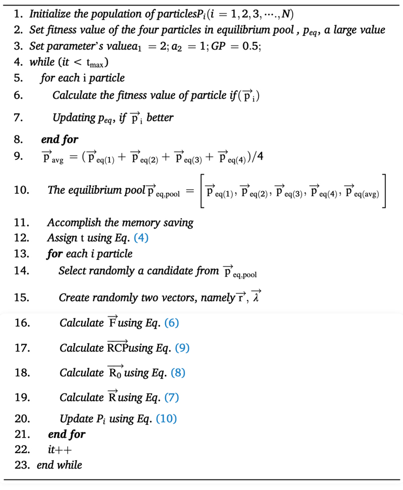
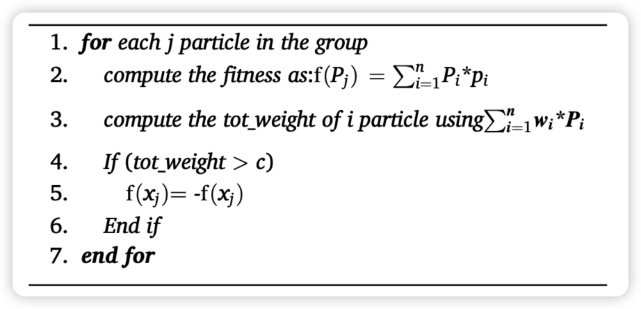
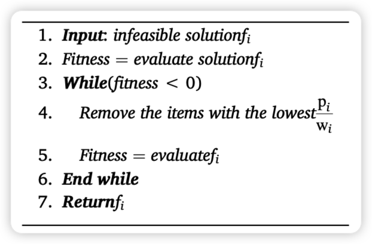
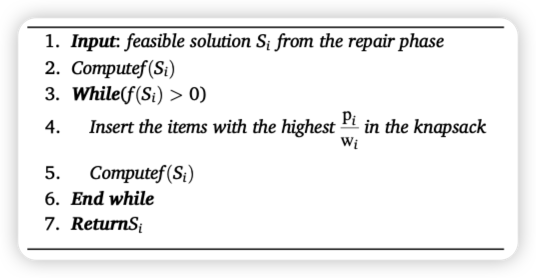
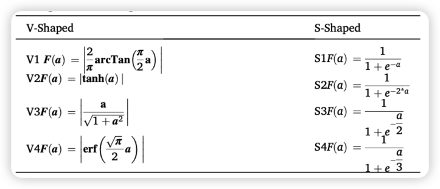

 
 
<b>0-1背包问题的二元均衡优化算法</b>

 
<b>A Binary Equilibrium Optimization Algorithm for 0–1 Knapsack Problems</b>

 

  
   
   
  <b>Санкт-Петербургский государственный политехнический университет</b> 
  <b>Институт компьютерных наук и технологий</b>
 

 

[toc]

# 概述

> 算法来自于论文：https://doi.org/10.1016/j.cie.2020.106946
>
> ---
>
> **A Binary Equilibrium Optimization Algorithm for 0–1 Knapsack Problems**
>
> ---
>
> Mohamed Abdel-Basset, Reda Mohamed, Seyedali Mirjalilib
>
> Faculty of Computers and Informatics, Zagazig University, Zagazig 44519, Egypt
> Center for Artificial Intelligence Research and Optimization, Torrens University Australia, AustraliaYonsei Frontier Lab, Yonsei University, Seoul, Korea
> d *King Abdul Aziz University, Jeddah, Saudi Arabia*

该仓库将注重本算法的实现及验证

# 缩写说明

## 专有名词

| 缩写 | 说明                                                         |
| ---- | ------------------------------------------------------------ |
| KP   | Knapsack Problems - 背包问题                                 |
| EO   | equilibrium optimizer - 标准的均衡优化器                     |
| BEO  | binary version of equilibrium optimization - 二进制版本的均衡优化 |
| RA   | repair algorithm - 修复算法                                  |
|      |                                                              |
|      |                                                              |
|      |                                                              |
|      |                                                              |
|      |                                                              |

## 符号

| 符号    | 说明                          |
| ------- | ----------------------------- |
| $n$     | 0-1 背包问题中，一共有 n 项   |
| $i$     | 背包中的第 $i$ 项             |
| $w_i$   | 第 $i$ 项的权重（占用的空间） |
| $p_i$   | 第 $i$ 项的利润（价值）       |
| $x_i=1$ | 第 $i$ 项物品装入了背包       |
| $x_i=0$ | 第 $i$ 项没有装入背包         |
|         |                               |
|         |                               |
|         |                               |
|         |                               |

# 摘要

本文提出了一个二进制版本的均衡优化（BEO - binary version of equilibrium optimization），用于解决0-1 knapsack问题，该问题被描述为一个离散问题。**由于标准的[均衡优化器](https://zhuanlan.zhihu.com/p/418152665)（EO - equilibrium optimizer）是为解决连续优化问题而提出的，因此需要一个离散的变体来解决二进制问题**。因此，包括V型和S型在内的八个转移函数被用来将连续EO转换为二进制EO（BEO）。在这些传递函数中，本研究表明，V形V3是最好的函数。我们还发现，S3传输函数比V3更有利于提高本文所采用的其他算法的性能。我们得出结论，**任何二进制算法的性能都依赖于传递函数的良好选择**。此外，我们使用惩罚函数从问题的解决方案中筛选出不可行的解决方案，并应用修复算法（RA - repair algorithm）将其转换为可行的解决方案。我们在三个基准数据集上评估了所提出的算法的性能，这些数据集有63个小型、中型和大型实例，并在不同的统计分析下与其他一些为解决0-1 knapsack而提出的算法进行了比较。实验结果表明，BEOV3算法在所有的小型、中型案例研究中都有优势。关于大规模的测试案例，所提出的方法在18个实例中的13个达到了最优值。

# 简介（第1节）

> 背包问题简单来说就是，在固定的背包容量下，装入价值最多最高的物品

**Knapsack问题（KP）**在许多现实世界的应用中得到了它们的重要性。这些问题常见于投资决策（Rooderkerk和van Heerde，2016）、货物装载问题（Mladenović，2019，Cho，2019，Brandt和Nickel，2019）、能源最小化（Müller，2015，Karaboghossian和Zito，2018）、资源分配（Jacko，2016）、计算机内存（Oppong，2019）、项目组合选择（Koc，2009，Bas，2012，Tavana，2015，Tavana et al, 2013），自适应多媒体系统（Khan，2002），密码学（Khan，2002，Liu等人，2019），住房问题（Chan，2018），以及切割库存问题（Alfares和Alsawafy，2019）。因此，解决KP使许多应用得以蓬勃发展和壮大。然而，KP是一个NP-hard问题，所以找到一个多项式时间的解决方案是困难的。**KP是一个组合优化问题，我们寻求在有限的解决方案中找到最佳解决方案**。**如果KP的大小增加，精确方法搜索最优解所需的时间就会呈指数级增长**。精确的方法，如穷举搜索或分支和约束，在空间和时间方面消耗了巨大的计算资源，特别是对于大规模的KP。因此，需要在可接受的时间内找到一个接近最优的解决方案，这是许多研究人员在解决KP时遵循的一个趋势。

在0-1 KP中，假设给定了一个由**==n个项目==**组成的集合，每个项目都有一个私人==$权重 w_i$==和==$利润 p_i$==。从给定的n个项目中，**决策者需要一个能使利润最大化的子集，同时保持其权重之和小于或等于背包的容量**。为了找到这个项目子集，**如果背包包含所选的==第i项==，其值为$x_i=1$，如果没选入背包值为$x_i=0$**。最后，这个问题在数学上可以表述为：

$$
\operatorname{maximize} \sum_{i=1}^{n} x_{i}^{*} p_{i}

\\

subjectto (使)\sum_{i=1}^{n} w_{i}^{*} x_{i}<c

\\

x_{i}=0 \ or \ 1, i=0,1 \cdots \cdots n

\\

p_{i}>0,\ w_{i}>0,\ c>0
$$

最近，许多**[元启发式算法](https://zh.wikipedia.org/wiki/元启发算法)（*meta*-heuristic algorithms）**被建议为各种优化问题寻找最优解，并取得了相对较好的结果（Bairathi and Gopalani, 2018; Mirjalili and Lewis, 2016; Askarzadeh, 2016; Abualigah, 2019; Abualigah et al., 2018; Abualigah et al., 2018; Mohammad Abualigah, 2020; Abualigah and Diabat, 2020; Safaldin et al., 2020）。**与精确方法相比，元启发式方法的特点是更快地收敛到最优解，并减少了计算成本**。因此，许多作者争相使用元启发法来解决KP。任何元启发式算法的主要目标是有效地探索搜索空间，找到接近最优的解决方案。一个稳健的元启发式算法是能够保持探索和利用阶段之间的平衡。下一节将讨论一些为解决0-1结包而提出的元启发式算法。

元启发式算法的优异表现促使我们提出了一种新的元启发式算法的二进制版本，即均衡优化器（EO）（Faramarzi，2019），其灵感来自物理学，用于处理knapsack问题。该算法在处理连续问题方面的高稳定性是提出二进制版本的原因，以研究其在处理作为组合优化问题的0-1 knapsack问题时的性能。元启发式算法相对于现有算法的优势总结如下：

1. 避免过早向局部最优收敛
2. 在迭代结束前有很强的稳定性
3. 有两个因子帮助算法平衡和前进
4. 算法存储目前为止最好的 4 个解，使算法具有额外的能力，以避免陷入局部最小值，从而加速向最优解决方案收敛。

根据这些优点，它被认为是一个强大的算法，随后调查它在离散问题上的表现是一个不可缺少的命令。**为了将EO的连续值转换为离散值，使用了八个转移函数，即V-Shape和S-Shape，并对这些函数进行了广泛的实验，以获得性能最好的一个二进制版本的EO（BEO）**。经过实验，很明显，**V-Shape V3是最好的一个**。此外，为了检查BEO的性能，它在小型、中型和大型三个基准数据集上进行了验证，并与14种最先进的算法进行了比较。经过验证和比较，所提出的算法在三个基准的大多数实例上，**特别是在大规模的实例上的优势是非常明显的**。最后，本文中主要贡献有以下几点：

- 提出了解决0-1结包问题的二元版新型EO
- **增加一个决策模型，在解决大规模的背包问题上有更高的能力**，为剪切原料寻找最不丰富的方式，选择投资和组合，为默克尔-海尔曼(Lagarias, 1984)生成关键和解决其他背包问题(Kellerer et al.， 2004)
- **提出了转移函数的良好选择可以提高二进制算法的性能**

本文的其余部分组织如下：

第2节：之前解决 0-1KP 和 MKP 的工作

第3节：总结了原始的EO。

第4节：说明了使用充分的转移函数作为建议，说明了 EO 在解决 0-1KP 的适应性。

第5节：介绍了所提出的方法在三组标准的知名基准上解决0-1 knapsack问题的讨论和实验结果，并进行了详细说明。

第6节：提供了关于建议的方法和未来工作的一些结论。

# 文献回顾（第2节）

为了展示最先进的技术，我们将介绍以前为解决单0-1 KP所做的一些工作。Ye等人（Ye, 2019）应用模仿生物组织机制的组织P系统来解决KP。虽然这个系统显示了正确的结果，但作者确实测试了该系统对大规模KP的性能。Wu等人（Wu et al., 2018）将共生搜索算法与和谐搜索相结合，用于解决小型和大型的KP。

此外，Gao等人（Gao, 2018）通过采用量子编码提高了狼群算法的性能。该算法使用量子旋转和量子塌陷来移动到全局搜索并避免局部最优。在（Zouache等人，2016）；Zouache等人将量子概念与萤火虫算法和粒子群优化相结合，结果非常令人鼓舞。其他算法，如谐波振荡器和社会进化（Pavithr, 2016, Huang, 2019, Wang, 2007）利用了量子计算的优势。复值编码法除了与风动优化算法（Zhou，2017）结合，还采用了贪婪策略，以增加种群的多样性，增强算法的局部搜索能力。同时，复值编码方法被加入到蝙蝠算法中，以使蝙蝠种群多样化（Zhou等人，2016）。

在（Kulkarni和Shabir，2016）中，采用了群组智能（CI）算法来解决项目数在4到75之间的0-1 KP。此外，问题大小的增加通过增加计算时间和函数评估来影响算法的性能，而且，为实验选择的数据集是低维的。因此，Sapre等人（Sapre，2019）用一种选择候选者最优解的教育方法改进了低维数据集的性能CI算法。Feng等人（Feng，2018）通过对君主蝴蝶优化（MBO）采用基于反对的学习策略（OBL）和高斯扰动改善了解决方案的质量。该算法在后期对一半的种群使用了OBL，但高斯扰动策略对一半具有最小适配度的个体起作用。之后，使用相同的算法（MBO），Feng等人（2018）采用混沌图来增强MBO算法的全局优化能力。

Zhou等人（2016）改进了一种猴子算法，该算法使用贪婪算法来纠正解决方案的不可行性，并提升这些解决方案的可行性。此外，如果全局最优解在预定的迭代次数中没有变化，该算法会重新初始化群体。实验表明，该算法在解决0-1 KP方面是有价值的。Kong, 2015）中介绍的简化二元和谐搜索依赖于存储在和谐存储器中的和谐之间的差异，而不是参数。此外，El-Shafei等人（2018）利用基于FPGA的Harare加速器的并行处理，使用二进制和谐搜索解决大维KP。

此外，一种新型的全局和谐搜索算法（NGHS）（Zou，2011）已经被开发出来，用于解决0-1结包问题。NGHS使用两种操作进行了改进：第一种是位置更新，用于在每次迭代中迅速将最差的和谐度更新为最佳的全局和谐度；第二种是遗传变异，旨在使NGHS脱离局部最优。在解决0-1 KP时，NGHS仍然存在陷入局部最小值的问题，因此无法达到更好的解决方案。此外，有人提出了一种改进的鲸鱼优化算法（IWOA）（Abdel-Basset等人，2019），用于解决单一的0-1 KP和MKP。IWOA由局部搜索策略（LSS）和征收飞行策略整合而成，在探索和开发操作者之间进行了更好的权衡。此外，为了提高效率，IWOA还与位运算器进行了整合。WOA也被用于其他二进制问题。

在(Wu, 2020)中，最近提出了离散的基于教与学的混合优化算法(HTLBO)来解决折算的0-1 KP。HTLBO的优化能力从三个方面得到了提高：（1）为了提高HTLBO的探索能力，改进了学习策略；（2）为了平衡探索和开发操作者，在教师和学习者阶段集成了自学因素；（3）最后，使用了两种类型的交叉法来提高HTLBO的搜索能力。

# 均衡优化器（第3节）

Equilibrium optimizer - 均衡优化器

最近，Faramarzi（2019）提出了一种新的基于物理学的元启发式算法，称为平衡优化器（EO），用于解决连续优化问题。EO寻求找到平衡状态，以实现进入、产生和离开控制体的质量平衡。EO在数学上表述如下

$$
Step 1: initialization
$$
在初始化步骤中，已经生成了一组𝑁粒子，每个粒子的尺寸数为𝑛。每个粒子内的尺寸都是随机初始化的，具体如下：

$$
\vec{v}_{i}=L_{\min }+\left(U_{\max }-\mathrm{L}_{\min }\right) * \mathrm{ri}=0,1,2, \cdots, \mathrm{N}
$$
其中：

- 𝑣⃗𝑖 是一个向量，包含颗粒𝑖的浓度
- 𝐿𝑚𝑖𝑛,𝑈𝑚𝑎𝑥 表示每个维度的专门搜索空间的最大和最小边界
- 𝑟 是一个在0和1之间随机产生的数字

---

$$
{Step 2: Equilibrium\ pool\ and\ candidates \left(c_{e q}\right)}
\\
均衡池和候选着\left(c_{e q}\right)
$$

EO的工作是寻找在控制体积上实现平衡的状态。当EO到达这个状态时，它可能是达到了它所寻找的近似最优解。像所有的元启发式算法一样，在优化过程的开始，全局最优解是不知道的，所以它们选择群体中最合适的一个作为全局解。同样，EO在开始时也不知道能达到系统平衡的质量浓度，所以它在$\overrightarrow{\mathrm{p}}_{\text {eq,pool }}$中加入最好的四个粒子作为平衡候选粒子，此外还有一个包含最好的四个粒子的平均值。**$\overrightarrow{\mathrm{p}}_{\text {eq,pool }}$ 中的前四个均衡候选粒子的作用是提高EO的探索能力，而最后一个则是提高其开发能力**。

$$
\vec{p}_{\text {eqppool }}=\left[\vec{p}_{\text {eq(1) }}, \vec{p}_{\text {eq(2) }}, \vec{p}_{\text {eq(3) }}, \vec{p}_{\text {eq(4) }}, \vec{p}_{\text {eq(avg) }}\right]
$$

---

$$
{Step 3: updating\ the\ concentration}
\\
更新浓度
$$

**以下公式的设计是为了确保EO在探索和开发操作者之间有一个合理的平衡：**
$$
\vec{F}=e^{-\vec{\lambda}\left(t-t_{0}\right)}
$$
其中 $\vec{\lambda}$ 是在（Rooderkerk和van Heerde，2016）的范围内随机生成的一个向量，$t$ 随着迭代逐渐减少，其表述如下：
$$
t=\left(1-\frac{i t}{t_{\max }}\right)^{(a 2^{*}\left(\frac{i t}{t_{\max }}\right)}
$$
其中：

- $it$ 是当前的迭代
- $t_{max }$ 表示最大的迭代次数
- $a 2$ 是控制EO的开发能力的一个固定值

**作为改善EO的探索和开发能力的另一种尝试，EO还考虑了：**
$$
\vec{t}_{0}=\frac{1}{\vec{\lambda}} \ln \left(-a_{1} \operatorname{sign}(\vec{r}-0.5)\left[1-e^{-\vec{\lambda}^{t}}\right)+t\right.
$$
其中：

- $a_{1}$ 是一个预先确定的固定值，用于控制多样化能力

    在$a_{1}$较高的情况下，则勘探操能力较高，而开发能力较低。相反，当$a_{2}$较大时，那么EO的开发能力优于勘探能力

**式(6)描述了将式(5)代入式(3)后对式(3)的修正:**
$$
\vec{F}=a_{1} \operatorname{sign}(\vec{r}-0.5)\left[e^{-\vec{\lambda}(t)}-1\right]
$$
其中：

- $\vec{r}$ 是一个在0到1之间创建的随机向量

**为提高EO的开发能力，提出了R，具体如下：**
$$
\vec{R}=\vec{R}_{0} * e^{-\vec{\lambda}^{*}\left(t-t_{0}\right)}
$$

**其中 $R_0$ 为初值，计算公式如下:**
$$
\vec{R}_{0}=\overrightarrow{R C P^{*}} *\left(\overrightarrow{c_{e q}}-\vec{\lambda} * \vec{C}\right)

\\

\overrightarrow{R C P}=\left\{\begin{array}{c}0.5 r_{1} r_{2}>R P \\ \text { 0 否则 }\end{array}\right.
$$

- $r_1$ 和 $r_2$ 是介于 0 和 1 之间的随机数
- $\overrightarrow{R C P}$ 用于确定是否将 $\vec{R}_{0}$ 应用到更新的解决方案。如果 $概率RP$ 小于 $r_2$ ，则应用 $\vec{R}_{0}$，否则不应用 $\vec{R}_{0}$。

**优化过程中的每个解通常会使用以下等式进行更新:**
$$
\vec{C}=\overrightarrow{c_{e q}}+\left(\vec{C}-\overrightarrow{c_{e q}}\right) * \vec{F}+\frac{\vec{R}}{\vec{\lambda} * V} *(1-\vec{F})
$$
其中 $V = 1$

**一般来说，EO的主要步骤如算法1所示：**

Algorithm 1. (EO algorithm)：

# 提出的方法（第4节）

> 本项目里的代码可以在这里找到：
>
> https://seyedalimirjalili.com/projects

在本节中，平衡优化算法被重新设计为求解0-1背包问题的二进制版本。标准EO是为解决连续优化问题而设计的，而背包问题被认为是一个离散问题，因此它必须重新设计，以足够解决这个问题。**要将标准EO转换为二进制版本，将使用后面介绍的传递函数之一进行转换，其中从标准算法返回连续值并转换为0或1。0的值指定从背包中取出的物品，1的值指定在背包中选择的物品。**在接下来的小节中，将展示构建我们提出的算法的各个阶段。

## 初始化

在这一阶段，提出了==𝑁个组==，其中==每个组包含n个粒子（维度）==，这些粒子（维度）被随机初始化为实值 $P_{j}$，$ \mathrm{j}=0,1,2 \cdots n$ ，==$P_{j}$在0到1之间==，然后根据式(11)将 𝑉𝑗 转换为0或1。求解0-1背包的初始群表示如图1所示。
$$
P_{j}=\left\{\begin{array}{l}\text { 1 \ if } \ {P_j}>0.5 \\ \text { 0 \ otherwise }\end{array}\right.
$$
*Fig. 1. Representation of the initial group:*

## [适应度函数](https://baike.baidu.com/item/适应度函数/20593164)

> https://blog.csdn.net/weixin_30239361/article/details/101540896
>
> **适应度函数也叫评价函数，主要是通过个体特征从而判断个体的适应度**。 
>
> 评价一个个体的适应度的一般过程： 对个体编码串进行解码处理后，可得到个体的表现型。由个体的表现型可计算出对应个体的目标函数值。
>
> ---
>
> https://baike.baidu.com/item/适应度函数/20593164
>
> 适应度[函数](https://baike.baidu.com/item/函数/301912?fromModule=lemma_inlink)(Fitness Function)的选取直接影响到遗传算法的收敛速度以及能否找到最优解,因为遗传算法在进化搜索中基本不利用外部信息,仅以适应度函数为依据,利用种群每个个体的适应度来进行搜索。因为适应度函数的复杂度是遗传算法复杂度的主要组成部分，所以适应度函数的设计应尽可能简单，使计算的时间复杂度最小。
>
> 
>
> 遗传算法评价一个解的好坏不是取决于它的解的结构，而是取决于该解的适应度值，这正体现了遗传算法“优胜劣汰”的特点。遗传算法不需要适应度函数满足连续可微等条件，唯一要求是针对输入可计算出能加以比较的非负结果。这一特点使得遗传算法具有广泛的适用性。在实际问题中，适应度函数与问题的目标函数是不完全一致的，如有的问题的目标是要求得最小值(费用问题)，而有的问题的目标是要求得最大值(利润函数)。因此在不少场合，将目标函数映射成求最大值形式而且函数值非负的适应度函数是必要的。
>
> 
>
> 在遗传算法中,适应度是描述个体性能的主要指标。根据适应度的大小，对个体进行优胜劣汰。适应度是驱动遗传算法的动力。从生物学角度讲，适应度相当于“生存竞争、适者生存”的生物生存能力，在遗传过程中具有重要意义。将优化问题的目标函数与个体的适应度建立映射关系，即可在群体进化过程中实现对优化问题目标函数的寻优。适应度函数也称评价函数，是根据目标函数确定的用于区分群体中个体好坏的标准，总是非负的，任何情况下都希望它的值越大越好。在选择操作中，会出现2个成为遗传算法欺骗的问题:
>
> 1)在遗传算法初期，通常会产生一些超常个体，按照比例选择法，这些超常个体会因竞争力突出，而控制选择过程，影响到算法的全局优化性能;
>
> 2)遗传算法后期，当算法趋于收敛时，由于种群中个体适应度差异较小，继续优化的潜能降低，可能获得某个局部最优解。因此，如果适应度函数选择不当就会产生以上的欺骗问题。可见适应度函数的选择对于遗传算法的意义重大。

适应度函数是所有元启发式算法中不可或缺的函数。因此，在使用元启发式平衡优化方法求解背包问题时，必须给出适合度函数，直到能够找到优化过程的搜索核心。**EO用于解决0-1背包问题的==适应度函数计算为背包中发现的物品的利润之和 $\mathrm{f}(x)=\sum_{i=1}^{n} P_{i}{ }^{*} p_{i}$==**，它的结果取决于这个**==约束条件 $\sum_{i=1}^{n} w_{i}{ }^{*} P_{i}<c$==**，其中 ==𝑤𝑖 和 𝑃𝑖 是背包中每件物品的重量和状态(0或1)==，==𝑐 是背包容量==。**不受上述约束，且由于其适应度最大，可被选为最佳适应度值的解称为==不可行解==**。我们将使用一个惩罚函数来处理这个不可行的解，该惩罚函数给出该解的负适应度值，直到它不是被选为最佳解。算法2描述了惩罚函数(PF)的步骤。

**Algorithm 2**. (*Penalty function (PF)*):

## 修复不可行解

在这些小节中，将说明将不可行解转化为可行解所使用的算法。该阶段有两种算法，第一种是**修复算法(repair algorithm, RA)**，其作用是修正PF算法返回的不可行解，第二种**是改进算法(Improvement algorithm, IA)**，其作用是改进RA返回的可行解。这两种算法如下:

**在修复算法中:** 

1. $\frac{\mathrm{p}_{i}}{\mathrm{w}_{i}}$ 比率最低的物品是从背包中取出的。 
2. 对新解决方案进行评估
3. 检查新解决方案的可行性，如果不可行，则重复步骤1和2，直到找到可行的解决方案(参见算法3)。

**Algorithm 3** Repair Algorithm (RA)：

**在改进算法中：**

1. $\frac{\mathrm{p}_{i}}{\mathrm{w}_{i}}$ 比值最高的物品被选择在背包中
2. 对新解决方案进行评估
3. 检查新解决方案的可行性，如果不可行，则删除背包中最后选择的项目，并终止改进过程(如算法4所示)。

**Algorithm 4**. (*Improvement Algorithm (IA)*)

## 转移函数

Table 1. V-Shaped and S-Shaped Transfer Function.

