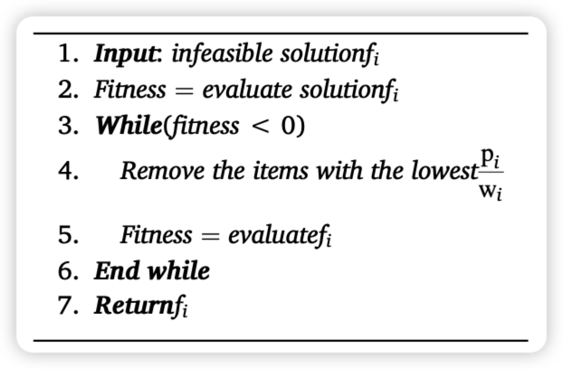
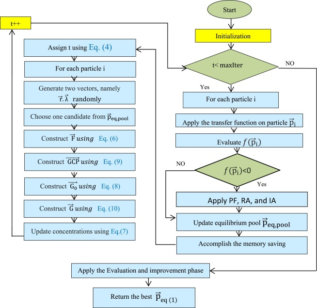
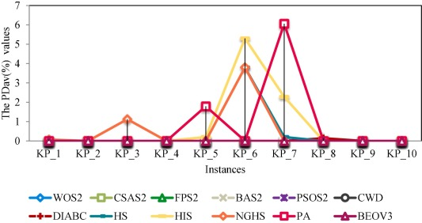
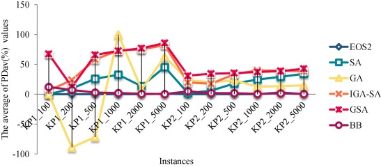

 
<b>0-1背包问题的二元均衡优化算法</b>

 
<b>A Binary Equilibrium Optimization Algorithm for 0–1 Knapsack Problems</b>

 

  
   
   
  <b>Санкт-Петербургский государственный политехнический университет</b> 
  <b>Институт компьютерных наук и технологий</b>
 

 

[toc]

<b>概述</b>

> 算法来自于论文：https://doi.org/10.1016/j.cie.2020.106946
>
> ---
>
> **A Binary Equilibrium Optimization Algorithm for 0–1 Knapsack Problems**

<b>摘要</b>

本文提出了一个二进制版本的均衡优化（BEO - binary version of equilibrium optimization），用于解决0-1 knapsack问题，该问题被描述为一个离散问题。**由于标准的[均衡优化器](https://zhuanlan.zhihu.com/p/418152665)（EO - equilibrium optimizer）是为解决连续优化问题而提出的，因此需要一个离散的变体来解决二进制问题**。因此，包括V型和S型在内的八个转移函数被用来将连续EO转换为二进制EO（BEO）。在这些传递函数中，==本研究表明，V形V3是最好的函数。我们还发现，S3传输函数比V3更有利于提高本文所采用的其他算法的性能==。我们得出结论，**任何二进制算法的性能都依赖于传递函数的良好选择**。此外，我们使用惩罚函数从问题的解决方案中筛选出不可行的解决方案，并应用修复算法（RA - repair algorithm）将其转换为可行的解决方案。我们在三个基准数据集上评估了所提出的算法的性能，这些数据集有63个小型、中型和大型实例，并在不同的统计分析下与其他一些为解决0-1 knapsack而提出的算法进行了比较。实验结果表明，BEOV3算法在所有的小型、中型案例研究中都有优势。关于大规模的测试案例，所提出的方法在18个实例中的13个达到了最优值。

# 简介（第1节）

> 背包问题简单来说就是，在固定的背包容量下，装入价值最多最高的物品

**Knapsack问题（KP）**在许多现实世界的应用中得到了它们的重要性。这些问题常见于投资决策（Rooderkerk和van Heerde，2016）、货物装载问题（Mladenović，2019，Cho，2019，Brandt和Nickel，2019）、能源最小化（Müller，2015，Karaboghossian和Zito，2018）、资源分配（Jacko，2016）、计算机内存（Oppong，2019）、项目组合选择（Koc，2009，Bas，2012，Tavana，2015，Tavana et al, 2013），自适应多媒体系统（Khan，2002），密码学（Khan，2002，Liu等人，2019），住房问题（Chan，2018），以及切割库存问题（Alfares和Alsawafy，2019）。因此，解决KP使许多应用得以蓬勃发展和壮大。然而，KP是一个NP-hard问题，所以找到一个多项式时间的解决方案是困难的。**KP是一个组合优化问题，我们寻求在有限的解决方案中找到最佳解决方案**。**如果KP的大小增加，精确方法搜索最优解所需的时间就会呈指数级增长**。精确的方法，如穷举搜索或分支和约束，在空间和时间方面消耗了巨大的计算资源，特别是对于大规模的KP。因此，需要在可接受的时间内找到一个接近最优的解决方案，这是许多研究人员在解决KP时遵循的一个趋势。

在0-1 KP中，假设给定了一个由**==n个项目==**组成的集合，每个项目都有一个私人==$权重 w_i$==和==$利润 p_i$==。从给定的n个项目中，**决策者需要一个能使利润最大化的子集，同时保持其权重之和小于或等于背包的容量**。为了找到这个项目子集，**如果背包包含所选的==第i项==，其值为$x_i=1$，如果没选入背包值为$x_i=0$**。最后，这个问题在数学上可以表述为：

$$
\operatorname{maximize} \sum_{i=1}^{n} x_{i}^{*} p_{i}

\\

subjectto (使)\sum_{i=1}^{n} w_{i}^{*} x_{i}<c

\\

x_{i}=0 \ or \ 1, i=0,1 \cdots \cdots n

\\

p_{i}>0,\ w_{i}>0,\ c>0
$$

最近，许多**[元启发式算法](https://zh.wikipedia.org/wiki/元启发算法)（*meta*-heuristic algorithms）**被建议为各种优化问题寻找最优解，并取得了相对较好的结果（Bairathi and Gopalani, 2018; Mirjalili and Lewis, 2016; Askarzadeh, 2016; Abualigah, 2019; Abualigah et al., 2018; Abualigah et al., 2018; Mohammad Abualigah, 2020; Abualigah and Diabat, 2020; Safaldin et al., 2020）。**与精确方法相比，元启发式方法的特点是更快地收敛到最优解，并减少了计算成本**。因此，许多作者争相使用元启发法来解决KP。任何元启发式算法的主要目标是有效地探索搜索空间，找到接近最优的解决方案。一个稳健的元启发式算法是能够保持探索和利用阶段之间的平衡。下一节将讨论一些为解决0-1背包而提出的元启发式算法。

元启发式算法的优异表现促使我们提出了一种新的元启发式算法的二进制版本，即均衡优化器（EO）（Faramarzi，2019），其灵感来自物理学，用于处理knapsack问题。该算法在处理连续问题方面的高稳定性是提出二进制版本的原因，以研究其在处理作为组合优化问题的0-1 knapsack问题时的性能。元启发式算法相对于现有算法的优势总结如下：

1. 避免过早向局部最优收敛
2. 在迭代结束前有很强的稳定性
3. 有两个因子帮助算法平衡和前进
4. 算法存储目前为止最好的 4 个解，使算法具有额外的能力，以避免陷入局部最小值，从而加速向最优解决方案收敛。

根据这些优点，它被认为是一个强大的算法，随后调查它在离散问题上的表现是一个不可缺少的命令。**为了将EO的连续值转换为离散值，使用了八个转移函数，即V-Shape和S-Shape，并对这些函数进行了广泛的实验，以获得性能最好的一个二进制版本的EO（BEO）**。经过实验，很明显，**V-Shape V3是最好的一个**。此外，为了检查BEO的性能，它在小型、中型和大型三个基准数据集上进行了验证，并与14种最先进的算法进行了比较。经过验证和比较，所提出的算法在三个基准的大多数实例上，**特别是在大规模的实例上的优势是非常明显的**。最后，本文中主要贡献有以下几点：

- 提出了解决0-1背包问题的二元版新型EO
- **增加一个决策模型，在解决大规模的背包问题上有更高的能力**，为剪切原料寻找最不丰富的方式，选择投资和组合，为默克尔-海尔曼(Lagarias, 1984)生成关键和解决其他背包问题(Kellerer et al.， 2004)
- **提出了转移函数的良好选择可以提高二进制算法的性能**

本文的其余部分组织如下：

第2节：之前解决 0-1KP 和 MKP 的工作

第3节：总结了原始的EO。

第4节：说明了使用充分的转移函数作为建议，说明了 EO 在解决 0-1KP 的适应性。

第5节：介绍了所提出的方法在三组标准的知名基准上解决0-1 knapsack问题的讨论和实验结果，并进行了详细说明。

第6节：提供了关于建议的方法和未来工作的一些结论。

# 文献回顾（第2节）

> 省略

# 均衡优化器（第3节）

**==EO - Equilibrium optimizer - 均衡优化器==**

最近，Faramarzi（2019）提出了一种新的基于物理学的元启发式算法，称为平衡优化器（EO），用于**解决连续优化问题**。EO寻求找到平衡状态，以实现进入、产生和离开控制体的质量平衡。EO在数学上表述如下

$$
Step 1: initialization
$$
在初始化步骤中，已经生成了一组𝑁粒子，每个粒子的尺寸数为𝑛。每个粒子内的尺寸都是随机初始化的，具体如下：

$$
\vec{v}_{i}=L_{\min }+\left(U_{\max }-\mathrm{L}_{\min }\right) * \mathrm{ri}=0,1,2, \cdots, \mathrm{N}

\tag1
$$
其中：

- 𝑣⃗𝑖 是一个向量，包含颗粒𝑖的浓度
- 𝐿𝑚𝑖𝑛,𝑈𝑚𝑎𝑥 表示每个维度的专门搜索空间的最大和最小边界
- 𝑟 是一个在0和1之间随机产生的数字

---

$$
{Step 2: Equilibrium\ pool\ and\ candidates \left(c_{e q}\right)}
\\
均衡池和候选着\left(c_{e q}\right)
$$

EO的工作是寻找在控制体积上实现平衡的状态。当EO到达这个状态时，它可能是达到了它所寻找的近似最优解。像所有的元启发式算法一样，在优化过程的开始，全局最优解是不知道的，所以它们选择群体中最合适的一个作为全局解。同样，EO在开始时也不知道能达到系统平衡的质量浓度，所以它在$\overrightarrow{\mathrm{p}}_{\text {eq,pool }}$中加入最好的四个粒子作为平衡候选粒子，此外还有一个包含最好的四个粒子的平均值。**$\overrightarrow{\mathrm{p}}_{\text {eq,pool }}$ 中的前四个均衡候选粒子的作用是提高EO的探索能力，而最后一个则是提高其开发能力**。

$$
\vec{p}_{\text {eqppool }}=\left[\vec{p}_{\text {eq(1) }}, \vec{p}_{\text {eq(2) }}, \vec{p}_{\text {eq(3) }}, \vec{p}_{\text {eq(4) }}, \vec{p}_{\text {eq(avg) }}\right]

\tag2
$$

---

$$
{Step 3: updating\ the\ concentration}
\\
更新浓度
$$

**以下公式的设计是为了确保EO在探索和开发操作者之间有一个合理的平衡：**
$$
\vec{F}=e^{-\vec{\lambda}\left(t-t_{0}\right)}

\tag3
$$
其中 $\vec{\lambda}$ 是在（Rooderkerk和van Heerde，2016）的范围内随机生成的一个向量，$t$ 随着迭代逐渐减少，其表述如下：
$$
t=\left(1-\frac{i t}{t_{\max }}\right)^{(a 2^{*}\left(\frac{i t}{t_{\max }}\right)}

\tag4
$$
其中：

- $it$ 是当前的迭代
- $t_{max }$ 表示最大的迭代次数
- $a 2$ 是控制EO的开发能力的一个固定值

**作为改善EO的探索和开发能力的另一种尝试，EO还考虑了：**
$$
\vec{t}_{0}=\frac{1}{\vec{\lambda}} \ln \left(-a_{1} \operatorname{sign}(\vec{r}-0.5)\left[1-e^{-\vec{\lambda}^{t}}\right)+t\right.

\tag5
$$
其中：

- $a_{1}$ 是一个预先确定的固定值，用于控制多样化能力

    在$a_{1}$较高的情况下，则勘探操能力较高，而开发能力较低。相反，当$a_{2}$较大时，那么EO的开发能力优于勘探能力

**式(6)描述了将式(5)代入式(3)后对式(3)的修正:**
$$
\vec{F}=a_{1} \operatorname{sign}(\vec{r}-0.5)\left[e^{-\vec{\lambda}(t)}-1\right]

\tag6
$$
其中：

- $\vec{r}$ 是一个在0到1之间创建的随机向量

**为提高EO的开发能力，提出了R，具体如下：**
$$
\vec{R}=\vec{R}_{0} * e^{-\vec{\lambda}^{*}\left(t-t_{0}\right)}

\tag7
$$

**其中 $R_0$ 为初值，计算公式如下:**
$$
\vec{R}_{0}=\overrightarrow{R C P^{*}} *\left(\overrightarrow{c_{e q}}-\vec{\lambda} * \vec{C}\right)

\tag8
$$

$$
\overrightarrow{R C P}=\left\{\begin{array}{c}0.5 r_{1} r_{2}>R P \\ \text { 0 otherwise }\end{array}\right.

\tag9
$$

- $\overrightarrow{R C P}$ 用于确定是否将 $\vec{R}_{0}$ 应用到更新的解决方案。如果 $概率RP$ 小于 $r_2$ ，则应用 $\vec{R}_{0}$，否则不应用 $\vec{R}_{0}$。

**优化过程中的每个解通常会使用以下等式进行更新:**
$$
\vec{C}=\overrightarrow{c_{e q}}+\left(\vec{C}-\overrightarrow{c_{e q}}\right) * \vec{F}+\frac{\vec{R}}{\vec{\lambda} * V} *(1-\vec{F})

\tag{10}
$$
其中 $V = 1$

**一般来说，EO的主要步骤如算法1所示：**

Algorithm 1. (EO algorithm)：

# 提出的方法（第4节）

> 本项目里的代码可以在这里找到：
>
> https://seyedalimirjalili.com/projects

在本节中，平衡优化算法被重新设计为求解0-1背包问题的二进制版本。标准EO是为解决连续优化问题而设计的，而背包问题被认为是一个离散问题，因此它必须重新设计，以足够解决这个问题。**要将标准EO转换为二进制版本，将使用后面介绍的传递函数之一进行转换，其中从标准算法返回连续值并转换为0或1。0的值指定从背包中取出的物品，1的值指定在背包中选择的物品。**在接下来的小节中，将展示构建我们提出的算法的各个阶段。

## 初始化

在这一阶段，提出了==𝑁个组==，其中==每个组包含n个粒子（维度）==，这些粒子（维度）被随机初始化为实值 $P_{j}$，$ \mathrm{j}=0,1,2 \cdots n$ ，==$P_{j}$在0到1之间==，然后根据式(11)将 $V_j$ 转换为0或1。求解0-1背包的初始群表示如图1所示。
$$
P_{j}=\left\{\begin{array}{l}\text { 1 \ if } \ {P_j}>0.5 \\ \text { 0 \ otherwise }\end{array}\right.
\tag{11}
$$
**Fig. 1. Representation of the initial group:**

## [适应度函数](https://baike.baidu.com/item/适应度函数/20593164)

> https://blog.csdn.net/weixin_30239361/article/details/101540896
>
> **适应度函数也叫评价函数，主要是通过个体特征从而判断个体的适应度**。 
>
> 评价一个个体的适应度的一般过程： 对个体编码串进行解码处理后，可得到个体的表现型。由个体的表现型可计算出对应个体的目标函数值。
>
> ---
>
> https://baike.baidu.com/item/适应度函数/20593164
>
> 适应度[函数](https://baike.baidu.com/item/函数/301912?fromModule=lemma_inlink)(Fitness Function)的选取直接影响到遗传算法的收敛速度以及能否找到最优解,因为遗传算法在进化搜索中基本不利用外部信息,仅以适应度函数为依据,利用种群每个个体的适应度来进行搜索。因为适应度函数的复杂度是遗传算法复杂度的主要组成部分，所以适应度函数的设计应尽可能简单，使计算的时间复杂度最小。
>
> 
>
> 遗传算法评价一个解的好坏不是取决于它的解的结构，而是取决于该解的适应度值，这正体现了遗传算法“优胜劣汰”的特点。遗传算法不需要适应度函数满足连续可微等条件，唯一要求是针对输入可计算出能加以比较的非负结果。这一特点使得遗传算法具有广泛的适用性。在实际问题中，适应度函数与问题的目标函数是不完全一致的，如有的问题的目标是要求得最小值(费用问题)，而有的问题的目标是要求得最大值(利润函数)。因此在不少场合，将目标函数映射成求最大值形式而且函数值非负的适应度函数是必要的。
>
> 
>
> 在遗传算法中,适应度是描述个体性能的主要指标。根据适应度的大小，对个体进行优胜劣汰。适应度是驱动遗传算法的动力。从生物学角度讲，适应度相当于“生存竞争、适者生存”的生物生存能力，在遗传过程中具有重要意义。将优化问题的目标函数与个体的适应度建立映射关系，即可在群体进化过程中实现对优化问题目标函数的寻优。==适应度函数也称评价函数，是根据目标函数确定的用于区分群体中个体好坏的标准，总是非负的，任何情况下都希望它的值越大越好。在选择操作中，会出现2个成为遗传算法欺骗的问题:==
>
> 1)在遗传算法初期，通常会产生一些超常个体，按照比例选择法，这些超常个体会因竞争力突出，而控制选择过程，影响到算法的全局优化性能;
>
> 2)遗传算法后期，当算法趋于收敛时，由于种群中个体适应度差异较小，继续优化的潜能降低，可能获得某个局部最优解。因此，如果适应度函数选择不当就会产生以上的欺骗问题。可见适应度函数的选择对于遗传算法的意义重大。

适应度函数是所有元启发式算法中不可或缺的函数。因此，在使用元启发式平衡优化方法求解背包问题时，必须给出适合度函数，直到能够找到优化过程的搜索核心。

**EO用于解决0-1背包问题的==适应度函数计算为背包中发现的物品的价值之和 $\mathrm{f}(x)=\sum_{i=1}^{n} P_{i}{ }^{*} p_{i}$==**，它的结果取决于这个**==约束条件 $\sum_{i=1}^{n} w_{i}{ }^{*} P_{i}<c$==**，其中 ==𝑤𝑖 和 𝑃𝑖 是背包中每件物品的重量和状态(0或1)==，==𝑐 是背包容量==。**不受上述约束，且由于其适应度最大，可被选为最佳适应度值的解称为==不可行解==**。我们将使用一个惩罚函数来处理这个不可行的解，==该惩罚函数给出该解的负适应度值，直到它不是被选为最佳解。算法2描述了惩罚函数(PF)的步骤。==

**Algorithm 2**. (*Penalty function (PF)*):

## 修复不可行解

在这些小节中，将说明将不可行解转化为可行解所使用的算法。该阶段有两种算法，

- 第一种是**修复算法(Repair Algorithm, RA)**，其作用是修正PF算法返回的不可行解，
- 第二种是**改进算法(Improvement Algorithm, IA)**，其作用是改进RA返回的可行解。这两种算法如下:

**在修复算法中:** 

1. $\frac{\mathrm{p}_{i}}{\mathrm{w}_{i}}$ 值最低的物品是从背包中取出的。 
2. 对新解决方案进行评估
3. 检查新解决方案的可行性，如果不可行，则重复步骤1和2，直到找到可行的解决方案(参见算法3)。

**Algorithm 3** Repair Algorithm (RA)：

**在改进算法中：**

1. $\frac{\mathrm{p}_{i}}{\mathrm{w}_{i}}$ 比值最高的物品被选择在背包中？
2. 对新解决方案进行评估
3. 检查新解决方案的可行性，如果不可行，则删除背包中最后选择的项目，并终止改进过程(如算法4所示)。

**Algorithm 4**. (*Improvement Algorithm (IA)*)

## 转移函数

**有八个不同的传递函数，分为S型和V型两类。它们允许将连续值映射为0或1值**。这些传递函数将一个实值作为输入，然后每个函数使用一个特定的公式将这个实值转换为0和1之间的值。之后，位于0和1之间的值使用公式（12）转换为二进制值。每个函数的公式显示在表1中，图2说明了同一类型函数的图形形状。关于这些转移函数的更多信息可在（Mirjalili & Lewis, 2013）找到。应该指出的是，在文献中存在着具有单一传递函数的EO的二元变体。然而，这项工作是在BEO算法中整合八个转移函数的半尝试，并对它们进行彻底的比较。
$$
F_{\text {bin }}=\left\{\begin{array}{c}1 \text { if F}(a) \geq \operatorname{rand}() \\ \text { 0 otherwise }\end{array}\right.

\tag{12}
$$
***Table 1. V-Shaped and S-Shaped Transfer Function:***

| **V-Shaped**                                                 | **S-Shaped**                                      |
| ------------------------------------------------------------ | ------------------------------------------------- |
| $\mathrm{V}1\boldsymbol{F}(\boldsymbol{a})=\left|\frac{2}{\pi}\operatorname{arcTan}\left(\frac{\pi}{2}\mathbf{a}\right)\right|$ | $\mathrm{S} 1 F(a)=\frac{1}{1+e^{-a}} $           |
| $\mathrm{~V} 2 \boldsymbol{F}(\boldsymbol{a})=|\tanh (\boldsymbol{a})|$ | $\mathrm{S} 2 F(a)=\frac{1}{1+e^{-2 * a}} $       |
| $\mathrm{~V} 3 \boldsymbol{F}(\boldsymbol{a})=\left|\frac{\mathbf{a}}{\sqrt{1+\boldsymbol{a}^2}}\right|$ | $\mathrm{S} 3 F(a)=\frac{1}{1+e^{-\frac{a}{2}}} $ |
| $\mathrm{~V} 4 \boldsymbol{F}(\boldsymbol{a})=\left|\operatorname{erf}\left(\frac{\sqrt{\pi}}{2} \boldsymbol{a}\right)\right|$ | $\mathrm{S} 4 F(a)=\frac{1}{1+e^{-\frac{a}{3}}}$  |

***Fig. 2. (a) S-Shaped and (b) V-Shaped transfer Functions:***

 V-Shaped transfer Functions.jpg)

## 评估

在更新了当前的解决方案之后，更新的解决方案被转换成一个二进制的解决方案，使用之前的一个转移函数，然后用PF来检查它是否是可行的。如果不可行，则应用之前说明的修复算法（RA），将这个不可行的解决方案转换为可行的解决方案。此外，使用改进算法（IA）来改进从修复算法返回的可行方案。如果改进后的方案比以前的方案好，它将被更新到群体中，并在下一代中作为一个个体使用。最后，在算法5中介绍了二进制版本的EO（BEO）。相同步骤的流程图也在图3中描述

**算法5 标准均衡优化器的二进制版本(BEO)：**

***图3. 标准均衡优化的二进制版本的步骤：***

## 一个说明性的例子

在清楚地描述了所提出的算法后，在这一节中，假设一个小例子来提高所提出的可读性。

假设我们有一个背包，由几个具有不同大小和利润的物品组成，这个背包的容量为15立方英寸（Ezugwu，2019）。我们需要在不破坏容量约束的情况下，在背包中插入能使利润最大化的物品。假设有三个潜在的项目。A、B 和 C，在表2中给出了它们的权重和利润

**Table 2. Weights and profits of three items：**

| **Items** | **Weights (w)** | **Profits (p)** |
| --------- | --------------- | --------------- |
| A         | 2               | 5               |
| B         | 30              | 10              |
| C         | 10              | 15              |

我们需要在保持背包容量（见公式（13））的前提下，找到总利润最大化的物品数量（见公式（14））。
$$
totalprofit =\sum_{i=1}^{3} x_{i}^{*} p_{i}

\tag{13}
$$

$$
capacity =\sum_{i=1}^{3} w_{i}{ }^{*} x_{i}<15

\tag{14}
$$

开始时，拟议的算法将创建一个由N个解决方案组成的群体，每个解决方案包括d个维度，在我们的例子中d=3。之后，这些解决方案将被随机分配，转移函数被用来将这些连续的解决方案转换成二进制的。作为一个说明性的例子，图4给出了一个由提议创建的解决方案。在创建和初始化这个解决方案后，它将被转换为使用转移函数的二进制。图像显示，在使用转移函数后，得到的二进制解决方案如图5所示。

***Fig. 4. an initial solution, x.***

***Fig. 5. The binary solution of the initial solution, x.***

计算出二元解后，该解中的0表示不选择该位置的物品，1表示选择。根据图5中给出的二元解，所选项目的总利润计算如下。

$f(x)=0 * 5+1 * 10+1 * 15=25$

而这个解决方案的容量计算如下。

$capacity =0 * 2+1 * 30+1 * 10=40>15$

---

在计算了这个解决方案的容量后，我们发现它超过了背包的允许容量，即15。因此，这个不可行的解决方案必须从人口中移除，以避免被选为目前最好的解决方案。为了做到这一点，将调用PF算法，把这个解决方案的适配度转换成一个负值。调用PF算法后，f (x) = - 25，随后这个解决方案将不会被选为最佳解决方案。在我们的建议中，这个不可行的解决方案将使用RA进行修复。在调用RA算法并从这个不可行的解决方案中删除一个具有最低 $\frac{\mathrm{p}_{i}}{\mathrm{w}_{i}}$ 的项目后，说这个项目在第二个位置，所以这个不可行的解决方案在RA步骤后将是如下。

***Fig. 6. The repaired binary solution.***

根据图6中给出的修复后的二元解，所选项目的总利润计算如下。

$f(x)=0 * 5+0 * 10+1 * 15=15$

而这个解决方案的容量计算如下。

$capacity =0 * 2+0 * 30+1 * 10=10<15$

---

在计算了这个修复后的方案的容量后，很明显，它小于背包的容量，因此这个方案被认为是可行的。在将不可行的解决方案转换为可行的之后，将使用IA算法对其进行改进。IA算法将把具有最高 $\frac{\mathrm{p}_{i}}{\mathrm{w}_{i}}$ 的项目插入背包，这就是第一个项目。因此，调用IA后，这个可行的解决方案将如下。

***Fig. 7. The improved repaired binary solution.***

根据图7中给出的二元解决方案，所选项目的总利润计算如下。

$f(x)=1 * 5+0^{*} 10+1 * 15=20$

而这个解决方案的容量计算如下。

$capacity =1 * 2+0 * 30+1 * 10=12<15$

很明显，这个改进后的方案的容量小于背包的容量，因此，它被认为是一个可行的方案，并被用于下一代的群体。这个例子是在由N个解决方案组成的群体中的一个单一解决方案上进行的，以说明我们的主张的阶段。

# 实验结果

在本文中，我们对小型、中型和大型问题进行了一些实验研究，以验证我们提出的算法的性能。我们在配备了Windows 7终极平台的设备上进行了所有的实验研究，该平台采用64位操作系统，Intel® Core™ i3-2330 M CPU @ 2.20 GHz，以及1GB的内存。IEOA和EOA是用Java编程语言实现的。

本节组织如下。第4.1节说明了参数设置。第4.2节展示了我们提出的算法（BEO）在小规模问题上获得的结果。第4.3节提供了我们提出的算法（BEO）在大规模问题上获得的结果。

## 参数设置
在本节中，我们说明了分配给拟议算法的参数值。为了在算法之间进行公平的比较，最大的迭代次数和种群大小分别被设定为20和5000。关于其他算法，它们的比较是基于发表的论文中发现的参数。拟议算法的a1被设置为3，作为一个推荐值，而a2等于1也是推荐值。最后，==table 3==显示了拟议算法的参数。

==***Table 3. the parameter setting of all algorithms used.***==

| Parameters   | Value |
| ------------ | ----- |
| 最大迭代次数 | 5000  |
| 颗粒数       | 20    |
| 运行次数     | 20    |
| a1           | 3     |
| a2           | 1     |

## 基准数据集的描述
在本节中，我们在表4中介绍的小型和中型数据集上检查我们所提出的算法的性能。这些数据集被分为两组。

1. 第一组是从（Kulkarni等人，2017）得到的，项目范围在10和75之间。
2. 第二组是在https://pages.mtu.edu/~kreher/cages/Data.html上找到的，项目数在8和24之间。

==***Table 4. Benchmark datasets descriptions.***==

在==Table 4==中，问题一栏包含了我们实验中使用的每个基准实例的名称，容量一栏包含了每个实例的knapsack容量，D一栏显示了小型、中型和大型问题的维数，最后，opt一栏包含了每个实例的最优值。在我们的实验中，我们使用六个标准来评估每个算法的性能：最佳、平均、最差、标准偏差（SD）、成功率（SR）和偏差百分比（PDav（%））。偏差百分比是一个统计测试，用于检查每个算法在多大程度上接近最优解，用以下公式计算。
$$
PDav(\%)\geq\frac{opimalalue-fmebaleblebledledt}{opimalvalue}*100

\tag{15}
$$
成功率是指一个算法在独立运行中达到最优解的百分比，计算方法如下:
$$
\mathrm{SR}(\%)=\frac{\text { number of optimal solution obtained with in the independent runs }}{\text{number of runs}}{ }^{ {*}} 100

\tag{16}
$$
最后，我们在本节的实验组织如下。
1. 实验1：EO配备并测试了之前说明的所有转移函数。

2. 实验2：提议的算法结果。

3. 实验3：与不同算法的比较。

---

### 实验1：八个转移函数的性能与BEO

在本节中，所有八个转移函数都被用于将BEO映射到二进制版本，以检查它们对BEO的有效性。在这里，我们只用第一个基准数据集来比较每个函数对BEO的优越性。

==table 5==、==table 6==、==table 7==显示了使用八个不同的转移函数对BEO进行映射得到的最佳、最差和平均适配值。在这些表中，BEOS1、BEOS2、BEOS3、BEOS4、BEOV1、BEOV1、BEOV1和BEOV1这几列分别表示使用S1、S2、S3、S4、V1、V2、V3和V4转移函数映射BEO所得到的结果。

==***Table 5. the best fitness values under eight different transfer functions.***==

==***Table 6. the worst results under 8 different transfer functions.***==

==***Table 7. the average fitness under 8 different transfer functions.***==

根据这些表格中介绍的结果，使用V3的映射BEO优于所有其他转移函数，其中BEOV3可以在所有20次独立运行中为所有实例实现最优值，而其他转移函数则不能在所有运行中实现最优值。图8显示了V3转移函数的优越性，其中BEOV3在20次运行中获得的所有实例的平均适配值（AFV）之和超过了使用其他转移函数与BEO获得的所有AFV。

***Fig. 8. Comparison of the summation of the fitness values.***

==Table 8== 介绍了 BEO 在 KP_1 到 KP_20 的每个实例的不同转移函数下获得的 PDav(%) 值。该表的最后一行显示了BEO在每个转移函数下获得的所有实例的PDav值之和。检查这一行可以看出，使用V3的BEO可以获得所有实例的最优值，并占据第一的位置，而使用V2的BEO排名第二，数值为0.012，使用S4的BEO排名最后，数值为0.1813。

==***Table 8. the PDav values under 8 different transfer functions.***==

---

### 实验2：提议的算法（BEOV3）结果

在上一节中，用BEO调查了八个转移函数，以检查它们在将EO产生的连续值映射为二进制值时的性能。这项调查在第一个基准实例上得到了验证，验证后得出结论，V3可以比其他的性能更好。因此，在本节中，所提出的算法BEOV3将在前面提到的两个基准上进行评估。本节的其余部分组织如下。

1. A部分：第一个基准的比较

2. B部分：第二个基准的比较

**A. 第一个基准的比较**

根据==Table 9.==中介绍的结果，所提出的算法对第一个基准数据集的所有实例都获得了最佳解决方案，成功率（SR）=100%，PDav=0%。在证明了所提出的算法在这个由20个实例组成的基准上的优越性后，下一节将进一步研究它在一个由25个实例组成的基准上的性能，这些实例的项目数量在8到24之间。

==***Table 9. The results of BEOV3 on the first benchmark datasets.***==

---

**B. 第二个基准的比较**

表10列出了BEOV3在第二个基准数据集上获得的结果。从这些结果中可以看出，在SR=100和PDav=0的情况下，BEOV3可以实现所有实例的最优解，只有SR=10和PDav=0.04的KP_24d除外。

==***Table 10. the results of BEOV3 on the datasets from KP_8a to KP_24e.***==

**黑体**值表示最佳结果。

作为我们在第一个和第二个基准上进行的实验的结果，我们提出的算法可以在这两个基准的总共45个中的44个达到最佳值。为了检查我们提出的算法比现有算法的优越性，在接下来的章节中，我们将在不同的基准上与一些现有算法进行比较。

---

### 实验3：与不同算法的比较。

在这一节中，我们将提议的算法与下列二元启发式算法的优越性进行比较。

1. 使用S2(FPS2)映射的花朵授粉算法（Yang等人，2014）。

2. 使用S2(WOS2)映射的鲸鱼优化算法（Mirjalili和Lewis，2016）。

3. 蝙蝠算法（Yang，2010）使用S2(BAS2)进行映射

4. 一种乌鸦搜索算法（Askarzadeh，2016），使用（CSAS2）映射。

5. 粒子群优化算法（Eberhart and Kennedy, 1995）（PSOS2）。

6. 一种离散改进的人工蜂群算法（DIABC）（张和刘，2019）。

7. CWDO（Lagarias，1984）。

8. HS (Zou, 2010)

9. IHS (Zou, 2010)

10. NGHS（Zou，2010）。

11. PA（Sonuc等人，2016）。

12. 一种改进的猴子算法（CGMA）（Zhou等人，2016）。

13. 一种混合共生生物搜索算法（GHSOS）（Wu等人，2018）。

14. 一种改进的人工蜂群算法（BABC-DE）（Cao，2018）。

前面列出的前五种算法在本文中是用Java编程语言实现的。如前所述，转移函数的良好选择可以提高二进制算法的性能，因此我们用八个转移函数对前五种算法进行了实验，经过实验，我们发现S2在这些算法上的表现优于所有其他转移函数。所有以前的算法都被用来验证我们提出的算法的优越性。本节的其余部分结构如下。
1. A节：第一个基准的比较

2. B节：第二个基准的比较

---

**A. 第一个基准的比较**

==Table 11== 介绍了BEOV3和其他11种二进制算法在KP_1到KP_12数据集上获得的结果，其中在PDav(%)=0的情况下，它可以在所有运行中实现这些数据集的最优解。检查该图可以证实，我们提出的算法在该基准的前10个实例中可以真正达到最优值。

==***Table 11. Comparison of the datasets from KP_1 and KP_10.***==

***Fig. 9. Comparison of the PDav values of the datasets from KP_1 to KP_10.***

==Table 12==介绍了所提算法和其他五种二元技术在KP_11至KP_20数据集上获得的结果，在所有的运行中，PDav(%)=0，它可以实现这些数据集的最优解。图10以图形方式显示了所提算法与基于各算法在相同数据集上获得的PDav值的比较。图11还说明了基于PDav值平均值的拟议算法的比较。检查该图可以看出，我们提出的算法是最好的，PDav的平均值为0。

==***Table 12. Comparison on the datasets from KP_11 and KP_20***==

***Fig. 10. Comparison of the PDav values of the datasets from KP_11 to KP_20***

***Fig. 11. Comparison of the first benchmark datasets.***

---

**B节：第二个基准的比较**

表13介绍了所提出的算法和其他八种二进制算法在KP_8a到KP_12e数据集上取得的结果，其中在PDav(%)=0的情况下，它可以在所有运行中实现这些数据集的最优解。

==***Table 13. comparison on the datasets from KP_8a and KP_12e***==

==Table 14 ==介绍了所提出的算法和其他八种二进制算法在数据集KP_16a到KP_24e上获得的结果。很明显，BEOV3在为评估我们提出的算法的性能而提出的六个标准中优于其他所有二进制算法。在本段的其余部分，我们将重点关注PDav标准，以验证我们提出的算法的优越性。根据表13中介绍的PDav值，BEOV3对所有实例获得的PDav值的平均值是最好的，可以占据第一的位置，超过了其他算法的表现。此外，图12比较了各算法获得的PDav值的平均值。该图证实了该算法比其他算法的优越性。

==***Table 14. Comparison on the datasets from KP_16a and KP_24e.***==

***Fig. 12. A comparison the average of PDAV(%) of the second benchmark datasets.***

 of the second benchmark datasets.jpg)

## 大规模的背包问题

在本节中，我们测试了我们提出的算法在 ==Table 15== 中介绍的大规模数据集上的性能。一些算法在小数据集上很好地完成了他们的任务，但是在大数据集上他们的性能就下降了。因此，我们用这些大规模的实例来检查我们提出的问题的规模显著增加时的性能。这些实例根据每个实例的利润和权重之间的相关性被分为三类，它们是不相关、弱相关和强相关的实例。表15中发现的这些实例可在http://artemisa.unicauca.edu.co/~johnyortega/instances_01_KP/，这些实例中的项目范围在100到5000之间。此外，为了检查我们提出的算法的有效性，将其与一些已发表的算法进行比较，如遗传算法（GA）（Ezugwu，2019）模拟退火（SA）（Ezugwu，2019），贪婪搜索算法（Ezugwu，2019），混合GA-SA（Ezugwu，2019），以及分支和约束算法（BB）（Ezugwu，2019）。

==***Table 15. large-scale datasets descriptions***==

实际上，在求解大规模数据集时，建议使用S2作为BEO的转移函数。表16介绍了各算法在大规模数据集上获得的结果，在PDav(%)=0的情况下，我们提出的算法在18个数据集的所有运行中，有12个达到了最优解，在PDav(%)分别等于0.035和0.013的情况下，可以在一些运行中达到KP2_500和KP2_1000的最优解。遗憾的是，在其他数据集上，它不能达到最优解。通过将BEOS2与其他已发表的算法进行比较，我们发现BEOS2的性能优于其他所有算法，只有BB算法在KP2_5000和KP3_5000中的性能优于其他算法。图13比较了每种算法在KP1_100到KP2_5000的实例上获得的PDav值。图14描述了各算法在所有实例上获得的PDav值的平均值的比较。

==***Table 16. the results obtained by the implemented algorithms on the large-scale problems***==

***Fig. 13. Comparison of the PDav values of the datasets on the large-scale problems***

***Fig. 14. Comparison of the average of PDav values.***

## 我们的实验总结
在第一个实验中，我们提出的算法与一些最先进的算法在20个实例上进行了比较，这些实例的项目范围在10和75之间。实验结束后，很明显，我们提出的算法的性能非常高，对于20个实例来说，它可以达到真正的最优值，而WOS2排在我们提出的算法之后，CSAS2被认为是这个基准上性能最差的一个。之后，第二个实验是在第二个基准上进行的，项目范围在8到12之间。这个基准的实验结果显示了我们提出的算法比其他算法的优越性，我们提出的算法可以以0.00015的PDav度量值占据第一位，而GHSOS以0.0016的数值排在第二位，而WOS2在这个基准中排名最后。最后，为了检查所提出的大规模基准的稳定性，第三个实验是在一个项目范围在100到5000的基准上进行的。实验结束时，我们发现在18个实例中，有13个实例的提议可以达到最优值，其余的也接近最优值；在这个基准上，提议的性能也优于其他的基准。总的来说，作为我们对这三个实验的结论，我们提出的算法在解决0-1背包问题时，在不同的规模下（小、中、大）都能胜过现有的算法，这使它成为克服这个问题的有力选择。

# 结论和未来工作
在本文中，我们介绍了一个二进制版本的EO来解决0-1背包问题。为了将标准的EO转换为二进制的，我们尝试了八个将连续值转换为二进制值0或1的转移函数，与EO一起找出能取得更好结果的最佳转移函数。实验后发现，转移函数V3比其他所有转移函数表现得更好。当在本文实现的其他算法上尝试这个函数V3来与二进制EO进行比较以考察其性能时，我们发现它们的性能会下降。因此，我们尝试了其他转移函数，以寻找另一个可以得到更好结果的函数。经过尝试，我们发现S2比V3在这些实现的算法上能取得更好的结果。因此，我们得出结论，二元启发式算法的性能依赖于转移函数的良好选择。同时，我们使用惩罚函数从群体中获得不可行的解决方案，并应用修复算法将这个不可行的解决方案转换为可行的解决方案，然后在这个解决方案上应用改进算法来改进它。我们提出的算法在三个基准数据集上进行了实验，包括小型、中型和大型的63个实例，并与14种最先进的算法进行了比较。实验的结果是，我们提出的V3算法在所有小规模和中等规模的实例中都能实现最优值，优于其他所有用于解决0-1背包问题的算法。而对于大规模的实例，使用S2的BEO的性能比使用V3的要好，并大大超过了其他算法。未来的工作包括通过将EO与其他元启发式算法、征收飞行策略或基于反对的学习相结合来提高其性能。二进制版本的EO的性能可以通过将其与解决0-1 knapsack的局部搜索方法相结合来提高。此外，EO还可用于解决其他组合问题，如DNA片段组装问题和流动车间调度问题。

